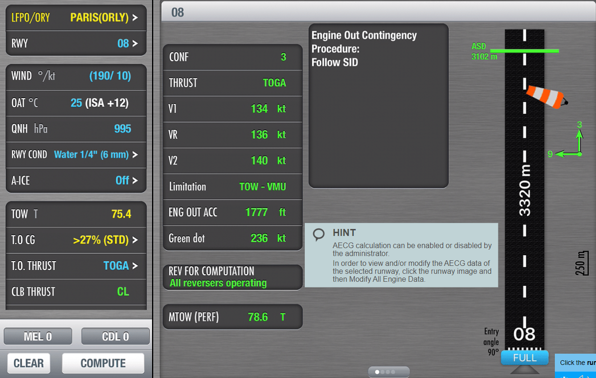
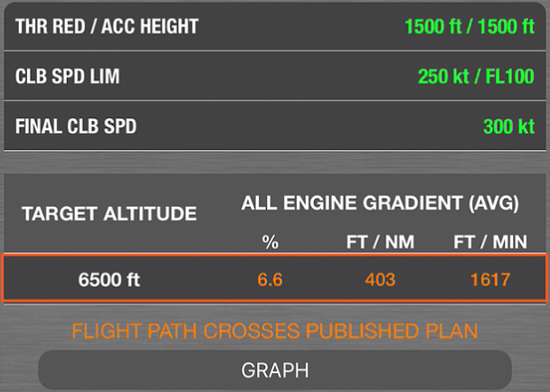

# 介绍

Flysmart是空客旗下子公司NAVBLUE推出的针对空客系列飞机的电子飞行包（EFB，Electronic Flight Bag）类型软件，其目的在于：

* 减少驾驶舱传统纸质文件的使用
* 增加驾驶舱工作效率
* 优化驾驶舱准备程序与实际飞行运行
* 优化航空器的计算过程
* 减小飞机重量与维护支出
* 将传统文件材料过渡为电子文件材料

该软件以IOS与Windows系统为载体，需要安装在iPad或电脑上进行使用

Flysmart包括了以下七个应用模块：

| 模块名称      | 模块全称                                   | 功能                                          | 性质     |
| --------------- | -------------------------------------------- | ----------------------------------------------- | ---------- |
| FS+ Manager   | The Flysamrt+ Manager                      | 基础模块，连接服务器，用于整个EFB的安装与维护 | 安装使用 |
| FS+ TakeOff   | The Takeoff Performance application        | 计算飞机起飞性能                              | 安装使用 |
| FS+ Landing   | The Landing Performance application        | 计算飞机落地性能                              | 安装使用 |
| FS+ OLB       | The OPS Library Browser（OLB） application | 飞行技术手册查阅                              | 安装使用 |
| FS+ In-Flight | The In-Flight Performance application      | 空中性能计算                                  | 安装使用 |
| FS+ Loadsheet | The Loadsheet application                  | 舱单配载计算                                  | 不能使用 |
| eQRH          | Electronic QRH                             | 电子QRH                                       | 安装使用 |

根据各公司的不同考量，某些公司会把eQRH模块集成在FS+ OLB中，没有单独列出，或者某些公司使用另外的EFB软件作为手册查询依据，具体实施办法以各公司相关要求为准

另外，FS+Loadsheet模块在中国地区没有获取授权批准，不能使用，机组依旧应该获取公司提供的纸质舱单

**注意：**FlySmart属于EFB运行B类软件，无论是Flysmart还是各公司自行开发的EFB软件，均**需要获得监管局正式批准许可方可投入运行**。试运行或验证运行期间，FlySmart计算数据仍仅供参考

# 工作原理

如同《A320飞行笔记》一样，软件只是进行运行和呈现的载体，除了空客本身对于Flysmart进行的用户管理、计算方式更新、基础数据更新和数据配置管理功能之外，Flysmart本身的数据，如机型数据库、性能数据库、跑道数据库都是由各公司的性能工程师使用后台服务器进行提供，换言之，使用Flysamrt软件进行计算时，即便是使用同样的机场跑道，不同的飞机进行计算后的数据结果都是有差异的，因此在进行Flysmart的使用时，必须提供准确的相对应的飞机进行性能计算

由于各个公司的手册具有差异性，因此在空客官方的OLB（如使用）软件中，仅提供空客官方英文版的AFM/FCOM/FCTM/QRH手册，如果需要使用中文手册，依旧需要各公司后台服务人员将手册转换为Flysmart支持的格式后上传至服务器

-20211018112955-0hbz217.jpg)

而在终端，机组使用iPad或其他终端设备上的Flysmart软件接收、更新、调取、输入、修改数据，通过Flysmart软件的易用特性迅速计算得到计算结果

# FLYSMART的硬件要求

Flysmart属于EFB的一个种类，因此必须符合EFB的硬件要求

Flysmart的移动终端设备是iPad，属于手持类EFB，手持类EFB的要求如下：

* 在飞机内外都可以使用
* 可以承载A类或B类EFB软件，同时可以安装其他非EFB类型软件，如地勤人员的维护软件，邮件客户端，图片管理应用等不会影响EFB软件正常工作的软件
* FEB符合GM1 CAT.GEN.MPA.140中的定义
* EFB的重量，形状，安装位置不会影响到飞行安全
* EFB可以由飞机自身提供特定的供电
* 如果安装，EFB必须能够简单的，不需要借助工具的从安装设备上拿取或固定，并且也不需要机务进行协助
* EFB中包含的内容被认为是飞机构型中的一部分
* 安装EFB的固定装置是经认证的飞机配置的一部分，具有将EFB安装到飞机上和/或与其他系统连接的预期功能
* EFB具有发射信号功能
* 将EFB安装在经过认证的固定支架上后，机组可以在所有的飞行阶段使用EFB
* 不符合上述条件的EFB，在飞行的关键阶段应该收起

除此以外，EFB的支架也有相应的要求，包括：

* 不受压力变化的影响而进行预期的固定功能
* 在高度或压力快速降低时，其预期功能不受影响
* 在飞机遭遇湍流、机动或其他动作时，其预期功能不受影响

# FLYSMART的使用

#### 安装与维护：

首先需要获取公司提供的服务器地址、账号、密码，航空公司会通过内网邮件等方式为机组及相关人员发送相应信息

在APP STORE中下载公司要求下载的软件

在成功登录之后，可以看到当前Flysmart信息，包括了EFB版本，服务器，密码，以及应用信息：

如上图所示，EFB版本EFB Version中的数据库已经过期，以**琥珀色**来表示，同时最下方的全部升级Update all右侧有黄色感叹号标识，此时应该升级当前的数据库

最下方的各模块，**绿色**代表数据正常，**红色**代表数据需要更新，**白色**代表当前没有数据

在最下方的快速访问条中，可以点击相应的图标进行对应页面的访问：

在使用中，机组可以通过Flysmart软件进行各种数据的计算，当前我们以飞行页面举例

在飞行页面，我们可以看到如上图中的界面，界面中三个模块分别是EFB版本，飞机信息和飞行信息，如下图所示，当前EFB数据库版本代码以琥珀色表示，代表当前数据库已过期，另外两个页面中的内容如下：

AIRCRAFT：

* AIRCRFAT TYPE 飞机型号
* AIRCRAFT REGISTRATION 飞机注册号
* WEIGHT VARIANT 重量变量 包括最大起飞重量、最大着陆重量与无燃油重量

FLIGHT：

* FLIGHT NUMBER 飞机呼号
* FROM 出发地
* TO 目的地

在填好以上信息后，再在各个航段相对应的页面内输入相关数据，Flysmart即可以开始根据输入的数据进行计算

#### 起飞：

起飞页，可以提供以下内容：

* 根据外界温度计算的V~1~、V~r~、V~2~、及单发增速高度
* 构型、灵活温度的计算
* 限制代码
* 性能限制重量
* 双发爬升梯度（All Engine Climb Gradient， AECG）
* 额外内容

在这些内容中，值得一提的是双发爬升梯度的输入，在某些情况下，机场会发布飞机在进行SID离场是的性能限制，以确保飞机在离场过程中，在某航路点之前达到某个特定的高度，常见的情况有：

* ATC要求
* 减噪音程序
* 越障

和正常起飞爬升一样，在进行AECG过程中，飞机需要满足以下几个阶段的包线：

* 起飞推力保持V2+10kt的初始爬升
* 减推力之后保持V2+10kt的爬升
* 收形态并增速到爬升速度限制的爬升

机组可以通过自行输入飞机当前的数据和外界条件来使用Flysmart计算飞机性能是否能满足，界面如下图所示：

根据机场发布的爬升梯度，如果需要进行爬升梯度的修改，可以点击跑道图像，以及MODIFY ALL ENGINE DATA按钮进行修改

点击进入后，Flysamrt会为我们供默认的AECG数据：

这些数据是基于满足以下的内容而提供的：

* 减推力高度
* 增速高度
* 爬升速度限制

如果要修改爬升梯度限制，点击**ALL ENGINE GRADIENT**右侧的<kbd>+</kbd>号按钮进行修改，之后在跳出的界面中输入新的梯度和保持该梯度达到的目标高度，并且点击<kbd>CPMPUTE</kbd>按钮进行计算：

如果性能可以满足当前要求，其显示的计算结果都以**绿色**字样显示，同时点击<kbd>GRAPH</kbd>按钮，可以显示包线图，**蓝色实线**代表当前飞机爬升梯度，**白色虚线**代表要求的梯度：

如果性能不能满足当前要求，其显示结果都以**琥珀色**字样显示，同时点击<kbd>GRAPH</kbd>按钮，可以显示包线中不能满足性能要求的部分：

其他页面也可以用类似的方式来进行修改

# 颜色代码

空客使用了和驾驶舱设计逻辑一致的颜色代码（参考"2. A320驾驶舱设计"[^1]）

颜色代码含义如下：

* **白色：**默认字符（由后台进行定义）
* **洋红色：**电子（当EFB已连接后出现）
* **黄色：**来自其他应用的数据
* **蓝色：**机组输入
* **绿色：**计算后不可更改的数据，且数据有效
* **红色：**计算后不可更改的数据，但数据无效

# **FLYSMART所涉及到的知识：**

* 如果实际运行中的数据和EFB中默认的数据不一致，EFB的计算是否有效？

  * 如果遭遇实际运行中的数据和EFB中默认数据不一致的情况，比如跑道施工，全跑道不可用，此时我们可以参考通告中的内容，通过MODIFY修改功能更改EFB中的数据，只要输入数据是准确的，那么所计算出的数据就可用，在这样的情况下，默认跑道信息的蓝色FULL字样，会变成MOD字样，标识修改已经完成

    
* 如果实际运行中，Flysmart计算出的数据和人工计算的数据不一致怎么办？

  * 由于每次Flysmart的计算都是基于人工输入而计算的，因此机组输入数据的精确性尤为重要，在得到结果后，如果重量差值不大于100kg，速度差值不大于1kt，计算结果被视为有效，如果存在温度偏差（理论上来说应该不存在这样的情况），比如起人工计算的起飞灵活温度和Flysmart计算的起飞灵活温度结论不一致，取其中较低的保守值，如果涉及到平台温度导致较低的保守数值不能用于灵活温度起飞（参考"减推力-减功率起飞"[^14]），机组应该联系公司性能席寻求参考意见
* 传统计算和Flysmart计算得到的数据差值不超过差值，应该取哪一个？

  * 与传统的计算方式不同，Flysmart采取的是改进算法，其中的计算逻辑有所不同，但是得到的数值都有效，均具有合法性

[^1]: # 2. A320驾驶舱设计

    # 2.1 设计目的：

    空客驾驶舱的设计是在飞机的整个运行环境中满足飞行机组的操作需要，同时保证在飞行中电传飞机系列之间的最大一致性

    驾驶舱的设计基于以下 10 条高水平设计要求：

    1. 飞行机组对于飞机安全运行负有最终责任
    2. 如需要，飞行机组可按直觉采取行动以行使其全部权利，同时也旨在消除超限应力或过量操纵的风险
    3. 适用于飞行员之前获得的各种技能水平和经验
    4. 确保安全，旅客舒适度以及效率，遵循此优先顺序
    5. 通过加强情景意识和飞机状态的意识简化飞行机组任务
    6. 自动化被视作是对飞行员可用的一个附加特征， 飞行机组可根据情况决定何时使用以及需要何种级别的辅助
    7. 人机界面的设计综同时考虑了系统特征和飞行机组的优劣势
    8. 系统设计过程中应用了当前最先进的人为因素考虑手段，以便管理飞行机组的潜在错误
    9. 整体驾驶舱设计有助于促进和加强机组成员通信(例如分工、协同合作)
    10. 新技术的使用和新功能的实施受以下方面的强制要求：

         * 重大的安全效益
         * 显著的运行优势
         * 对飞行机组需求有明确的响应

    # 2.2 驾驶舱面板设计：

    #### 驾驶舱面板设计概述：

    A320的驾驶舱设计为前向驾驶舱设计，设计时考虑到了双人制驾驶舱的操作要求，其主要布局设置考虑了以下因素：

    * 各系统的相对重要性

    * 飞行员的操纵频率

    * 触及控制面板的便利程度

    * 控制面板的形状差异（防止混淆）

    * 如需要时，重复控制

    此设计能够达到的效果：

    * 显著减少飞行机组的工作量

    * 优化机组分工

    **最少化“低头”时间**（请在飞行与训练过程中牢记这一点）

    #### 顶板：

    顶板设计是以系统进行模块化划分，在所有顶板模块上，都能找到相对应的系统名称，在进行顶板操作时，应首先抬头确认该模块的系统名称，在找到该系统名称后，再在相对应模块上寻找相关的电门或开关。

    

    #### 遮光板：

    遮光板支持自动飞行系统(AFS)的短期策略操纵。控制面板的操作可实现“抬头”且对于左右座飞行员都容易操作。注意，其设计目的为最少化“低头”时间。

    #### 主仪表面板：

    主仪表面板支持以下必要的显示组件（带*为选装）：

    * 飞行（PFD/HUD*）

    * 导航（ND）

    * 通信（DCDU*）

    * 监控各飞机系统（ECAM）

    显示组件全部位于两个飞行员完全不受阻的视野中，即空客的设计概念为减少头部的运动，依靠视觉获取最多信息。

    #### 操纵台：

    操纵台主要支持以下方面的操纵：

    * 发动机和推力(发动机主手柄，推力手柄)
    * 导航(MCDU，FMS)
    * 通信(RMP)

    以上设备缩写可查询"8. 缩略语快速查询表格"[^2]

    # 2.3 告警：

    #设计# #告警#

    # 概述：

    空客的告警系统是通过系统在面对非正常情况、系统工作状态变化时的提醒，最直观的方式是通过光线和声音两个方面来进行提示。

    #### 告警触发（听觉）：

    一般来讲，当下列情况发生时需要告警： 

    * 出现系统失效
    * 飞机超出正常的飞行包线
    * 安全突发事件（如：TCAS、TWAS）
    * 出现外部信息（如：客舱呼叫、ATC）
    * 系统自动改变其操作方式（如：AP断开，方式逆转）

    这些告警：

    * 触发目视和/或语音指示
    * 按严重性和优先级排序
    * 在某些特定飞行阶段不相关时被抑制

    #### 告警指示（视觉）：

    告警指示以下列方式呈现给飞行机组：

    * 初始指示(目视或语音)通过主警戒或主警告
    * 发动机警告显示(EWD)显示与失效相关的告警标题 -  系统显示(SD)自动显示受影响的系统
    * 顶板上，受影响系统的按钮/按钮电门灯呈**琥珀色**或**红色**

    #### 注意：

    空客告警系统并不仅限于声音与灯光两种提醒方式，在飞行过程中机组必须随时根据系统工作状态监控飞机，确保飞行运行安全。

    # 2.4 顶板暗驾驶舱概念：

    大部分系统是由顶板控制的，通过：

    * 按钮
    * 按钮电门
    * 电门
    * 旋钮，旋钮选择器

    每个按钮/按钮电门有一个或两个灯：

    * 上面的一个灯专门显示告警或系统状态（例如故障灯，OPEN灯）。如果无需告警或系统状态，两个灰色点将替代此灯
    * 下面的灯：

      * 在按钮电门上，对应系统的控制选择（例如接通、关断、超控），或
      * 在按钮上，对应系统状态（例如发动机防冰）

    如果无需控制系统选择，两个灰色点将替代此灯。

    一般规则认为：灯灭原则。系统可用并且适航。

    # 2.5 颜色代码：

    #### 颜色代码概述：

    空客在自己的显示组件主仪表面板，及顶板上都使用了自己设计的颜色语言，分别理解仪表与顶板的颜色语言有助于我们理解飞机当前的工作状态，从而采取更合理的动作来确保飞机的运行处于安全飞行包线中。

    #### 显示组件：

    显示组件上提供的信息用颜色编码，以指示：

    * 系统状态(ECAM 或  FMA)
    * 方式状态(FMA)
    * 信息性质(例如告警标题，要执行的动作，信息)

    #### 按钮/按钮电门灯：

    按钮/按钮电门上提供的信息同样也用颜色编码以指示系统状态：

    * **琥珀色**：指示系统失效
    * **红色**：指示某个可能需要即刻修正动作的失效
    * **绿色**：指示某个系统正常运行
    * **蓝色**：指示某个暂时选择的系统正常运行
    * 白色：指示某个按钮电门位置异常或维护/测试结果
    * 空白：系统适航

    # 2.6 电传飞机：

    #### 电传飞机概述：

    不同于传统飞机的线缆式操纵，电传飞机是把操纵输入量转化成数字信号传递至飞机相应舵面的计算机进行舵面输入。从这方面来讲，空客公司是将飞行员定义成一名管理者，由管理者通过侧杆向计算机下达指令进行动作，而非传统意义上飞机的直接操纵者。

    #### 飞行操纵保护：

    飞行操纵保护的目的在于：

    * 给予飞行机组全权，以便使其对相关操作施加本能、即刻动作从而获取最佳飞机性能
    * 使过量操纵、超限应力或损坏飞机的可能性降至最低

    PF主要任务之一是保持飞机在正常飞行包线限制范围以内。但是，在一些情况下，由于极端状况或对飞机误操纵，飞机可能会超出这些限制。 尽管有系统保护，PF也不能故意超出正常飞行包线。此外，这些保护设计并不用于结构限制的保护(例如相反方向的舵脚蹬输入)。相反，它们被设计用于需要本能和快速反应的紧急和紧张状况下，给PF提供有效帮助。

    **简而言之**，飞行操纵保护的目的在于最大程度的减少飞行员在进行不合理飞机操纵时产生的失误。

    #### 侧杆：

    侧装式侧杆的主要操作优势： 

    * 使主仪表面板的视野不受阻碍
    * 适应紧急情况(例如失能，操纵杆卡阻，操纵失效)
    * 正确调整扶手即可轻松握杆
    * 使滑动小桌板的安装成为可能(如用于放置航图、文件和餐食)

    接通自动驾驶时：

    * 侧杆锁定在中立位(即时的触觉反馈)
    * 飞行机组和自动驾驶同时输入是不可能的
    * 通过随时用力按压侧杆可本能地断开自动驾驶

    ###### 侧杆的使用：

    **一次仅一名飞行员进行侧杆输入**。

    如果PM想要操纵侧杆，TA必须：

    * 清楚地报出“我操纵”（关于更多责任的划分，请参考："4.1 驾驶舱职责划分"[^3]）
    * 按压并保持其侧杆按钮，以便完全操纵电传系统

    解释：飞行机组应记住侧杆输入是代数式叠加的。因此必须避免双输入，否则将触发语音和视觉告警。

    任一个飞行员可在任何时候在其侧杆输入。

    任一个飞行员可通过按压其侧杆按钮使另一个飞行员侧杆失效。

    #### 以改变构型法则飞行：

    当飞机在高高度以改变构型法则飞行时，飞行机组应当考虑下列因素：

    * 在高高度，下降到较低高度以增加抖振裕度。下降到最大推荐高度以下近 4000ft 时（即 REC MAX ALT - 4000 feet），会显著减少颠簸中失速警告的发生。
    * 在大速度时，小心机动并使用小的控制输入量。取决于再构型法则，俯仰控制法则可以有不同的模式，但横滚控制法则会一直是直接法则。

    ###### 备用法则：

    正常飞行包线内的操作特点，在俯仰上与正常法则一样。  
    正常飞行包线以外， PF 必须采取适当预防措施以防止失控，并且/或避免大幅度地偏移。这些动作与在任何情况下没有保护的飞机上执行的那些动作一样。

    ###### 直接法则：

    PF 必须注意避免大幅度地改变推力，或突然地作动减速板， 尤其是在重心靠后的时候。 如果减速板放出，且飞机已被重新配平， PF 必须柔和地收起减速板以提供给飞机足够时间重新配平， 从而避免过度机头下俯的配平变化。  
    此种情况下，目标不在于精确地操作飞机，而是保持飞机高度安全和稳定以便恢复失去的系统。

    ###### 机械备份：

    俯仰配平轮用于控制俯仰。 因为水平安定面(THS)面积大，舵面效应显著，因此任何俯仰配平轮上的动作应该平稳。  
    方向舵提供水平控制， 且其移动会导致略带延迟的明显横滚。 PF 应使用方向舵转弯，然后等待飞机反应。提前松开方向舵脚蹬，以保持机翼水平和稳定。

    # 2.7 推力-自动推力：

    空客选择了非反向驱动推力手柄概念：

    * 飞行员可以通过能量提示（速度、速度趋势、HUD V 型标志、发动机参数），而不是模棱两可的推力手柄活动，轻松直观的监控飞机能量。即，飞机推力手柄不会前后自动移动，飞行员通过精准的数据来判断当前自动推力工作的方式。
    * 当接通自动推力时，推力手柄的位置决定了可由自动推力指令的最大许可推力。即，推力手柄的位置为提供给自动推力最大额度的上限，自动推力会根据当前飞机需要的能量在最大额度推力与慢车之间根据飞机的姿态自行调整。
    * 当飞行机组使用人工推力时，推力手柄位置决定当前推力。此操纵方法和其他不使用自动推力的飞机一致。    

[^2]: # 8. 缩略语快速查询表格

    #### 搜索功能简单介绍：

    在需要进行搜索时，使用快捷键<kbd>CTRL</kbd>+<kbd>P</kbd> ，在搜索栏中输入自己需要寻找的内容，快速跳转

    此功能不仅能搜索缩略语部分，本笔记中的所有文档和内容都可以进行搜索

    #### A：

    | 缩略语       | 全称                                                | 翻译                         |
    | -------------- | ----------------------------------------------------- | ------------------------------ |
    | A/BRK        | Autobrake                                           | 自动刹车                     |
    | A/C          | Aircraft                                            | 飞机                         |
    | A/P、AP      | Autopilot                                           | 自动驾驶                     |
    | A/S          | Airspeed                                            | 空速                         |
    | A/SKID       | Anti-skid                                           | 防滞                         |
    | A/THR、A-THR | Auto Thrust                                         | 自动推力                     |
    | AA           | Airworthiness Authorities                           | 适航当局                     |
    | AAL          | Above Aerodrome Level                               | 高于机场高度                 |
    | AAT          | Aircraft Allocation Table                           | 飞机分配表                   |
    | AB           | Abort                                               | 取消、中断、中止             |
    | ABCU         | Alternate Braking Control Unit                      | 备用刹车控制组件             |
    | ABN          | Abnormal                                            | 不正常、非正常               |
    | ABV          | Above                                               | 高于                         |
    | AC           | Alternating Current                                 | 交流电                       |
    | ACARS        | ARINC Communication Addressing and Reporting System | 航空无线电通讯寻址和报告系统 |
    | ACAS         | Airbrone Collision Avoidance System                 | 空中防撞系统                 |
    | ACCEL        | Acceleration                                        | 增速、加速                   |
    | ACC          | Active Clearance Control                            | 主动间隔控制                 |
    | ACCU         | Accumulator                                         | 储压器、蓄压瓶               |
    | ACP          | Audio Control Panel                                 | 音频控制面板                 |
    | ACS          | Aircraft Configuration Summary                      | 飞机构型总结                 |
    | ACSC         | Air Conditioning System Controller                  | 空调系统控制器               |
    | ACT          | Additional Center Tank                              | 附加中央邮箱                 |
    | ADC          | Air Data Computer                                   | 大气数据计算机               |
    | ADF          | Automatic Direction Finder                          | 自动定向仪                   |
    | ADIRS        | Air Data Inertial Reference System                  | 大气数据惯导基准系统         |
    | ADIRU        | Air Data Inertial Reference Unit                    | 大气数据惯导基准组件         |
    | ADM          | Air Data Module                                     | 大气数据模块                 |
    | ADR          | Air Data Reference                                  | 大气数据基准                 |
    | ADS-B        | Automatic Dependent Surveillance - Broadcast        | 广播式自动相关监视           |
    | ADS-C        | Automatic Dependent Surveillance - Contract         | 合约式自动相关监视           |
    | ADV          | Advisory                                            | 咨询                         |
    | AEO          | All Engine Operative                                | 所有发动机工作               |
    | AEVC         | Avionic Equipment Vetilation Controller             | 航空电子设备通风控制器       |
    | AFM          | Airplane Flight Manual                              | 飞机飞行手册                 |
    | AFMC         | Auxiliary Fuel Management Computer                  | 辅助燃油管理计算机           |
    | AFMC         | Auxiliary Fuel Management System                    | 辅助燃油管理系统             |
    | AFS          | Auto Flight System                                  | 自动飞行系统                 |
    | AGL          | Above Ground Level                                  | 高于地面高度                 |
    | AIDS         | Aircraft Integrated Data System                     | 飞机综合数据系统             |
    | AIL          | Aileron                                             | 副翼                         |
    | AIME         | Autonomous Integrity Monitoring Extrapolation       | 自主完整性监控推断           |
    | AIP          | Attendant Indication Panel                          | 乘务员指示面板               |
    | AIU          | Audio Interface Unit                                | 音频借口组件                 |
    | ALT          | Altitude                                            | 高度                         |
    | ALTN         | Alternate                                           | 备用的、备降场               |
    | AMC          | Acceptable Means of Compliance                      | 可接受的符合性方法           |
    | AMI          | Airline Modifiable Information                      | 航空公司可修改信息           |
    | AMM          | Aircraft Maintenace Manual                          | 飞机维护手册                 |
    | AMU          | Audio Management Unit                               | 音频管理组件                 |
    | ANT          | Antenna                                             | 天线                         |
    | AOA          | Angle Of Attack                                     | 迎角                         |
    | AOC          | Airline Operation Control                           | 航空公司运行控制             |
    | APP、APPR    | Approach                                            | 进近                         |
    | APPU         | Asymetry Position Pick-off Unit                     | 不对称位置传感组件           |
    | APU          | Auxiliary Power Unit                                | 辅助动力装置                 |
    | AR           | Authorization Required                              | 所需授权                     |
    | ARINC        | Aeronautical Radio Incorporated                     | 航空无线电公司               |
    | ARN          | Aircraft Registration Number                        | 飞机注册号                   |
    | ARP          | Aerospace Recommended Practice                      | 空域建议惯例                 |
    | ARPT         | Airport                                             | 机场                         |
    | ASAP         | As Soon As Possible                                 | 尽快                         |
    | ASD          | Accelerate Stop Distance                            | 加速停止距离                 |
    | ASI          | Air Speed Indicator                                 | 空速表                       |
    | ASP          | Audio Selector Panel                                | 音频选择器面板               |
    | ATC          | Air Traffic Control                                 | 空中交通管制                 |
    | ATM          | Air Traffic Management                              | 空中交通管理                 |
    | ATN          | Aeronautical Telecommunication Network              | 航空电信网                   |
    | ATE          | Automatic Test Equipment                            | 自动测试设备                 |
    | ATIS         | Automatic Terminal Information System               | 自动终端信息系统             |
    | ATS          | Auto Thrust System/Air Traffic Service              | 自动推力系统/空中交通服务    |
    | ATSAW        | Airborne Traffic Situational Awareness              | 空中飞机活动情景意识         |
    | ATSU         | Air Traffic Service Unit                            | 空中交通服务组件             |
    | ATT          | Attitude                                            | 姿态                         |
    | AUTO         | Automatic                                           | 自动的                       |
    | AVNCS        | Avionics                                            | 航空电子                     |
    | AWY          | Airway                                              | 航路                         |

    #### B：

    | 缩略语 | 全称                               | 翻译              |
    | -------- | ------------------------------------ | ------------------- |
    | B/C    | Back Course                        | 反航道            |
    | BACV   | Braking Action Computaion Function | 刹车效应计算作用  |
    | BARO   | Barometric                         | 气压的/测定气压的 |
    | BASOV  | Buffer Air Shut Off Valve          | 缓冲空气关断活门  |
    | BAT    | Battery                            | 电瓶              |
    | BCL    | Battery Charge Limiter             | 电瓶充电限制器    |
    | BCDS   | Bite Centralized Data System       | 自测中央数据系统  |
    | BCU    | Backup Control Unit                | 备用控制组件      |
    | BDDV   | Brake Dual Distribution Valve      | 刹车双分配活门    |
    | BITE   | Built-In Test Equipment            | 自测设备          |
    | BIU    | BITE Interface Unit                | 自测设备接口组件  |
    | BFE    | Buyer Furnished Equipment          | 买方提供设备      |
    | BFO    | Beat Frequency Oscillator          | 差频振荡器        |
    | BLW    | Below                              | 低于              |
    | BMC    | Bleed Monitoring Computer          | 引气监控计算机    |
    | BNR    | Binary                             | 二进制的          |
    | BRG    | Bearing                            | 方位，轴承        |
    | BRK    | Brake                              | 刹车              |
    | BRT    | Bright                             | 明亮的            |
    | BSCU   | Braking Steering Control Unit      | 刹车转弯控制组件  |
    | BTC    | Bus Tie Contactor                  | 汇流条联接接触器  |
    | BTL    | Bottle                             | 瓶               |
    | BTS    | Bleed Temperature Sensor           | 引气温度传感器    |
    | BUS    | Busbar                             | 汇流条            |
    | BUSS   | Back Up Speed Scale                | 备用速度刻度      |

    #### C：

    | 缩略语     | 全称                                                            | 翻译                                 |
    | ------------ | ----------------------------------------------------------------- | -------------------------------------- |
    | C/B、CB    | Circuit Breaker                                                 | 跳开关                               |
    | C/L、CL    | Checklist                                                       | 检查单                               |
    | CAB        | Cabin                                                           | 客舱                                 |
    | CAPT       | Captain/Capture                                                 | 机长/截获                            |
    | CAS        | Calibrated Airspeed                                             | 校准空速                             |
    | CAT        | Category                                                        | 种类                                 |
    | CBMS       | Circuit Breaker Monitoring System                               | 跳开关监控系统                       |
    | CCD        | Cursor Control Device                                           | 游标控制系统                         |
    | CDL        | Configuration Deviation List                                    | 构型缺损清单                         |
    | CDLS       | Cockpit Door Locking System                                     | 驾驶舱门锁定系统                     |
    | CDSS       | Cockpit Door Surveillance System                                | 驾驶舱门监视系统                     |
    | CDU        | Control Display Unit                                            | 控制显示组件                         |
    | CF         | Cost of Fuel                                                    | 燃油成本                             |
    | CFDIU      | Centralized Fault Data Interface Unit                           | 集中故障数据接口组件                 |
    | CFDS       | Centralized Fault Display System                                | 集中故障显示系统                     |
    | CFP        | Computerized Flight Plan                                        | 计算机化的飞行计划                   |
    | CG         | Center of Gravity                                               | 重心                                 |
    | CHAN       | Channel                                                         | 频道                                 |
    | CHG        | Change                                                          | 变更、变化、改变                     |
    | CHK        | Check                                                           | 检查                                 |
    | CI         | Cost Index                                                      | 成本指数                             |
    | CIDS       | Cabin Intercommunication Data System                            | 客舱内部通讯数据系统                 |
    | CIDS - SDF | Cabin Intercommunication Data System - Smoke Detection Function | 客舱内部通讯数据系统-烟雾探测功能    |
    | CKPT       | Cockpit                                                         | 驾驶舱                               |
    | CIS        | Commonwealth of Independent States                              | 独联体                               |
    | CLB        | Climb                                                           | 爬升                                 |
    | CLR        | Clear                                                           | 清除                                 |
    | CLSD       | Closed                                                          | 关闭的、闭合的                       |
    | CM1(2)     | Crewmenber 1 (2)                                                | 机组人员1（左座）、机组人员2（右座） |
    | CMPTR      | Computer                                                        | 计算机                               |
    | CMS        | Constant Mach Segment/Centeral Maintenance System               | 恒定马赫航段/中央维护系统            |
    | CNSU       | Cabin Network Server Unit                                       | 客舱网络服务器组件                   |
    | CO         | Company                                                         | 公司                                 |
    | CO RTE     | Company Route                                                   | 公司航路                             |
    | COND       | Conditioning                                                    | 空调                                 |
    | CONF       | Configuration                                                   | 形态                                 |
    | CONT       | Continuous                                                      | 连续的                               |
    | CP         | Control Panel                                                   | 控制面板                             |
    | CPC        | Cabin Pressure Controller                                       | 座舱压力控制器                       |
    | CPCU       | Cabin Pressure Controller Unit                                  | 客舱压力控制器组件                   |
    | CPDLC      | Controller - Pilot Data Link Communication                      | 管制员-飞行员数据链通讯              |
    | CRC        | Continuous Repetitive Chime                                     | 连续重复谐音                         |
    | CRG        | Cargo                                                           | 货舱                                 |
    | CRS        | Course                                                          | 航道                                 |
    | CRT        | Cathode Ray Tube                                                | 阴极射线管                           |
    | CRZ        | Cruise                                                          | 巡航                                 |
    | CSAS       | Conditioned Service Air System                                  | 空调维护空气系统                     |
    | CSCU       | Cargo Smoke Control Unit                                        | 货舱延误控制组件                     |
    | CSD        | Constant Speed Drive                                            | 恒速传动装置                         |
    | CSM/G      | Constant Speed Motor/Generator                                  | 恒速马达/发电机                      |
    | CSTR       | Constraint                                                      | 强制                                 |
    | CT         | Cost of Time                                                    | 时间成本                             |
    | CTL        | Control                                                         | 控制、管制                           |
    | CTL PNL    | Control Panel                                                   | 控制面板                             |
    | CTR        | Center                                                          | 中央                                 |
    | CVR        | Cockpit Voice Recorder                                          | 驾驶舱语音记录器                     |

    #### D：

    | 缩略语 | 全称                                                | 翻译                         |
    | :------: | ----------------------------------------------------- | ------------------------------ |
    |   DA   | Drift Angle                                         | 偏流角                       |
    |  DAC  | Digital to Analog Coverter/Double Annular Combustor | 数字模拟转换器/双环燃烧室    |
    |  DAR  | Digital AIDS Recorder                               | 数字式飞机综合数据系统记录器 |
    |  DBUS  | Digital Backup Speed                                | 数字式备份速度               |
    |   DC   | Direct Current                                      | 直流电                       |
    |  DCDU  | Datalink Control and Display Unit                   | 数据链控制和显示组件         |
    |  DCL  | Digital Cabin Logbook                               | 数字式客舱记录本             |
    |  DCMS  | Doors Control and Monitoring System                 | 舱门控制和监控系统           |
    | DDRMI | Digital Distance and Radio Magnetic Indicator       | 数字式距离和无线电磁指示器   |
    | DECEL | Deceleration                                        | 减速                         |
    |  DES  | Descent                                             | 下降                         |
    |  DEST  | Destination                                         | 目的地                       |
    |  DET  | Detection/Detector                                  | 探测/探测器                  |
    |  DEV  | Deviation                                           | 偏差                         |
    |  DFA  | Deplayed Flap Approach                              | 延迟襟翼进近                 |
    |  DFDR  | Digital Flight Data Recorder                        | 数字式飞行数据记录器         |
    |   DH   | Decision Height                                     | 决断高                       |
    |  DIR  | Dirction                                            | 方向                         |
    | DIR TO | Direct To                                           | 直飞                         |
    |  DISC  | Disconnect                                          | 断开                         |
    | DISCH | Discharge                                           | 排出，释放                   |
    |  DIST  | Distance                                            | 距离                         |
    |  DITS  | Digital Information Transfer System                 | 数字式信息转换系统           |
    |  DIV  | Diverter                                            | 分流器，转向器               |
    |  DMC  | Display Management Computer                         | 显示管理计算机               |
    |  DME  | Distance Measuring Equipment                        | 测距仪                       |
    |  DMU  | Data Management Unit                                | 数据管理组件                 |
    |   DN   | Down                                                | 向下，放下                   |
    |  DPO  | Descent Profile Optimization                        | 下降剖面优化                 |
    |  DSDL  | Decicated Serial DataLink                           | 专用串列数据链               |
    |  DTG  | Distance To Go                                      | 待飞距离                     |
    |  DTO  | Derated Take Off                                    | 减功率起飞                   |
    |   DU   | Display Unit/Documentary Unit                       | 显示组件/文档单元            |

    #### E：

    | 缩略语   | 全称                                                | 翻译                        |
    | ---------- | ----------------------------------------------------- | ----------------------------- |
    | E/WD     | Engine/Warning Display                              | 发动机/警告显示             |
    | ECAM     | Electronic Centralized Aircraft Monitoring          | 飞机电子中央监控            |
    | ECAS     | Emergency Cockpit Alerting System                   | 驾驶舱紧急警报系统          |
    | ECB      | Electronic Control Box (APU)                        | (APU) 电子控制盒            |
    | ECM      | Engine Condition Monitoring                         | 发动机状态监控              |
    | ECON     | Economic                                            | 经济的                      |
    | ECP      | ECAM Control Panel                                  | ECAM 控制面板               |
    | ECS      | Environmental Control System                        | 环境控制系统                |
    | ECU      | Engine Control Unit                                 | 发动机控制组件              |
    | EDP      | Engine-Driven Pump                                  | 发动机驱动泵                |
    | EEC      | Electronic Engine Computer                          | 电子发动机计算机            |
    | EFB      | Electronic Flight Bag                               | 电子飞行包                  |
    | EFCS     | Electronic Flight Control System                    | 电子飞行操纵系统            |
    | EFIS     | Electronic Flight Instruments System                | 电子飞行仪表系统            |
    | EFF      | Electronic Flight Folder                            | 电子飞行文件夹              |
    | EFOB     | Estimated Fuel On Board                             | 预计机载燃油                |
    | EGPWS    | Enhanced Ground Proximity Warning System            | 增强型近地警告系统          |
    | EGT      | Exhaust Gas Temperature                             | 排气温度                    |
    | EIS      | Electronic Instruments System                       | 电子仪表系统                |
    | EIU      | Engine Interface Unit                               | 发动机接口组件              |
    | ELAC     | Elevator Aileron Computer                           | 升降舵副翼计算机            |
    | ELEC     | Electrics                                           | 电气                        |
    | ELT      | Emergency Locator Transmitter                       | 应急定位发射机              |
    | ELEV     | Elevator                                            | 升降舵                      |
    | ELV      | Elevation                                           | 标高                        |
    | EMER     | Emergency                                           | 应急，紧急                  |
    | EMER GEN | Emergency Generator                                 | 应急发电机                  |
    | ENG      | Engine                                              | 发动机                      |
    | EO       | Engine-Out                                          | 发动机失效                  |
    | EOSID    | Engine-Out Standard Instrument Departure            | 发动机失效标准仪表离场      |
    | EPE      | Estimated Position Error                            | 预计位置误差                |
    | EPR      | Engine Pressure Ratio                               | 发动机压力比                |
    | EPU      | Emergency Power Unit/Estimated Position Uncertainty | 应急电源组件/预计位置不确定 |
    | EQPT     | Equipment                                           | 设备                        |
    | EROPS    | Extended Range Operation                            | 延程运行                    |
    | ESF      | Estimated Suitable Friction                         | 预计合适的摩擦力            |
    | ESS      | Essential                                           | 重要的，主要的              |
    | EST      | Estimated                                           | 估计的，预测的              |
    | ETA      | Estimated Time of Arrival                           | 预计到达时间                |
    | ETE      | Estimated Time of Enroute                           | 预计航路时间                |
    | ETOPS    | Extended Twin Operation                             | 双发延程运行                |
    | ETP      | Equal Time Point                                    | 等时点                      |
    | ETT      | Estimated Time of Takeoff                           | 预计起飞时间                |
    | EVMU     | Engine Vibration Monitoring  Unit                   | 发动机震动监控组件          |
    | EXP      | Expedite                                            | 加速                        |
    | EXT PWR  | External Power                                      | 外部电源                    |
    | EXTN     | Extension                                           | 伸出                        |

    #### F：

    | 缩略语         | 全称                                         | 翻译                     |
    | ---------------- | ---------------------------------------------- | -------------------------- |
    | F              | Fuel                                         | 燃油                     |
    | FAA            | Federal Aviation Administration              | 美国联邦航空局           |
    | FAP            | Forward Attendant Panel                      | 前乘务员面板             |
    | F/C            | Flight Crew                                  | 飞行机组                 |
    | F/O、FO        | First Officer                                | 副驾驶                   |
    | FAC            | Flight Augmentation Computer                 | 飞行增稳计算机           |
    | FADEC          | Full Authority Digital Engine Control System | 全权数字式发动机控制系统 |
    | FAF            | Final Approach Fix                           | 最后进近定位点           |
    | FANS           | Future Air Navigation System                 | 未来空中导航系统         |
    | FAP            | Flight Attendant Panel                       | 乘务员面板               |
    | FAR            | Federal Aviation Regulation                  | 联邦航空条例             |
    | FAV            | Fan Air Valve                                | 风扇空气活门             |
    | FCDC           | Flight Control Data Concentrator             | 飞行操纵数据集中器       |
    | FCMS           | Flight Control and Monitoring System         | 燃油控制和监控系统       |
    | FCOM           | Flight Crew Operating Manual                 | 飞行机组操作手册         |
    | FCTM           | Flight Crew Techniques Manual                | 飞行机组技术手册         |
    | FCU            | Flight Control Unit                          | 飞行控制组件             |
    | FD             | Flight Director                              | 飞行指引仪               |
    | FDGS           | Fan Drive Gear System                        | 风扇传动齿轮系统         |
    | FDIMU          | Flight Data Interface and Management Unit    | 飞行数据接口和管理组件   |
    | FDIU           | Flight Data Interface Unit                   | 飞行数据接口组件         |
    | FDU            | Fire Detection Unit                          | 火警探测组件             |
    | FEP            | Final End Point                              | 最后结束点               |
    | FF             | Fuel  Flow                                   | 燃油流量                 |
    | FG             | Flight Guidance                              | 飞行引导                 |
    | FGC            | Flight Guidance Computer                     | 飞行引导计算机           |
    | F-G/S          | FLS Glide Slope                              | FLS下滑道                |
    | FIDS           | Fault Isolation and Detection System         | 故障隔离和探测系统       |
    | FL             | Flight Level                                 | 飞行高度层               |
    | FLD            | Factored Landing Distance                    | 分解着陆距离             |
    | FLEX           | Flexible                                     | 灵活的                   |
    | FLHV           | Fuel Lower Heating Value                     | 燃油低热值               |
    | F-LOC          | FLS Localizer                                | FLS航向道                |
    | FLP            | Flap                                         | 襟翼                     |
    | FLS            | FMS Landing System                           | 着陆系统                 |
    | FLSCU          | Fuel Level Sensing Control Unit              | 燃油油面传感控制装置     |
    | FLT            | Flight                                       | 飞行                     |
    | F/CTL、FLT CTL | Flight Control                               | 飞行控制                 |
    | FLXTO          | Flexible Takeoff                             | 灵活起飞                 |
    | FM             | Flight Management                            | 飞行管理                 |
    | FMA            | Flight Mode Annunciator                      | 飞行方式信号牌           |
    | FMGC           | Flight Management and Guidance Computer      | 飞行管理引导计算机       |
    | FMGS           | Flight Management and Guidance System        | 飞行管理引导系统         |
    | FMS            | Flight Management System                     | 飞行管理系统             |
    | FMV            | Fuel Metering Valve                          | 燃油计量活门             |
    | FNL            | Final                                        | 最后                     |
    | FOB            | Fuel On Board                                | 机载燃油                 |
    | FOHE           | Fuel Oil Heat Exchanger                      | 燃油滑油热交换器         |
    | FOM            | Figure Of Merit                              | 灵敏度                   |
    | FPA            | Flight Path  Angle                           | 飞行轨迹角               |
    | F-PLN          | Flight Plan                                  | 飞行计划                 |
    | FPD            | Flight Path Director                         | 飞行轨迹指引仪           |
    | FPPU           | Feedback Position Pick-off Unit              | 反馈位置传感组件         |
    | FPV            | Flight Path Vector                           | 飞行轨迹矢量             |
    | FQ             | Fuel Quantity                                | 燃油量                   |
    | FQI            | Fuel Quantity Indication                     | 燃油量指示               |
    | FQIC           | Fuel Quantity Indication Computer            | 燃油量指示计算机         |
    | FQU            | Fuel Quantity Unit                           | 燃油量组件               |
    | FREQ           | Frequency                                    | 频率                     |
    | FRT            | Front                                        | 前                       |
    | FRV            | Fuel Return Valve                            | 燃油回油活门             |
    | FTIS           | Fuel Tank Inerting System                    | 燃油惰化系统             |
    | FU             | Fuel Used                                    | 已耗燃油                 |
    | FWC            | Flight Warning Computer                      | 飞行警告计算机           |
    | FWD            | Forward                                      | 前、向前                 |
    | FWS            | Flight Warning System                        | 飞行警告系统             |

    #### G：

    | 缩略语   | 全称                                             | 翻译                      |
    | ---------- | -------------------------------------------------- | --------------------------- |
    | G/S      | Glideslope                                       | 下滑道                    |
    | GA       | Go-Around                                        | 复飞                      |
    | GAPCU    | Ground and Auxiliary Power Control Unit          | 地面和辅助动力控制组件    |
    | GBAS     | Ground Based Augmentation System                 | 陆基增强系统              |
    | GCU      | Generator Control Unit                           | 发电机控制组件            |
    | GDU      | Croup of Documentary Unit                        | 文档单元组                |
    | GEN      | Generator                                        | 发电机                    |
    | GES      | Ground Earth Station                             | 地面地球站                |
    | GLC      | Generator Line Contactor                         | 发电机线路接触器          |
    | GLS      | GBAS Landing System/GNSS Land System             | GBAS着陆系统/GNSS着陆系统 |
    | GMT      | Greenwich Mean Time                              | 格林威治标准时            |
    | GND      | Ground                                           | 地面                      |
    | GND TEMP | Ground Temperature                               | 地面温度                  |
    | GNSS     | Global Navigation Satellite System               | 全球导航尾行系统          |
    | GPCU     | Ground Power Control Unit                        | 地面电源控制组件          |
    | GPIRS    | Global Positioning and Inertial Reference System | 全球定位和惯性基准系统    |
    | GPS      | Global Position System                           | 全球定位系统              |
    | GPWS     | Ground Proximity Warning System                  | 近地警告系统              |
    | GRND     | Ground                                           | 地面                      |
    | GRP      | Georaphic Reference Poing                        | 地理坐标基准点            |
    | GRVTY    | Gravity                                          | 重力                      |
    | GS       | Ground Speed                                     | 地速                      |
    | GSM      | Global System for Mobile Communication           | 全球移动通信系统          |
    | GW       | Gross Weight                                     | 全重、总重                |

    #### H：

    | 缩略语 | 全称                                      | 翻译                     |
    | -------- | ------------------------------------------- | -------------------------- |
    | HC     | Harness Connector                         | 安全带连接器             |
    | HCU    | Hydraulic Control Unit/HUD Combiner Unit  | 液压控制组件/HUD合并组件 |
    | HDG    | Heading                                   | 航向                     |
    | HDG/S  | Heading Selected                          | 选择的航向               |
    | HDL    | Handle                                    | 手柄、处理、操作         |
    | HF     | High Frequency                            | 高频                     |
    | HI     | High                                      | 高的                     |
    | HLD    | Hold                                      | 保持、等待               |
    | HM     | Holding Pattern with a Manual Termination | 有人工终点的等待航线     |
    | HUM    | Hydrau-Mechanical Unit                    | 液压-机械组件            |
    | HMS    | Heat Management System                    | 加温管理系统             |
    | HP     | High Pressure                             | 高压                     |
    | HPA    | Hectopascal                               | 百帕                     |
    | HPC    | High Pressure Compressor                  | 高压压缩机               |
    | HPFD   | Hamorized Primary Flight Display          | 协调主飞显示             |
    | HPSOV  | High Pressure Shut-Off Valve              | 高压关断活门             |
    | HPT    | High Pressure Turbine                     | 高压涡轮                 |
    | HPV    | High Pressure Valve                       | 高压活门                 |
    | HUD    | Head Up Display                           | 平视显示                 |
    | HUDC   | Dead Up Display Computer                  | 平视显示计算机           |
    | HYD    | Hydraulic                                 | 液压                     |

    #### I：

    | 缩略语 | 全称                                     | 翻译                 |
    | -------- | ------------------------------------------ | ---------------------- |
    | I/O    | Inputs/Outputs                           | 输入/输出            |
    | I/P    | Input or Intercept Profile               | 输入或切入剖面       |
    | IAF    | Initial Approach Fix                     | 起始进近定位点       |
    | IAS    | Indicated Airspeed                       | 指示空速             |
    | IATA   | International Air Transport Association  | 国际航空运输组织     |
    | ICAO   | International Air Transport Organization | 国际民航组织         |
    | IDENT  | Indentification                          | 识别                 |
    | IDG    | INtegrated Drive Generator               | 整体驱动发电机       |
    | IFE    | In Flight Entertainment                  | 空中娱乐             |
    | IFPC   | Integrated Fuel Pump and Control         | 整体燃油泵和控制     |
    | IFR    | Instrument Flight Rules                  | 仪表飞行规则         |
    | IGGS   | Inert Gas Generation System              | 惰性气体发生系统     |
    | IGN    | Ignition                                 | 点火                 |
    | INHIB  | Inhibited                                | 受抑制               |
    | ILS    | Instrument Landing System                | 仪表着陆系统         |
    | IM     | Inner Marker                             | 内指标点             |
    | IMC    | Instrument Meteorological Conditions     | 仪表气象条件         |
    | IMM    | Immediate                                | 立即                 |
    | INB    | Inbound                                  | 向台                 |
    | INBO   | Inboard                                  | 机内的，内侧的       |
    | INCREM | Increment                                | 增值，增量           |
    | IND    | Indicator                                | 指示器               |
    | INIT   | Initialization                           | 初始化，起始         |
    | INOP   | Inoperative                              | 不工作               |
    | INR    | Inner                                    | 内侧，内部           |
    | INST   | Instrument                               | 仪表                 |
    | INTCPT | Intercept                                | 切入                 |
    | INV    | Inverter                                 | 变流机               |
    | IP     | Intermediate Pressure                    | 中级压力             |
    | IPC    | Intermediate Pressure Check valve        | 中级压力单向活门     |
    | IPPU   | Instrumentation Position Pick-off Unit   | 仪表设备位置传感组件 |
    | IR     | Intertial Reference                      | 惯性基准             |
    | IRS    | Intertial Reference System               | 惯性基准系统         |
    | ISA    | International Standard Atmosphere        | 国际标准大气         |
    | ISDU   | Initial System Display Unit              | 初始系统显示组件     |
    | ISIS   | Integrated Standby Instrument System     | 整体备用仪表系统     |
    | ISOL   | Isolation                                | 隔离                 |
    | ISPSS  | In-Seat Power Supply System              | 在座供电系统         |
    | ISPSU  | In-Seat Power Supply Unit                | 在座供电组件         |
    | ITP    | In Trail Procedure                       | 纵向排列程序         |

    #### J：

    | 缩略语 | 全称                       | 翻译         |
    | -------- | ---------------------------- | -------------- |
    | JAA    | Joint Aviation Authorities | 联合航空当局 |
    | JAR    | Joint Aviation Regulation  | 联合航空条例 |

    #### K：

    无

    #### L：

    | 缩略语  | 全程                                                 | 翻译                            |
    | --------- | ------------------------------------------------------ | --------------------------------- |
    | L/G     | Landing Gear                                         | 起落架                          |
    | LAF     | Load Alleviation Function                            | 减载功能                        |
    | LAT     | Lateral/Latitude                                     | 水平/纬度                       |
    | LAT REV | Latitude Revision                                    | 水平修正                        |
    | LAV     | Lavatory                                             | 盥洗间                          |
    | LCD     | Liquid Crystal Display                               | 液晶显示器                      |
    | LCN     | Load Classification Number                           | 载荷分类号                      |
    | LDA     | Landing Distance Available/Localizer Directional Aid | 可用着陆距离/航向道方向辅助设备 |
    | L DEV   | Lateral Deviation                                    | 水平偏离                        |
    | LDG     | Landing                                              | 着陆                            |
    | LDS     | Laptop Docking Station                               | 笔记本电脑安装台                |
    | LED     | Light Emitting Diode                                 | 发光二极管                      |
    | LEDU    | List of Effective Documentary Units                  | 有效文档单元清单                |
    | LEOEB   | List of Effective Operations Engineering Bulletins   | 有效操作工程通告清单            |
    | LESS    | List of Effective Section/Subsections                | 有效节/子节清单                 |
    | LF      | Low Frequency                                        | 低频                            |
    | LGCIU   | Landing Gear Control Interface Unit                  | 起落架控制接口组件              |
    | LGPIU   | Landing Gear Position Indicator Unit                 | 起落架位置指示组件              |
    | LH      | Left-Hand                                            | 左侧                            |
    | LIM     | Limitation                                           | 极限                            |
    | LIS     | Localizer Inertial Smoothing                         | 航向道惯性校平                  |
    | LK      | Lock                                                 | 锁定                            |
    | LL      | Latitude/Longitude                                   | 纬度/经度                       |
    | LLS     | Left-Line Select key                                 | 左行选键                        |
    | LO      | Low                                                  | 低                              |
    | LOC     | Localizer                                            | 航向道                          |
    | LONG    | Longitude                                            | 经度                            |
    | LP      | Low Pressure                                         | 低压                            |
    | LPC     | Low Pressure Compressor                              | 低压压缩机                      |
    | LPT     | Low Pressure Turbine                                 | 低压涡轮                        |
    | LRRA    | Low Range Radio Altimetier                           | 低范围无线电高度表              |
    | LRU     | Line Replaceable Unit                                | 航线可更换件                    |
    | LS      | Loudspeaker                                          | 扬声器                          |
    | LSK     | Line Select Key                                      | 行选键                          |
    | LT      | Light                                                | 灯                              |
    | LTS     | Load and Trim Sheet                                  | 装载配平单                      |
    | LVL     | Level                                                | 水平，水位，层                  |
    | LVL/CH  | Level Change                                         | 高度层改变                      |
    | LVR     | Lever                                                | 手柄                            |
    | LW      | Landing Weight                                       | 着陆重量                        |

    #### M：

    | 缩略语  | 全称                                          | 翻译                      |
    | --------- | ----------------------------------------------- | --------------------------- |
    | MABH    | Minimum Approach Break-off Height             | 最低中止进近高            |
    | MAC     | Mean Aerodynamic Chord                        | 平均空气动力弦            |
    | MAG     | Magnetic                                      | 磁场的，磁力的            |
    | MAG DEC | Magnetic Declination                          | 磁偏角                    |
    | MAG VAR | Magnetic Variation                            | 磁差                      |
    | MAINT   | Maintenance                                   | 维护                      |
    | MAN     | Manual                                        | 人工                      |
    | MAP     | Missed Approach Point                         | 复飞点                    |
    | MAX     | Maximum                                       | 最大                      |
    | MAX CLB | Maximum Climb                                 | 最大爬升                  |
    | MAX DES | Maximum Descent                               | 最大下降                  |
    | MAX END | Maximum Endurance                             | 最大续航时间              |
    | MC      | Master Caution                                | 主警戒                    |
    | MCDU    | Multipurpose Control and Display Unit         | 多功能控制显示组件        |
    | MCT     | Maximum Continuous Thrust                     | 最大连续推力              |
    | MCU     | Modular Concept Unit                          | 模块概念组件              |
    | MDA     | Minimum Descent Altitude                      | 最低下降高度              |
    | MDDU    | Multifunction Disk Drive Unit                 | 多功能磁盘驱动组件        |
    | MDH     | Minimum Descent Height                        | 最低下降高                |
    | MECH    | Mechanic                                      | 机械的，机务              |
    | MEA     | Minimum Enroute Altitude                      | 最低航路高度              |
    | MED     | Medium                                        | 中间的，方法，介质        |
    | MEL     | Minimum Equipment List                        | 最低设备清单              |
    | MFA     | Memorized Fault Annunciator                   | 储存的故障信号牌          |
    | MGB     | Main Gearbox                                  | 主变速箱                  |
    | MIN     | Minimum                                       | 最小                      |
    | MKR     | Marker                                        | 指标点                    |
    | MLA     | Maneuver Load Alleviation                     | 机动减载                  |
    | MLG     | Main Landing Gear                             | 主起落架                  |
    | MLS     | Microwave Landing System                      | 微波着陆系统              |
    | MLW     | Maximum Landing Weight                        | 最大着陆重量              |
    | MM      | Middle Marker                                 | 中指标点                  |
    | MMEL    | Master Minimum Equipment List                 | 主最低设备清单            |
    | MMO     | Maximum Operating Mach                        | 最大操作马赫              |
    | MMR     | Multi Mode Receiver                           | 多方式接收机              |
    | MN      | Mach Number                                   | 马赫数                    |
    | MORA    | Minimum Off Route Altitude                    | 最低偏航高度              |
    | MP      | Modification Proposal                         | 改装提案                  |
    | MRIU    | Maintenance and Recording Interface Unit      | 维护和记录接口组件        |
    | MRP     | Map Reference Point                           | 地图基准点                |
    | MSA     | Minimum Safe Altitude/Minimum Sector Altitude | 最低安全高度/最低扇区高度 |
    | MSG     | Message                                       | 信息                      |
    | MSL     | Mean Sea Level                                | 平均海平面                |
    | MSU     | Mode Selector Unit                            | 方式选择器组件            |
    | MTBF    | Mean Time Between Failure                     | 平均失效间隔时间          |
    | MTC     | Modulated Turbine Cooling                     | 调节涡轮冷却              |
    | MTOW    | Maximum Takeoff Weight                        | 最大起飞重量              |
    | MZFW    | Maximum Zero Fuel Weight                      | 最大无燃油重量            |

    #### N：

    | 缩略语  | 全称                                       | 翻译               |
    | --------- | -------------------------------------------- | -------------------- |
    | N/A、NA | Not Applicable                             | 不适用             |
    | N1      | Low Pressure Rotor Speed                   | 低压转子速度       |
    | N2      | High Pressure Rotor Speed                  | 高压转子速度       |
    | NACA    | National AdvisoryCommittee for Aeronautics | 国家航空咨询委员会 |
    | NAI     | Engine Nacelle Anti-Ice                    | 发动机吊舱防冰     |
    | NAV     | Navigation                                 | 导航               |
    | NAVAID  | Navigation Aid                             | 导航设备           |
    | NCD     | Non Computed Data                          | 非计算数据         |
    | ND      | Navigation Display                         | 导航显示           |
    | NDB     | Non Directional Neacon                     | 无方向性信标       |
    | NLG     | Nose Landing Gear                          | 前起落架           |
    | NORM    | Normal                                     | 正常               |
    | NPA     | Non Precision Approach                     | 非精密进近         |
    | NW      | Nosewheel                                  | 前轮               |
    | NWS     | Nosewheel Steering                         | 前轮转弯           |

    #### O：

    | 缩略语 | 全称                               | 翻译             |
    | -------- | ------------------------------------ | ------------------ |
    | O/P    | Output                             | 输出             |
    | OANS   | On-board Airport Navigation System | 机载机场导航系统 |
    | OAT    | Outside Air Temperature            | 外界大气温度     |
    | OBRM   | On Board Replaceable Module        | 机载可更换组件   |
    | OEB    | Operation Engineering Bulletin     | 操作工程通告     |
    | OEI    | One Engine Inoperative             | 单发失效         |
    | OFF/R  | Off Reset                          | 关/重置          |
    | OFST   | Offset                             | 偏置             |
    | OIS    | Onboard Information System         | 机载信息系统     |
    | OIT    | Onboard Information Terminal       | 机载信息终端     |
    | OLB    | OPS Library Browser                | 运行类手册浏览器 |
    | OM     | Outer Marker                       | 外指标点         |
    | OP     | Open                               | 打开             |
    | OPP    | Opposite                           | 相反的           |
    | OPS    | Operations                         | 运行，操作       |
    | OPT    | Optimum                            | 理想的，最佳的   |
    | OUTB   | Outbound                           | 背台，向外       |
    | OUTR   | Outer                              | 外部，外侧       |
    | OVBD   | Overboard                          | 机外，舱外       |
    | OVHD   | Overhead                           | 头顶的，飞越上空 |
    | OVHT   | Overheat                           | 过热             |
    | OVRD   | Override                           | 超控             |
    | OVSPD  | Overspeed                          | 超速             |
    | OXY    | Oxygen                             | 氧气             |

    #### P：

    | 缩略语  | 全称                                             | 翻译                     |
    | --------- | -------------------------------------------------- | -------------------------- |
    | P/N、PN | Part Number                                      | 件号                     |
    | PA      | Passenger Address                                | 旅客广播                 |
    | P-ALT   | Profile Altitude                                 | 剖面高度                 |
    | PAX     | Passenger                                        | 旅客                     |
    | PAR     | Precision Approach Radar                         | 精密进近雷达             |
    | PBCS    | Performance-Based Communication and Surveillance | 以性能为基础的通讯和监视 |
    | PBE     | Portable Breathing Equipment                     | 便携式呼吸设备           |
    | PBN     | Performance Based Navigation                     | 基于性能的导航           |
    | P-CLB   | Profile Climb                                    | 剖面爬升                 |
    | PCU     | Power Control Unit                               | 动力控制组件             |
    | P-DES   | Profile Descent                                  | 剖面下降                 |
    | PDB     | Performance Data Base                            | 性能数据库               |
    | PDU     | Pilot Display Unit                               | 飞行员显示组件           |
    | PED     | Portable Electronic Device                       | 便携式电子设备           |
    | PERF    | Performance                                      | 性能                     |
    | PES     | Passenger Entertainment System                   | 旅客娱乐系统             |
    | PF      | Pilot Flying                                     | 操纵飞机的飞行员         |
    | PFC     | Porous Friction Course                           | 多孔摩擦道面             |
    | PFD     | Primary Flight Display                           | 主飞行显示               |
    | PHC     | Probes Heat Computer                             | 探头加温计算机           |
    | PIREP   | Pilot Report                                     | 飞行员报告               |
    | P-MACH  | Profile Mach                                     | 剖面马赫                 |
    | PM      | Pilot Monitoring                                 | 监控飞机的飞行员         |
    | PNL     | Panel                                            | 面板                     |
    | POB     | Pressure Off Brake                               | 无液压止动装置           |
    | POS     | Position                                         | 位置                     |
    | PPOS    | Present Position                                 | 当前位置                 |
    | PPU     | Position Pick-off Unit                           | 位置传感器               |
    | PR      | Pressure                                         | 压力                     |
    | PRED    | Prediction                                       | 预计，预告，预测         |
    | PRESS   | Pressure，Pressurization                         | 压力，增压               |
    | PROC    | Procedure                                        | 程序                     |
    | PROC T  | Procedure Turn                                   | 程序转弯                 |
    | PROF    | Profile                                          | 剖面                     |
    | PROG    | Progress                                         | 进程，进展               |
    | PROTEC  | Protection                                       | 保护                     |
    | P-SPEED | Profile Speed                                    | 剖面速度                 |
    | PSCU    | Proximity Switch Control Unit                    | 近地电门控制组件         |
    | PSL     | Product Structure Level                          | 产品结构层               |
    | PSU     | Passenger Service Unit                           | 旅客服务组件             |
    | PT      | Point                                            | 点                       |
    | PTR     | Printer                                          | 打印机                   |
    | PTT     | Push To Talk                                     | 按下通话                 |
    | PTU     | Power Transfer Unit (Hydraulic)                  | 动力转换组件（液压系统） |
    | PVI     | Paravisual Indicator                             | 侧视指示器               |
    | PWR     | Power                                            | 功率，动力，电源         |
    | PWS     | Predictive Windshear System                      | 预测式风切变系统         |

    #### Q：

    | 缩略语 | 全称                                              | 翻译                           |
    | -------- | --------------------------------------------------- | -------------------------------- |
    | QAR    | Quick Access Recorder                             | 快速存取记录器                 |
    | QFE    | Field Elevation Atmosphere Pressure               | 机场标高大气压力，场压         |
    | QFU    | Runway Heading                                    | 跑道航向                       |
    | QNE    | Sea Level Standard Atmosphere Pressure (1013 hPa) | 海平面标准大气压力（1013百帕） |
    | QNH    | Sea Level  Atmosphere Pressure                    | 海平面大气压力，海压           |
    | QRH    | Quick Reference Handbook                          | 快速检查单                     |
    | QT     | Quart (US)                                        | 夸脱（美制）                   |
    | QTY    | Quantity                                          | 数量，量                       |

    #### R：

    | 缩略语 | 全称                                     | 翻译                  |
    | -------- | ------------------------------------------ | ----------------------- |
    | R/I    | Radio/Inertial                           | 无线电/惯性           |
    | RA     | Radio Altimeter/Resolution Advisory      | 无线电高度表/决断咨询 |
    | RAAS   | Runway Awareness and Advisory System     | 跑道意识和咨询系统    |
    | RACC   | Rotor Active Clearance Control           | 转子主动间隙控制      |
    | RAD    | Radio                                    | 无线电                |
    | RAIM   | Receiver Autonomous Integrity Monitoring | 接收机自主完整性监控  |
    | RAT    | Ram Air Turbine                          | 冲压空气涡轮          |
    | RATC   | Remote ATC Box                           | 遥控ATC盒             |
    | RCAM   | Runway Condition Assessment Matrix       | 跑道条件评估矩阵      |
    | RCDR   | Recorder                                 | 记录器，录音机        |
    | RCL    | Recall                                   | 重现                  |
    | RCP    | Required Communication Performance       | 所需的通讯性能        |
    | RCVR   | Receiver                                 | 接收机                |
    | REAC   | Reactive                                 | 反应的                |
    | REC    | Recommended                              | 建议的                |
    | RED    | Reduction                                | 减少                  |
    | REG    | Regulation                               | 规则，调节            |
    | REL    | Release                                  | 松开                  |
    | REV    | Reverse                                  | 反推                  |
    | RFCF   | Runway Field Clearance Floor             | 跑道区域净空层        |
    | RH     | Right-Hand                               | 右侧                  |
    | RLD    | Required Landing Distance                | 所需着陆距离          |
    | RLSK   | Right Line Select Key                    | 右行选键              |
    | RMI    | Radio Magnetic Indicator                 | 无线电磁指示器        |
    | RMP    | Radio Management Panel                   | 无线电管理面板        |
    | RNAV   | Area Navigation                          | 区域导航              |
    | RNG    | Range                                    | 范围，距离            |
    | RNP    | Required Navigation Performance          | 要求的导航性能        |
    | ROP    | Runway Overrun Protection                | 冲出跑道保护          |
    | ROPS   | Runway Overrun Prevention System         | 防止冲出跑道系统      |
    | ROW    | Runway Overrun Warning                   | 冲出跑道警告          |
    | RPCU   | Residual Pressure Control Unit           | 剩余压力控制组件      |
    | RPM    | Revolution Per Minute                    | 每分钟转速            |
    | RPTG   | Repeating                                | 重复的                |
    | RQRD   | Required                                 | 要求的                |
    | RSP    | Required Surveillance Performance        | 所需的监视性能        |
    | RSV    | Reserves                                 | 储备，备用            |
    | RSVR   | Reservoir                                | 储油箱                |
    | RTA    | Required Time of Arrival                 | 要求到达时间          |
    | RTE    | Route                                    | 航路                  |
    | RTL    | Rudder Travel Limit                      | 方向舵行程限制        |
    | RTO    | Rejected Takeoff                         | 中断起飞              |
    | RTOW   | Regulatory Takeoff Weight                | 调节的起飞重量        |
    | RUD    | Rudder                                   | 方向舵                |
    | RVSM   | Reduced Vertical Separation Minimum      | 缩小的最小垂直间隔    |
    | RWY    | Runway                                   | 跑道                  |

    #### S：

    | 缩略语      | 全称                                                       | 翻译                       |
    | ------------- | ------------------------------------------------------------ | ---------------------------- |
    | S           | South                                                      | 南                         |
    | S/C         | Step Climb                                                 | 梯级爬升                   |
    | S/D         | Step Descent                                               | 梯级下降                   |
    | S/D         | Shut Down                                                  | 关车                       |
    | S/F         | Slats/Flaps                                                | 缝翼/襟翼                  |
    | S/N、SN     | Serial Number                                              | 序列号                     |
    | SAAAR       | Special Aircrew and Aircraft Authorization Required        | 要求特殊机组和飞机授权     |
    | SAC         | Single Annular Chamber                                     | 单个环形室                 |
    | SAT         | Static Air Temperature                                     | 静温                       |
    | SATCOM      | Satellite Communication                                    | 卫星通讯                   |
    | SBAS        | Satellite Based Augmentation System                        | 星基增强系统               |
    | SC          | Single Chime                                               | 单谐音                     |
    | SCP         | Software Control Panel                                     | 软件控制面板               |
    | SD          | System Display                                             | 系统显示                   |
    | SDAC        | System Data Acquisition Concentrator                       | 系统数据集获器             |
    | SDCU        | Smoke Detection Control Unit                               | 烟雾探测控制组件           |
    | SDF         | Smoke Detection Function、Simplified Directional  Facility | 烟雾探测功能、简化定向设施 |
    | SEC         | Spoiler Elevator Computer                                  | 扰流板升降舵计算机         |
    | SEL         | Selector                                                   | 选择器                     |
    | SFCC        | Slat/Flap Control Computer                                 | 缝翼/襟翼控制计算机        |
    | SFE         | Seller-Furnished Equipment                                 | 卖方配置设备               |
    | SID         | Standard Instrument Departure                              | 标准仪表离场               |
    | SIM         | Simulation                                                 | 模拟                       |
    | SLT         | Slat                                                       | 缝翼                       |
    | SOP         | Standard Operating Procedure                               | 标准操作程序               |
    | SPD         | Speed                                                      | 速度                       |
    | SPD LIM     | Speed Limit                                                | 速度限制                   |
    | SPLR        | Spoiler                                                    | 扰流板                     |
    | SQWK        | Squawk                                                     | 应答机                     |
    | SRS         | Speed Reference System                                     | 速度基准系统               |
    | STAR        | Standard Terminal Arrival Route                            | 标准终端进场航路           |
    | STAT        | Static                                                     | 静态的                     |
    | STAT INV    | Static Inverter                                            | 静变流机                   |
    | STBY        | Standby                                                    | 备用                       |
    | STD         | Standard                                                   | 标准                       |
    | STEER、STRG | Steering                                                   | 转弯，操纵，驾驶           |
    | STS         | Status                                                     | 状态                       |
    | SWTG        | Switching                                                  | 转换                       |
    | SYNC        | Synchronize                                                | 同步                       |
    | SYS         | System                                                     | 系统                       |

    #### T：

    | 缩略语       | 全称                                           | 翻译                     |
    | -------------- | ------------------------------------------------ | -------------------------- |
    | T.O、T/O、TO | Takeoff                                        | 起飞                     |
    | T/C          | Top of Climb                                   | 爬升顶点                 |
    | T/D          | Top of Descent                                 | 下降顶点                 |
    | TA           | Traffic Advisory                               | 活动咨询                 |
    | TAB          | Temporary Abnormal Behavior                    | 短暂非正常行为           |
    | TAC          | Taxi Aid Camera                                | 滑行辅助摄像机           |
    | TACAN        | Tactical Air Navigation                        | 战术空中导航             |
    | TACT         | Tactical                                       | 战术的                   |
    | TAS          | True Air Speed                                 | 真空速                   |
    | TAT          | Total Air Temperature                          | 全温，总温               |
    | TAU          | Time to intercept                              | 切入时间                 |
    | TAWS         | Terrain Awareness and Warning System           | 地形意识和警告系统       |
    | TBC          | To Be Confirmed                                | 待证实                   |
    | TBD          | To Be Determined                               | 待定                     |
    | T2CAS        | Traffic and Terrain Collision Avoidance System | 空中交通和地面防撞系统   |
    | T3CAS        | Traffic and Terrain Collision Avoidance System | 空中交通和地面防撞系统   |
    | TCA          | Turbine Cooling Air                            | 涡轮冷却空气             |
    | TCAS         | Traffic Alert and Collision Avoidance System   | 空中交通警报和防撞系统   |
    | TCC          | Turbine Case Cooling                           | 涡轮机匣冷却             |
    | TCF          | Terrain Clearance Floor                        | 地形净空层               |
    | TCM          | Thrust Control Malfunction                     | 推力控制异常             |
    | TDU          | Temporary Documentary Unit                     | 临时文档单元             |
    | TEMP         | Temperature                                    | 温度                     |
    | TFTS         | Terrestrial Flight Telephone System            | 陆上飞行电话系统         |
    | TGT          | Target                                         | 目标                     |
    | THR          | Thrust                                         | 推力                     |
    | THS          | Trimmable Horizontal Stabilizer                | 可配平的水平安定面       |
    | THSA         | Trimmable Horizontal Stabilizer Actuator       | 可配平的水平安定面作动筒 |
    | TK           | Tank/Track Angle                               | 油箱/航迹角              |
    | TKE          | Track Angle Error                              | 航迹角误差               |
    | TLA          | Throttle Lever Angle                           | 油门杆角度               |
    | TLU          | Travel Limitation Unit                         | 行程限制组件             |
    | TMR          | Timer                                          | 计时器                   |
    | TOC          | Table of Contents                              | 目录                     |
    | TOD          | Takeoff Distance                               | 起飞距离                 |
    | TOGA         | Takeoff-Go-Around                              | 起飞-复飞                |
    | TOGW         | Takeoff Gross Weight                           | 起飞全重                 |
    | TOR          | Takeoff Run                                    | 起飞滑跑                 |
    | TOS          | Takeoff Surveillance                           | 起飞监视                 |
    | TOW          | Takeoff Weight                                 | 起飞重量                 |
    | T-P          | Turn Point                                     | 转弯点                   |
    | TPIS         | Tire Pressure Indicating System                | 胎压指示系统             |
    | TR           | Transformer Rectifier                          | 变压整流器               |
    | T-R          | Transmitter-Receiver                           | 发射机-接收机            |
    | TRANS        | Transition                                     | 过渡                     |
    | TRK          | Track                                          | 航迹                     |
    | TROPO        | Tropopause                                     | 对流层顶                 |
    | TRU          | Transformer Rectifier Unit                     | 变压整流器组件           |
    | TRV          | Travel                                         | 旅行，行程               |
    | TSM          | Trouble Shooting Manual                        | 排故手册                 |
    | TTG          | Time to Go                                     | 待飞时间                 |
    | TVMC         | Minimum Control Speed Temperature              | 最小控制速度温度         |
    | TWY          | Taxiway                                        | 滑行道                   |

    #### U：

    | 缩略语 | 全称                       | 翻译               |
    | -------- | ---------------------------- | -------------------- |
    | UFD    | Unit Fault Data            | 组件故障数据       |
    | ULB    | Underwater Locator Beacon  | 水下定位信标机     |
    | UNLK   | Unlock                     | 未锁的，松锁，开锁 |
    | UP     | Up、Upper                  | 上、向上           |
    | USB    | Universal Serial Bus       | 通用串行总线       |
    | UTC    | Universal Coordinated Time | 世界协调时         |

    #### V：

    | 缩略语   | 全称                                      | 翻译                  |
    | ---------- | ------------------------------------------- | ----------------------- |
    | V/S      | Vertical Speed                            | 垂直速度              |
    | V1       | Decision Speed                            | 决断速度              |
    | V2       | Takeoff Safety Speed                      | 起飞安全速度          |
    | VAPP     | Approach Speed                            | 进近速度              |
    | VBV      | Variable Bypass Valve                     | 可变旁通活门          |
    | VC       | Calibrated Airspeed                       | 校准空速              |
    | VDEV     | Vertical Deviation                        | 垂直偏离              |
    | VEL      | Velocity                                  | 速度                  |
    | VERT     | Vertical                                  | 垂直                  |
    | VERT REV | Vertical Revisor                          | 垂直修正              |
    | VFE      | Maximum Speed for each Flap configuration | 各襟翼形态的最大速度  |
    | VFEN     | VFE Next                                  | 下一档VFE             |
    | VFTO     | Final Takeoff Speed                       | 最后起飞速度          |
    | VHF      | Very High Frequency                       | 甚高频                |
    | VHV      | Very High Voltage                         | 甚高压                |
    | VIB      | Vibration                                 | 振动                  |
    | VIP      | Vertical Intersection Point               | 垂直交叉点            |
    | VLE      | Maximum Landing Gear Extended Speed       | 最大放起落架速度      |
    | VLS      | Lowest Selectable Speed                   | 最小可选速度          |
    | VLV      | Valve                                     | 活门                  |
    | VM       | Maneuvering Speed                         | 机动飞行速度          |
    | VMAX     | Maximum Allowable Speed                   | 最大允许速度          |
    | VMC      | Visual Meteorological Conditions          | 目视气象条件          |
    | VMCA     | Minimum Control Speed in the Air          | 空中最小控制速度      |
    | VMCG     | Minimum Control Speed on Ground           | 地面最小控制速度      |
    | VMCL     | Minimum Control Speed at Landing          | 着陆最小控制速度      |
    | VMIN     | Minimum Operating Speed                   | 最小操作速度          |
    | VMO      | Maximum Operating Speed                   | 最大操作速度          |
    | VOR-D    | VOR-DME                                   | 甚高频全向信标-测距仪 |
    | VR       | Rotation Speed                            | 抬头速度              |
    | VREF     | Landing Reference Speed                   | 着陆基准速度          |
    | VSC      | Vacuum System Controller                  | 真空系统控制器        |
    | VSI      | Vertical Speed Indicator                  | 垂直速度指示器        |
    | VSV      | Variable Stator Vane                      | 可变静子叶片          |
    | VU       | Visual Unit                               | 目视组件              |
    | VMU      | Minimum Unstick Speed                     | 最小离地速度          |
    | VOR      | VHF Omnidirectional Range                 | 甚高频全向信标        |

    #### W：

    | 缩略语 | 全称                        | 翻译           |
    | -------- | ----------------------------- | ---------------- |
    | W/S    | Wind Shear                  | 风切变         |
    | WAI    | Wing Anti-Ice               | 机翼防冰       |
    | WARN   | Warning                     | 警告           |
    | WBM    | Weight and Balance Manual   | 载重平衡手册   |
    | WBS    | Weight and Balance System   | 载重平衡系统   |
    | WD     | Warning Display             | 警告显示       |
    | WGD    | Windshield Guidance Display | 风挡引导显示器 |
    | WHC    | Window Heat Computer        | 窗加温计算机   |
    | WNDW   | Window                      | 窗             |
    | WPT    | Waypoint                    | 航路点         |
    | WSHLD  | Windshield                  | 风挡           |
    | WT     | Weight                      | 重量           |
    | WTB    | Wing Tip Brake              | 翼尖制动       |
    | WXR    | Weather Radar               | 气象雷达       |

    #### X：

    | 缩略语 | 全称             | 翻译             |
    | -------- | ------------------ | ------------------ |
    | XBLD   | Crossbleed       | 交输引气         |
    | XCVR   | Transceiver      | 收发机           |
    | XFR    | Transfer         | 转换，传输，交输 |
    | XMTR   | Transmitter      | 发射机           |
    | XPDR   | Transponder      | 应答机           |
    | XTK    | Crosstrack Error | 偏航误差         |

    #### Y：

    #### Z：

    | 缩略语 | 全称                                     | 翻译         |
    | -------- | ------------------------------------------ | -------------- |
    | ZFCG   | Zero Fuel Center of Gravity              | 无燃油重心   |
    | ZFW    | Zero Fuel Weight                         | 无燃油重量   |
    | ZFWCG  | Zero Fuel Weight Center of Gravity field | 无燃油重心栏 |
    | ZP     | Pressure Altitude                        | 气压高度     |

[^3]: # 4.1 驾驶舱职责划分

    # 正常情况下：

    |     PF     |               PM               |
    | :----------: | :------------------------------: |
    | 飞行操纵  | 监控飞行轨迹，导航以及飞机系统 |
    |    导航    |              通讯              |

    #### 补充程序时：

    如果程序与发动机起动有关，首先推荐阅读整个程序，然后：

    * PM 读出动作
    * PF 执行动作

    针对其他的补充程序：

    应按照“读&做(READ&DO)”原则执行程序，即PM 读出程序，PF 或PM 视情况执行动作。  

    ---

    # 非正常情况下：

    {{{col
    PF：

    PM：

    }}}

    {{{col
    * 飞行操纵（包括侧杆、推力手柄、方向舵、自动驾驶接通时的FCU）
    * 导航
    * 在PM进行ECAM动作或者QRH程序时进行通讯

    * 完成PF下达的口令
    * 监控飞机的轨迹和导航
    * 执行ECAM动作或应用QRH/OEB 程序

    }}}

    ---

    # 职责区域划分列表：

    | PF控制部分                  | PF和PM进行控制部分及条件   | PM控制部分及条件                        |
    | ----------------------------- | ---------------------------- | ----------------------------------------- |
    | "4.2 侧杆的职责划分"[^4]      | "4.4 FCU和AFS的职责划分"[^5] | "4.7 改变构型的职责划分"[^6]              |
    | "4.3 推力手柄的职责划分"[^7] | "4.5 MCDU的职责划分"[^8]     | "4.8 顶板的职责划分"[^9]                  |
    | 脚蹬                        | "4.6 通讯的职责划分"[^11]    | "4.9 OEB、ECAM、QRH、FCOM的职责划分"[^12] |
    | 本侧的EFIS                  |                            | "4.10 需要进行交叉检查的职责划分"[^13]    |

[^4]: # 4.2 侧杆的职责划分

    #### 侧杆：

    侧装式侧杆的主要操作优势： 

    * 使主仪表面板的视野不受阻碍
    * 适应紧急情况(例如失能，操纵杆卡阻，操纵失效)
    * 正确调整扶手即可轻松握杆
    * 使滑动小桌板的安装成为可能(如用于放置航图、文件和餐食)

    接通自动驾驶时：

    * 侧杆锁定在中立位(即时的触觉反馈)
    * 飞行机组和自动驾驶同时输入是不可能的
    * 通过随时用力按压侧杆可本能地断开自动驾驶

    ###### 侧杆的使用：

    **一次仅一名飞行员进行侧杆输入**。

    如果PM想要操纵侧杆，TA必须：

    * 清楚地报出“我操纵”（关于更多责任的划分，请参考：((20210811174513-p71t6tc '4.1 驾驶舱职责划分'))）
    * 按压并保持其侧杆按钮，以便完全操纵电传系统

    解释：飞行机组应记住侧杆输入是代数式叠加的。因此必须避免双输入，否则将触发语音和视觉告警。

    任一个飞行员可在任何时候在其侧杆输入。

    任一个飞行员可通过按压其侧杆按钮使另一个飞行员侧杆失效。

[^5]: # 4.4 FCU和AFS的职责划分

    # FCU和AFS的职责划分：

    在AP接通的情况下，FCU的设置由PF进行设置。

    在AP断开的情况下，FCU的设置由PF下口令由PM进行设置。

    另，具体的电门归属按下表执行，带~~删除线~~动作代表不允许进行的动作：

    | 系统          | PF                           | PM                        |
    | --------------- | ------------------------------ | --------------------------- |
    | AP/A-Thrust  | 断开（侧杆或本能断开） 接通 | ~~断开~~ 接通：根据PF要求  |
    | FD            | ~~接通~~                        | 接通：根据PF要求          |
    | AP            | 接通                         | 接通：根据PF要求          |

    # FCU上各键位的作用和断开方式：

    |  电门  | 作用                     | 推荐断开方式                 |
    | :-------: | -------------------------- | ------------------------------ |
    |   AP   | 接通或断开自动驾驶       | 侧杆接管按钮                 |
    |  A-THR  | 接通或断开自动推力       | 推力手柄断开按钮             |
    |  APPR  | 接通、预位或断开盲降方式 | 拔出航向旋钮或使用高度旋钮   |
    |   LOC   | 接通、预位或断开航道信号 | 拔出航向旋钮                 |
    | EXPDITE | 接通垂直加速方式         | 拔出高度旋钮或使用升降率旋钮 |

[^6]: # 4.7 改变构型的职责划分

    改变飞机构型指改变飞机缝翼、襟翼位置，以及起落架的收放。

    这些动作都需要PM来通过控制手柄来进行。

    PM在通过控制手柄改变飞机构型前，必须要获得PF的口令，并且检查是否符合改变构型的速度或高度限制。

[^7]: # 4.3 推力手柄的职责划分

    推力手柄为PF操作的控制装置的一部分，便于确保他们的“飞行”任务。因此，PM不能操作推力手柄。如果ECAM/QRH/OEB 程序要求，PM 应该让PF操作对应的手柄。飞行机组需使用下列任务分工方法：

    * PF指示相关推力手柄并请求PM确认。
    * PM核实PF指示的推力手柄并给出确认。
    * PF按需操作相关推力手柄。   

[^8]: # 4.5 MCDU的职责划分

    两名飞行员都可以进行MCDU的输入，但是存在一定的限制。

    手册要求，在FL100以下，仅能使用MCDU进行以下的输入：

    * 进近性能页面
    * 直飞
    * 导航设备
    * 最后时刻的跑道改变
    * 启用二计划
    * 启用备降场

    在进行耗时的MCDU输入时，PF必须使用下口令的方式指挥PM进行输入，或通过角色转换的方式交操纵进行输入，具体角色转换方式参考"4.1 驾驶舱职责划分"[^3]

    但手册中并没有对“耗时”进行定义，因此，可视为根据PF的个人能力，在不丢失飞机操纵和监控的情况下，对MCDU进行的输入。

[^9]: # 4.8 顶板的职责划分

    当ECAM/QRH/OEB 程序要求飞行机组执行顶板上的动作或当飞行机组执行系统复位时，飞行机组可通过在其一侧或每个面板顶端的白色标签(大写字符)快速识别和找到系统面板，详情可参阅："顶板："[^10]

    为执行程序要求的任意动作，PM需指示相关面板和控制装置并按照下列顺序报出：

    * 系统名字
    * 控制装置名字，或系统复位
    * 动作

    例如：“空调，交输引气，关断”。

    通过这样的方式让PF一直清楚PM执行程序的进展情况并减小PM误操作的风险。

    在大多数时候，如果系统失效，使用控制装置的故障灯会呈**琥珀色**，可以更快的让机组正确识别顶板上可应用的系统控制装置。

    完成动作后，PM应检查SD页面，核实执行了所选动作。

[^10]: #### 顶板：

    顶板设计是以系统进行模块化划分，在所有顶板模块上，都能找到相对应的系统名称，在进行顶板操作时，应首先抬头确认该模块的系统名称，在找到该系统名称后，再在相对应模块上寻找相关的电门或开关。

    

[^11]: # 4.6 通讯的职责划分

    # 频率的设置与守听：

    三部VHF的频率设置应该由PM执行。

    正常情况下，VHF1应该保持与管制部门的联系，包括：放行、机坪、地面、塔台、进近、区调等。

    正常情况下，VHF2在地面运行时应该保持与服务部门的联系，包括：通波、签派、配载、现场等。在推出后应守听频率121.5，且音量旋钮大于1点钟方向。

    正常情况下，VHF3应该时刻保持数据传输。

    # 与外部进行联系：

    正常情况下，PM应该负责通过甚高频与外界联系。

    非正常情况下，如PM正在执行ECAM动作或QRH程序时，PF负责与外部的通讯。

    在涉及到飞机直接的运行状态时，如推出过程中通过内话系统通知地面机务是否已经设置停留刹车，是否起动发动机等。

[^12]: # 4.9 OEB、ECAM、QRH、FCOM的职责划分

    在出现任何非正常情况下，由PF下口令，指挥PM进行OEB、ECAM、QRH和FCOM所需要进行的查询和动作。

    PM 必须：

    * 读&做（READ&DO）OEB/ECAM/QRH/FCOM
    * 在进行ECAM动作时，进行状态页面的认读
    * 进行某些特殊科目时，进行QRH的总结部分

[^13]: # 4.10 需要进行交叉检查的职责划分

    某些关键性设备需要进行交叉检查，包括有：

    * 发动机主电门
    * IR选择器
    * 所有带保护盖的控制按钮
    * 跳开关复位

    某些使用老程序的公司还要求在进行单发程序时，对运行的发动机进行交叉检查及保护。

    所有带保护盖的控制按钮中，黑色保护盖代表该操作可逆，**红色保护盖**代表该操作不可逆。

[^14]: # 减推力-减功率起飞

    # **减推力/减功率起飞：**

    在平时的运行中，往往会出现飞机的TOGA起飞功率大于实际所需要的功率的情况，在这样的情况下，减小每次起飞时候所使用的发动机功率能够有效降低发动机的损耗，从而达到降低发动机维护成本与提高发动机可靠性的目的

    为了达到这样的目的，空客公司设计了减推力起飞和减功率起飞的程序

    * 减推力起飞：

      * 减推力起飞即我们平时所说的灵活温度起飞，我们知道温度对于发动机性能能够产生影响，当我们在不需要使用对应当前温度的全推力起飞时，我们可以通过输入一个灵活温度“欺骗”发动机，使发动机仅提供当前“假定温度”所对应的最大推力，这个推力小于当前温度的最大推力，因此假定温度必须要高于当前的实际温度
      * 
    * 减功率起飞：

      * 通过数据查询找到一个相对额定功率较低的推力，是主动将发动机功率限制住，减额定功率把发动机的整体推力变小。同一温度下，发动机的推力比全推力的情况下变小
      * 

    通过两者的原理对比可知，虽然两者的最终目的都是减小发动机的推力，但是灵活温度起飞是通过利用“假定温度”欺骗FADEC，让FADEC提供一个对应当前“假定温度”的“最大推力”，而减推力起飞这是从整体上通过FADEC限制发动机的推力输出

    # **减推力/减功率起飞的对比：**

    * 推力的灵活性：

      * 减推力起飞在起飞过程中如果认为有必要，可以随时利用TOGA方式使用当前飞机能够提供的最大推力
      * 减功率起飞在起飞过程中，由于已经计算了所有的不利影响，在飞机达到F速度之前，除非出现了"GPWS及EGPWS"[^15]警告或"风切变及前方风切变"[^21]警告，都不允许使用TOGA推力
    * 对Vmcg的影响：

      * 首先我们要理解什么是V~mcg~，V~mcg~（地面最小操纵速度）在CCAR-25适航性标准中的定义是：飞机在跑道上滑跑过程中一发失效，另一侧完好发动机的推力会将飞机推向一边，飞行员通过操纵方向舵偏转与空气相互作用，可以使飞机恢复至与跑道中线平行的方向继续滑跑的最小速度，这里提出的要求有以下四点：

        * V~mcg~必须小于V~1~，否则飞机会无法进行控制
        * 通过方向舵与空气的互相作用来控制飞机方向，而非前轮转弯
        * 飞机机翼保持水平，保持原本的滑行方向，从单发失效丢失滑跑方向至恢复滑跑方向，飞机与原线路发生的偏移不超过9米，即30ft
        * 在进行V~mcg~计算时，必须使用最保守的计算方式来确定
      * 在明确了V~mcg~的定义后，我们可以知道，当V~mcg~越大，飞机在出现了地面单发后方向控制的难度也就越大，我们再进行两种起飞方式的对比：

        * 减推力起飞，由于发动机提供的是“假定温度”下的最大推力，因此一旦出现单发，由于发动机推力不平衡造成的偏转会存在，V~mcg~没有改变
        * 减功率起飞，由于限定了发动机产生的推力，因此一旦出现单发，发动机推力造成的不平衡会变小，V~mcg~会变小
    * 污染跑道：

      * 减推力起飞的性能计算急于非污染跑道的性能计算，因此在污染跑道上不能进行减推力起飞
      * 减功率起飞的性能计算考虑了所有的外界环境因素，因此可以在污染跑道上使用减推力起飞

    | 条件                             | 减推力起飞 | 减功率起飞 |
    | ---------------------------------- | ------------ | ------------ |
    | 起飞过程中能否随时增加推力到TOGA | 是         | 否         |
    | 是否减小V~mcg~                  | 否         | 是         |
    | 是否可以在污染跑道起飞           | 否         | 是         |

    由于国内使用的跑道普遍较长，V~mcg~的影响有限，污染跑道运行实例也较为罕见，因此在国内运行时，各家航空公司在运行和进行飞行员培训时都倾向于使用减推力起飞的程序，使用的飞机使用的也是减推力起飞的飞机，同时，空客规定不允许同时使用减推力和减功率起飞。在进行减推力起飞的过程中，主要涉及到两个方面的查询：

    # "最大起飞重量的查询"[^27]

    # "灵活温度的查询"[^28]

[^15]: # GPWS及EGPWS

    标签：#记忆项目#

    # **现象：**

    #### 警戒阶段：

    | 音响警告        | 视觉现象                                                                                                                                            | 含义        |
    | ----------------- | ----------------------------------------------------------------------------------------------------------------------------------------------------- | ------------- |
    | TERRAIN TERRAIN | ND显示琥珀色**TERR TERRAIN**，**GPWS**按钮指示灯亮  | 地形 地形   |
    | TOO LOW TERRAIN | ND显示琥珀色**TOO LOW TERR**，**GWPS**按钮指示灯亮  | 太低 地形   |
    | TERRAIN AHEAD   | ND显示琥珀色**TERR AHEAD**，**GWPS**按钮指示灯亮    | 前方地形    |
    | OBSTACLE AHEAD  | ND显示琥珀色**OBST AHEAD**，**GPWS**按钮指示灯亮    | 前方障碍物  |
    | SINK RATE       | ND显示琥珀色**SINK RATE**，**GPWS**按钮指示灯亮     | 下沉率      |
    | DON'T SINK      | ND显示琥珀色**DON'T SINK**，**GPWS**按钮指示灯亮    | 不要下沉    |
    | TOO LOW GEAR    | ND显示琥珀色**TOO LOW GEAR**，**GWPS**按钮指示灯亮  | 太低 起落架 |
    | TOO LOW FLAPS   | ND显示琥珀色**TOO LOW FLAPS**，**GWPS**按钮指示灯亮 | 太低 襟翼   |
    | GLIDE SLOPE     | ND显示琥珀色**GLID ESLOPE**，**GWPS**按钮指示灯亮   | 下滑道      |

    

    当GPWS警戒出现后，如机组未进行及时修正，所有的**警戒**信号也可以恶化为**警告**信号。

    #### 警告阶段：

    | 音响警告               | 视觉现象                                                                                                                                   | 含义            |
    | ------------------------ | -------------------------------------------------------------------------------------------------------------------------------------------- | ----------------- |
    | PULL UP                | ND显示红色**PULL UP**, **PULL UP**钮指示灯亮 | 拉升            |
    | TERRAIN AHEAD PULL UP  | ND显示红色**PULL UP**，**PULL UP**钮指示灯亮 | 前方地形 拉升   |
    | OBSTACAL AHEAD PULL UP | ND显示红色**PULL UP**，**PULL UP**钮指示灯亮 | 前方障碍物 拉升 |

    

    对于安装了新型EGPWS的机型，EGPWS会主动在机组两侧的ND上显示**TERRAIN**信息，在完成记忆项目后，机组需要主动按需关闭ND的**TERR**功能。

    # **程序：**

    #### 原因：

    在进行程序的记忆之前，我们首先要理解GPWS的警戒和警告的分类。所有的警戒和警告的分类，我们都大体上可以从四个根本原因上进行归类：

    1. <kbd>方向</kbd>原因，飞机在朝着有地形的方向接近，通常调整方向或者获取高度即可以消除警戒或警告；
    2. <kbd>高度</kbd>原因，飞机目前的方向正确，但是高度过低，需要获取高度以消除警戒或警告；
    3. <kbd>下降率</kbd>原因，飞目前的方向正确，高度在正常包线范围之内，但是下降率过大，触发近地警告；
    4. <kbd>构型</kbd>原因，飞机目前方向正确，高度正确，下降率正常，但是系统探测到飞机没有做好着陆准备

    而方向、高度、下降率三种原因都可以通过获取高度的方式来消除警告或警戒。

    | 方向原因                                                            | 高度原因                                                                  | 下降率原因                                                      |                             构型原因                             |
    | --------------------------------------------------------------------- | --------------------------------------------------------------------------- | ----------------------------------------------------------------- | :-----------------------------------------------------------------: |
    | **TERRAIN TERRAIN** | **TERRAIN TERRAIN**       | **SINK RATE**   | **TOO LOW GEAR** |
    | **TERRAIN AHEAD**   | **TOO LOW TERRAIN**       | **DON'T SINK**  | **TOO LOW FLAPS** |
    | **OBSTACLE AHEAD**  | **TERRAIN AHEAD**         | **GLIDE SLOPE** |                                                                  |
    |                                                                     | **OBSTACLE AHEAD**        |                                                                 |                                                                  |
    |                                                                     | **TERRAIN AHEAD PULL UP**  |                                                                 |                                                                  |
    |                                                                     | **OBSTACAL AHEAD PULL UP** |                                                                 |                                                                  |

    #### 动作：

    在IMC条件下，如果由于下降率过大而造成警戒或警告，说明飞机可以通过调整俯仰和推力的方式消除警告：

    * 调整俯仰和推力，使警报停止。
    * 当高度低于500AGL时，考虑复飞，参考"中止进近、复飞、中断着陆"[^16]

    在IMC条件下，如果由于方向或高度原因造成的警戒，说明飞机可以通过获取高度或调整方向的方式来消除警告，并且无论当前性质是警戒还是警告，高度的损失意味着可控撞地风险的增加，时间窗口尤为重要，因此必须毫不犹豫执行动作：

    * AP断开
    * 带杆到底
    * 推力手柄TOGA
    * 减速板检查收回
    * 坡度水平或调整
    * 不要改变飞机构型，直至越过障碍物

    无论在IMC或VMC条件下，如果由于构型原因造成警戒或警告，说明机组在进近过程中没有做好准备，不具备继续进近的条件，因此需要复飞，机组动作：

    * 复飞，参考"复飞程序："[^19]

    在VMC条件下，并且确认飞机没有可控撞地风险且负荷稳定进近的定义（参考："稳定进近"[^20]）；或在执行运营人设计的特殊程序时；或在有意低于下滑道时，飞行机组可以：

    * 将GPWS警告视为假警告，或
    * 目视调整飞行轨迹以消除警报，或
    * 关闭G/S方式

    # **容易出现的问题：**

    * 花太多时间判断当前警告的性质而不第一时间进行修正
    * 执行记忆项目动作不彻底，不推TOGA
    * 执行记忆项目动作不撤离，害怕过大的俯仰输入，不带杆到底
    * 习惯性用复飞动作进行记忆项目，在警告没有消除的情况下改变飞机构型

    # GPWS演示案例：

    <iframe src="https://player.bilibili.com/player.html?bvid=BV1dv411w7zb&amp;page=1&amp;high_quality=1&amp;as_wide=1&amp;allowfullscreen=true" data-src="//player.bilibili.com/player.html?aid=292996383&amp;bvid=BV13f4y1n7uh&amp;cid=408431792&amp;page=1" scrolling="no" border="0" frameborder="no" framespacing="0" allowfullscreen="true" sandbox="allow-top-navigation-by-user-activation allow-same-origin allow-forms allow-scripts allow-popups" style="height: 360px; width: 640px;"></iframe>

[^16]: # 中止进近、复飞、中断着陆

    # 定义：

    #### 中止进近：

    在从进近开始的所有中止继续进近的行为都可以认为是中止进近，包括复飞。中止进近可以视实际情况使用"中止进近程序："[^17]或"复飞程序："[^19]。

    #### 复飞：

    满足下列全部要素的中止进近的拉升，视为复飞：

    * 通过FAF点
    * 得到着陆许可
    * 在最后进近阶段和着陆阶段的拉升

    同时，下列情况也应该视为复飞：

    * 雷达引导时，在完全建立了盲降情况下的中止进近
    * VFR时，三转弯之后的中止进近

    注^1^：没有收到管制员着陆许可的拉升不属于复飞，只属于中止进近。

    #### 中断着陆：

    飞机从50ft飞越跑道入口开始至飞机在跑道上停稳过程中的复飞，中止着陆是复飞和中止进近的一种特殊情况。

    注：一旦使用反推，机组不得进行复飞。

    ## 复飞条件：

    在进近过程中，PF和PM以及飞行观察员都应该随时保持复飞意识， 当飞行机组成员之一提出复飞建议或出现以下任一情况时，必须执行复飞：

    * IMC下飞机距离跑道入口高度1000ft、VMC下飞机距离跑道入口高度500ft，飞机不能建立和保持稳定进近；
    * 在IMC下进近，由于机载或地面设备故障、工作不正常而导致进近不稳定；
    * 到达决断高（DH）、最低下降高度（MDA）或复飞点不能获得目视参考；
    * 进近至DH、MDA至复飞点之前的任何时间内建立了目视参考着陆，下降率大于1000ft/m;
    * 在DH或MDA以下失去目视参考（平流雾、辐射雾、全部跑道灯光失效或夜航着陆光屏等视觉原因）；
    * 最后进近中出现恶劣天气，如塔台报告大雨或以上、风切变或机长认为操纵困难的情况；
    * 机场实况低于机场、机长或机组的天气标准；
    * 出现近地警告系统发出非预期的飞机形态警告、地形警告等；
    * 发动机推力设置与飞机外部形态设置相差较大；
    * 没有完成正常检查单或QRH；
    * IMC下精密雷达引导（PAR）进近中失去通讯联络；
    * 跑道上有障碍物
    * ATC发出复飞指令
    * 飞行机组成员发生空中失能，另一名驾驶员接替困难；
    * 飞行机组对着陆缺乏信心；
    * 在MDA或以上高度进行盘旋机动飞行时，不能清晰辨认该机场特征部分的参照物；
    * 在RNP运行中，水平偏差或垂直偏差超出机型手册规定范围，而又没有建立继续进近的目视条件；
    * 除目视盘旋外，1000ft（AGL）未建立着陆形态。

    ## 程序与动作：

    #### 中止进近程序：

    空客结合飞机系统特点以及不需要使用TOGA推力情形下的复飞提出了中止进近技术。中止进近相比于复飞而言，一个明显的区别就是机组**不需要**将推力手柄推至TOGA。在中止进近中，机组的动作流程是：

    * 宣布“取消进近”
    * 取消已选择的进近模式，参考"FCU上各键位的作用和断开方式："[^18]
    * 管理飞机的航径
    * 如需要，改航

    #### 复飞程序：

    * 宣布“复飞-襟翼”
    * 推力手柄设置为TOGA位
    * PM收一档襟翼
    * 抬头跟随SRS
    * 报出FMA
    * PM报出正上升率
    * 下口令“收轮”

    #### 中断着陆程序：

    中断着陆程序和复飞相似，但是由于高度较低，因此在进行中断着陆时，延迟收襟翼的时机，在飞机完全开始复飞，出现正上升率且RA高度开始增加后，机组再进行收襟翼和收轮的动作。

    **注意**：在中断着陆的过程中，飞机起落架接地是可接受现象。

    除非ATC指令，一旦出现以上情况，必须在第一时间通知ATC。

[^17]: #### 中止进近程序：

    空客结合飞机系统特点以及不需要使用TOGA推力情形下的复飞提出了中止进近技术。中止进近相比于复飞而言，一个明显的区别就是机组**不需要**将推力手柄推至TOGA。在中止进近中，机组的动作流程是：

    * 宣布“取消进近”
    * 取消已选择的进近模式，参考"FCU上各键位的作用和断开方式："[^18]
    * 管理飞机的航径
    * 如需要，改航

[^18]: # FCU上各键位的作用和断开方式：

    |  电门  | 作用                     | 推荐断开方式                 |
    | :-------: | -------------------------- | ------------------------------ |
    |   AP   | 接通或断开自动驾驶       | 侧杆接管按钮                 |
    |  A-THR  | 接通或断开自动推力       | 推力手柄断开按钮             |
    |  APPR  | 接通、预位或断开盲降方式 | 拔出航向旋钮或使用高度旋钮   |
    |   LOC   | 接通、预位或断开航道信号 | 拔出航向旋钮                 |
    | EXPDITE | 接通垂直加速方式         | 拔出高度旋钮或使用升降率旋钮 |

[^19]: #### 复飞程序：

    * 宣布“复飞-襟翼”
    * 推力手柄设置为TOGA位
    * PM收一档襟翼
    * 抬头跟随SRS
    * 报出FMA
    * PM报出正上升率
    * 下口令“收轮”

[^20]: # 稳定进近

    # 定义：

    稳定进近是指飞机在着陆前以要求的构型、姿态、速度、动力，沿进近航径（即仪表着陆系统的航向道和下滑道）飞行的进近方式。稳定进近是确保进近着陆安全或者说正常落地的前提。

    # 建立稳定进近的最低高度：

    IMC气象条件下，必须在1000ft（AGL）以前建立稳定进近。

    VMC气象条件下，必须在500ft（AGL）以前建立稳定进近。

    # 稳定进近的标准：

    {{{col
    #### 仪表进近标准：

    #### 目视进近标准：

    }}}

    {{{col
    * 五边进近高度1000-1500ft（AGL）以内：

      * 飞机飞行航径正确；
      * 只需要很小的航向/俯仰变化就能保持正确的飞行航径；
      * 推力设置适合飞机形态；
      * 着陆襟翼放出；起落架放下，完成着陆形态；
      * 完成着陆检查单；完成着陆准备（风挡、雨刷、夜航灯光）；
      * 按进近图规定的标准稳定下降率（如果进近下降时）；
      * 调整速度到目标速度，速度偏差在+10/-5kt以内；
      * 航向道与下滑道偏差在±1个点范围内。
    * 五边进近高度500ft（AGL）以内：

      * 按进近图规定的标准保持稳定的下降率并不超过1000ft/m（如进近下降率要求大于此标准，需要完成特别简令）；
      * 保持速度稳定在Vapp，速度偏差+5/-0kt以内；
      * 航道和下滑道偏离指示小于±1/4个点，并保持在航道/下滑道上。

    * 五边进近1000ft（AGL）以内：

      * 飞机飞行航径正确；
      * 只需要很小的航向/俯仰变化就能保持正确的飞行航径；
      * 推力设置适合飞机形态；
      * 着陆襟翼放出；起落架放下，完成着陆形态；
      * 完成着陆检查单；完成着陆准备（风挡、雨刷、夜航灯光）；
      * 调整速度到目标速度，速度偏差在+10/-5kt以内；
    * 五边进近高度500ft（AGL）以内：

      * 保持稳定的着陆航向对正跑道，在转弯后对正跑道或反向进近对正跑道时，机翼应是水平的；
      * 保持稳定的下降率，不超过1000英尺/分钟（如果进近需要降率大于1000英尺/分钟，下降前应做特别简令）；
      * 保持速度稳定在Vapp，速度偏差+5/-0kt以内；

    }}}

    在满足了上述条件之后，在进入进近着陆阶段时，还需要满足以下标准：

    #### 进近着陆标准：

    在高于接地点500英尺以下，保持仪表或目视进近条件的进近才能认为是稳定的进近。如果在500ft（AGL）或以下不能持续保持下述标准，应执行复飞：

    * 在进近着陆过程中，目视着陆在高于接地点100英尺时，飞机的位置应该是驾驶舱在跑道水平延长线范围之内，并持续保持在此范围。
    * 飞机过跑道时，应该：

      * 稳定在目标速度到目标速度+5海里/小时以内；
      * 稳定的保持飞行航径；
      * 可以在接地区正常着陆

    注意：在整个进近过程中如果出现任何不能满足以上条件的情况，机组都应该选择复飞，复飞内容请参阅"中止进近、复飞、中断着陆"[^16]

[^21]: # 风切变及前方风切变

    标签：#记忆项目#、#能量管理#

    # **风切变的解释：**

    #### **风切变形成的因素：**

    风切变可以形成在空中的任何高度，大气中不同两点之间的风速或风向的剧烈变化都可以称为风切变。但是对于民航飞机来说，最能形成风险的是高度低于1500ft的**低空风切变**，形成风切变的原因有很多，如：雷暴，锋面，逆温层，地形，机场附近的风力发电机，甚至五边上的帆船。最严重的风切变出现时往往还存在中到强程度的降水。

    #### **风切变的原理与影响：**

    风切变主要是由冷气轴引起，就像一个正在向下移动的宽度在0.5 NM至1.5 NM之间的圆柱。当空气接触地面时：

    * 它在水平方向产生一个蘑菇状的气流，引起水平风梯度；
    * 它在边缘处向内侧卷曲，引起垂直气团的运动。

    由此我们可以得知，当飞机在遭遇风切变时：

    * 水平风梯度严重影响升力，导致飞机下降或者达到非常大的迎角
    * 垂直气团的运动会严重影响着飞机飞行轨迹。

     

    

    # **风切变的识别：**

    * 预测式风切变探测警告
    * 反应式风切变探测警告

    同时，我们应当了解，预测式风切变和反应式风切变探测并不能探测出所有的风切变，因此根据局方的定义，飞行员还应该进行人工判断，尤其是判断出严重低空风切变时，机组应该立刻根据记忆项目采取行动，判断的依据包括：

    * 空速的突然变化±15kt
    * 垂直速度的突然变化±500ft
    * 俯仰姿态突然变化±5°
    * 下滑道突然偏差±1个点（进近阶段）
    * 推力较长时间不正常（进近阶段）

    注意，风切变可以出现在大气中的任何高度和位置，而在离地50ft以下时，空客的风切变探测系统告警会被抑制，因此离地高度小于50ft时，即便遭遇风切变也不会有任何提醒。起飞过程中，当空速大于100kt时，风切变探测系统告警被抑制。

    # **前方风切变：**

    #### **预测式风切变探测工作的条件：**

    * PWS电门在AUTO位
    * 无线电高度低于2300ft
    * 雷达系统电门在1或2或OFF位
    * 至少一台发动机在工作
    * 地速大于30kt或纵向加速度在至少0.5s内大于给定的临界值

    注：如果安装了两部气象雷达，当选择的气象雷达失效时，飞行机组可以用雷达控制面板上的雷达电门选择工作的系统来恢复 PWS 功能。   

    #### **前方风切变的现象：**

    * 起飞阶段警告：

      * 驾驶舱响起语音警告“**WINDSHEAR AHEAD**”
      * PFD上出现红色“**W/S AHEAD**”字样
      * ND上出现预测式风切变显示的前方5NM范围内的风切变

    

    * 进近阶段警告：

      * 驾驶舱响起语音警告“**GO AROUND,** **WINDSHEAR AHEAD**”
      * ND上出现红色“**W/S AHEAD**”字样
      * ND上出现预测式风切变显示的前方5NM范围内的风切变

    

    * 警戒：

      * 驾驶舱响起语音警戒“**MONITOR RADAR DISPLAY**”
      * ND上出现琥珀色“**W/S AHEAD**”字样
      * ND上出现预测式风切变显示的前方5NM范围内的风切变

      
    * 咨询：

      * ND上出现预测式风切变显示的前方5NM范围内的风切变

    注：最后进近期间，在 370 ftAGL 和 50 ftAGL之间且范围在 1.5 NM和 0.5 NM之间时，目视和音响警告警报降级至警戒警报。  

    #### **前方风切变的程序：**

    * 起飞前：

      * 延迟起飞，或者选择有利跑道
    * 起飞滑跑过程中：

      * 中断起飞
    * 升空时：

      * 推力手柄TOGA（在进入风切变之前都可以改变形态，因此按照正常起飞程序收轮收襟翼）
      * AP如果接通，保持ON（在进入风切变之前，可以根据"自动驾驶："[^22]限制接通AP）
      * 跟随SRS
      * 如果进入风切变，参考"风切变改出的程序："[^23]

    * 进近时：

      * 中止进近
    * 着陆时：

      * 复飞
      * AP如果接通，保持ON

    参考"风切变改出的程序："[^23]

    # **风切变：**

    #### **风切变的现象：**

    参考"风切变的识别："[^24]

    #### **风切变改出的程序：**

    * 起飞时：

      * 如果在V1前识别出风切变，中断起飞

    * V1后、爬升、着陆阶段：

      * 当机组成员发现风向风速急速改变时，喊出“风向风速不稳定，疑似风切变”
      * PF宣布“风切变，我操纵，保持构型”
      * 推力手柄TOGA
      * 保持当前AP的状态
      * 跟随SRS
      * 如飞机正在转弯，拔出航向
      * 检查减速板收起

    > **注意：**
    >
    > 如有必要，PF可以带杆到底。
    >
    > 当迎角值大于α prot，AP将自动断开。
    >
    > 如果没有FD，则保持俯仰至17.5°。
    >
    > 在进入风切变后，PM应该主动报出风向风速以及飞机的状态，如：“顺风50kt增加，速度减小，下降率-500”。
    >
    > 在风向风速逐渐稳定后，PM报出“风向风速稳定”。
    >
    > PM应该在有条件的情况下尽快报告ATC，防止后续飞机进入风切变，如脱离风切变后突破了目标高度，应及时通知ATC并且申请新的高度指令。
    >

    * 风切变脱离后：

      * 如未收起落架，收起落架
      * 使用俯仰控制好飞机的速度，不进入红区
      * 在TOGA位置断开自动推力
      * 接通A-THR
      * 当飞机速度有上升趋势时，将推力手柄收回至CLIMB位
      * 正常收形态。

    # **容易出现的问题：**

    * 不敢进行大量的侧杆输入，导致无法及时跟随SRS
    * 俯仰输入过程中带坡度
    * 如飞机正在转弯，不拔出航向，机翼未改平
    * 如在进近过程中遭遇风切变，未检查减速板收起
    * 认为飞机抖动减小且速度上升既是脱离风切变，不证实当前风速风向是否确实稳定
    * 速度快速上升时试图通过收推力的方式来控制空速
    * 速度快速上升时不使用俯仰来控制空速，导致超速
    * 进近过程中遭遇风切变习惯性正上升后收轮
    * PM在进入风切变后第一时间急于联系ATC，而忽略监控当前飞机状态

    ---

    # **补充程序：**

    在极其特殊的情况下，飞机在滑跑过程中遭遇风切变时速度无法达到Vr，在这种情况下，机组不应该考虑中断起飞，而应该在距离跑道末端约2000ft处开始抬轮。

    判断飞机相对于跑道的位置，可以使用跑道灯光系统进行判断，具体请参考："跑道标识："[^25]与"跑道灯光与跑道距离的关系："[^26]。

    # 风切变及前方风切变演示案例：

    <iframe src="https://player.bilibili.com/player.html?bvid=BV1T64y1a7BJ&amp;page=1&amp;high_quality=1&amp;as_wide=1&amp;allowfullscreen=true" data-src="//player.bilibili.com/player.html?aid=420412391&amp;bvid=BV1J3411q7YF&amp;cid=408428853&amp;page=1" scrolling="no" border="0" frameborder="no" framespacing="0" allowfullscreen="true" sandbox="allow-top-navigation-by-user-activation allow-same-origin allow-forms allow-scripts allow-popups" style="height: 360px; width: 640px;"></iframe>

[^22]: #### 自动驾驶：

    | 状态                                              | 最低条件                   |
    | --------------------------------------------------- | ---------------------------- |
    | 起飞时                                            | 100ft（AGL）且离地至少5秒  |
    | 在使用FINAL APP，V/S或FPA模式的进近中             | 250ft (AGL)                |
    | 盘旋进近                                          | 500ft（AGL）               |
    | 在 ILS进近中，若FMA上未显示CAT 2或CAT 3能力      | 160ft（AGL）               |
    | 在 ILS 进近中， 当FMA上显示 CAT 2或 CAT 3能力时  | 参考CAT II/CAT III运行     |
    | 在PAR精密雷达进近或对等的进近中                  | 250ft（AGL）               |
    | 人工复飞后 在所有其它飞行阶段                   | 100ft (AGL) 500ft （AGL） |

[^23]: #### **风切变改出的程序：**

    * 起飞时：

      * 如果在V1前识别出风切变，中断起飞

    * V1后、爬升、着陆阶段：

      * 当机组成员发现风向风速急速改变时，喊出“风向风速不稳定，疑似风切变”
      * PF宣布“风切变，我操纵，保持构型”
      * 推力手柄TOGA
      * 保持当前AP的状态
      * 跟随SRS
      * 如飞机正在转弯，拔出航向
      * 检查减速板收起

    > **注意：**
    >
    > 如有必要，PF可以带杆到底。
    >
    > 当迎角值大于α prot，AP将自动断开。
    >
    > 如果没有FD，则保持俯仰至17.5°。
    >
    > 在进入风切变后，PM应该主动报出风向风速以及飞机的状态，如：“顺风50kt增加，速度减小，下降率-500”。
    >
    > 在风向风速逐渐稳定后，PM报出“风向风速稳定”。
    >
    > PM应该在有条件的情况下尽快报告ATC，防止后续飞机进入风切变，如脱离风切变后突破了目标高度，应及时通知ATC并且申请新的高度指令。
    >

    * 风切变脱离后：

      * 如未收起落架，收起落架
      * 使用俯仰控制好飞机的速度，不进入红区
      * 在TOGA位置断开自动推力
      * 接通A-THR
      * 当飞机速度有上升趋势时，将推力手柄收回至CLIMB位
      * 正常收形态。

[^24]: # **风切变的识别：**

    * 预测式风切变探测警告
    * 反应式风切变探测警告

    同时，我们应当了解，预测式风切变和反应式风切变探测并不能探测出所有的风切变，因此根据局方的定义，飞行员还应该进行人工判断，尤其是判断出严重低空风切变时，机组应该立刻根据记忆项目采取行动，判断的依据包括：

    * 空速的突然变化±15kt
    * 垂直速度的突然变化±500ft
    * 俯仰姿态突然变化±5°
    * 下滑道突然偏差±1个点（进近阶段）
    * 推力较长时间不正常（进近阶段）

    注意，风切变可以出现在大气中的任何高度和位置，而在离地50ft以下时，空客的风切变探测系统告警会被抑制，因此离地高度小于50ft时，即便遭遇风切变也不会有任何提醒。起飞过程中，当空速大于100kt时，风切变探测系统告警被抑制。

[^25]: # 跑道标识：

    

    * 跑道入口标识（Threshold）：

      * 跑道入口标识斑马线线段数量与跑道宽度成正比，以A320可以运行的跑道宽度为例，分别对应：

        * 8条线段：跑道宽度30m
        * 12条线段：跑道宽度45m
        * 16条线段：跑道宽度60m
    * 接地区标识（Touchdown zone markings）

      * 接地区标识分两种，如下图：
      * 
      * 左图第一段标识只有单独线段，呈左右对称分部于道面，代表跑道总长度不超过2400m
      * 右图第一段为三条线段成为一组，呈左右对称分部于道面，代表跑道总长度超过2400m
      * 如最上示例图所示，接地区标识可以用作测距，在飞机进行滑跑减速的过程中，可以通过对侧跑道的接地区标识进行剩余距离的估算
    * 跑道内移标志：参考下图

      * 
      * 图一为永久性跑道内移，机组可以使用该距离进行滑跑或起飞，但是禁止用于落地
      * 图二为临时性跑道内移，机组可以使用该距离进行滑跑或起飞，但是禁止用于落地，其跑道数字标识可能没有更改或移除
      * 图三为跑道内移，机组禁止使用
      * 图四为跑道内移，机组禁止使用其起飞或落地，仅用于对侧跑道落地后进行减速滑跑

[^26]: # 跑道灯光与跑道距离的关系：

    #### 跑道边线灯：

    跑道边线灯的灯距根据机场的不同而有所不同，如果需要使用数灯的方式来确定是否符合起飞或落地标准，应查阅相关机场的机场细则获取跑道边线灯灯距信息。

    从起飞一侧观察，跑道末端的600m或跑道长度的三分之一（二者取其小值）这一段的跑道边灯显示**黄色**。

    #### 跑道中线灯：

    所有执行精密进近的机场都需要安装跑道中线灯。

    这些灯的灯距通常以5米、7米、15米或30米的纵向间隔均匀排列，如果需要使用数灯的方式来确定是否符合起飞或落地标准，应查阅相关机场的机场细则获取跑道边线灯灯距信息。

    从跑道入口到离跑道末端900米处，跑道灯光为**白色**；由距跑道末端900米处到离跑道末端300米处，是**红色**与可变**白色**相间；由离跑道末端300米处直到跑道末端为**红色**。

[^27]: # 最大起飞重量的查询

    当飞机在温度较高的高高原地区运行时，由于飞机性能衰减较为严重，因此机组在获取舱单后必须要进行最大起飞重量的查询以确定当前飞机性能能够允许的最大起飞重量

    # 使用方法

    1. 使用基准部分确认使用对应当前跑道的起飞性能表

        
    2. 查找正文中的性能

        如使用的是温度表示法，先查找当前OAT对应的最大起飞重量是否能够起飞，如果性能满足，则在正文中查找对应起飞形态的重量

        

        如使用的是重量表示法，在正文中查找对应的数据，检查当前查出的灵活温度是否高于OAT，确定是否满足灵活温度起飞的条件

        
    3. 是否开防冰，如果开防冰，根据手册内容进行最大灵活温度修正，如下（以各公司手册为准）：

        
    4. 使用修正部分进行修正

        注意，在进行修正的过程中，和"灵活温度的查询"[^28]修正内容不同，在进行最大起飞重量查询时，所有数据都要进行修正

        

    5. 得到所有参数后，运用说明部分进行检查，必须要确定以下内容：

        * 使用当前起飞重量对比手册"7. 限制"[^30]部分当前飞机的最大起飞认证重量，取较小值
        * 得到的速度不小于Min V~1~/V~r~/V~2~的速度
    6. 最后再通过"灵活温度的查询"[^28]中的内容来确认起飞时能否使用灵活温度起飞，以及具体的灵活温度

    # 使用方法简单图示：

    

[^28]: # 灵活温度的查询

    使用灵活温度起飞的条件

    在使用灵活温度起飞前，我们必须要明确灵活温度的使用限制，在满足了以下三个条件之后才能进行减推力起飞：

    * T~Flex~（灵活温度）＞Tref（平台推力温度，起飞性能表"修正部分"[^29]阴影区查询）
    * T~Flex~（灵活温度）＞OAT（外界温度）
    * T~Flex~（灵活温度）≤T~Flex max~（最大灵活温度）

    # 使用方法

    1. 使用基准部分确认使用对应当前跑道的起飞性能表

        
    2. 查找正文中的性能

        如使用的是温度表示法，先查找当前OAT对应的最大起飞重量是否能够起飞，如果性能满足，则在正文中查找对应起飞形态的重量

        

        如使用的是重量表示法，在正文中查找对应的数据，检查当前查出的灵活温度是否高于OAT

        
    3. 是否开防冰，如果开防冰，根据手册内容进行最大灵活温度修正（如下，以各公司手册为准）：

        
    4. 使用修正部分进行修正

        注意，和"最大起飞重量的查询"[^27]不同，在进行修正的过程中，湿跑道的修正需要进行重量、灵活温度和速度的全部修正，QNH和引气的修正只进行灵活温度的修正

        

    4. 得到所有参数后，运用说明部分进行检查，必须要确定以下内容：

        * 灵活温度＞OAT
        * V~1~/V~r~/V~2~＞Min V~1~/V~r~/V~2~

        

    # 使用方法简单图示

    

    

[^29]: # 修正部分

    

    修正部分包括了三个部分的修正：

    * 道面情况的修正
    * 修正海压的修正
    * 空调引气的修正

    修正部分会出现带灰色阴影部分，这部分适用于查询出灵活温度大于T~vmc~时的修正。T~vmc~的数据在灰色阴影部分有显示，如上图所示，阴影部分的T~vmc~以带括号的（+67）标识，这代表只有当灵活温度大于67℃时，我们才使用该部分进行修正

[^30]: # 7. 限制

    标签：#限制#

    **注意：**由于各公司运行机型与构型各不相同，因此本笔记中涉及到的限制仅供参考，具体限制以各公司手册对应的飞机编号为准。

    # 飞机概述：

    #### 飞行机动载荷加速：

    * 光洁形态：

      * -1g至+2.5g
    * 其他形态：

      * 0g至+2g

    #### 最大操作高度：

    * 光洁形态：

      * 39800ft（这是可以保持座舱压力低于8000ft的最大高度）
    * 带形态：

      * 20000ft

    #### 机场运行限制：

    跑道坡度：±2°

    跑道高度：9200ft

    标称跑道宽度：45m（某些机型为：30m，以公司手册为准）

    #### 飞机离地俯仰和坡度限制：

    参看各公司手册DSC-20-40

    ---

    # 风的限制：

    最大**验证**侧风：38kt（包含侧风）

    起落最大顺风限制：10kt

    客货舱门的操作：

    * 客舱门操作最大风速65kt
    * 前和后货舱门操作时的最大风为 40 节（或 50 节，如果飞机机头迎风，或如果前和后货舱门处在下风面）
    * 在风速超过 65 节前，必须关闭前和后货舱门

    #### 湿跑道和污染跑道上最大的**推荐**侧风：

    | 跑道状态/跑道污染物                                                                                                                                                                  | ESF^（1）^或PIREP^（2）^ | 最大起飞侧风（包括阵风） | 最大着陆侧风（包括阵风） |
    | :------------------------------------------------------------------------------------------------------------------------------------------------------------------------------------- | ---------------------------- | :------------------------: | -------------------------- |
    | **潮湿：** 湿：3mm（1/8''）水 雪浆：3mm（1/8''） 干雪：3mm（1/8''） 湿雪：3mm（1/8''） 霜                                                                                 | 好                         |           38kt           | 38kt                     |
    | **实雪：** OAT≤-15°C                                                                                                                                                        | 好至中                     |           29kt           | 29kt                     |
    | **干雪：** 大于3mm（1/8''），最多100mm（4''） **湿雪：** 大于3mm（1/8''），最多30mm（6/5''） **实雪：** OAT＞15℃ **实雪上有干雪 实雪上有湿雪 湿滑** | 中                         |           25kt           | 25kt                     |
    | **水：** 大于3mm（1/8''），最多13mm(1/2'') **雪浆：** 大于3mm（1/8''），最多13mm(1/2'')                                                                               | 中至差                     |           20kt           | 20kt                     |
    | **冰**（冷的&干的）                                                                                                                                                           | 差                         |           15kt           | 15kt                     |

    EFS：预计道面摩擦力

    PIREP：刹车效应飞行员报告

    注：上表中给出的最大侧风的数值是基于计算得出的**推荐**值。

    自动着陆侧风限制请查看："自动着陆最大风条件："[^31]

    ---

    # 污染跑道起飞限制：

    以下跑道条件不推荐起飞：

    * 实雪顶部有水
    * 冰上有干雪或湿雪

    以下条件不允许起飞：

    * 湿冰

    ---

    # 速度限制：

    #### 驾驶舱窗户打开最大速度：

    200kt

    #### 最大使用速度：

    * VMO：350kt
    * MMO：M 0.82

    #### 最大襟缝翼速度：

    | 襟翼手柄位置 | 显示的形态 | 最大速度 | 飞行阶段         |
    | -------------- | ------------ | ---------- | ------------------ |
    | 1            | 1          | 230kt    | 下降、等待、进近 |
    | 1            | 1+F        | 215kt    | 起飞             |
    | 2            | 2          | 200kt    | 起飞、进近       |
    | 3            | 3          | 185kt    | 起飞、进近、着陆 |
    | FULL         | FULL       | 177kt    | 着陆             |

    #### 起落架速度限制：

    * 起落架放出时的最大速度（VLE）：280kt/M 0.67
    * 可以放下起落架的最大速度（VLO~放下~）：250kt/M 0.60
    * 可以手上起落架的最大速度（VLO~收上~）：220kt/M 0.54

    #### 最大轮速：

    195kt

    滑行速度：当飞机重量大于76000kg时，转弯速度不能超过20kt。

    #### 雨刷使用限制：

    最大使用雨刷速度：230kt

    ---

    # 重量限制：

    由于每个公司的重量限制因飞机构型不同而不同，因此请参考本公司对于本公司手册中关于重量限制部分内容。

    ---

    # 引气、空调、增压、通风限制：

    #### 引气：

    机上有旅客时，建议无空调供给时间不超过20分钟。

    不得同时使用地面HP气源装置和APU引气。

    #### 电子设备通风：

    | 外界温度        | 飞机供电时间 |
    | ----------------- | -------------- |
    | OAT≤49℃       | 无限制       |
    | 49℃＜OAT≤55℃ | 2h           |
    | 55℃＜OAT≤60℃ | 1h           |
    | 60℃＜OAT≤64℃ | 0.5h         |

    #### 座舱压力：

    * 最大正压差：

      * 9.0 PSI
    * 最大负压差：

      * -1 PSI
    * 安全释放活门设置：

      * 8.6 PSI

    飞行机组不得同时使用来自组件和来自 LP 空调装置的空调空气，以防止对空调系统产生任何不利的影响。

    ---

    # 自动飞行系统：

    #### 自动驾驶：

    | 状态                                              | 最低条件                   |
    | --------------------------------------------------- | ---------------------------- |
    | 起飞时                                            | 100ft（AGL）且离地至少5秒  |
    | 在使用FINAL APP，V/S或FPA模式的进近中             | 250ft (AGL)                |
    | 盘旋进近                                          | 500ft（AGL）               |
    | 在 ILS进近中，若FMA上未显示CAT 2或CAT 3能力      | 160ft（AGL）               |
    | 在 ILS 进近中， 当FMA上显示 CAT 2或 CAT 3能力时  | 参考CAT II/CAT III运行     |
    | 在PAR精密雷达进近或对等的进近中                  | 250ft（AGL）               |
    | 人工复飞后 在所有其它飞行阶段                   | 100ft (AGL) 500ft （AGL） |

    #### 导航方式的使用：

    **起飞后：**

    起飞后可以使用NAV方式，前提条件是：

    * GPS PRIMARY（GPS主用）可用，或
    * 飞行机组检查了FMGS起飞更新。

    **终端区域：**

    可在终端区域使用 NAV 方式，只要：

    * GPS PRIMARY（GPS主用）可用，或
    * 在MCDU上检查或输入了适当的RNP，并显示 HIGH 精度，或
    * 用导航设备原始数据交叉检查了FMS导航。

    #### 最低决断高：

    **特殊授权CAT I(SA CAT I)：**

    最低决断高：150ft（AGL）

    在 APPR 方式中至少一部自动驾驶仪必须接通下降至 决断高，并且 CAT 2，或 CAT 3 SINGLE 或 CAT 3 DUAL 必须显示在FMA 上。

    飞行机组必须使用 HUD 监控进近。飞行机组应该进行人工着陆。

    **低于标准的 CAT I（LTS CAT I）：**

    最低决断高：200ft（AGL）

    飞行机组必须使用 HUD 飞进近。

    飞行机组应执行人工着陆。

    **ILS Ⅱ 类：**

    最低决断高：100ft（AGL）

    至少一部自动驾驶仪必须接通在 APPR 方式，并且CAT 2, 或CAT 3 SINGLE或CAT 3DUAL 必须显示在 FMA 上。 人工着陆时，AP 应不晚于 80 ft AGL 断开。

    **特殊授权 CAT II (SA CAT II)**：

    最低决断高：100ft（AGL）

    至少一部自动驾驶仪必须接通在APPR方式，并且CAT 2, 或CAT 3 SINGLE 或 CAT 3 DUAL必须显示在FMA上。

    有HUD，飞行机组必须使用HUD监控进近并执行自动着陆或人工着陆。无自动着陆时，如果飞行机组执行自动进近，必须在不迟于80ft（AGL）前断开自动驾驶。

    没有HUD,飞行机组必须执行自动着陆。

    **不同于标准的 CAT II（ OTS CAT II）**：

    最低决断高：100ft（AGL）

    至少一部自动驾驶仪必须接通在APPR方式，并且CAT 2, 或CAT 3 SINGLE或CAT 3DUAL 必须显示在 FMA 上。  

    有HUD ,飞行机组必须使用HUD监控进近并执行自动着陆或人工着陆。无自动着陆时，如果飞行机组执行自动进近，须在不迟于 80 ft AGL 前断开自动驾驶。如无 HUD，飞行机组必须执行自动着陆。  

    **ILS III 类失效消极保护（单通道）：**

    最低决断高：50ft（AGL）

    在选择或管理速度下必须使用 自动推力。

    至少一部自动驾驶必须接通在APPR方式，并且FMA上必须显示CAT 3 SINGLE或CAT 3 DUAL。  

    **ILS III 类失效后保持工作（双通道）**：

    最低DH：100ft

    在选择或管理速度下必须使用自动推力。

    在 APPR 方式中必须接通两部自动驾驶，且 FMA 上必须显示 CAT 3 DUAL。

    * 无DH的CAT III

      * 最小RVR：75m

    #### 自动着陆：

    只有在进近中达到 1 000 ft 之前完成了发动机失效程序且在形态全（CEO）或形态3或者形态全（NEO）下，才允许进行 CAT II 和 CAT III 的失效消极保护自动着陆。  

    #### 自动着陆最大风条件：

    {{{col
    **NEO发动机：**

    **CEO发动机：**

    }}}

    {{{col
    * 顶风：30kt
    * 顺风：10kt
    * 侧风：20kt（15kt用于单发失效时的自动滑跑）

    * 顶风：30kt
    * 顺风：10kt
    * 侧风：20kt（无自动滑跑）/15kt（有自动滑跑）

    }}}

    ---

    # APU：

    #### APU起动：

    连续三次尝试起动 APU 后，飞行机组必须等待 60 min 才能进行新的起动尝试。

    在进行加/抽油程序时，允许APU的起动和关车，前提条件时：

    * 如果APU不能起动或自动关车，不要起动APU
    * 如果发生燃油溢出，执行正常APU关车

    #### APU转子速度：

    最大N转速：107%

    #### APU的EGT限制：

    最大EGT对于 APU 起动（低于 35 000 ft）：1090℃

    最大EGT对于 APU 起动（高于 35 000 ft）：1120℃ 

    APU运转时最大EGT：675℃

    #### APU电瓶起动限制：

    在应急电气构型下，最大电瓶起动APU高度为：FL2500

    且要求符合下列包线：

    

    #### APU供气限制：

    辅助起动发动机最高限制：20000ft

    空调和增压的最大高度（单组件）：22500ft

    空调和增压的最大高度（双组件）：20000ft

    不允许使用APU引气用于机翼防冰

    ---

    # 发动机：

    #### 发动机推力/EGT限制：

    **NEO：**

    | 操作                 | 条件           | 时限   | EGT    |
    | ---------------------- | ---------------- | -------- | -------- |
    | TOGA（包含起飞FLEX） | 所有发动机工作 | 5min   | 1083℃ |
    | TOGA（包含起飞FLEX） | 一台发动机工作 | 10min  | 1083℃ |
    | MCT                  | 无限制         | 无限制 | 1043℃ |
    | 起动                 | 地面           |        | 1083℃ |
    | 起动                 | 空中           |        | 1083℃ |

    **CEO：**

    | 操作                 | 条件           | 时限   | EGT   |
    | ---------------------- | ---------------- | -------- | ------- |
    | TOGA（包含起飞FLEX） | 所有发动机工作 | 5min   | 950℃ |
    | TOGA（包含起飞FLEX） | 一台发动机工作 | 10min  | 950℃ |
    | MCT                  | 无限制         | 无限制 | 915℃ |
    | 起动                | 地面          |        | 725℃ |
    | 起动                 | 空中           |        | 725℃ |

    #### 轴转速：

    {{{col
    **NEO：**

    **CEO：**

    }}}

    {{{col
    正常操作中的最大N1：100%

    最大N1：:104%

    }}}

    {{{col
    最大允许N1:105%

    最大N2：105%

    }}}

    正常操作中的最大N2:100%

    最大允许N2:105%

    #### 滑油温度：

    {{{col
    **NEO：**

    **CEO：**

    }}}

    {{{col
    最大温度：151℃

    最大连续温度：140℃

    }}}

    {{{col
    最低起动温度：-40℃

    最大瞬时温度（15 min）：155℃

    }}}

    {{{col
    起飞前最低温度：52℃

    {{{row
    最低起动温度：-40℃

    起飞前最低温度：-10℃

    }}}

    }}}

    #### 滑油量：

    | NEO                                            | CEO                                      |
    | ------------------------------------------------ | ------------------------------------------ |
    | 滑油量≥14夸脱，如OAT＜-30℃，滑油量≥16.5夸脱 | 滑油量≥9.5夸脱+0.5夸脱/每小时预计消耗量 |

    #### 起动机：

    |     | NEO                                                                       | CEO                                                                |
    | ------ | --------------------------------------------------------------------------- | -------------------------------------------------------------------- |
    | 循环 | 最多2次标准自动起动为一个循环                                             | 最多3次标准自动起动为一个循环                                      |
    | 间隔 | 对于地面起动（自动或人工），在连续的工作循环之间要求 35 s 的停顿         | 对于地面起动（自动或人工），在连续的工作循环之间要求 20 s 的停顿  |
    | 冷却 | 继3次失败的工作循环，或15min 连续或累积的冷转后, 要求有15 min的冷却时间  | 继4次失败的工作循环，要求有15 min的冷却时间                       |
    | 限制 | 当 N2高于20%时，不得运转起动机。                                         | 当 N2高于20%时，不得运转起动机。                                   |

    #### 反推：

    飞行中严禁选择反推。

    不允许使用反推让飞机后退。

    70 kt 以下不应使用最大反推。允许使用慢车反推直至飞机停下。  

    #### 灵活起飞：

    仅当工作的发动机在灵活温度（ TFLEX）的可用推力情况下，飞机满足起飞重量的所有性能要求时，才允许减推力起飞，即所谓的 灵活 起飞。

    在存在任何影响性能的不工作项目的情况下，只有在应用了相关的性能差额来满足上述要求时，才允许减推力起飞。

    不允许在污染跑道上灵活起飞。  

    **灵活起飞的条件：**

    | NEO                                           | CEO                                           |
    | ----------------------------------------------- | ----------------------------------------------- |
    | T~Flex~不得高于T~MAXFLEX~，即 ISA + 50 ° C | T~Flex~不得高于T~MAXFLEX~，即 ISA + 53 ° C |
    | 低于平台温度（T~REF~）                       | 低于平台温度（T~REF~）                       |
    | 低于实际的 OAT                                | 低于实际的 OAT                                |

    #### 发动机最大侧风起动：

    最大验证起动侧风：35kt。

    ---

    # 飞行操纵：

    #### 飞行机动载荷加速限制：

    #### 飞行机动载荷加速：

    * 光洁形态：

      * -1g至+2.5g
    * 其他形态：

      * 0g至+2g

    #### 襟缝翼放出飞行的最大高度：

    #### 最大操作高度：

    * 光洁形态：

      * 39800ft（这是可以保持座舱压力低于8000ft的最大高度）
    * 带形态：

      * 20000ft

    #### 最大襟缝翼飞行速度：

    #### 最大襟缝翼速度：

    | 襟翼手柄位置 | 显示的形态 | 最大速度 | 飞行阶段         |
    | -------------- | ------------ | ---------- | ------------------ |
    | 1            | 1          | 230kt    | 下降、等待、进近 |
    | 1            | 1+F        | 215kt    | 起飞             |
    | 2            | 2          | 200kt    | 起飞、进近       |
    | 3            | 3          | 185kt    | 起飞、进近、着陆 |
    | FULL         | FULL       | 177kt    | 着陆             |

    ---

    # 燃油：

    #### 起飞时燃油不平衡：

    ###### 内侧油箱（外侧平衡）：

    | 油箱容量（较重的油箱） | 最大不平衡          |
    | :----------------------: | --------------------- |
    |           满           | 500 kg（1102 lb）   |
    |   3000 kg（6613 lb）   | 1050 kg（2314 lb）  |
    |  1450 kg （3196 lb）  | 1045 kg （3196 lb） |

    ###### 外侧油箱（内侧平衡）：

    | 最大不平衡 | 370 kg（815 lb） |
    | ------------ | ------------------ |

    #### 飞行和着陆时燃油不平衡：

    ###### 内侧油箱（外侧平衡）：

    | 油箱容量（较重的油箱） | 最大不平衡         |
    | :----------------------: | -------------------- |
    |           满           | 1500 kg（3306 lb） |
    |   4300 kg（9479 lb）   | 1600 kg（3527 lb） |
    |   2250 kg（4960 lb）   | 2250 kg（4960 lb） |
    | 小于2250 kg（4960 lb） | 无限制             |

    ###### 外侧油箱（内侧平衡）：

    | 最大不平衡 | 690 kg (1521 lb)^注^ |
    | ------------ | ----------------------- |

    注解：允许在外侧机翼油箱中达到最大不平衡（一满/一空），条件是：

    * 一侧的外侧和内侧机翼油箱燃油量等于另一侧的外侧和内侧机翼油箱燃油量，或
    * 在较轻的外侧油箱一侧，内侧油箱的燃油量大于另一侧内侧油箱的燃油量。内侧油箱之间的燃油量差值不得大于3000 kg（6613 lb）。

    #### 最小起飞油量：

    最小起飞油量：1500 kg（3307 lb）

    起飞时不可以出现与机翼油箱中燃油低油面相关的 ECAM (燃油 机翼油箱低油面等) 的警报。

    ---

    # 防冰排雨：

    # 结冰条件的定义：

    **地面时：**

    当在地面和起飞时 OAT 不超过 10 °C，且在机坪、滑行道或跑道上操作时，道面上的雪、积水或雪浆可能会被发动机吸入，或冻结在发动机、吊舱或发动机传感器探头上，在这种情况下视为存在结冰条件。

    **地面或空中：**

    当OAT（在地面或起飞后或TAT（飞行中）不超过10 °C，且存在任何形式的可见水汽（例如云、能见度为1sm（1600m）或以下的雾、雨、雪、雨夹雪或冰晶）时，就存在结冰条件。  

    当存在结冰条件或预计会出现结冰条件时，在所有的地面及飞行操作中都必须接通发动机防冰，在温度低于 -40 °C SAT 时的爬升和巡航期间除外。在结冰条件下下降前和下降期间，包括温度低于-40°CSAT时，必须接通发动机防冰。   

    # 严重积冰的定义：

    当机身上累积的冰达到大约 5 mm (0.2 in) 厚或更厚时被视为严重积冰。

    # 薄白霜的定义：

    薄白霜通常是在寒冷无云的夜里在暴露的表面上均匀形成的白色结晶沉淀。 它很薄以致可辨别在其下面的表面特征（线条或标记）。  

    # 排雨剂：

    飞行机组应只在中到大雨的情况下才使用排雨剂。

    # **雨刷最大操作速度**：

    #### 雨刷使用限制：

    最大使用雨刷速度：230kt

    ---

    ---

    # 起落架：

    #### 刹车温度：

    起飞时的最大刹车温度：300℃

    #### 起落架速度限制：

    #### 起落架速度限制：

    * 起落架放出时的最大速度（VLE）：280kt/M 0.67
    * 可以放下起落架的最大速度（VLO~放下~）：250kt/M 0.60
    * 可以手上起落架的最大速度（VLO~收上~）：220kt/M 0.54

    #### 最大轮速：

    #### 最大轮速：

    195kt

    滑行速度：当飞机重量大于76000kg时，转弯速度不能超过20kt。

    #### 前轮转弯：

    使用空客批准的推车时，最大NWS角度：±85°

    #### 轮胎泄气或破损时的滑行：

    在轮胎泄气（未破损）的情况下脱离跑道或低速滑行，下列所有限制适用：

    * 如果每个起落架上最多一个轮胎泄气（考虑三个起落架），转弯时最大滑行速度：7kt
    * 如果同一主起落架（最多一个主起落架）上的两个轮胎泄气，最大滑行速度：3kt
    * 对于前轮转弯（ NWS）角：最大30°

    另外，如果怀疑轮胎破损，在脱离跑道或滑行之前飞行机组必须要求检查飞机。如果地面人员怀疑爆胎可能损坏起落架，则应采取维护措施。   

    ---

    # 导航：

    #### IRS地面校准：

    IRS 的地面校准可能在北纬 82° 和南纬 82 ° 之间。

    #### 磁（MAG）基准：

    * 如果所有 ADIRU 有相同的磁差表：

      在NAV方式， IR 将不会提供有效的磁航向和磁航迹角：

      * 北纬 73 ° 以北，西经 90 ° 和西经 120 ° (磁极地区)之间，和
      * 北纬 82 ° 以北，和
      * 南纬 60 ° 以南。

      禁止在超过这些限制的纬度飞行。
    * 如果一部 ADIRU 有不同的磁差表：

      在 NAV 方式， IR 将不会提供有效的磁航向和磁航迹角：

      * 北纬 60 ° 以北，西经 30 ° 和西经 160 ° 之间，和 
      * 北纬 75 ° 以北，和 
      * 南纬 55 ° 以南。

      禁止在超过这些限制的纬度飞行。

    ---

    # 其他：

    其他数据限制请查阅各公司FCOM手册-限制。

    ---

[^31]: #### 自动着陆最大风条件：

    {{{col
    **NEO发动机：**

    **CEO发动机：**

    }}}

    {{{col
    * 顶风：30kt
    * 顺风：10kt
    * 侧风：20kt（15kt用于单发失效时的自动滑跑）

    * 顶风：30kt
    * 顺风：10kt
    * 侧风：20kt（无自动滑跑）/15kt（有自动滑跑）

    }}}

    ---
