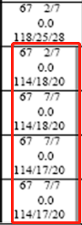

# 图例

# 基准部分

基准部分代表当前性能表的基础，即根据当前提供的条件计算，飞机性能可以满足起飞、越障、中断起飞并且顺利在跑道上停住

> A320214
>

* A320代表飞机型号
* 倒数第三位2代表200衍生型号
* 倒数第二位数字代表发动机厂商

  * 0=General Electric
  * 1=CFM International
  * 2=Prato & Whitney
  * 3=International Aero Engines
  * 4=Rolls-Royce
  * 5= CFM Leap
  * 6=Engine Alliance，GP
  * 7=Prato & Whitney PW1100G-JM
* 最后一位数字代表发动机后续改进型号代码

> JAA
>

* JAA代表适航规定

> CFM56-5B4 engines
>

* 发动机型号

* > QNH 1013.25 HPA
  >
  > Air Cond. On
  >
  > Anti-icing Off
  >
  > All reversers operating
  >

  * QNH，空调和防冰在计算时的使用条件
* > Dry check
  >
  > No reversers on dry runway
  >

  * Dry Check，干跑道检查，如果表格中有Dry Check，机组可以根据当前道面使用相对应的DRY或WET表格进行查询，如果表格中没有Dry Check，如果在湿跑道进行起飞，机组必须比较DRY的湿跑道修正和WET两张性能表中的性能，并且取较保守的数据使用
  * No reversers on dry runway，干跑道没有反推

当前机场信息，包括了：

Elevation 标高

Isa temp 温度

Rwy slop 跑道坡度

TORA=Take Off Run Available=可用起飞滑跑

TODA=Take Off Distance Available=可用起飞距离

ASDA=Accelerate Stop Distance Available=可用加速至停止距离

此外，常见的还有：

* LDA=Landing Distance Available=可用着陆距离
* Line up dist=跑道对正距离

08=跑道号

2 Obstacles=当前对应跑道的障碍物数量

右上方为数据库版本以及发布日期

DRY代表当前跑道条件

# 正文部分

RTOW性能表有两种表示法，温度表示法与重量表示法

在进行正文部分的查询时，两种不同的表示法使用不同的方式：

在温度表示法时，正文部分显示的内容如下：

78.5为最大起飞重量的理论熟知

4/6为限制代码

150/51/55为飞机的V~1~、V~r~、V~2~速度

注意，在使用温度表示法时，容易遇到温度数值带灰色或带型号的情况：

灰色部分的含义，是指当前灵活温度大于T~max~，是一个虚拟理论温度，具体T~max~内容请参考说明部分，如果外界温度超过T~max~，则不允许起飞，如果查询出的灵活温度超过T~max~则无影响

星号部分的含义，是当前灵活温度所对应的速度可能受到V~mc~的影响和限制，V~mc~可以说明部分的V~mc~ Limitation中查阅，此星号是提醒机组在这些低速的情况下注意飞机的控制

---

在重量表示法时，正文部分显示的内容如下：

54为起飞灵活温度

4/4为限制代码

150/51/55为飞机的V~1~、V~r~、V~2~速度

在使用重量表示法时，同样容易遇到正文中带灰色阴影的部分：

当出现阴影部分时，说明当前灵活温度所对应的速度可能受到V~mc~的影响和限制，V~mc~可以在说明部分的V~mc~ Limitation中查阅

注意，在重量表示法时，查询出的灵活温度同样不能低于说明部分的

# 修正部分

修正部分包括了三个部分的修正：

* 道面情况的修正
* 修正海压的修正
* 空调引气的修正

修正部分会出现带灰色阴影部分，这部分适用于查询出灵活温度大于T~vmc~时的修正。T~vmc~的数据在灰色阴影部分有显示，如上图所示，阴影部分的T~vmc~以带括号的（+67）标识，这代表只有当灵活温度大于67℃时，我们才使用该部分进行修正

# 说明部分

> VMC
>
> LIMITATION
>

Tvmc的限制，右侧有灰色阴影部分，对应正文部分中的灰色阴影部分，该部分提醒机组在这些低速的情况下注意飞机的控制，同样该部分可能用星号来显示，如下图：

与下图所对应的，在正文部分中，相关的数据即以星号来表示：

> T~ref~(OAT)=43℃
>
> T~max~（OAT）=54℃
>

T~ref~平台推力温度=43℃，如当前查询出的灵活温度小于该温度，不允许使用减推力起飞

T~max~最大取证温度=54℃，当前机场最大观测到的温度

> Min acc height 440ft
>
> Max acc height 1847ft
>

最小改平增速高440ft

最大改平增速高1847ft

> Min QNH alt 717ft
>
> MAX QNG alt 2124ft
>

最小修正海压高度717ft

最大修正海压高度2124ft

> LIMITATION CODES：
>
> 1=1st segment 2=2nd segment 3=runway length 4=obstacles 5=tire speed 6=brake energy 7=max weight 8=final take-off 9=VMU
>

限制代码：

1=第一阶段 2=第二阶段 3=跑道长度 4=障碍物 5=轮胎速度（地速） 6=最大刹车能量 7=最大重量 8=最终离地 9=V~mu~（最小离地速度）

> Min V~1~/V~r~/V~2~=112/18/21
>
> CHECK VMU LIMITATION
>
> Correct. V~1~/V~r~/V~2~=1.0 KT/1000KG
>

最小的V~1~/V~r~/V~2~速度为112/118/121kt

检查最小离地速度限制

修正 V~1~/V~r~/V~2~，每1000KG对应1kt
