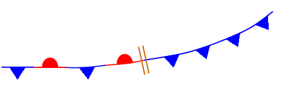

# 常用缩写

| 缩写 | 全称                           | 含义           |
| :-----: | -------------------------------- | ---------------- |
|  CU  | Cumulus                        | 淡积云         |
|  TCU  | Toweringcumulus                | 浓积云         |
|  CB  | Cumulonimbus                   | 积雨云         |
|  NS  | Nimbostratus                   | 雨层云         |
|  AS  | Altostratus                    | 高层云         |
|  CI  | Cirrus                         | 卷云           |
|  CC  | Cirrocumulus                   | 卷积云         |
|  SKC  | Sky Clear（0/8）               | 碧空           |
|  FEW  | Few（1~2/8）                   | 舒云           |
|  SCT  | Scattered（3~4/8）             | 少云           |
|  BKN  | Broken（5~7/8）                | 多云           |
|  OVC  | Covercast（8/8）               | 满天云         |
|  CS  | Cirrostratus                   | 层积云         |
|  ST  | Stratus                        | 层云           |
|  CUF  | Cumuliform                     | 积状云         |
| BECMG | Becoming                       | 渐变           |
| TEMPO | Temporary                      | 短时           |
| ISOL | Isolated                       | 孤立的         |
| OCNL | Occasionally                   | 偶然的         |
|  FRQ  | Frequent                       | 频繁的         |
|  SC  | Stratocumulus                  | 层积云         |
|  DUC  | Denseupper Cloud               | 高空浓云       |
|  STF  | Stratiform                     | 层状云         |
| EMBD | Embedded in a Layer           | 隐藏的         |
| OBSC | Obsured                        | 遮蔽的         |
|  SQL  | Squall Line                    | 飑线           |
| WDSPR | Widespread                     | 分部广阔的     |
| PROB | Probability                    | 概率的         |
|  LYR  | Layer                          | 层状的         |
|  FM  | From                           | 起始时间       |
|  TL  | Till                           | 直到           |
|  CNS  | Continuous                     | 连续的         |
|  COT  | Coastal                        | 海岸的         |
|  LOC  | Locally                        | 局部，当地     |
|  MON  | Mountainous                    | 山区的         |
| NOSIG | No Significant Change          | 无重大变化     |
|  CAT  | Clear Air Turbulence           | 晴空颠簸       |
|  MI  | Shallow                        | 浅的           |
|  BC  | Patches                        | 分散状的       |
|  PR  | Partial                        | 部分的         |
|  DR  | Low drifting                   | 低高度风吹起的 |
|  BL  | Blowing                        | 高高度风吹起的 |
|  SH  | Shower                         | 阵性的         |
|  TS  | Thunderstorm                   | 雷暴           |
|  FZ  | Freezing                       | 冻结的         |
|  DZ  | Drizzle                        | 毛毛雨         |
|  RA  | Rain                           | 雨             |
|  SN  | Snow                           | 雪             |
|  SG  | Snow grins                     | 雪粒           |
|  IC  | Ice Crystal                    | 冰晶           |
|  PE  | Ice pellets                    | 冰粒           |
|  GR  | Hail                           | 冰雹           |
|  GS  | Small hail and/or snow pellets | 小冰雹或冰粒   |
|  BR  | Mist                           | 轻雾           |
|  FG  | Fog                            | 雾             |
|  FU  | Smoke                          | 烟             |
|  VA  | Volcanic ash                   | 火山灰         |
|  DU  | Widespread Dust                | 浮尘，扬尘     |
|  SA  | Sand                           | 沙             |
|  HZ  | Haze                           | 霾             |
|  PO  | Dust/sandwhirls                | 沙柱、沙尘卷   |
|  SQ  | Squalls                        | 飑，狂风       |
|  FC  | Funnel cloud                   | 漏斗云或龙卷   |
|  SS  | Sandstorm                      | 沙暴           |
|  DS  | Duststorm                      | 尘暴           |

# 常见符号

| 符号                                                                                             | METAR代号      | 全称                                                  | 含义                                         |
| -------------------------------------------------------------------------------------------------- | ---------------- | ------------------------------------------------------- | ---------------------------------------------- |
|       | FU VA          | Smoke or volcanic Ash                                 | 烟或火山灰                                   |
|       | HZ             | Haze                                                  | 雾霾                                         |
|       | DU SA          | Dust or sand                                          | 扬沙或扬尘                                   |
|     | BLDU BLSA      | Blowing dust or sand                                  | 大片沙尘暴或扬尘                             |
|       | PO             | Dust devil                                            | 沙柱、沙尘卷                                 |
|     | VCSS           | Vicinity sand storm                                   | 附近有沙暴                                   |
|       | BR             | Mist or light fog                                     | 轻雾或轻霾                                   |
|     | MIFG           | More or less continuous shallow fog                   | 或多或少连续的轻雾                           |
|     | VCTS           | Vincinity thunderstorm                                | 附近有雷暴                                   |
|    | VIRGA          | Virga or precipitation not hitting ground             | 未落至地面的降水                             |
|     | VCSH           | Vicinity showers                                      | 附近有阵雨                                   |
|       | TS             | Thunderstorm with or without precipitation            | 带或不带降水的雷暴                           |
|       | SQ             | Squalls                                               | 飑，狂风                                     |
|       | FC             | Funnel cloud or tornado                               | 漏斗云或龙卷风                               |
|       | SS             | Sand or dust storm                                    | 沙暴或尘暴                                   |
|    | +SS            | Strong sand or dust storm                             | 强沙暴或尘暴                                 |
|     | BLSN           | Blowing snow                                          | 吹雪                                         |
|     | DRSN           | Drifting snow                                         | 飘雪                                         |
|     | VCFG           | Vincinty fog                                          | 附近有雾                                     |
|     | BCFG           | Patchy fog                                            | 块状雾                                       |
|     | PRFG           | Fog, sky discernable                                  | 雾，但天空可见                               |
|       | FG             | Fog, sky undiscernable                                | 雾，天空不可见                               |
|     | FZFG           | Freezing fog                                          | 冻雾                                         |
|      | -DZ            | Light drizzle                                         | 小毛毛雨（指未能形成雨滴但是形成降水的水汽） |
|       | DZ             | Moderate drizzle                                      | 中度毛毛雨                                   |
|    | +DZ            | Heavy drizzle                                         | 重度毛毛雨                                   |
|    | -FZDZ          | Light freezing drizzle                                | 轻度毛毛冻雨                                 |
|     | FZDZ +FZDZ     | Moderate to heavy freezing drizzle                    | 中度或重度毛毛冻雨                           |
|    | -DZRA          | Light drizzle and rain                                | 毛毛雨和小雨                                 |
|     | DZRA           | Moderate to heavy drizzle and rain                    | 中度或重度毛毛雨和雨                         |
|      | -RA            | Light rain                                            | 小雨                                         |
|       | RA             | Moderate rain                                         | 中雨                                         |
|                                              | +RA            | Heavy rain                                            | 大雨                                         |
|    | -FZRA          | Light freezing rain                                   | 小冻雨                                       |
|     | FZRA +FZRA     | Moderate to heavy freezing rain                       | 中冻雨或大冻雨                               |
|    | -RASN          | Light rain and snow                                   | 小雨夹雪                                     |
|     | RASN +RASN     | Moderate to heavy rain and snow                       | 中雨夹雪或大雨夹雪                           |
|      | -SN            | Light snow                                            | 小雪                                         |
|       | SN             | Moderate snow                                         | 中雪                                         |
|    | +SN            | Heavy snow                                            | 大雪                                         |
|       | SG             | Snow grains                                           | 雪粒                                         |
|       | IC             | Ice crystals                                          | 冰晶                                         |
|       | PE PL          | Ice pellets                                           | 冰粒                                         |
|    | -SHRA          | Light rain showers                                    | 小阵雨                                       |
|     | SHRA +SHRA     | Moderate to heavy rain showers                        | 中到大阵雨                                   |
|  | SHRASN         | Light rain and snow showers                           | 小雨阵雪                                     |
|   | SHRASN +SHRASN | Moderate to heavy rain and snow showers               | 中度或重度雨阵雪                             |
|    | -SHSN          | Light snow showers                                    | 小阵雪                                       |
|     | SHSN +SHSN     | Moderate to heavy snow showers                        | 中度或重度阵雪                               |
|      | -GR            | Light showers with hail, not with thunder            | 与雷暴无关的小阵冰雹                         |
|       | GR             | Moderate to heavy showers with hail, not with thunder | 与雷暴无关的中度或重度阵冰雹                 |
|     | TSRA           | Light to moderate thunderstorm with rain              | 小到中度的雷暴降雨                           |
|     | TSGR           | Light to moderate thunderstorm with hail              | 小到中度的雷暴冰雹                           |
|  | +TSRA          | Thunderstorm with heavy rain                          | 严重的雷暴降雨                               |

# 锋线图示

| 符号                                                 | 含义   | 解释                                                                                                                                                                                                   |
| ------------------------------------------------------ | -------- | -------------------------------------------------------------------------------------------------------------------------------------------------------------------------------------------------------- |
|  | 冷锋   | 分隔两个气团的区域，其中较冷、较密的气团正在前进并取代较暖的气团。                                                                                                                                     |
|  | 暖锋   | 大量暖空气和它所取代的冷空气之间的过渡区。                                                                                                                                                             |
|  | 静止锋 | 暖气团和冷气团之间的锋面，运动非常缓慢或根本不运动。                                                                                                                                                   |
|  | 锢囚锋 | 两个锋的复合体，形成为冷锋超过暖锋或准静止锋。根据冷锋后面的空气与暖锋或静止锋前面的空气的相对冷度，可以形成两种类型的遮挡。当最冷的空气在冷锋后面时会产生冷闭塞，而当最冷空气在暖锋之前会产生暖闭塞。 |
|  | 槽线   | 大气压力相对较低的细长区域；与脊线相反。                                                                                                                                                               |
|  | 飑线   | 一系列活跃的雷暴，无论是连续的还是间断的，包括由于雷暴的存在而产生的连续降水区。                                                                                                                       |
|  | 干线   | 分隔潮湿和干燥气团的边界。                                                                                                                                                                             |
|  | 热带波 | 低谷或气旋曲率最大值。                                                                                                                                                                                 |
|  | 变化线 | 变化线代表锋线类型的转换                                                                                                                                                                               |
