# 📕简介：

《A320飞行笔记思源版》作为A320系列飞机驾驶员的学习笔记总结，主要归纳了在进行A320飞行和训练时，一些值得分享的经验及需要注意的内容。本笔记的目的是通过知识和经验的分享让飞行员更有效率的进行学习，但本笔记并不能取代各公司发布的手册，更不能取代各自公司的运行标准，当本笔记里记载的内容和航空公司的标准产生分歧或冲突时，应当以各公司的手册为准。

# 📖目录：

# 📮相关链接：

## 📒"1. 笔记介绍与使用方法"[^1]

## 🤖"2. A320驾驶舱设计"[^2]

## 🔏"3. A320程序设计"[^15]

## 🛠"4. 驾驶舱分工"[^20]

## ⚕"5. 运行"[^23]

## 👨‍💼"6. 科目分析"[^61]

## 🔢"7. 限制"[^37]

## 🔠"8. 缩略语快速查询表格"[^3]

## 👍"9. 经验法则"[^90]

## 出品方公众号：云端公社

## 问卷调查：[点击这里](https://www.wjx.cn/vj/tA3KdGb.aspx)

## 联系邮箱：[点击这里](jethydra1985@gmail.com)

## "鸣谢名单"[^122]

[^1]: # 1. 笔记介绍与使用方法

    # **1.1 笔记介绍：**

    #### 性质：

    《A320飞行笔记》作为A320系列飞机驾驶员的学习笔记总结，主要归纳了在进行A320飞行和训练时，一些值得分享的经验及需要注意的内容。

    本笔记对于相关科目分析的制作逻辑是根据以下顺序安排的：

    1. 出现故障时飞机的状态/即时状态
    2. 处置故障的程序
    3. 需要注意的关键节点
    4. 容易出现的错误
    5. 科目涉及到的系统知识要点

    飞行员可以根据自己当前飞行技术的实际需求，从基本的现象判断，到应知应会的故障处置，再到科目背后所蕴含的系统逻辑，进行深入浅出的学习

    #### 优势：

    本笔记的优势在于使用双链接与大纲功能使用户能够更快捷便利的进行内容查询，不需要通过繁琐的搜索或切换就可以进行快速跳转。同时具有关系图与全局关系图功能对知识结构进行一目了然的分析。

    #### 注意：

    本笔记不能作为官方操作手册使用，当本笔记中的内容与公司手册内容相冲突时，应该以公司手册为准。

    如果对于本笔记有任何意见或建议，欢迎反馈。

    # **1.2 思源笔记版使用说明：**

    #### 思源笔记版大纲的使用：

    在每一章内容中可以使用快捷键ALT+2打开大纲。点击大纲中的小条目可以直接进行跳转。

    

    #### 思源笔记版关系图与全局关系图的使用：

    使用快捷键ALT+8打开本章内容的关系图谱，使用鼠标滚轮进行大小的调整。

    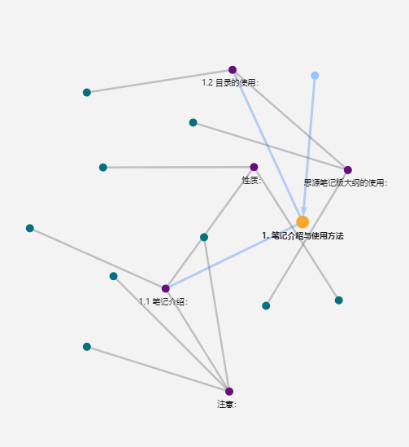

    使用快捷键ALT+9打开全局内容的关系图谱，使用鼠标的滚轮进行大小的调整。

    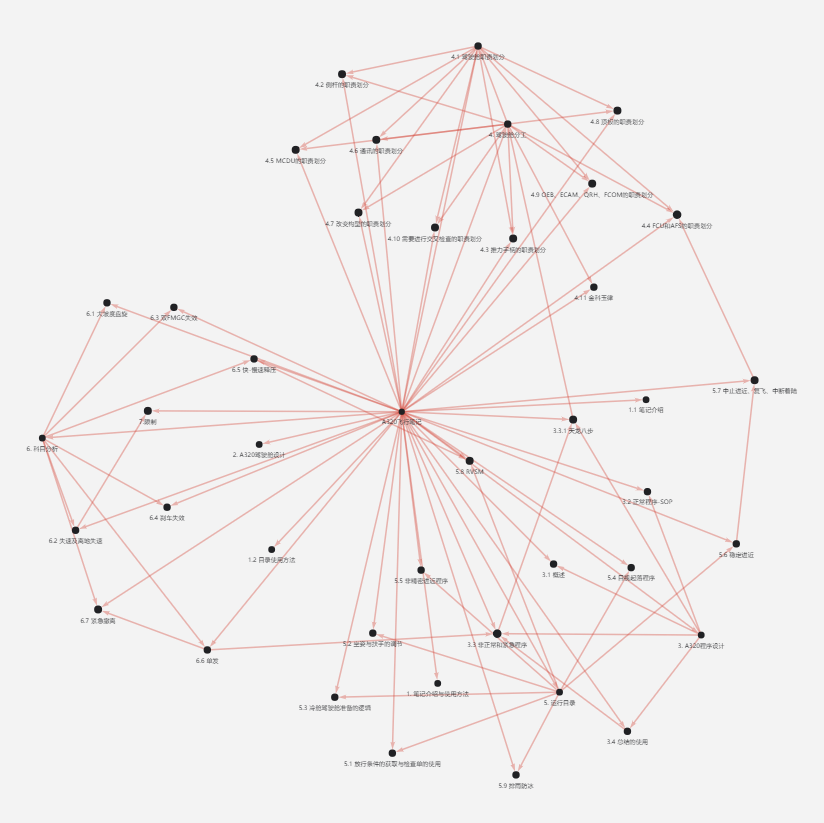

    #### 思源笔记版文件跳转的使用：

    将鼠标移动到超链接上可以看到浮窗显示。

    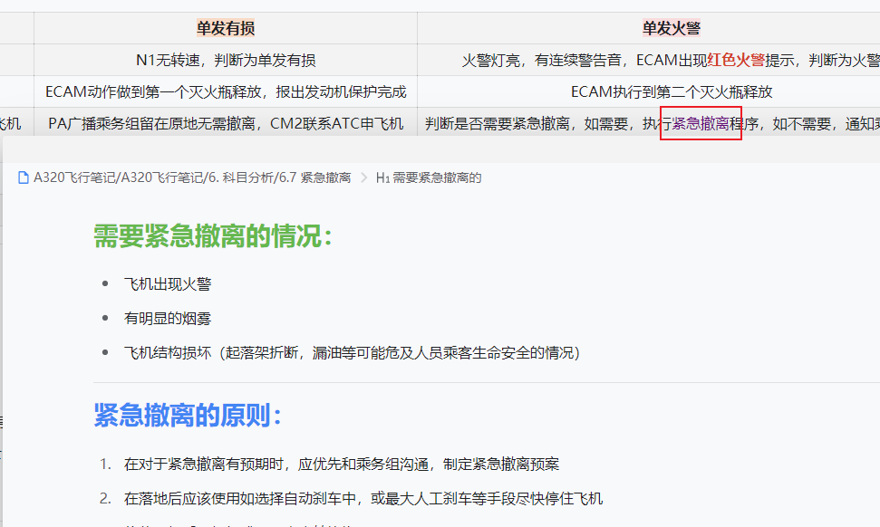

    单击超链接可以直接进入超链接提供的子页面。使用快捷键CTRL+左键可以返回到上一级页面。

    # 1.3 PDF版大纲的使用：

    PDF目前暂时不支持大纲的直接跳转，可以通过添加书签的方式浏览，后续维护过程中会进行更新。

[^2]: # 2. A320驾驶舱设计

    # 2.1 设计目的：

    空客驾驶舱的设计是在飞机的整个运行环境中满足飞行机组的操作需要，同时保证在飞行中电传飞机系列之间的最大一致性

    驾驶舱的设计基于以下 10 条高水平设计要求：

    1. 飞行机组对于飞机安全运行负有最终责任
    2. 如需要，飞行机组可按直觉采取行动以行使其全部权利，同时也旨在消除超限应力或过量操纵的风险
    3. 适用于飞行员之前获得的各种技能水平和经验
    4. 确保安全，旅客舒适度以及效率，遵循此优先顺序
    5. 通过加强情景意识和飞机状态的意识简化飞行机组任务
    6. 自动化被视作是对飞行员可用的一个附加特征， 飞行机组可根据情况决定何时使用以及需要何种级别的辅助
    7. 人机界面的设计综同时考虑了系统特征和飞行机组的优劣势
    8. 系统设计过程中应用了当前最先进的人为因素考虑手段，以便管理飞行机组的潜在错误
    9. 整体驾驶舱设计有助于促进和加强机组成员通信(例如分工、协同合作)
    10. 新技术的使用和新功能的实施受以下方面的强制要求：

         * 重大的安全效益
         * 显著的运行优势
         * 对飞行机组需求有明确的响应

    # 2.2 驾驶舱面板设计：

    #### 驾驶舱面板设计概述：

    A320的驾驶舱设计为前向驾驶舱设计，设计时考虑到了双人制驾驶舱的操作要求，其主要布局设置考虑了以下因素：

    * 各系统的相对重要性

    * 飞行员的操纵频率

    * 触及控制面板的便利程度

    * 控制面板的形状差异（防止混淆）

    * 如需要时，重复控制

    此设计能够达到的效果：

    * 显著减少飞行机组的工作量

    * 优化机组分工

    **最少化“低头”时间**（请在飞行与训练过程中牢记这一点）

    #### 顶板：

    顶板设计是以系统进行模块化划分，在所有顶板模块上，都能找到相对应的系统名称，在进行顶板操作时，应首先抬头确认该模块的系统名称，在找到该系统名称后，再在相对应模块上寻找相关的电门或开关。

    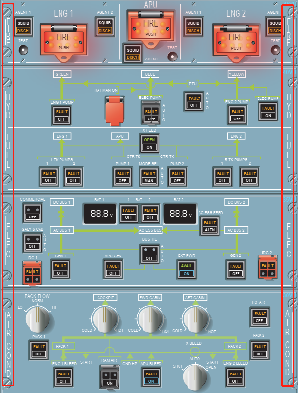

    #### 遮光板：

    遮光板支持自动飞行系统(AFS)的短期策略操纵。控制面板的操作可实现“抬头”且对于左右座飞行员都容易操作。注意，其设计目的为最少化“低头”时间。

    #### 主仪表面板：

    主仪表面板支持以下必要的显示组件（带*为选装）：

    * 飞行（PFD/HUD*）

    * 导航（ND）

    * 通信（DCDU*）

    * 监控各飞机系统（ECAM）

    显示组件全部位于两个飞行员完全不受阻的视野中，即空客的设计概念为减少头部的运动，依靠视觉获取最多信息。

    #### 操纵台：

    操纵台主要支持以下方面的操纵：

    * 发动机和推力(发动机主手柄，推力手柄)
    * 导航(MCDU，FMS)
    * 通信(RMP)

    以上设备缩写可查询"8. 缩略语快速查询表格"[^3]

    # 2.3 告警：

    #设计# #告警#

    # 概述：

    空客的告警系统是通过系统在面对非正常情况、系统工作状态变化时的提醒，最直观的方式是通过光线和声音两个方面来进行提示。

    #### 告警触发（听觉）：

    一般来讲，当下列情况发生时需要告警： 

    * 出现系统失效
    * 飞机超出正常的飞行包线
    * 安全突发事件（如：TCAS、TWAS）
    * 出现外部信息（如：客舱呼叫、ATC）
    * 系统自动改变其操作方式（如：AP断开，方式逆转）

    这些告警：

    * 触发目视和/或语音指示
    * 按严重性和优先级排序
    * 在某些特定飞行阶段不相关时被抑制

    #### 告警指示（视觉）：

    告警指示以下列方式呈现给飞行机组：

    * 初始指示(目视或语音)通过主警戒或主警告
    * 发动机警告显示(EWD)显示与失效相关的告警标题 -  系统显示(SD)自动显示受影响的系统
    * 顶板上，受影响系统的按钮/按钮电门灯呈**琥珀色**或**红色**

    #### 注意：

    空客告警系统并不仅限于声音与灯光两种提醒方式，在飞行过程中机组必须随时根据系统工作状态监控飞机，确保飞行运行安全。

    # 2.4 顶板暗驾驶舱概念：

    大部分系统是由顶板控制的，通过：

    * 按钮
    * 按钮电门
    * 电门
    * 旋钮，旋钮选择器

    每个按钮/按钮电门有一个或两个灯：

    * 上面的一个灯专门显示告警或系统状态（例如故障灯，OPEN灯）。如果无需告警或系统状态，两个灰色点将替代此灯
    * 下面的灯：

      * 在按钮电门上，对应系统的控制选择（例如接通、关断、超控），或
      * 在按钮上，对应系统状态（例如发动机防冰）

    如果无需控制系统选择，两个灰色点将替代此灯。

    一般规则认为：灯灭原则。系统可用并且适航。

    # 2.5 颜色代码：

    #### 颜色代码概述：

    空客在自己的显示组件主仪表面板，及顶板上都使用了自己设计的颜色语言，分别理解仪表与顶板的颜色语言有助于我们理解飞机当前的工作状态，从而采取更合理的动作来确保飞机的运行处于安全飞行包线中。

    #### 显示组件：

    显示组件上提供的信息用颜色编码，以指示：

    * 系统状态(ECAM 或  FMA)
    * 方式状态(FMA)
    * 信息性质(例如告警标题，要执行的动作，信息)

    #### 按钮/按钮电门灯：

    按钮/按钮电门上提供的信息同样也用颜色编码以指示系统状态：

    * **琥珀色**：指示系统失效
    * **红色**：指示某个可能需要即刻修正动作的失效
    * **绿色**：指示某个系统正常运行
    * **蓝色**：指示某个暂时选择的系统正常运行
    * 白色：指示某个按钮电门位置异常或维护/测试结果
    * 空白：系统适航

    # 2.6 电传飞机：

    #### 电传飞机概述：

    不同于传统飞机的线缆式操纵，电传飞机是把操纵输入量转化成数字信号传递至飞机相应舵面的计算机进行舵面输入。从这方面来讲，空客公司是将飞行员定义成一名管理者，由管理者通过侧杆向计算机下达指令进行动作，而非传统意义上飞机的直接操纵者。

    #### 飞行操纵保护：

    飞行操纵保护的目的在于：

    * 给予飞行机组全权，以便使其对相关操作施加本能、即刻动作从而获取最佳飞机性能
    * 使过量操纵、超限应力或损坏飞机的可能性降至最低

    PF主要任务之一是保持飞机在正常飞行包线限制范围以内。但是，在一些情况下，由于极端状况或对飞机误操纵，飞机可能会超出这些限制。 尽管有系统保护，PF也不能故意超出正常飞行包线。此外，这些保护设计并不用于结构限制的保护(例如相反方向的舵脚蹬输入)。相反，它们被设计用于需要本能和快速反应的紧急和紧张状况下，给PF提供有效帮助。

    **简而言之**，飞行操纵保护的目的在于最大程度的减少飞行员在进行不合理飞机操纵时产生的失误。

    #### 侧杆：

    侧装式侧杆的主要操作优势： 

    * 使主仪表面板的视野不受阻碍
    * 适应紧急情况(例如失能，操纵杆卡阻，操纵失效)
    * 正确调整扶手即可轻松握杆
    * 使滑动小桌板的安装成为可能(如用于放置航图、文件和餐食)

    接通自动驾驶时：

    * 侧杆锁定在中立位(即时的触觉反馈)
    * 飞行机组和自动驾驶同时输入是不可能的
    * 通过随时用力按压侧杆可本能地断开自动驾驶

    ###### 侧杆的使用：

    **一次仅一名飞行员进行侧杆输入**。

    如果PM想要操纵侧杆，TA必须：

    * 清楚地报出“我操纵”（关于更多责任的划分，请参考："4.1 驾驶舱职责划分"[^4]）
    * 按压并保持其侧杆按钮，以便完全操纵电传系统

    解释：飞行机组应记住侧杆输入是代数式叠加的。因此必须避免双输入，否则将触发语音和视觉告警。

    任一个飞行员可在任何时候在其侧杆输入。

    任一个飞行员可通过按压其侧杆按钮使另一个飞行员侧杆失效。

    #### 以改变构型法则飞行：

    当飞机在高高度以改变构型法则飞行时，飞行机组应当考虑下列因素：

    * 在高高度，下降到较低高度以增加抖振裕度。下降到最大推荐高度以下近 4000ft 时（即 REC MAX ALT - 4000 feet），会显著减少颠簸中失速警告的发生。
    * 在大速度时，小心机动并使用小的控制输入量。取决于再构型法则，俯仰控制法则可以有不同的模式，但横滚控制法则会一直是直接法则。

    ###### 备用法则：

    正常飞行包线内的操作特点，在俯仰上与正常法则一样。  
    正常飞行包线以外， PF 必须采取适当预防措施以防止失控，并且/或避免大幅度地偏移。这些动作与在任何情况下没有保护的飞机上执行的那些动作一样。

    ###### 直接法则：

    PF 必须注意避免大幅度地改变推力，或突然地作动减速板， 尤其是在重心靠后的时候。 如果减速板放出，且飞机已被重新配平， PF 必须柔和地收起减速板以提供给飞机足够时间重新配平， 从而避免过度机头下俯的配平变化。  
    此种情况下，目标不在于精确地操作飞机，而是保持飞机高度安全和稳定以便恢复失去的系统。

    ###### 机械备份：

    俯仰配平轮用于控制俯仰。 因为水平安定面(THS)面积大，舵面效应显著，因此任何俯仰配平轮上的动作应该平稳。  
    方向舵提供水平控制， 且其移动会导致略带延迟的明显横滚。 PF 应使用方向舵转弯，然后等待飞机反应。提前松开方向舵脚蹬，以保持机翼水平和稳定。

    # 2.7 推力-自动推力：

    空客选择了非反向驱动推力手柄概念：

    * 飞行员可以通过能量提示（速度、速度趋势、HUD V 型标志、发动机参数），而不是模棱两可的推力手柄活动，轻松直观的监控飞机能量。即，飞机推力手柄不会前后自动移动，飞行员通过精准的数据来判断当前自动推力工作的方式。
    * 当接通自动推力时，推力手柄的位置决定了可由自动推力指令的最大许可推力。即，推力手柄的位置为提供给自动推力最大额度的上限，自动推力会根据当前飞机需要的能量在最大额度推力与慢车之间根据飞机的姿态自行调整。
    * 当飞行机组使用人工推力时，推力手柄位置决定当前推力。此操纵方法和其他不使用自动推力的飞机一致。    

[^3]: # 8. 缩略语快速查询表格

    #### 搜索功能简单介绍：

    在需要进行搜索时，使用快捷键<kbd>CTRL</kbd>+<kbd>P</kbd> ，在搜索栏中输入自己需要寻找的内容，快速跳转

    此功能不仅能搜索缩略语部分，本笔记中的所有文档和内容都可以进行搜索

    #### A：

    | 缩略语       | 全称                                                | 翻译                         |
    | -------------- | ----------------------------------------------------- | ------------------------------ |
    | A/BRK        | Autobrake                                           | 自动刹车                     |
    | A/C          | Aircraft                                            | 飞机                         |
    | A/P、AP      | Autopilot                                           | 自动驾驶                     |
    | A/S          | Airspeed                                            | 空速                         |
    | A/SKID       | Anti-skid                                           | 防滞                         |
    | A/THR、A-THR | Auto Thrust                                         | 自动推力                     |
    | AA           | Airworthiness Authorities                           | 适航当局                     |
    | AAL          | Above Aerodrome Level                               | 高于机场高度                 |
    | AAT          | Aircraft Allocation Table                           | 飞机分配表                   |
    | AB           | Abort                                               | 取消、中断、中止             |
    | ABCU         | Alternate Braking Control Unit                      | 备用刹车控制组件             |
    | ABN          | Abnormal                                            | 不正常、非正常               |
    | ABV          | Above                                               | 高于                         |
    | AC           | Alternating Current                                 | 交流电                       |
    | ACARS        | ARINC Communication Addressing and Reporting System | 航空无线电通讯寻址和报告系统 |
    | ACAS         | Airbrone Collision Avoidance System                 | 空中防撞系统                 |
    | ACCEL        | Acceleration                                        | 增速、加速                   |
    | ACC          | Active Clearance Control                            | 主动间隔控制                 |
    | ACCU         | Accumulator                                         | 储压器、蓄压瓶               |
    | ACP          | Audio Control Panel                                 | 音频控制面板                 |
    | ACS          | Aircraft Configuration Summary                      | 飞机构型总结                 |
    | ACSC         | Air Conditioning System Controller                  | 空调系统控制器               |
    | ACT          | Additional Center Tank                              | 附加中央邮箱                 |
    | ADC          | Air Data Computer                                   | 大气数据计算机               |
    | ADF          | Automatic Direction Finder                          | 自动定向仪                   |
    | ADIRS        | Air Data Inertial Reference System                  | 大气数据惯导基准系统         |
    | ADIRU        | Air Data Inertial Reference Unit                    | 大气数据惯导基准组件         |
    | ADM          | Air Data Module                                     | 大气数据模块                 |
    | ADR          | Air Data Reference                                  | 大气数据基准                 |
    | ADS-B        | Automatic Dependent Surveillance - Broadcast        | 广播式自动相关监视           |
    | ADS-C        | Automatic Dependent Surveillance - Contract         | 合约式自动相关监视           |
    | ADV          | Advisory                                            | 咨询                         |
    | AEO          | All Engine Operative                                | 所有发动机工作               |
    | AEVC         | Avionic Equipment Vetilation Controller             | 航空电子设备通风控制器       |
    | AFM          | Airplane Flight Manual                              | 飞机飞行手册                 |
    | AFMC         | Auxiliary Fuel Management Computer                  | 辅助燃油管理计算机           |
    | AFMC         | Auxiliary Fuel Management System                    | 辅助燃油管理系统             |
    | AFS          | Auto Flight System                                  | 自动飞行系统                 |
    | AGL          | Above Ground Level                                  | 高于地面高度                 |
    | AIDS         | Aircraft Integrated Data System                     | 飞机综合数据系统             |
    | AIL          | Aileron                                             | 副翼                         |
    | AIME         | Autonomous Integrity Monitoring Extrapolation       | 自主完整性监控推断           |
    | AIP          | Attendant Indication Panel                          | 乘务员指示面板               |
    | AIU          | Audio Interface Unit                                | 音频借口组件                 |
    | ALT          | Altitude                                            | 高度                         |
    | ALTN         | Alternate                                           | 备用的、备降场               |
    | AMC          | Acceptable Means of Compliance                      | 可接受的符合性方法           |
    | AMI          | Airline Modifiable Information                      | 航空公司可修改信息           |
    | AMM          | Aircraft Maintenace Manual                          | 飞机维护手册                 |
    | AMU          | Audio Management Unit                               | 音频管理组件                 |
    | ANT          | Antenna                                             | 天线                         |
    | AOA          | Angle Of Attack                                     | 迎角                         |
    | AOC          | Airline Operation Control                           | 航空公司运行控制             |
    | APP、APPR    | Approach                                            | 进近                         |
    | APPU         | Asymetry Position Pick-off Unit                     | 不对称位置传感组件           |
    | APU          | Auxiliary Power Unit                                | 辅助动力装置                 |
    | AR           | Authorization Required                              | 所需授权                     |
    | ARINC        | Aeronautical Radio Incorporated                     | 航空无线电公司               |
    | ARN          | Aircraft Registration Number                        | 飞机注册号                   |
    | ARP          | Aerospace Recommended Practice                      | 空域建议惯例                 |
    | ARPT         | Airport                                             | 机场                         |
    | ASAP         | As Soon As Possible                                 | 尽快                         |
    | ASD          | Accelerate Stop Distance                            | 加速停止距离                 |
    | ASI          | Air Speed Indicator                                 | 空速表                       |
    | ASP          | Audio Selector Panel                                | 音频选择器面板               |
    | ATC          | Air Traffic Control                                 | 空中交通管制                 |
    | ATM          | Air Traffic Management                              | 空中交通管理                 |
    | ATN          | Aeronautical Telecommunication Network              | 航空电信网                   |
    | ATE          | Automatic Test Equipment                            | 自动测试设备                 |
    | ATIS         | Automatic Terminal Information System               | 自动终端信息系统             |
    | ATS          | Auto Thrust System/Air Traffic Service              | 自动推力系统/空中交通服务    |
    | ATSAW        | Airborne Traffic Situational Awareness              | 空中飞机活动情景意识         |
    | ATSU         | Air Traffic Service Unit                            | 空中交通服务组件             |
    | ATT          | Attitude                                            | 姿态                         |
    | AUTO         | Automatic                                           | 自动的                       |
    | AVNCS        | Avionics                                            | 航空电子                     |
    | AWY          | Airway                                              | 航路                         |

    #### B：

    | 缩略语 | 全称                               | 翻译              |
    | -------- | ------------------------------------ | ------------------- |
    | B/C    | Back Course                        | 反航道            |
    | BACV   | Braking Action Computaion Function | 刹车效应计算作用  |
    | BARO   | Barometric                         | 气压的/测定气压的 |
    | BASOV  | Buffer Air Shut Off Valve          | 缓冲空气关断活门  |
    | BAT    | Battery                            | 电瓶              |
    | BCL    | Battery Charge Limiter             | 电瓶充电限制器    |
    | BCDS   | Bite Centralized Data System       | 自测中央数据系统  |
    | BCU    | Backup Control Unit                | 备用控制组件      |
    | BDDV   | Brake Dual Distribution Valve      | 刹车双分配活门    |
    | BITE   | Built-In Test Equipment            | 自测设备          |
    | BIU    | BITE Interface Unit                | 自测设备接口组件  |
    | BFE    | Buyer Furnished Equipment          | 买方提供设备      |
    | BFO    | Beat Frequency Oscillator          | 差频振荡器        |
    | BLW    | Below                              | 低于              |
    | BMC    | Bleed Monitoring Computer          | 引气监控计算机    |
    | BNR    | Binary                             | 二进制的          |
    | BRG    | Bearing                            | 方位，轴承        |
    | BRK    | Brake                              | 刹车              |
    | BRT    | Bright                             | 明亮的            |
    | BSCU   | Braking Steering Control Unit      | 刹车转弯控制组件  |
    | BTC    | Bus Tie Contactor                  | 汇流条联接接触器  |
    | BTL    | Bottle                             | 瓶               |
    | BTS    | Bleed Temperature Sensor           | 引气温度传感器    |
    | BUS    | Busbar                             | 汇流条            |
    | BUSS   | Back Up Speed Scale                | 备用速度刻度      |

    #### C：

    | 缩略语     | 全称                                                            | 翻译                                 |
    | ------------ | ----------------------------------------------------------------- | -------------------------------------- |
    | C/B、CB    | Circuit Breaker                                                 | 跳开关                               |
    | C/L、CL    | Checklist                                                       | 检查单                               |
    | CAB        | Cabin                                                           | 客舱                                 |
    | CAPT       | Captain/Capture                                                 | 机长/截获                            |
    | CAS        | Calibrated Airspeed                                             | 校准空速                             |
    | CAT        | Category                                                        | 种类                                 |
    | CBMS       | Circuit Breaker Monitoring System                               | 跳开关监控系统                       |
    | CCD        | Cursor Control Device                                           | 游标控制系统                         |
    | CDL        | Configuration Deviation List                                    | 构型缺损清单                         |
    | CDLS       | Cockpit Door Locking System                                     | 驾驶舱门锁定系统                     |
    | CDSS       | Cockpit Door Surveillance System                                | 驾驶舱门监视系统                     |
    | CDU        | Control Display Unit                                            | 控制显示组件                         |
    | CF         | Cost of Fuel                                                    | 燃油成本                             |
    | CFDIU      | Centralized Fault Data Interface Unit                           | 集中故障数据接口组件                 |
    | CFDS       | Centralized Fault Display System                                | 集中故障显示系统                     |
    | CFP        | Computerized Flight Plan                                        | 计算机化的飞行计划                   |
    | CG         | Center of Gravity                                               | 重心                                 |
    | CHAN       | Channel                                                         | 频道                                 |
    | CHG        | Change                                                          | 变更、变化、改变                     |
    | CHK        | Check                                                           | 检查                                 |
    | CI         | Cost Index                                                      | 成本指数                             |
    | CIDS       | Cabin Intercommunication Data System                            | 客舱内部通讯数据系统                 |
    | CIDS - SDF | Cabin Intercommunication Data System - Smoke Detection Function | 客舱内部通讯数据系统-烟雾探测功能    |
    | CKPT       | Cockpit                                                         | 驾驶舱                               |
    | CIS        | Commonwealth of Independent States                              | 独联体                               |
    | CLB        | Climb                                                           | 爬升                                 |
    | CLR        | Clear                                                           | 清除                                 |
    | CLSD       | Closed                                                          | 关闭的、闭合的                       |
    | CM1(2)     | Crewmenber 1 (2)                                                | 机组人员1（左座）、机组人员2（右座） |
    | CMPTR      | Computer                                                        | 计算机                               |
    | CMS        | Constant Mach Segment/Centeral Maintenance System               | 恒定马赫航段/中央维护系统            |
    | CNSU       | Cabin Network Server Unit                                       | 客舱网络服务器组件                   |
    | CO         | Company                                                         | 公司                                 |
    | CO RTE     | Company Route                                                   | 公司航路                             |
    | COND       | Conditioning                                                    | 空调                                 |
    | CONF       | Configuration                                                   | 形态                                 |
    | CONT       | Continuous                                                      | 连续的                               |
    | CP         | Control Panel                                                   | 控制面板                             |
    | CPC        | Cabin Pressure Controller                                       | 座舱压力控制器                       |
    | CPCU       | Cabin Pressure Controller Unit                                  | 客舱压力控制器组件                   |
    | CPDLC      | Controller - Pilot Data Link Communication                      | 管制员-飞行员数据链通讯              |
    | CRC        | Continuous Repetitive Chime                                     | 连续重复谐音                         |
    | CRG        | Cargo                                                           | 货舱                                 |
    | CRS        | Course                                                          | 航道                                 |
    | CRT        | Cathode Ray Tube                                                | 阴极射线管                           |
    | CRZ        | Cruise                                                          | 巡航                                 |
    | CSAS       | Conditioned Service Air System                                  | 空调维护空气系统                     |
    | CSCU       | Cargo Smoke Control Unit                                        | 货舱延误控制组件                     |
    | CSD        | Constant Speed Drive                                            | 恒速传动装置                         |
    | CSM/G      | Constant Speed Motor/Generator                                  | 恒速马达/发电机                      |
    | CSTR       | Constraint                                                      | 强制                                 |
    | CT         | Cost of Time                                                    | 时间成本                             |
    | CTL        | Control                                                         | 控制、管制                           |
    | CTL PNL    | Control Panel                                                   | 控制面板                             |
    | CTR        | Center                                                          | 中央                                 |
    | CVR        | Cockpit Voice Recorder                                          | 驾驶舱语音记录器                     |

    #### D：

    | 缩略语 | 全称                                                | 翻译                         |
    | :------: | ----------------------------------------------------- | ------------------------------ |
    |   DA   | Drift Angle                                         | 偏流角                       |
    |  DAC  | Digital to Analog Coverter/Double Annular Combustor | 数字模拟转换器/双环燃烧室    |
    |  DAR  | Digital AIDS Recorder                               | 数字式飞机综合数据系统记录器 |
    |  DBUS  | Digital Backup Speed                                | 数字式备份速度               |
    |   DC   | Direct Current                                      | 直流电                       |
    |  DCDU  | Datalink Control and Display Unit                   | 数据链控制和显示组件         |
    |  DCL  | Digital Cabin Logbook                               | 数字式客舱记录本             |
    |  DCMS  | Doors Control and Monitoring System                 | 舱门控制和监控系统           |
    | DDRMI | Digital Distance and Radio Magnetic Indicator       | 数字式距离和无线电磁指示器   |
    | DECEL | Deceleration                                        | 减速                         |
    |  DES  | Descent                                             | 下降                         |
    |  DEST  | Destination                                         | 目的地                       |
    |  DET  | Detection/Detector                                  | 探测/探测器                  |
    |  DEV  | Deviation                                           | 偏差                         |
    |  DFA  | Deplayed Flap Approach                              | 延迟襟翼进近                 |
    |  DFDR  | Digital Flight Data Recorder                        | 数字式飞行数据记录器         |
    |   DH   | Decision Height                                     | 决断高                       |
    |  DIR  | Dirction                                            | 方向                         |
    | DIR TO | Direct To                                           | 直飞                         |
    |  DISC  | Disconnect                                          | 断开                         |
    | DISCH | Discharge                                           | 排出，释放                   |
    |  DIST  | Distance                                            | 距离                         |
    |  DITS  | Digital Information Transfer System                 | 数字式信息转换系统           |
    |  DIV  | Diverter                                            | 分流器，转向器               |
    |  DMC  | Display Management Computer                         | 显示管理计算机               |
    |  DME  | Distance Measuring Equipment                        | 测距仪                       |
    |  DMU  | Data Management Unit                                | 数据管理组件                 |
    |   DN   | Down                                                | 向下，放下                   |
    |  DPO  | Descent Profile Optimization                        | 下降剖面优化                 |
    |  DSDL  | Decicated Serial DataLink                           | 专用串列数据链               |
    |  DTG  | Distance To Go                                      | 待飞距离                     |
    |  DTO  | Derated Take Off                                    | 减功率起飞                   |
    |   DU   | Display Unit/Documentary Unit                       | 显示组件/文档单元            |

    #### E：

    | 缩略语   | 全称                                                | 翻译                        |
    | ---------- | ----------------------------------------------------- | ----------------------------- |
    | E/WD     | Engine/Warning Display                              | 发动机/警告显示             |
    | ECAM     | Electronic Centralized Aircraft Monitoring          | 飞机电子中央监控            |
    | ECAS     | Emergency Cockpit Alerting System                   | 驾驶舱紧急警报系统          |
    | ECB      | Electronic Control Box (APU)                        | (APU) 电子控制盒            |
    | ECM      | Engine Condition Monitoring                         | 发动机状态监控              |
    | ECON     | Economic                                            | 经济的                      |
    | ECP      | ECAM Control Panel                                  | ECAM 控制面板               |
    | ECS      | Environmental Control System                        | 环境控制系统                |
    | ECU      | Engine Control Unit                                 | 发动机控制组件              |
    | EDP      | Engine-Driven Pump                                  | 发动机驱动泵                |
    | EEC      | Electronic Engine Computer                          | 电子发动机计算机            |
    | EFB      | Electronic Flight Bag                               | 电子飞行包                  |
    | EFCS     | Electronic Flight Control System                    | 电子飞行操纵系统            |
    | EFIS     | Electronic Flight Instruments System                | 电子飞行仪表系统            |
    | EFF      | Electronic Flight Folder                            | 电子飞行文件夹              |
    | EFOB     | Estimated Fuel On Board                             | 预计机载燃油                |
    | EGPWS    | Enhanced Ground Proximity Warning System            | 增强型近地警告系统          |
    | EGT      | Exhaust Gas Temperature                             | 排气温度                    |
    | EIS      | Electronic Instruments System                       | 电子仪表系统                |
    | EIU      | Engine Interface Unit                               | 发动机接口组件              |
    | ELAC     | Elevator Aileron Computer                           | 升降舵副翼计算机            |
    | ELEC     | Electrics                                           | 电气                        |
    | ELT      | Emergency Locator Transmitter                       | 应急定位发射机              |
    | ELEV     | Elevator                                            | 升降舵                      |
    | ELV      | Elevation                                           | 标高                        |
    | EMER     | Emergency                                           | 应急，紧急                  |
    | EMER GEN | Emergency Generator                                 | 应急发电机                  |
    | ENG      | Engine                                              | 发动机                      |
    | EO       | Engine-Out                                          | 发动机失效                  |
    | EOSID    | Engine-Out Standard Instrument Departure            | 发动机失效标准仪表离场      |
    | EPE      | Estimated Position Error                            | 预计位置误差                |
    | EPR      | Engine Pressure Ratio                               | 发动机压力比                |
    | EPU      | Emergency Power Unit/Estimated Position Uncertainty | 应急电源组件/预计位置不确定 |
    | EQPT     | Equipment                                           | 设备                        |
    | EROPS    | Extended Range Operation                            | 延程运行                    |
    | ESF      | Estimated Suitable Friction                         | 预计合适的摩擦力            |
    | ESS      | Essential                                           | 重要的，主要的              |
    | EST      | Estimated                                           | 估计的，预测的              |
    | ETA      | Estimated Time of Arrival                           | 预计到达时间                |
    | ETE      | Estimated Time of Enroute                           | 预计航路时间                |
    | ETOPS    | Extended Twin Operation                             | 双发延程运行                |
    | ETP      | Equal Time Point                                    | 等时点                      |
    | ETT      | Estimated Time of Takeoff                           | 预计起飞时间                |
    | EVMU     | Engine Vibration Monitoring  Unit                   | 发动机震动监控组件          |
    | EXP      | Expedite                                            | 加速                        |
    | EXT PWR  | External Power                                      | 外部电源                    |
    | EXTN     | Extension                                           | 伸出                        |

    #### F：

    | 缩略语         | 全称                                         | 翻译                     |
    | ---------------- | ---------------------------------------------- | -------------------------- |
    | F              | Fuel                                         | 燃油                     |
    | FAA            | Federal Aviation Administration              | 美国联邦航空局           |
    | FAP            | Forward Attendant Panel                      | 前乘务员面板             |
    | F/C            | Flight Crew                                  | 飞行机组                 |
    | F/O、FO        | First Officer                                | 副驾驶                   |
    | FAC            | Flight Augmentation Computer                 | 飞行增稳计算机           |
    | FADEC          | Full Authority Digital Engine Control System | 全权数字式发动机控制系统 |
    | FAF            | Final Approach Fix                           | 最后进近定位点           |
    | FANS           | Future Air Navigation System                 | 未来空中导航系统         |
    | FAP            | Flight Attendant Panel                       | 乘务员面板               |
    | FAR            | Federal Aviation Regulation                  | 联邦航空条例             |
    | FAV            | Fan Air Valve                                | 风扇空气活门             |
    | FCDC           | Flight Control Data Concentrator             | 飞行操纵数据集中器       |
    | FCMS           | Flight Control and Monitoring System         | 燃油控制和监控系统       |
    | FCOM           | Flight Crew Operating Manual                 | 飞行机组操作手册         |
    | FCTM           | Flight Crew Techniques Manual                | 飞行机组技术手册         |
    | FCU            | Flight Control Unit                          | 飞行控制组件             |
    | FD             | Flight Director                              | 飞行指引仪               |
    | FDGS           | Fan Drive Gear System                        | 风扇传动齿轮系统         |
    | FDIMU          | Flight Data Interface and Management Unit    | 飞行数据接口和管理组件   |
    | FDIU           | Flight Data Interface Unit                   | 飞行数据接口组件         |
    | FDU            | Fire Detection Unit                          | 火警探测组件             |
    | FEP            | Final End Point                              | 最后结束点               |
    | FF             | Fuel  Flow                                   | 燃油流量                 |
    | FG             | Flight Guidance                              | 飞行引导                 |
    | FGC            | Flight Guidance Computer                     | 飞行引导计算机           |
    | F-G/S          | FLS Glide Slope                              | FLS下滑道                |
    | FIDS           | Fault Isolation and Detection System         | 故障隔离和探测系统       |
    | FL             | Flight Level                                 | 飞行高度层               |
    | FLD            | Factored Landing Distance                    | 分解着陆距离             |
    | FLEX           | Flexible                                     | 灵活的                   |
    | FLHV           | Fuel Lower Heating Value                     | 燃油低热值               |
    | F-LOC          | FLS Localizer                                | FLS航向道                |
    | FLP            | Flap                                         | 襟翼                     |
    | FLS            | FMS Landing System                           | 着陆系统                 |
    | FLSCU          | Fuel Level Sensing Control Unit              | 燃油油面传感控制装置     |
    | FLT            | Flight                                       | 飞行                     |
    | F/CTL、FLT CTL | Flight Control                               | 飞行控制                 |
    | FLXTO          | Flexible Takeoff                             | 灵活起飞                 |
    | FM             | Flight Management                            | 飞行管理                 |
    | FMA            | Flight Mode Annunciator                      | 飞行方式信号牌           |
    | FMGC           | Flight Management and Guidance Computer      | 飞行管理引导计算机       |
    | FMGS           | Flight Management and Guidance System        | 飞行管理引导系统         |
    | FMS            | Flight Management System                     | 飞行管理系统             |
    | FMV            | Fuel Metering Valve                          | 燃油计量活门             |
    | FNL            | Final                                        | 最后                     |
    | FOB            | Fuel On Board                                | 机载燃油                 |
    | FOHE           | Fuel Oil Heat Exchanger                      | 燃油滑油热交换器         |
    | FOM            | Figure Of Merit                              | 灵敏度                   |
    | FPA            | Flight Path  Angle                           | 飞行轨迹角               |
    | F-PLN          | Flight Plan                                  | 飞行计划                 |
    | FPD            | Flight Path Director                         | 飞行轨迹指引仪           |
    | FPPU           | Feedback Position Pick-off Unit              | 反馈位置传感组件         |
    | FPV            | Flight Path Vector                           | 飞行轨迹矢量             |
    | FQ             | Fuel Quantity                                | 燃油量                   |
    | FQI            | Fuel Quantity Indication                     | 燃油量指示               |
    | FQIC           | Fuel Quantity Indication Computer            | 燃油量指示计算机         |
    | FQU            | Fuel Quantity Unit                           | 燃油量组件               |
    | FREQ           | Frequency                                    | 频率                     |
    | FRT            | Front                                        | 前                       |
    | FRV            | Fuel Return Valve                            | 燃油回油活门             |
    | FTIS           | Fuel Tank Inerting System                    | 燃油惰化系统             |
    | FU             | Fuel Used                                    | 已耗燃油                 |
    | FWC            | Flight Warning Computer                      | 飞行警告计算机           |
    | FWD            | Forward                                      | 前、向前                 |
    | FWS            | Flight Warning System                        | 飞行警告系统             |

    #### G：

    | 缩略语   | 全称                                             | 翻译                      |
    | ---------- | -------------------------------------------------- | --------------------------- |
    | G/S      | Glideslope                                       | 下滑道                    |
    | GA       | Go-Around                                        | 复飞                      |
    | GAPCU    | Ground and Auxiliary Power Control Unit          | 地面和辅助动力控制组件    |
    | GBAS     | Ground Based Augmentation System                 | 陆基增强系统              |
    | GCU      | Generator Control Unit                           | 发电机控制组件            |
    | GDU      | Croup of Documentary Unit                        | 文档单元组                |
    | GEN      | Generator                                        | 发电机                    |
    | GES      | Ground Earth Station                             | 地面地球站                |
    | GLC      | Generator Line Contactor                         | 发电机线路接触器          |
    | GLS      | GBAS Landing System/GNSS Land System             | GBAS着陆系统/GNSS着陆系统 |
    | GMT      | Greenwich Mean Time                              | 格林威治标准时            |
    | GND      | Ground                                           | 地面                      |
    | GND TEMP | Ground Temperature                               | 地面温度                  |
    | GNSS     | Global Navigation Satellite System               | 全球导航尾行系统          |
    | GPCU     | Ground Power Control Unit                        | 地面电源控制组件          |
    | GPIRS    | Global Positioning and Inertial Reference System | 全球定位和惯性基准系统    |
    | GPS      | Global Position System                           | 全球定位系统              |
    | GPWS     | Ground Proximity Warning System                  | 近地警告系统              |
    | GRND     | Ground                                           | 地面                      |
    | GRP      | Georaphic Reference Poing                        | 地理坐标基准点            |
    | GRVTY    | Gravity                                          | 重力                      |
    | GS       | Ground Speed                                     | 地速                      |
    | GSM      | Global System for Mobile Communication           | 全球移动通信系统          |
    | GW       | Gross Weight                                     | 全重、总重                |

    #### H：

    | 缩略语 | 全称                                      | 翻译                     |
    | -------- | ------------------------------------------- | -------------------------- |
    | HC     | Harness Connector                         | 安全带连接器             |
    | HCU    | Hydraulic Control Unit/HUD Combiner Unit  | 液压控制组件/HUD合并组件 |
    | HDG    | Heading                                   | 航向                     |
    | HDG/S  | Heading Selected                          | 选择的航向               |
    | HDL    | Handle                                    | 手柄、处理、操作         |
    | HF     | High Frequency                            | 高频                     |
    | HI     | High                                      | 高的                     |
    | HLD    | Hold                                      | 保持、等待               |
    | HM     | Holding Pattern with a Manual Termination | 有人工终点的等待航线     |
    | HUM    | Hydrau-Mechanical Unit                    | 液压-机械组件            |
    | HMS    | Heat Management System                    | 加温管理系统             |
    | HP     | High Pressure                             | 高压                     |
    | HPA    | Hectopascal                               | 百帕                     |
    | HPC    | High Pressure Compressor                  | 高压压缩机               |
    | HPFD   | Hamorized Primary Flight Display          | 协调主飞显示             |
    | HPSOV  | High Pressure Shut-Off Valve              | 高压关断活门             |
    | HPT    | High Pressure Turbine                     | 高压涡轮                 |
    | HPV    | High Pressure Valve                       | 高压活门                 |
    | HUD    | Head Up Display                           | 平视显示                 |
    | HUDC   | Dead Up Display Computer                  | 平视显示计算机           |
    | HYD    | Hydraulic                                 | 液压                     |

    #### I：

    | 缩略语 | 全称                                     | 翻译                 |
    | -------- | ------------------------------------------ | ---------------------- |
    | I/O    | Inputs/Outputs                           | 输入/输出            |
    | I/P    | Input or Intercept Profile               | 输入或切入剖面       |
    | IAF    | Initial Approach Fix                     | 起始进近定位点       |
    | IAS    | Indicated Airspeed                       | 指示空速             |
    | IATA   | International Air Transport Association  | 国际航空运输组织     |
    | ICAO   | International Air Transport Organization | 国际民航组织         |
    | IDENT  | Indentification                          | 识别                 |
    | IDG    | INtegrated Drive Generator               | 整体驱动发电机       |
    | IFE    | In Flight Entertainment                  | 空中娱乐             |
    | IFPC   | Integrated Fuel Pump and Control         | 整体燃油泵和控制     |
    | IFR    | Instrument Flight Rules                  | 仪表飞行规则         |
    | IGGS   | Inert Gas Generation System              | 惰性气体发生系统     |
    | IGN    | Ignition                                 | 点火                 |
    | INHIB  | Inhibited                                | 受抑制               |
    | ILS    | Instrument Landing System                | 仪表着陆系统         |
    | IM     | Inner Marker                             | 内指标点             |
    | IMC    | Instrument Meteorological Conditions     | 仪表气象条件         |
    | IMM    | Immediate                                | 立即                 |
    | INB    | Inbound                                  | 向台                 |
    | INBO   | Inboard                                  | 机内的，内侧的       |
    | INCREM | Increment                                | 增值，增量           |
    | IND    | Indicator                                | 指示器               |
    | INIT   | Initialization                           | 初始化，起始         |
    | INOP   | Inoperative                              | 不工作               |
    | INR    | Inner                                    | 内侧，内部           |
    | INST   | Instrument                               | 仪表                 |
    | INTCPT | Intercept                                | 切入                 |
    | INV    | Inverter                                 | 变流机               |
    | IP     | Intermediate Pressure                    | 中级压力             |
    | IPC    | Intermediate Pressure Check valve        | 中级压力单向活门     |
    | IPPU   | Instrumentation Position Pick-off Unit   | 仪表设备位置传感组件 |
    | IR     | Intertial Reference                      | 惯性基准             |
    | IRS    | Intertial Reference System               | 惯性基准系统         |
    | ISA    | International Standard Atmosphere        | 国际标准大气         |
    | ISDU   | Initial System Display Unit              | 初始系统显示组件     |
    | ISIS   | Integrated Standby Instrument System     | 整体备用仪表系统     |
    | ISOL   | Isolation                                | 隔离                 |
    | ISPSS  | In-Seat Power Supply System              | 在座供电系统         |
    | ISPSU  | In-Seat Power Supply Unit                | 在座供电组件         |
    | ITP    | In Trail Procedure                       | 纵向排列程序         |

    #### J：

    | 缩略语 | 全称                       | 翻译         |
    | -------- | ---------------------------- | -------------- |
    | JAA    | Joint Aviation Authorities | 联合航空当局 |
    | JAR    | Joint Aviation Regulation  | 联合航空条例 |

    #### K：

    无

    #### L：

    | 缩略语  | 全程                                                 | 翻译                            |
    | --------- | ------------------------------------------------------ | --------------------------------- |
    | L/G     | Landing Gear                                         | 起落架                          |
    | LAF     | Load Alleviation Function                            | 减载功能                        |
    | LAT     | Lateral/Latitude                                     | 水平/纬度                       |
    | LAT REV | Latitude Revision                                    | 水平修正                        |
    | LAV     | Lavatory                                             | 盥洗间                          |
    | LCD     | Liquid Crystal Display                               | 液晶显示器                      |
    | LCN     | Load Classification Number                           | 载荷分类号                      |
    | LDA     | Landing Distance Available/Localizer Directional Aid | 可用着陆距离/航向道方向辅助设备 |
    | L DEV   | Lateral Deviation                                    | 水平偏离                        |
    | LDG     | Landing                                              | 着陆                            |
    | LDS     | Laptop Docking Station                               | 笔记本电脑安装台                |
    | LED     | Light Emitting Diode                                 | 发光二极管                      |
    | LEDU    | List of Effective Documentary Units                  | 有效文档单元清单                |
    | LEOEB   | List of Effective Operations Engineering Bulletins   | 有效操作工程通告清单            |
    | LESS    | List of Effective Section/Subsections                | 有效节/子节清单                 |
    | LF      | Low Frequency                                        | 低频                            |
    | LGCIU   | Landing Gear Control Interface Unit                  | 起落架控制接口组件              |
    | LGPIU   | Landing Gear Position Indicator Unit                 | 起落架位置指示组件              |
    | LH      | Left-Hand                                            | 左侧                            |
    | LIM     | Limitation                                           | 极限                            |
    | LIS     | Localizer Inertial Smoothing                         | 航向道惯性校平                  |
    | LK      | Lock                                                 | 锁定                            |
    | LL      | Latitude/Longitude                                   | 纬度/经度                       |
    | LLS     | Left-Line Select key                                 | 左行选键                        |
    | LO      | Low                                                  | 低                              |
    | LOC     | Localizer                                            | 航向道                          |
    | LONG    | Longitude                                            | 经度                            |
    | LP      | Low Pressure                                         | 低压                            |
    | LPC     | Low Pressure Compressor                              | 低压压缩机                      |
    | LPT     | Low Pressure Turbine                                 | 低压涡轮                        |
    | LRRA    | Low Range Radio Altimetier                           | 低范围无线电高度表              |
    | LRU     | Line Replaceable Unit                                | 航线可更换件                    |
    | LS      | Loudspeaker                                          | 扬声器                          |
    | LSK     | Line Select Key                                      | 行选键                          |
    | LT      | Light                                                | 灯                              |
    | LTS     | Load and Trim Sheet                                  | 装载配平单                      |
    | LVL     | Level                                                | 水平，水位，层                  |
    | LVL/CH  | Level Change                                         | 高度层改变                      |
    | LVR     | Lever                                                | 手柄                            |
    | LW      | Landing Weight                                       | 着陆重量                        |

    #### M：

    | 缩略语  | 全称                                          | 翻译                      |
    | --------- | ----------------------------------------------- | --------------------------- |
    | MABH    | Minimum Approach Break-off Height             | 最低中止进近高            |
    | MAC     | Mean Aerodynamic Chord                        | 平均空气动力弦            |
    | MAG     | Magnetic                                      | 磁场的，磁力的            |
    | MAG DEC | Magnetic Declination                          | 磁偏角                    |
    | MAG VAR | Magnetic Variation                            | 磁差                      |
    | MAINT   | Maintenance                                   | 维护                      |
    | MAN     | Manual                                        | 人工                      |
    | MAP     | Missed Approach Point                         | 复飞点                    |
    | MAX     | Maximum                                       | 最大                      |
    | MAX CLB | Maximum Climb                                 | 最大爬升                  |
    | MAX DES | Maximum Descent                               | 最大下降                  |
    | MAX END | Maximum Endurance                             | 最大续航时间              |
    | MC      | Master Caution                                | 主警戒                    |
    | MCDU    | Multipurpose Control and Display Unit         | 多功能控制显示组件        |
    | MCT     | Maximum Continuous Thrust                     | 最大连续推力              |
    | MCU     | Modular Concept Unit                          | 模块概念组件              |
    | MDA     | Minimum Descent Altitude                      | 最低下降高度              |
    | MDDU    | Multifunction Disk Drive Unit                 | 多功能磁盘驱动组件        |
    | MDH     | Minimum Descent Height                        | 最低下降高                |
    | MECH    | Mechanic                                      | 机械的，机务              |
    | MEA     | Minimum Enroute Altitude                      | 最低航路高度              |
    | MED     | Medium                                        | 中间的，方法，介质        |
    | MEL     | Minimum Equipment List                        | 最低设备清单              |
    | MFA     | Memorized Fault Annunciator                   | 储存的故障信号牌          |
    | MGB     | Main Gearbox                                  | 主变速箱                  |
    | MIN     | Minimum                                       | 最小                      |
    | MKR     | Marker                                        | 指标点                    |
    | MLA     | Maneuver Load Alleviation                     | 机动减载                  |
    | MLG     | Main Landing Gear                             | 主起落架                  |
    | MLS     | Microwave Landing System                      | 微波着陆系统              |
    | MLW     | Maximum Landing Weight                        | 最大着陆重量              |
    | MM      | Middle Marker                                 | 中指标点                  |
    | MMEL    | Master Minimum Equipment List                 | 主最低设备清单            |
    | MMO     | Maximum Operating Mach                        | 最大操作马赫              |
    | MMR     | Multi Mode Receiver                           | 多方式接收机              |
    | MN      | Mach Number                                   | 马赫数                    |
    | MORA    | Minimum Off Route Altitude                    | 最低偏航高度              |
    | MP      | Modification Proposal                         | 改装提案                  |
    | MRIU    | Maintenance and Recording Interface Unit      | 维护和记录接口组件        |
    | MRP     | Map Reference Point                           | 地图基准点                |
    | MSA     | Minimum Safe Altitude/Minimum Sector Altitude | 最低安全高度/最低扇区高度 |
    | MSG     | Message                                       | 信息                      |
    | MSL     | Mean Sea Level                                | 平均海平面                |
    | MSU     | Mode Selector Unit                            | 方式选择器组件            |
    | MTBF    | Mean Time Between Failure                     | 平均失效间隔时间          |
    | MTC     | Modulated Turbine Cooling                     | 调节涡轮冷却              |
    | MTOW    | Maximum Takeoff Weight                        | 最大起飞重量              |
    | MZFW    | Maximum Zero Fuel Weight                      | 最大无燃油重量            |

    #### N：

    | 缩略语  | 全称                                       | 翻译               |
    | --------- | -------------------------------------------- | -------------------- |
    | N/A、NA | Not Applicable                             | 不适用             |
    | N1      | Low Pressure Rotor Speed                   | 低压转子速度       |
    | N2      | High Pressure Rotor Speed                  | 高压转子速度       |
    | NACA    | National AdvisoryCommittee for Aeronautics | 国家航空咨询委员会 |
    | NAI     | Engine Nacelle Anti-Ice                    | 发动机吊舱防冰     |
    | NAV     | Navigation                                 | 导航               |
    | NAVAID  | Navigation Aid                             | 导航设备           |
    | NCD     | Non Computed Data                          | 非计算数据         |
    | ND      | Navigation Display                         | 导航显示           |
    | NDB     | Non Directional Neacon                     | 无方向性信标       |
    | NLG     | Nose Landing Gear                          | 前起落架           |
    | NORM    | Normal                                     | 正常               |
    | NPA     | Non Precision Approach                     | 非精密进近         |
    | NW      | Nosewheel                                  | 前轮               |
    | NWS     | Nosewheel Steering                         | 前轮转弯           |

    #### O：

    | 缩略语 | 全称                               | 翻译             |
    | -------- | ------------------------------------ | ------------------ |
    | O/P    | Output                             | 输出             |
    | OANS   | On-board Airport Navigation System | 机载机场导航系统 |
    | OAT    | Outside Air Temperature            | 外界大气温度     |
    | OBRM   | On Board Replaceable Module        | 机载可更换组件   |
    | OEB    | Operation Engineering Bulletin     | 操作工程通告     |
    | OEI    | One Engine Inoperative             | 单发失效         |
    | OFF/R  | Off Reset                          | 关/重置          |
    | OFST   | Offset                             | 偏置             |
    | OIS    | Onboard Information System         | 机载信息系统     |
    | OIT    | Onboard Information Terminal       | 机载信息终端     |
    | OLB    | OPS Library Browser                | 运行类手册浏览器 |
    | OM     | Outer Marker                       | 外指标点         |
    | OP     | Open                               | 打开             |
    | OPP    | Opposite                           | 相反的           |
    | OPS    | Operations                         | 运行，操作       |
    | OPT    | Optimum                            | 理想的，最佳的   |
    | OUTB   | Outbound                           | 背台，向外       |
    | OUTR   | Outer                              | 外部，外侧       |
    | OVBD   | Overboard                          | 机外，舱外       |
    | OVHD   | Overhead                           | 头顶的，飞越上空 |
    | OVHT   | Overheat                           | 过热             |
    | OVRD   | Override                           | 超控             |
    | OVSPD  | Overspeed                          | 超速             |
    | OXY    | Oxygen                             | 氧气             |

    #### P：

    | 缩略语  | 全称                                             | 翻译                     |
    | --------- | -------------------------------------------------- | -------------------------- |
    | P/N、PN | Part Number                                      | 件号                     |
    | PA      | Passenger Address                                | 旅客广播                 |
    | P-ALT   | Profile Altitude                                 | 剖面高度                 |
    | PAX     | Passenger                                        | 旅客                     |
    | PAR     | Precision Approach Radar                         | 精密进近雷达             |
    | PBCS    | Performance-Based Communication and Surveillance | 以性能为基础的通讯和监视 |
    | PBE     | Portable Breathing Equipment                     | 便携式呼吸设备           |
    | PBN     | Performance Based Navigation                     | 基于性能的导航           |
    | P-CLB   | Profile Climb                                    | 剖面爬升                 |
    | PCU     | Power Control Unit                               | 动力控制组件             |
    | P-DES   | Profile Descent                                  | 剖面下降                 |
    | PDB     | Performance Data Base                            | 性能数据库               |
    | PDU     | Pilot Display Unit                               | 飞行员显示组件           |
    | PED     | Portable Electronic Device                       | 便携式电子设备           |
    | PERF    | Performance                                      | 性能                     |
    | PES     | Passenger Entertainment System                   | 旅客娱乐系统             |
    | PF      | Pilot Flying                                     | 操纵飞机的飞行员         |
    | PFC     | Porous Friction Course                           | 多孔摩擦道面             |
    | PFD     | Primary Flight Display                           | 主飞行显示               |
    | PHC     | Probes Heat Computer                             | 探头加温计算机           |
    | PIREP   | Pilot Report                                     | 飞行员报告               |
    | P-MACH  | Profile Mach                                     | 剖面马赫                 |
    | PM      | Pilot Monitoring                                 | 监控飞机的飞行员         |
    | PNL     | Panel                                            | 面板                     |
    | POB     | Pressure Off Brake                               | 无液压止动装置           |
    | POS     | Position                                         | 位置                     |
    | PPOS    | Present Position                                 | 当前位置                 |
    | PPU     | Position Pick-off Unit                           | 位置传感器               |
    | PR      | Pressure                                         | 压力                     |
    | PRED    | Prediction                                       | 预计，预告，预测         |
    | PRESS   | Pressure，Pressurization                         | 压力，增压               |
    | PROC    | Procedure                                        | 程序                     |
    | PROC T  | Procedure Turn                                   | 程序转弯                 |
    | PROF    | Profile                                          | 剖面                     |
    | PROG    | Progress                                         | 进程，进展               |
    | PROTEC  | Protection                                       | 保护                     |
    | P-SPEED | Profile Speed                                    | 剖面速度                 |
    | PSCU    | Proximity Switch Control Unit                    | 近地电门控制组件         |
    | PSL     | Product Structure Level                          | 产品结构层               |
    | PSU     | Passenger Service Unit                           | 旅客服务组件             |
    | PT      | Point                                            | 点                       |
    | PTR     | Printer                                          | 打印机                   |
    | PTT     | Push To Talk                                     | 按下通话                 |
    | PTU     | Power Transfer Unit (Hydraulic)                  | 动力转换组件（液压系统） |
    | PVI     | Paravisual Indicator                             | 侧视指示器               |
    | PWR     | Power                                            | 功率，动力，电源         |
    | PWS     | Predictive Windshear System                      | 预测式风切变系统         |

    #### Q：

    | 缩略语 | 全称                                              | 翻译                           |
    | -------- | --------------------------------------------------- | -------------------------------- |
    | QAR    | Quick Access Recorder                             | 快速存取记录器                 |
    | QFE    | Field Elevation Atmosphere Pressure               | 机场标高大气压力，场压         |
    | QFU    | Runway Heading                                    | 跑道航向                       |
    | QNE    | Sea Level Standard Atmosphere Pressure (1013 hPa) | 海平面标准大气压力（1013百帕） |
    | QNH    | Sea Level  Atmosphere Pressure                    | 海平面大气压力，海压           |
    | QRH    | Quick Reference Handbook                          | 快速检查单                     |
    | QT     | Quart (US)                                        | 夸脱（美制）                   |
    | QTY    | Quantity                                          | 数量，量                       |

    #### R：

    | 缩略语 | 全称                                     | 翻译                  |
    | -------- | ------------------------------------------ | ----------------------- |
    | R/I    | Radio/Inertial                           | 无线电/惯性           |
    | RA     | Radio Altimeter/Resolution Advisory      | 无线电高度表/决断咨询 |
    | RAAS   | Runway Awareness and Advisory System     | 跑道意识和咨询系统    |
    | RACC   | Rotor Active Clearance Control           | 转子主动间隙控制      |
    | RAD    | Radio                                    | 无线电                |
    | RAIM   | Receiver Autonomous Integrity Monitoring | 接收机自主完整性监控  |
    | RAT    | Ram Air Turbine                          | 冲压空气涡轮          |
    | RATC   | Remote ATC Box                           | 遥控ATC盒             |
    | RCAM   | Runway Condition Assessment Matrix       | 跑道条件评估矩阵      |
    | RCDR   | Recorder                                 | 记录器，录音机        |
    | RCL    | Recall                                   | 重现                  |
    | RCP    | Required Communication Performance       | 所需的通讯性能        |
    | RCVR   | Receiver                                 | 接收机                |
    | REAC   | Reactive                                 | 反应的                |
    | REC    | Recommended                              | 建议的                |
    | RED    | Reduction                                | 减少                  |
    | REG    | Regulation                               | 规则，调节            |
    | REL    | Release                                  | 松开                  |
    | REV    | Reverse                                  | 反推                  |
    | RFCF   | Runway Field Clearance Floor             | 跑道区域净空层        |
    | RH     | Right-Hand                               | 右侧                  |
    | RLD    | Required Landing Distance                | 所需着陆距离          |
    | RLSK   | Right Line Select Key                    | 右行选键              |
    | RMI    | Radio Magnetic Indicator                 | 无线电磁指示器        |
    | RMP    | Radio Management Panel                   | 无线电管理面板        |
    | RNAV   | Area Navigation                          | 区域导航              |
    | RNG    | Range                                    | 范围，距离            |
    | RNP    | Required Navigation Performance          | 要求的导航性能        |
    | ROP    | Runway Overrun Protection                | 冲出跑道保护          |
    | ROPS   | Runway Overrun Prevention System         | 防止冲出跑道系统      |
    | ROW    | Runway Overrun Warning                   | 冲出跑道警告          |
    | RPCU   | Residual Pressure Control Unit           | 剩余压力控制组件      |
    | RPM    | Revolution Per Minute                    | 每分钟转速            |
    | RPTG   | Repeating                                | 重复的                |
    | RQRD   | Required                                 | 要求的                |
    | RSP    | Required Surveillance Performance        | 所需的监视性能        |
    | RSV    | Reserves                                 | 储备，备用            |
    | RSVR   | Reservoir                                | 储油箱                |
    | RTA    | Required Time of Arrival                 | 要求到达时间          |
    | RTE    | Route                                    | 航路                  |
    | RTL    | Rudder Travel Limit                      | 方向舵行程限制        |
    | RTO    | Rejected Takeoff                         | 中断起飞              |
    | RTOW   | Regulatory Takeoff Weight                | 调节的起飞重量        |
    | RUD    | Rudder                                   | 方向舵                |
    | RVSM   | Reduced Vertical Separation Minimum      | 缩小的最小垂直间隔    |
    | RWY    | Runway                                   | 跑道                  |

    #### S：

    | 缩略语      | 全称                                                       | 翻译                       |
    | ------------- | ------------------------------------------------------------ | ---------------------------- |
    | S           | South                                                      | 南                         |
    | S/C         | Step Climb                                                 | 梯级爬升                   |
    | S/D         | Step Descent                                               | 梯级下降                   |
    | S/D         | Shut Down                                                  | 关车                       |
    | S/F         | Slats/Flaps                                                | 缝翼/襟翼                  |
    | S/N、SN     | Serial Number                                              | 序列号                     |
    | SAAAR       | Special Aircrew and Aircraft Authorization Required        | 要求特殊机组和飞机授权     |
    | SAC         | Single Annular Chamber                                     | 单个环形室                 |
    | SAT         | Static Air Temperature                                     | 静温                       |
    | SATCOM      | Satellite Communication                                    | 卫星通讯                   |
    | SBAS        | Satellite Based Augmentation System                        | 星基增强系统               |
    | SC          | Single Chime                                               | 单谐音                     |
    | SCP         | Software Control Panel                                     | 软件控制面板               |
    | SD          | System Display                                             | 系统显示                   |
    | SDAC        | System Data Acquisition Concentrator                       | 系统数据集获器             |
    | SDCU        | Smoke Detection Control Unit                               | 烟雾探测控制组件           |
    | SDF         | Smoke Detection Function、Simplified Directional  Facility | 烟雾探测功能、简化定向设施 |
    | SEC         | Spoiler Elevator Computer                                  | 扰流板升降舵计算机         |
    | SEL         | Selector                                                   | 选择器                     |
    | SFCC        | Slat/Flap Control Computer                                 | 缝翼/襟翼控制计算机        |
    | SFE         | Seller-Furnished Equipment                                 | 卖方配置设备               |
    | SID         | Standard Instrument Departure                              | 标准仪表离场               |
    | SIM         | Simulation                                                 | 模拟                       |
    | SLT         | Slat                                                       | 缝翼                       |
    | SOP         | Standard Operating Procedure                               | 标准操作程序               |
    | SPD         | Speed                                                      | 速度                       |
    | SPD LIM     | Speed Limit                                                | 速度限制                   |
    | SPLR        | Spoiler                                                    | 扰流板                     |
    | SQWK        | Squawk                                                     | 应答机                     |
    | SRS         | Speed Reference System                                     | 速度基准系统               |
    | STAR        | Standard Terminal Arrival Route                            | 标准终端进场航路           |
    | STAT        | Static                                                     | 静态的                     |
    | STAT INV    | Static Inverter                                            | 静变流机                   |
    | STBY        | Standby                                                    | 备用                       |
    | STD         | Standard                                                   | 标准                       |
    | STEER、STRG | Steering                                                   | 转弯，操纵，驾驶           |
    | STS         | Status                                                     | 状态                       |
    | SWTG        | Switching                                                  | 转换                       |
    | SYNC        | Synchronize                                                | 同步                       |
    | SYS         | System                                                     | 系统                       |

    #### T：

    | 缩略语       | 全称                                           | 翻译                     |
    | -------------- | ------------------------------------------------ | -------------------------- |
    | T.O、T/O、TO | Takeoff                                        | 起飞                     |
    | T/C          | Top of Climb                                   | 爬升顶点                 |
    | T/D          | Top of Descent                                 | 下降顶点                 |
    | TA           | Traffic Advisory                               | 活动咨询                 |
    | TAB          | Temporary Abnormal Behavior                    | 短暂非正常行为           |
    | TAC          | Taxi Aid Camera                                | 滑行辅助摄像机           |
    | TACAN        | Tactical Air Navigation                        | 战术空中导航             |
    | TACT         | Tactical                                       | 战术的                   |
    | TAS          | True Air Speed                                 | 真空速                   |
    | TAT          | Total Air Temperature                          | 全温，总温               |
    | TAU          | Time to intercept                              | 切入时间                 |
    | TAWS         | Terrain Awareness and Warning System           | 地形意识和警告系统       |
    | TBC          | To Be Confirmed                                | 待证实                   |
    | TBD          | To Be Determined                               | 待定                     |
    | T2CAS        | Traffic and Terrain Collision Avoidance System | 空中交通和地面防撞系统   |
    | T3CAS        | Traffic and Terrain Collision Avoidance System | 空中交通和地面防撞系统   |
    | TCA          | Turbine Cooling Air                            | 涡轮冷却空气             |
    | TCAS         | Traffic Alert and Collision Avoidance System   | 空中交通警报和防撞系统   |
    | TCC          | Turbine Case Cooling                           | 涡轮机匣冷却             |
    | TCF          | Terrain Clearance Floor                        | 地形净空层               |
    | TCM          | Thrust Control Malfunction                     | 推力控制异常             |
    | TDU          | Temporary Documentary Unit                     | 临时文档单元             |
    | TEMP         | Temperature                                    | 温度                     |
    | TFTS         | Terrestrial Flight Telephone System            | 陆上飞行电话系统         |
    | TGT          | Target                                         | 目标                     |
    | THR          | Thrust                                         | 推力                     |
    | THS          | Trimmable Horizontal Stabilizer                | 可配平的水平安定面       |
    | THSA         | Trimmable Horizontal Stabilizer Actuator       | 可配平的水平安定面作动筒 |
    | TK           | Tank/Track Angle                               | 油箱/航迹角              |
    | TKE          | Track Angle Error                              | 航迹角误差               |
    | TLA          | Throttle Lever Angle                           | 油门杆角度               |
    | TLU          | Travel Limitation Unit                         | 行程限制组件             |
    | TMR          | Timer                                          | 计时器                   |
    | TOC          | Table of Contents                              | 目录                     |
    | TOD          | Takeoff Distance                               | 起飞距离                 |
    | TOGA         | Takeoff-Go-Around                              | 起飞-复飞                |
    | TOGW         | Takeoff Gross Weight                           | 起飞全重                 |
    | TOR          | Takeoff Run                                    | 起飞滑跑                 |
    | TOS          | Takeoff Surveillance                           | 起飞监视                 |
    | TOW          | Takeoff Weight                                 | 起飞重量                 |
    | T-P          | Turn Point                                     | 转弯点                   |
    | TPIS         | Tire Pressure Indicating System                | 胎压指示系统             |
    | TR           | Transformer Rectifier                          | 变压整流器               |
    | T-R          | Transmitter-Receiver                           | 发射机-接收机            |
    | TRANS        | Transition                                     | 过渡                     |
    | TRK          | Track                                          | 航迹                     |
    | TROPO        | Tropopause                                     | 对流层顶                 |
    | TRU          | Transformer Rectifier Unit                     | 变压整流器组件           |
    | TRV          | Travel                                         | 旅行，行程               |
    | TSM          | Trouble Shooting Manual                        | 排故手册                 |
    | TTG          | Time to Go                                     | 待飞时间                 |
    | TVMC         | Minimum Control Speed Temperature              | 最小控制速度温度         |
    | TWY          | Taxiway                                        | 滑行道                   |

    #### U：

    | 缩略语 | 全称                       | 翻译               |
    | -------- | ---------------------------- | -------------------- |
    | UFD    | Unit Fault Data            | 组件故障数据       |
    | ULB    | Underwater Locator Beacon  | 水下定位信标机     |
    | UNLK   | Unlock                     | 未锁的，松锁，开锁 |
    | UP     | Up、Upper                  | 上、向上           |
    | USB    | Universal Serial Bus       | 通用串行总线       |
    | UTC    | Universal Coordinated Time | 世界协调时         |

    #### V：

    | 缩略语   | 全称                                      | 翻译                  |
    | ---------- | ------------------------------------------- | ----------------------- |
    | V/S      | Vertical Speed                            | 垂直速度              |
    | V1       | Decision Speed                            | 决断速度              |
    | V2       | Takeoff Safety Speed                      | 起飞安全速度          |
    | VAPP     | Approach Speed                            | 进近速度              |
    | VBV      | Variable Bypass Valve                     | 可变旁通活门          |
    | VC       | Calibrated Airspeed                       | 校准空速              |
    | VDEV     | Vertical Deviation                        | 垂直偏离              |
    | VEL      | Velocity                                  | 速度                  |
    | VERT     | Vertical                                  | 垂直                  |
    | VERT REV | Vertical Revisor                          | 垂直修正              |
    | VFE      | Maximum Speed for each Flap configuration | 各襟翼形态的最大速度  |
    | VFEN     | VFE Next                                  | 下一档VFE             |
    | VFTO     | Final Takeoff Speed                       | 最后起飞速度          |
    | VHF      | Very High Frequency                       | 甚高频                |
    | VHV      | Very High Voltage                         | 甚高压                |
    | VIB      | Vibration                                 | 振动                  |
    | VIP      | Vertical Intersection Point               | 垂直交叉点            |
    | VLE      | Maximum Landing Gear Extended Speed       | 最大放起落架速度      |
    | VLS      | Lowest Selectable Speed                   | 最小可选速度          |
    | VLV      | Valve                                     | 活门                  |
    | VM       | Maneuvering Speed                         | 机动飞行速度          |
    | VMAX     | Maximum Allowable Speed                   | 最大允许速度          |
    | VMC      | Visual Meteorological Conditions          | 目视气象条件          |
    | VMCA     | Minimum Control Speed in the Air          | 空中最小控制速度      |
    | VMCG     | Minimum Control Speed on Ground           | 地面最小控制速度      |
    | VMCL     | Minimum Control Speed at Landing          | 着陆最小控制速度      |
    | VMIN     | Minimum Operating Speed                   | 最小操作速度          |
    | VMO      | Maximum Operating Speed                   | 最大操作速度          |
    | VOR-D    | VOR-DME                                   | 甚高频全向信标-测距仪 |
    | VR       | Rotation Speed                            | 抬头速度              |
    | VREF     | Landing Reference Speed                   | 着陆基准速度          |
    | VSC      | Vacuum System Controller                  | 真空系统控制器        |
    | VSI      | Vertical Speed Indicator                  | 垂直速度指示器        |
    | VSV      | Variable Stator Vane                      | 可变静子叶片          |
    | VU       | Visual Unit                               | 目视组件              |
    | VMU      | Minimum Unstick Speed                     | 最小离地速度          |
    | VOR      | VHF Omnidirectional Range                 | 甚高频全向信标        |

    #### W：

    | 缩略语 | 全称                        | 翻译           |
    | -------- | ----------------------------- | ---------------- |
    | W/S    | Wind Shear                  | 风切变         |
    | WAI    | Wing Anti-Ice               | 机翼防冰       |
    | WARN   | Warning                     | 警告           |
    | WBM    | Weight and Balance Manual   | 载重平衡手册   |
    | WBS    | Weight and Balance System   | 载重平衡系统   |
    | WD     | Warning Display             | 警告显示       |
    | WGD    | Windshield Guidance Display | 风挡引导显示器 |
    | WHC    | Window Heat Computer        | 窗加温计算机   |
    | WNDW   | Window                      | 窗             |
    | WPT    | Waypoint                    | 航路点         |
    | WSHLD  | Windshield                  | 风挡           |
    | WT     | Weight                      | 重量           |
    | WTB    | Wing Tip Brake              | 翼尖制动       |
    | WXR    | Weather Radar               | 气象雷达       |

    #### X：

    | 缩略语 | 全称             | 翻译             |
    | -------- | ------------------ | ------------------ |
    | XBLD   | Crossbleed       | 交输引气         |
    | XCVR   | Transceiver      | 收发机           |
    | XFR    | Transfer         | 转换，传输，交输 |
    | XMTR   | Transmitter      | 发射机           |
    | XPDR   | Transponder      | 应答机           |
    | XTK    | Crosstrack Error | 偏航误差         |

    #### Y：

    #### Z：

    | 缩略语 | 全称                                     | 翻译         |
    | -------- | ------------------------------------------ | -------------- |
    | ZFCG   | Zero Fuel Center of Gravity              | 无燃油重心   |
    | ZFW    | Zero Fuel Weight                         | 无燃油重量   |
    | ZFWCG  | Zero Fuel Weight Center of Gravity field | 无燃油重心栏 |
    | ZP     | Pressure Altitude                        | 气压高度     |

[^4]: # 4.1 驾驶舱职责划分

    # 正常情况下：

    |     PF     |               PM               |
    | :----------: | :------------------------------: |
    | 飞行操纵  | 监控飞行轨迹，导航以及飞机系统 |
    |    导航    |              通讯              |

    #### 补充程序时：

    如果程序与发动机起动有关，首先推荐阅读整个程序，然后：

    * PM 读出动作
    * PF 执行动作

    针对其他的补充程序：

    应按照“读&做(READ&DO)”原则执行程序，即PM 读出程序，PF 或PM 视情况执行动作。  

    ---

    # 非正常情况下：

    {{{col
    PF：

    PM：

    }}}

    {{{col
    * 飞行操纵（包括侧杆、推力手柄、方向舵、自动驾驶接通时的FCU）
    * 导航
    * 在PM进行ECAM动作或者QRH程序时进行通讯

    * 完成PF下达的口令
    * 监控飞机的轨迹和导航
    * 执行ECAM动作或应用QRH/OEB 程序

    }}}

    ---

    # 职责区域划分列表：

    | PF控制部分                  | PF和PM进行控制部分及条件   | PM控制部分及条件                        |
    | ----------------------------- | ---------------------------- | ----------------------------------------- |
    | "4.2 侧杆的职责划分"[^5]      | "4.4 FCU和AFS的职责划分"[^6] | "4.7 改变构型的职责划分"[^7]              |
    | "4.3 推力手柄的职责划分"[^8] | "4.5 MCDU的职责划分"[^9]     | "4.8 顶板的职责划分"[^10]                 |
    | 脚蹬                        | "4.6 通讯的职责划分"[^12]    | "4.9 OEB、ECAM、QRH、FCOM的职责划分"[^13] |
    | 本侧的EFIS                  |                            | "4.10 需要进行交叉检查的职责划分"[^14]    |

[^5]: # 4.2 侧杆的职责划分

    #### 侧杆：

    侧装式侧杆的主要操作优势： 

    * 使主仪表面板的视野不受阻碍
    * 适应紧急情况(例如失能，操纵杆卡阻，操纵失效)
    * 正确调整扶手即可轻松握杆
    * 使滑动小桌板的安装成为可能(如用于放置航图、文件和餐食)

    接通自动驾驶时：

    * 侧杆锁定在中立位(即时的触觉反馈)
    * 飞行机组和自动驾驶同时输入是不可能的
    * 通过随时用力按压侧杆可本能地断开自动驾驶

    ###### 侧杆的使用：

    **一次仅一名飞行员进行侧杆输入**。

    如果PM想要操纵侧杆，TA必须：

    * 清楚地报出“我操纵”（关于更多责任的划分，请参考：((20210811174513-p71t6tc '4.1 驾驶舱职责划分'))）
    * 按压并保持其侧杆按钮，以便完全操纵电传系统

    解释：飞行机组应记住侧杆输入是代数式叠加的。因此必须避免双输入，否则将触发语音和视觉告警。

    任一个飞行员可在任何时候在其侧杆输入。

    任一个飞行员可通过按压其侧杆按钮使另一个飞行员侧杆失效。

[^6]: # 4.4 FCU和AFS的职责划分

    # FCU和AFS的职责划分：

    在AP接通的情况下，FCU的设置由PF进行设置。

    在AP断开的情况下，FCU的设置由PF下口令由PM进行设置。

    另，具体的电门归属按下表执行，带~~删除线~~动作代表不允许进行的动作：

    | 系统          | PF                           | PM                        |
    | --------------- | ------------------------------ | --------------------------- |
    | AP/A-Thrust  | 断开（侧杆或本能断开） 接通 | ~~断开~~ 接通：根据PF要求  |
    | FD            | ~~接通~~                        | 接通：根据PF要求          |
    | AP            | 接通                         | 接通：根据PF要求          |

    # FCU上各键位的作用和断开方式：

    |  电门  | 作用                     | 推荐断开方式                 |
    | :-------: | -------------------------- | ------------------------------ |
    |   AP   | 接通或断开自动驾驶       | 侧杆接管按钮                 |
    |  A-THR  | 接通或断开自动推力       | 推力手柄断开按钮             |
    |  APPR  | 接通、预位或断开盲降方式 | 拔出航向旋钮或使用高度旋钮   |
    |   LOC   | 接通、预位或断开航道信号 | 拔出航向旋钮                 |
    | EXPDITE | 接通垂直加速方式         | 拔出高度旋钮或使用升降率旋钮 |

[^7]: # 4.7 改变构型的职责划分

    改变飞机构型指改变飞机缝翼、襟翼位置，以及起落架的收放。

    这些动作都需要PM来通过控制手柄来进行。

    PM在通过控制手柄改变飞机构型前，必须要获得PF的口令，并且检查是否符合改变构型的速度或高度限制。

[^8]: # 4.3 推力手柄的职责划分

    推力手柄为PF操作的控制装置的一部分，便于确保他们的“飞行”任务。因此，PM不能操作推力手柄。如果ECAM/QRH/OEB 程序要求，PM 应该让PF操作对应的手柄。飞行机组需使用下列任务分工方法：

    * PF指示相关推力手柄并请求PM确认。
    * PM核实PF指示的推力手柄并给出确认。
    * PF按需操作相关推力手柄。   

[^9]: # 4.5 MCDU的职责划分

    两名飞行员都可以进行MCDU的输入，但是存在一定的限制。

    手册要求，在FL100以下，仅能使用MCDU进行以下的输入：

    * 进近性能页面
    * 直飞
    * 导航设备
    * 最后时刻的跑道改变
    * 启用二计划
    * 启用备降场

    在进行耗时的MCDU输入时，PF必须使用下口令的方式指挥PM进行输入，或通过角色转换的方式交操纵进行输入，具体角色转换方式参考"4.1 驾驶舱职责划分"[^4]

    但手册中并没有对“耗时”进行定义，因此，可视为根据PF的个人能力，在不丢失飞机操纵和监控的情况下，对MCDU进行的输入。

[^10]: # 4.8 顶板的职责划分

    当ECAM/QRH/OEB 程序要求飞行机组执行顶板上的动作或当飞行机组执行系统复位时，飞行机组可通过在其一侧或每个面板顶端的白色标签(大写字符)快速识别和找到系统面板，详情可参阅："顶板："[^11]

    为执行程序要求的任意动作，PM需指示相关面板和控制装置并按照下列顺序报出：

    * 系统名字
    * 控制装置名字，或系统复位
    * 动作

    例如：“空调，交输引气，关断”。

    通过这样的方式让PF一直清楚PM执行程序的进展情况并减小PM误操作的风险。

    在大多数时候，如果系统失效，使用控制装置的故障灯会呈**琥珀色**，可以更快的让机组正确识别顶板上可应用的系统控制装置。

    完成动作后，PM应检查SD页面，核实执行了所选动作。

[^11]: #### 顶板：

    顶板设计是以系统进行模块化划分，在所有顶板模块上，都能找到相对应的系统名称，在进行顶板操作时，应首先抬头确认该模块的系统名称，在找到该系统名称后，再在相对应模块上寻找相关的电门或开关。

    

[^12]: # 4.6 通讯的职责划分

    # 频率的设置与守听：

    三部VHF的频率设置应该由PM执行。

    正常情况下，VHF1应该保持与管制部门的联系，包括：放行、机坪、地面、塔台、进近、区调等。

    正常情况下，VHF2在地面运行时应该保持与服务部门的联系，包括：通波、签派、配载、现场等。在推出后应守听频率121.5，且音量旋钮大于1点钟方向。

    正常情况下，VHF3应该时刻保持数据传输。

    # 与外部进行联系：

    正常情况下，PM应该负责通过甚高频与外界联系。

    非正常情况下，如PM正在执行ECAM动作或QRH程序时，PF负责与外部的通讯。

    在涉及到飞机直接的运行状态时，如推出过程中通过内话系统通知地面机务是否已经设置停留刹车，是否起动发动机等。

[^13]: # 4.9 OEB、ECAM、QRH、FCOM的职责划分

    在出现任何非正常情况下，由PF下口令，指挥PM进行OEB、ECAM、QRH和FCOM所需要进行的查询和动作。

    PM 必须：

    * 读&做（READ&DO）OEB/ECAM/QRH/FCOM
    * 在进行ECAM动作时，进行状态页面的认读
    * 进行某些特殊科目时，进行QRH的总结部分

[^14]: # 4.10 需要进行交叉检查的职责划分

    某些关键性设备需要进行交叉检查，包括有：

    * 发动机主电门
    * IR选择器
    * 所有带保护盖的控制按钮
    * 跳开关复位

    某些使用老程序的公司还要求在进行单发程序时，对运行的发动机进行交叉检查及保护。

    所有带保护盖的控制按钮中，黑色保护盖代表该操作可逆，**红色保护盖**代表该操作不可逆。

[^15]: # 3. A320程序设计

    # 目录：

    * 🖋"3.1 概述"[^16]

    * ⚙"3.2 正常程序-SOP"[^17]

    * 🦺"3.3 非正常和紧急程序"[^18]

      * {{{col
        🐉"3.3.1 天龙八步"[^19]

        }}}

    * 📚"3.4 总结的使用"[^22]

[^16]: # 3.1 概述

    # 概述：

    空客公司对自己的程序进行了一套重新的设计，其目的是：

    * 常规做法确保安全和高效飞行
    * 组织任务分工和团队写作
    * 指导飞行员动作（飞行机组和飞机之间的联系）

    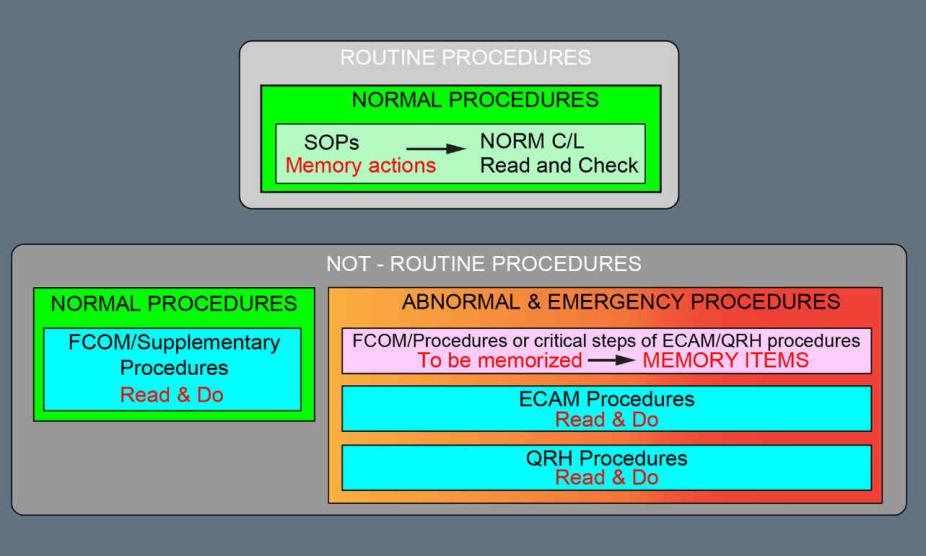

    纵观A320机型所有的程序我们会发现，在所有的A320机型程序设计理念里，所有系统都有至少一套备用系统或措施，当飞机出现系统故障后，如果飞机在某个系统上没有更多的备份，那么飞机就应该尽快落地。从另一个角度来看，我们可以将这样的设计理念总结为：**如飞机只剩下一套系统或措施来接替或取代某个系统，那么我们应视为飞机当前不适航**。因此机组应该根据这样的标准来进行**PANPAN**或**MAYDAY**的决策

[^17]: # 3.2 正常程序-SOP

    # 概念：

    飞机正常运行期间，飞行机组要频繁执行的动作。

    这些动作被视为常规任务。常规任务由标准操作程序(SOP)支持。

    # SOP设计原则：

    SOP是根据以下原则设计的：  

    * 每个飞行阶段有一套SOP
    * 按照时间顺序描述动作
    * 动作易于记忆和执行（驾驶舱扫描、操作流程）

    SOP设计有效的前提是：

    * 所有对应的**系统运行正常**
    * 所有对应的自动功能可以正常使用

    某些SOP动作要对照检查单进行检查。

    # SOP运用原则：

    飞行机组应凭记忆执行SOP动作。机组也**可以参考QRH，以便执行初始驾驶舱准备和离机程序**。 

    # 正常程序-补充程序：

    #### 概念：

    日常飞机正常运行期间，某些非日常频繁使用的操作被归纳至补充程序。

    飞行机组必须使用“读与做（Read & Do）”原则执行这些非常规的动作。

    #### 补充程序设计原则：

    补充程序的设计根据以下原则：

    * 容易识别和理解
    * **一个特定的情况对应一个补充程序**
    * 按时间描述动作

    #### 补充程序运用原则：

    补充程序运用有效的前提是飞行机组使用“读&做(READ&DO)”原则(通常由 PM 完成)执行补充程序。 

[^18]: # 3.3 非正常和紧急程序

    # 设计原则：

    这些程序是非常规的，属于非正常和紧急程序，并且根据情况的危机程度确定其优先级。

    下列情况发生后，非正常和紧急程序启动：

    * 系统失效，或
    * 需要操作的环境

    非正常和紧急程序的设计被定义为：

    * 记忆项目：当飞行机组没有事件参考ECAM/QRH/FCOM 以保证安全的飞行路径时，或
    * OEB 记忆动作：当飞行机组没有事件参考详细的OEB动作以保证安全的飞行路径时，或
    * 通过ECAM、QRH、FCOM或OEB处理的读&做（READ&DO）程序。

    | 记忆项目 | ECAM程序 | QRH程序 |
    | ---------- | ---------- | --------- |
    | 记忆     | 读&做    | 读&做   |

    # 非正常和紧急程序的运用原则：

    |                                    | When ? | How ? |
    | ------------------------------------ | -------- | ------- |
    | 记忆项目                           | 立即   | 记忆  |
    | OEB 记忆动作                       | 立即   | 记忆  |
    | 非正常/紧急程序 ECAM/FCOM/QRH/OEB | 适当时 | 读&做 |

    具体处置流程，请查看"3.3.1 天龙八步"[^19]

[^19]: # 3.3.1 天龙八步

    # 说明：

    根据现有手册，一共实际上为**九个**步骤，由于发现故障后立即需要进行分工划分以及飞机状态控制，为了方便记忆，因此此处归纳为天龙八步。

    # **故障处置流程**

    1. 发现故障+控制飞机状态
    2. 判断故障
    3. 短期决策
    4. 故障处置
    5. 状态评估
    6. 决策
    7. 进近准备和简令
    8. 进近和着陆

    # **发现故障+控制飞机状态：**

    #### **发现故障：**

    驾驶舱中任何一名飞行员发现故障后应该报出故障，同时进行止铃动作。如发现ECAM出现资讯信息，首先发现的飞行员也应该报出“XX系统咨询信息”。

    #### **控制飞机状态：**

    在进行止铃后，PF应该首先进行驾驶舱责任的划分，主要程序为进行喊话“我操纵、导航、通讯，你执行ECAM动作”。

    * **操纵的含义：**飞机FMA上所对应的速度、高度都由PF负责，主要需要检查的是当前的速度模式，高度模式，自动驾驶是否接通，自动推力是否存在，如自动驾驶或自动推力还在正常工作，在非特殊情况下都建议保持接通状态，如没有接通，在人工接管后，通过下口令的方式尝试重新接通，如无法接通，或出现**THST LK**等现象，则根据空客金科玉律，进行人工介入，接管。**如果出现显示屏幕失效，侧杆失效等特殊情况，则飞行员失去了操纵的条件，应该在第一时间交操纵至具有操纵条件的飞行员。**

    * **导航的含义：**检查FMA上飞机的水平模式，如果已经脱离NAV模式，则需要进行人工导航，甚至考虑原始导航，如果需要进行原始导航，则由PF下口令在MCDU中锁定导航台，如FMGC功能不可用，则由PF下口令使用备用导航协调频率。

    * **通讯的含义：**在进行故障判断的过程中，视情况是否由PF及时通知ATC，通讯应包含的信息有：自己的身份，当前所处的情况，自己的意图，以及是否需要什么类型的帮助。

    # **判断故障：**

    在PF进行飞机状态控制的过程中，PM应该协助PF对飞机状态进行监控，对于出现的不正常偏差应通过标准喊话进行提醒。在飞机状态稳定后，报出ECAM报出的故障名称，正确方式应该为：先报出短横线所标识的故障系统，再报出后续的故障名称。

    # **短期决策：**

    PF结合当前的故障情况与飞机的实际状况进行评估与决策，决策的原则应为飞机建立安全的飞行航经，便于处置后续的故障，同时通知ATC自己当前的意图。

    # **故障处置：**

    在确定飞机处于稳定状态且机上人员安全后，PF下口令证实当前的故障是否有相关OEB，如果没有OEB，PM应回答“没有OEB”，PF下口令“执行ECAM动作”，如没有ECAM动作，则应该查询相关的QRH、FCOM或其他的受控文件，机组人员还应该根据综合情况来判断当前故障，包括但不限于：仪表显示，面板灯光，系统页面等，机组还可以从客 舱或 ATC 方面得到信息支援。

    ECAM动作应该为念出琥珀色所显示的故障涉及的系统以及故障名称，念出白色字代表的条件信息，蓝色字所代表的相关动作，完成蓝色字的相关动作，以及备忘页面涉及到的系统次级故障。

    完成了ECAM动作后，系统会自动跳转到状态页面，此时PM应该首先喊出“状态页面”，PF进行打断“暂停状态页面”，之后询问是否有正常检查单以及计算机复位。如有，则执行，执行后故障未消失，则PF下口令“继续执行状态页面”。

    状态页面中的蓝字也代表相关动作，在此阶段不需要执行，而是在进行了决策之后，在进近准备阶段进行复习时，再决定是否执行相关的动作。

    # **状态评估：**

    在决定下一步的意图时，首先应该根据当前故障和飞机状态进行状态评估，评估标准应包括但不限于：

    * 飞机的剩余性能
    * 客舱情况
    * 油耗
    * 意图机场的跑道规格
    * 飞往机场的航路天气及机场天气
    * 落地机场的保障能力
    * 机组成员的能力评估与精力分配

    在进行完综合评估后，使用相关手册如QRH中的总结部分，性能的查询，包括着陆距离，进近速度部分等信息帮助进行评估审核，必要时可以联系ATC或AOC获取相关帮助。

    # **决策：**

    在进行完状态评估后，综合考量所有的状态评估内容来进行决策，决策后尽快通知ATC、AOC以及客舱，同时明确表达自己目前所处的情况以及所需要的帮助。

    # **进近准备和简令：**

    进近简令应该由PF完成，在进行进近准备以及进近简令的过程中，应将操纵交接给PM，在交接过程中需要强调驾驶舱分工。但是如果由于设备故障等特殊原因无法进行操纵交接时，可以下口令让PM完成进近准备和进近简令。

    在进行进近准备时，应首先复习飞机的状态页面，复习不工作系统，以及进近、着陆和复飞的部分，并且在设备可用的情况下输入查询好的进近速度或着陆形态。

    之后进行正常的进近简令，简令完成后还应该完成相关的非正常状态下所有故障所涉及到的补充内容。

    # **进近和着陆：**

    执行进近时 PM 应使用状态页和总结的进近部分。着陆部分程序内容 在经过简单复习后按记忆完成。在进近过程中，每次形态的改变时，状态页面都会重新跳出，在快速复习检查没有非预期的新增项目时，应尽快清除状态页面，防止状态页面覆盖其他值得注意监控的系统信息。

    更多内容，查看"4. 驾驶舱分工"[^20]

    ---

    # 简单记忆口诀：

    **OE距（速）评飞天；**

    **超重卡单直，**

    **交准简乘签。**

    ## 口诀解释：

    {{{col
    #### PM：

    #### PF：

    }}}

    {{{col
    ###### OE距（速）：

    ###### 评飞天：

    }}}

    {{{col
    OEB

    评估飞机状态与机场情况

    }}}

    {{{col
    ECAM程序

    飞向哪里

    }}}

    {{{col
    距离查询，包含速度

    天气信息的获取

    }}}

    **注意**：OE距（速）评飞天为对等关系，当PM在进行OEB、ECAM、距离速度查询的同时，PF也应该及时评估飞机的状态，判断是否需要脱离航路飞向某个点等待排故，之后如果涉及改航或备降则查询天气。

    ### 超重卡单直：

    超重着陆检查单是否需要

    重力放起落架检查单

    襟缝翼卡阻的程序（检查单）

    单发进近检查单是否需要（单发直接进近检查单确定形态）

    直接法则是否需要准备

    ### 交准简乘签：

    交接操纵

    进近准备

    简令

    乘务员通知

    签派通知

[^20]: # 4. 驾驶舱分工

    # 目录：

    * 👩‍🔧"4.1 驾驶舱职责划分"[^4]

    * 🕹"4.2 侧杆的职责划分"[^5]

    * 🎚"4.3 推力手柄的职责划分"[^8]

    * 🛃"4.4 FCU和AFS的职责划分"[^6]

    * 💻"4.5 MCDU的职责划分"[^9]

    * 📻"4.6 通讯的职责划分"[^12]

    * 🚩"4.7 改变构型的职责划分"[^7]

    * 🔝"4.8 顶板的职责划分"[^10]

    * 🔖"4.9 OEB、ECAM、QRH、FCOM的职责划分"[^13]

    * ⚔"4.10 需要进行交叉检查的职责划分"[^14]

    * 💽"4.11 金科玉律"[^21]

[^21]: # 4.11 金科玉律

    # 金科玉律：

    金科玉律是空客公司设计的最核心的飞行理念，空客飞行员需随时牢记金科玉律的顺序与逻辑，在所有正常和非正常情况下都要服从金科玉律。

    1. **操纵、导航、通讯，按此顺序并合理分工。**
    2. **任何时候都要采用相应等级的自动化设备。**
    3. **任何时候都要了解FMA。**
    4. **情况未按预期发展时，采取措施。**

    # 金科玉律解读：

    #### 1. 操纵、导航、通讯，按此顺序并合理分工：

    **解读**：无论是正常还是非正常状态，无论自动驾驶还是人工驾驶，飞行员都必须要按照此顺序进行飞行。操纵控制飞机处于安全的包线范围之内，导航确认自己的相对位置，通讯与外界沟通，进行合理的工作排序。此技术和小飞机的飞行方式相同。

    **操纵的定义：**

    * PF应该专注于操控飞机，操纵飞机的过程中应该具有明确的控制目标，并且为了达到这个目标，不断的监控并控制飞机的俯仰、坡度、空速、推力、侧滑航向等关键参数。
    * PM必须协助PF，并积极监控飞机的飞行参数并且报出任何过大的参数偏差。整个过程必须积极。

    **导航的定义：**

    导航是建立情景意识的基本，导航过程中需要建立四个“知道”：

    * 知道你**在哪里**
    * 知道你**应该在哪里**
    * 知道你**应该去哪里**
    * 知道**天气、地形和障碍物在哪里**

    **通讯的定义：**

    通讯设计有效的机组交流，包括：

    * 飞行机组间的交流
    * 飞行机组和ATC的交流
    * 飞行机组和乘务组的交流
    * 飞行机组和地面人员的交流

    在进行通讯的过程中，飞行机组应该使用**标准术语**和**标准喊话**。

    #### 任何时候都要采用相应等级的自动化设备：

    **解读：**空客飞机装配有几个等级的自动化设备，以执行相应的任务。在进行飞行的过程中，合理的使用自动化设备能够有效减小机组的工作负荷。

    #### 任何时候都要了解FMA：

    **解读：**对于任何自动化设备的输入，比如高度的转换，水平模式的选择等。因此在进行了任何自动化设备的输入后，我们都必须要在PFD、ND上进行检查，以确认动作效果。空客对于FMA的要求是：

    * 监控FMA
    * 报出FMA
    * 证实FMA
    * 理解FMA

    #### 情况未按预期发展时，采取措施：

    **解读：**当任何情况未按照预期发展时，机组应该采取措施。这里前提条件，是指必须要有对于情况的预期，而采用的措施措施可以是自动化设备的介入，也可以是人工操纵的接管。

    # 金科玉律总结：

    在任何飞行阶段，飞行员都应该遵守空客的金科玉律。

    首先我们要理解，操纵、导航、通讯，是飞行的基本三要素，这一点和所有的飞机都相同。

    其次，空客的自动化等级较高，因此我们需要使用相应的自动化设备来减小飞行员的负担。

    第三，通过FMA的认读和理解来确定我们空客自动化设备的工作状态。

    第四，当情况未按预期发展的时候，我们可以通过自动化设备来进行干预，如果自动化设备无法使用，那么我们可以直接降级至第一条，通过人工的操纵导航通讯的方式来进行飞行。

[^22]: # 3.4 总结的使用

    # 概述：

    QRH总结为QRH程序设计用于帮助飞行机组在发生电气应急构型或双液压失效时执行相关动作。

    QRH **小结分为四个部分：巡航，进近，着陆和复飞。**

    #### 巡航部分：

    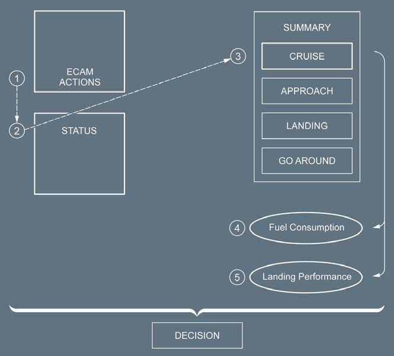

    步骤1和步骤2：

    按照"3.3 非正常和紧急程序"[^18]完成ECAM动作。

    步骤3：

    检查状态页面后，PM应考虑参考QRH的总结的巡航部分。并通过QRH相应章节进行：

    * 增加的燃油消耗评估（步骤4）
    * 所选机场的着陆性能计算（步骤5）

    ---

    #### 进近准备：

    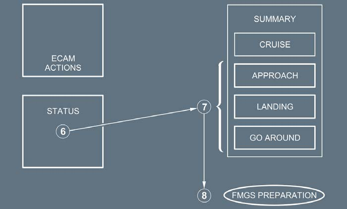

    在进行进近准备的过程中，机组首先应该检查状态页面（步骤6），之后使用总结的进近、着陆、复飞三个部分（步骤7）支持进近准备（步骤8）。

    机组必须在进近、着陆、复飞阶段执行总结中包括的纸质程序，如：襟缝翼卡阻程序、重力放起落架程序。

    ---

    #### 进近简令：

    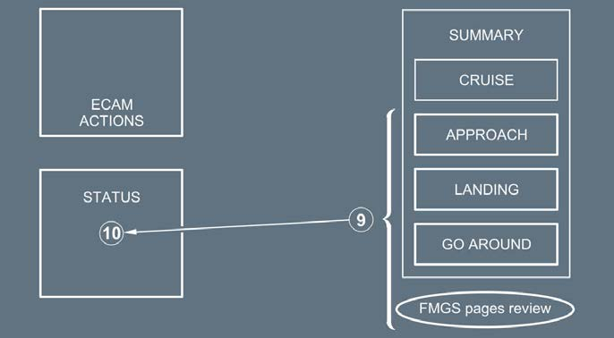

    机组应使用QRH总结的进近、着陆、复飞部分进行进近简令，同时要交叉检查相关的FMS页面（步骤9）以及状态页面（步骤10）。

    ---

    #### 进近：

    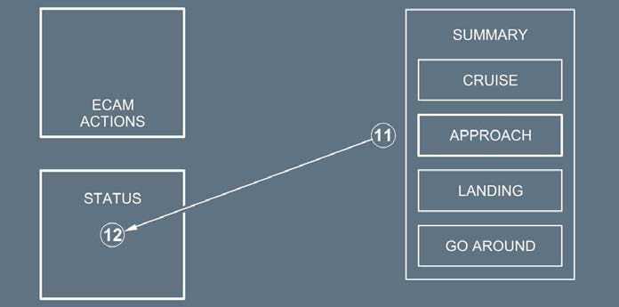

    机组应参考进近部分实施进近(步骤11）。

    当飞机处于最终形态时，作为提醒，飞行机组可快速浏览着陆和复飞部分(刹车，前轮转弯，反推和复飞时收起起落架）。 

    最后， PM 应检查状态页面(步骤 12)并核对所有进近程序动作已完成。   

[^23]: # 5. 运行

    # 目录：

    * 🛬"进近"[^24]

      * 🎯"精密进近"[^25]
      * 🦯"非精密进近"[^30]
      * 🛰"PBN与RNP进近"[^31]

        * "LNAV ONLY"[^32]
        * "LNAV-VNAV和RNP AR"[^34]
      * 👣"稳定进近"[^39]
    * 📝"放行条件的获取与检查单的使用"[^40]
    * 💺"坐姿与扶手的调节"[^41]
    * 🎛"冷舱驾驶舱预先准备的逻辑"[^42]
    * 👀"目视起落程序"[^43]
    * ⤴"中止进近、复飞、中断着陆"[^26]
    * 🛣"RVSM"[^44]
    * 🌨"排雨防冰"[^45]
    * 💡"跑道标识与灯光系统"[^46]
    * 📑"MEL的使用"[^47]
    * 🛫"减推力-减功率起飞"[^50]

[^24]: # 进近

    # "精密进近"[^25]

    # "非精密进近"[^30]

    # "PBN与RNP进近"[^31]

    # "稳定进近"[^39]

[^25]: # 精密进近

    注：由于很多机场都具有特殊性，因此此处只涉及基本的精密进近程序，不考虑进场排序，高距比，特殊运行，特殊天气等其他因素。

    # 通用精密进近的程序：

    #### 进近准备阶段：

    进近准备期间对飞行计划进行检查；顺序以“小帽子”为准。

    下降和进近准备包括：

    （收到进场资料后，飞行机组应使用下列程序）

    * 定义水平和垂直飞行计划
    * 检查相应导航设施的调谐（自动或人工）
    * 检查进程页面
    * 输入PERF（性能）和WIND（风）数据
    * 燃油页面检查
    * 次飞行计划（二计划）

    根据跑道道面状况、天气条件等选择相应的自动刹车。

    #### 起始进近阶段：

    * 进近阶段检查，确认PFD上识别正确的盲降三字代码，如果代码不正确，需要进行莫斯代码的确认
    * 启动进近开始减速
    * 如果在NAV方式，飞机飞越**DECEL**虚拟航路点，进近阶段自动生效
    * 进近启动、速度管理，速度会减速到绿点，适时放出形态1
    * 放襟翼时：

      * PF下口令：速度高度检查，襟翼1
      * PM检查速度低于VFE、高度低于20000ft
      * PM喊话：速度高度检查，襟翼1
      * （襟翼手柄选择一，同时检查襟翼实际行程，以及速度向S速度减速）
      * 襟翼到位后PM报出“襟翼1到位”，PF“证实”

    在进入中间进近/最后进近阶段前，确认是否使用人工或管理方式进行截获，如需要使用人工方式进行截获，则拔出航向。

    #### 中间进近：

    * 在预位APPR电门或LOC电门前，必须**同时满足以下三个条件**：

      * 获取ATC指令
      * 在最后进近航迹的截获航迹上（如ATC指挥，飞机当前航迹必须和最后航迹产生交叉角，这种情况下需要考虑ATC指挥穿越航向道进行反截获的情况，避免错误的提前截获航向道）
      * LOC偏离可用（在PFD上，出现LOC偏离指示）

    * 满足以上三个条件后，PF按下FCU上APPR按钮（这将预位**GS**、**LOC**方式，预位后至少3s，**GS**、**LOC**截获方式将接通）
    * 两部AP接通（自动方式下）
    * 通过FMA检查**GS**、**LOC**预位
    * 通告FMA监控**GS**、**LOC**截获（报出FMA证实）

    注：如果 ATC 仅只许可截获 **LOC**，机组应按下 FCU 上的 **LOC** 按钮-电门

    * 如果 ATC 在远距离许可进近，例如 30NM，那么飞行机组应该意识到：

      * 在接收到有效的无线电高度表信号之前，G/S可能受到干扰，FMA 上将显示 CAT 1

    #### 形态设置：

    * 不低于2000英尺AGL或飞机低于下滑道一个点且速度低于下一档VFE时：

      * PF下口令：襟翼2
      * PM喊话“速度检查，襟翼2”，襟翼手柄选择2（在实际飞行时要考虑到四边顺逆风、飞行时飞机的真高去判断放襟翼二的时机。四边顺风大，四转弯周边地形复杂，考虑提前放出襟翼2减小地速，防止飞机由于速度大穿越五边航向道）
      * 四边飞行，如ATC指挥雷达引导时，PF下口令“整理计划到五边”，PM执行
    * GS截获/襟翼二位或最低2000英尺AGL时：

      * PF下口令“放轮”
      * PM起落架手柄放下、检查并喊话“放轮”
      * PM起落架手柄放下后 地面扰流板预位、机头电门-滑行位、跑道脱离电门-ON

    #### 最后进近：

    * GS截获后：PF设置（AP接通）或下口令指挥PM设置（AP断开）复飞高度，具体参考"4.4 FCU和AFS的职责划分"[^6]
    * 低于下一档VFE时：

      * PF下口令“襟翼3/襟翼全”
      * PM喊话“速度检查”，襟翼手柄选择3/全，通知客舱
    * 着陆检查单
    * 如需要复飞，参考"中止进近、复飞、中断着陆"[^26]

[^26]: # 中止进近、复飞、中断着陆

    # 定义：

    #### 中止进近：

    在从进近开始的所有中止继续进近的行为都可以认为是中止进近，包括复飞。中止进近可以视实际情况使用"中止进近程序："[^27]或"复飞程序："[^29]。

    #### 复飞：

    满足下列全部要素的中止进近的拉升，视为复飞：

    * 通过FAF点
    * 得到着陆许可
    * 在最后进近阶段和着陆阶段的拉升

    同时，下列情况也应该视为复飞：

    * 雷达引导时，在完全建立了盲降情况下的中止进近
    * VFR时，三转弯之后的中止进近

    注^1^：没有收到管制员着陆许可的拉升不属于复飞，只属于中止进近。

    #### 中断着陆：

    飞机从50ft飞越跑道入口开始至飞机在跑道上停稳过程中的复飞，中止着陆是复飞和中止进近的一种特殊情况。

    注：一旦使用反推，机组不得进行复飞。

    ## 复飞条件：

    在进近过程中，PF和PM以及飞行观察员都应该随时保持复飞意识， 当飞行机组成员之一提出复飞建议或出现以下任一情况时，必须执行复飞：

    * IMC下飞机距离跑道入口高度1000ft、VMC下飞机距离跑道入口高度500ft，飞机不能建立和保持稳定进近；
    * 在IMC下进近，由于机载或地面设备故障、工作不正常而导致进近不稳定；
    * 到达决断高（DH）、最低下降高度（MDA）或复飞点不能获得目视参考；
    * 进近至DH、MDA至复飞点之前的任何时间内建立了目视参考着陆，下降率大于1000ft/m;
    * 在DH或MDA以下失去目视参考（平流雾、辐射雾、全部跑道灯光失效或夜航着陆光屏等视觉原因）；
    * 最后进近中出现恶劣天气，如塔台报告大雨或以上、风切变或机长认为操纵困难的情况；
    * 机场实况低于机场、机长或机组的天气标准；
    * 出现近地警告系统发出非预期的飞机形态警告、地形警告等；
    * 发动机推力设置与飞机外部形态设置相差较大；
    * 没有完成正常检查单或QRH；
    * IMC下精密雷达引导（PAR）进近中失去通讯联络；
    * 跑道上有障碍物
    * ATC发出复飞指令
    * 飞行机组成员发生空中失能，另一名驾驶员接替困难；
    * 飞行机组对着陆缺乏信心；
    * 在MDA或以上高度进行盘旋机动飞行时，不能清晰辨认该机场特征部分的参照物；
    * 在RNP运行中，水平偏差或垂直偏差超出机型手册规定范围，而又没有建立继续进近的目视条件；
    * 除目视盘旋外，1000ft（AGL）未建立着陆形态。

    ## 程序与动作：

    #### 中止进近程序：

    空客结合飞机系统特点以及不需要使用TOGA推力情形下的复飞提出了中止进近技术。中止进近相比于复飞而言，一个明显的区别就是机组**不需要**将推力手柄推至TOGA。在中止进近中，机组的动作流程是：

    * 宣布“取消进近”
    * 取消已选择的进近模式，参考"FCU上各键位的作用和断开方式："[^28]
    * 管理飞机的航径
    * 如需要，改航

    #### 复飞程序：

    * 宣布“复飞-襟翼”
    * 推力手柄设置为TOGA位
    * PM收一档襟翼
    * 抬头跟随SRS
    * 报出FMA
    * PM报出正上升率
    * 下口令“收轮”

    #### 中断着陆程序：

    中断着陆程序和复飞相似，但是由于高度较低，因此在进行中断着陆时，延迟收襟翼的时机，在飞机完全开始复飞，出现正上升率且RA高度开始增加后，机组再进行收襟翼和收轮的动作。

    **注意**：在中断着陆的过程中，飞机起落架接地是可接受现象。

    除非ATC指令，一旦出现以上情况，必须在第一时间通知ATC。

[^27]: #### 中止进近程序：

    空客结合飞机系统特点以及不需要使用TOGA推力情形下的复飞提出了中止进近技术。中止进近相比于复飞而言，一个明显的区别就是机组**不需要**将推力手柄推至TOGA。在中止进近中，机组的动作流程是：

    * 宣布“取消进近”
    * 取消已选择的进近模式，参考"FCU上各键位的作用和断开方式："[^28]
    * 管理飞机的航径
    * 如需要，改航

[^28]: # FCU上各键位的作用和断开方式：

    |  电门  | 作用                     | 推荐断开方式                 |
    | :-------: | -------------------------- | ------------------------------ |
    |   AP   | 接通或断开自动驾驶       | 侧杆接管按钮                 |
    |  A-THR  | 接通或断开自动推力       | 推力手柄断开按钮             |
    |  APPR  | 接通、预位或断开盲降方式 | 拔出航向旋钮或使用高度旋钮   |
    |   LOC   | 接通、预位或断开航道信号 | 拔出航向旋钮                 |
    | EXPDITE | 接通垂直加速方式         | 拔出高度旋钮或使用升降率旋钮 |

[^29]: #### 复飞程序：

    * 宣布“复飞-襟翼”
    * 推力手柄设置为TOGA位
    * PM收一档襟翼
    * 抬头跟随SRS
    * 报出FMA
    * PM报出正上升率
    * 下口令“收轮”

[^30]: # 非精密进近

    # 非精密进近程序

    1. 在确定进近方式为非精密进近后，进行进近准备，天气标准按照非精密进近标准掌握
    2. 对于程序不熟悉，可以使用"TRAIFC"口诀进行总结

    ---

    # TRAFIC口诀详解

    "Trafic"口诀是适用于所有非精密进近方式的一个口诀。

    口诀中每个字母所对应的含义和非精密进近的时间线相等，因此按照"Trafic"字母顺序结合航图依次完成动作，即可以完成一个完整的非精密进近程序。

    | 首字母 | Stand for         |                                                                                                                                         含义解释                                                                                                                                         |
    | -------- | ------------------- | :-----------------------------------------------------------------------------------------------------------------------------------------------------------------------------------------------------------------------------------------------------------------------------------------: |
    | T      | Track             |                                                                           Track位：但凡是非精密进近，无论是否有AP、FD，飞机的水平方式都应该选择至**Track**位置。                                                                           |
    | R      | Radio/Nav         |                                     导航台调谐：在MCDU正常工作时，优先使用MCDU上的Radio/Nav页面，根据进近图来进行导航台的筛选和调谐，如在进近过程中需要更换锁定的导航台，则做好换台的预案，如MCDU不工作，则使用人工协调的方式进行导航台的筛选和调谐。                                     |
    | A      | Altitude          |                                高度：确定从IAF点开始的每一个点所对应的高度，以及进近所对应的最低下降高度。注意：某些航图中会出现IF点至FAF点有梯度下降的情况，此高度非常容易被忽略，当忽略了这些细微的高度调整，很容易造成飞机无法正确进入CDFA程序的情况。                                |
    | F      | FAF               | FAF点位置和高度：确定FAF点的位置和高度，**在FAF点前需要建立着陆形态**，在FAF点+1NM时需预调下滑角，FAF点+0.3海里时拔出。注意：FAF点的位置和高度非常重要，FAF点代表飞机从这一点开始进入稳定的下滑角，因此在FAF点前必须要建立稳定的着陆形态。 |
    | I      | Info              |                                                                                                           高距比信息：进入下滑后，PM需要不断根据当前对应的DME报出相应的高距比。                                                                                                           |
    | C      | Check List/Course |                                                                                       检查单与着陆航迹：建立稳定下降后执行检查单，五边能见跑道后，PF下口令“关指引，着陆航迹”，如不能见，则复飞。                                                                                       |

    ---

    # 非精密进近的种类和区别

    |  种类  | 使用的地面设备     | 相关机载设备                                                                 | 五边截获方式                                                                                                                                     | 方向偏差修正方式                                                           |
    | :-------: | -------------------- | ------------------------------------------------------------------------------ | -------------------------------------------------------------------------------------------------------------------------------------------------- | ---------------------------------------------------------------------------- |
    |   LOC   | ILS导航台（无GS）  | LOC电门（无法同时接通两部AP）、LS电门                                        | 根据飞机位置与本场VOR（如有）的10°夹角转弯，或减速后距离五边距离不小于2.5海里转。小于90°截获，尽量使用30°切入角，如有指引，指引自动截获航向道 | 有指引则根指引，无指引则人工使用方向旋钮进行调节、无AP则人工进行修正。     |
    | VOR/DME | VOR台（带DME功能） | MCDU的RADIO NAV页面，锁定导航台与径向线，或人工进行调谐，EFIS面板选择VOR模式 | 航道杆一个点位置直接转向锁定的径向线，无论是否有指引，都需要人工使用方向旋钮进行调节                                                             | 以锁定径向线为参考进行修正，无论是否有只有，都需要人工使用方向旋钮进行调节 |
    | NDB/DME | NDB/DME            | MCDU的RADIO NAV页面，锁定NDB台，或人工进行调谐，EFIS面板选择ADF模式          | 根据飞机位置与导航台的10°夹角转弯，或航图提供的DME距离作为转弯参考，转弯后直接追针，无论是否有指引，都需要人工使用方向旋钮进行调节              | 追针拉尾，无论是否有指引，都需要人工使用方向旋钮进行调节                   |

    # 偏差标准

    在最后进近阶段，非精密进近的偏差上限如下：

    | LOC           | VOR                | NDB     |
    | --------------- | -------------------- | --------- |
    | 航向道1/2个点 | VOR 1/2个点或2.5° | NDB 5° |

    如偏差等于或大于此标准，则必须中止进近或复飞，参考"中止进近、复飞、中断着陆"[^26]部分内容

[^31]: # PBN与RNP进近

    # **概念**

    PBN（Performance-Based Navigatio）,是指在相应的导航基础设施条件下，航空器在指定的空域内或者沿航路、仪表飞行程序飞行时对系统精确性、完好性、可用性、连续性以及功能等方面的性能要求。通常分为RNAV（Aera Navigation）和RNP（Required Navigation Performance）两种表现性形式，两者都属于区域导航，但是其最大的区别在于RNP具有自我机载性能监视与告警能力，即RNP可以随时监控自己的导航精度与偏差，这类型的导航方式与传统地面导航相比最大的区别在于对于地面导航设备的依赖性较小，对于偏远机场、山区机场、地面导航设施不足的小型机场，PBN具有更好的实用性

    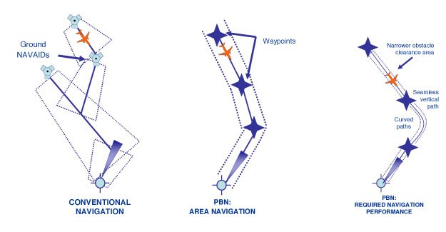

    在PBN中，许多 RNAV 系统虽然具有极高的精度，并且具有RNP 系统提供的许多功能，但是它们并不能对其性能提供保证。有鉴于此，在空域要求并非必须使用RNP系统的情况下，为避免给运营人造成不必要的支出，许多新的及现有的导航要求将继续针对RNAV系统而非RNP系统，因此，预计RNAV和RNP运行将会多年共存

    在不同的区域中飞行时，根据其导航规范要求以及针对的飞行阶段要求不同，我们可以将RNP及RNAV的应用及精度要求进行梳理，具体如下：

    | 导航规范            | 海洋/偏远航路 | 陆地航路 | 进场 | 起始进近 | 中间进近 | 最后进近 | 复飞  | 离场 |
    | --------------------- | --------------- | ---------- | ------ | ---------- | ---------- | ---------- | ------- | ------ |
    | RNP 1               | N/A           | N/A      | 1    | 1        | 1        | N/A     | 1     | 1    |
    | RNP 2               | 2             | 2        | N/A  | N/A      | N/A      | N/A      | N/A   | N/A  |
    | RNP 4               | 4             | N/A      | N/A  | N/A      | N/A      | N/A      | N/A   | N/A  |
    | RNP 10              | 10            | N/A      | N/A  | N/A      | N/A      | N/A      | N/A   | N/A  |
    | RNP APCH            | N/A           | N/A      | 1    | 1        | 1        | 0.3      | 1     | N/A  |
    | RNP 0.3（旋翼机用） | N/A           | 0.3      | 0.3  | 0.3      | 0.3      | N/A     | 0.3   | 0.3  |
    | RNAV 1              | N/A           | 1        | 1    | 1        | 1        | N/A      | 1     | 1    |
    | RNAV 2              | N/A           | 2        | 2    | N/A      | N/A      | N/A      | N/A  | 2    |
    | RNAV 5              | N/A           | 5        | 5    | N/A      | N/A      | N/A      | N/A   | N/A  |

    从上面表格可以看出，RNP或者RNAV的数字后缀，基本上就代表了他们在各个航段下的精度要求（单位为海里，N/A代表不适用），此精度要求含义为在当前阶段飞行中，总飞行时间的95%误差所不能超过的限制

    除此以外，RNP 1，RNP APCH，RNAV 1都具有起始进近能力，但是只有RNP APCH满足最后进近0.3导航精度才能进行进近，说明仅有RNP APCH才能完成最后的进近，其余的RNP 1和RNAV，可以结合其他进近方式完成最后进近，如ILS

    RNP进近中，分为以下三种情况：

    * LNAV ONLY
    * LNAV/VNAV
    * RNP AR

    其性质，使用技术，关键数据监控，限制，显示如下：

    |            | LNAV ONLY                                                                                                                                                               | LNAV/VNAV                                                     | RNP AR                                                        |
    | ------------ | ------------------------------------------------------------------------------------------------------------------------------------------------------------------------- | --------------------------------------------------------------- | --------------------------------------------------------------- |
    | 性质1      | 非精密进近                                                                                                                                                              | 类精密进近                                                    | 类精密进近                                                    |
    | 性质2      | 早期稳定进近技术                                                                                                                                                        | 有限的减速进近技术                                            | 减速进近技术                                                  |
    | 决断高度   | MDA                                                                                                                                                                     | DA                                                            | DA                                                            |
    | 进近技术   | CDFA（参考"非精密进近"[^30]）                                                                                                                                             | 管理                                                          | 管理                                                          |
    | 机组检查   | 航图公布数据交叉检查                                                                                                                                                    | 横向检查XTK，垂直检查V/DEV                                    | 横向检查L/DEV，垂直检查V/DEV                                  |
    | 受到的限制 | 地面导航台信号覆盖区域                                                                                                                                                  | 温度                                                          | 温度                                                          |
    | FMA显示    | **FPA** **-3°**/**NAV** | **FINAL APP** | **FINAL APP** |

    PBN的实施，是基于GNSS系统而存在的，GNSS系统原名全球卫星导航系统（Global Navigation Satellite System），包括了美国的GPS，俄国的格洛纳斯，欧洲的伽利略以及中国的北斗系统

    航空器上的卫星信号接收器需要通过GNSS的至少4颗卫星才能进行定位，同时为了保障数据的准确性，航空器要求使用5颗卫星进行数据的交叉校验，这个功能，被我们称之为RAIM，即接收机自主完好性监测（Receiver Autonomous Integrity Monitoring），在进行RNP运行是，我们必须要通过RAIM来检查卫星信号的接收完好性，以确定在飞行过程中，按照要求的时间里，飞机能够同时接收到5颗卫星的信号

    由于地球的自转和卫星的公转，在航班运行期间有可能会出现飞机无法同时接收5颗卫星的信号的情况，但是通过地球自转和卫星运动轨迹的数据，RAIM的完整性可以预测，机组可以通过放行通告获取，当目的地机场要求使用RNP进近但是预测进近阶段会出现RAIM在此期间不可用时，机组可以选择使用其他的方式进近或改变到达时间

    # **逃逸程序**

    在RNP进近过程中，其优势在于对于地面导航台依赖较小，因此有很多缺乏地面导航设施的小机场都会使用RNP程序，在这些机场中，有些机场仅支持RNP进近。但是当飞机的导航精度降级或丢失时（如RAIM不可用时），无法满足RNP程序的复飞精度要求，因此无法进行标准的RNP复飞。针对这样的情况，空客设计了逃逸程序。逃逸程序的实施方法为：保持当前航迹爬升至MSA，或MORA，之后联系ATC获取新的指令

    # **进近方式**

    # "LNAV ONLY"[^32]

    # "LNAV-VNAV和RNP AR"[^34]

[^32]: # LNAV ONLY

    LNAV ONLY属于非精密进近的一种，其程序可以**参考**"非精密进近"[^30]，天气标准应按照非精密进近掌握，设备标准如下：

    # **设备要求**

    * 一部FMGC
    * 一部MCDU
    * 一部GPS
    * 两部IRS
    * 一个FD在NAV方式
    * 两个ND（在一侧通过PFD/ND电门临时显示ND信息是允许的）

    # **程序**

    * 执行LNAV ONLY可行性的检查：

      * 检查飞机设备是否符合进近标准
      * 通过MCDU进程页面的绿色**GPS PRIMARY**字样检查RAIM的有效性
    * 下降准备：

      * 获取天气和着陆信息，如外界温度较低，进行高度低温修正
      * 与公布的航图中的内容交叉检查MCDU计划页面中的终端程序，除非ATC要求，进近过程中不得更改数据库中的飞行计划，另外，MCDU中的最后横向轨迹与航图公布的横向轨迹数据的最大差异为1°
      * 在进程页面的**BRG/DIST**字段中，插入基准跑道入口用于位置监控
      * 在性能页面中，MDA考虑低温修正，并且按照CDFA原则在MDA+50ft
      * 复习复飞策略，包括导航系统降级后的"逃逸程序"[^33]
    * 下降：

      * FL100时，检查导航精度，如导航精度低，使用传统"非精密进近"[^30]进近，如没有传统进场程序，则中止进近
      * 至少有一部MCDU的进程页面上有**GPS PRIMARY**字样
      * 交叉检查气压基准
    * 起始/中间进近：

      * 监控飞机位置
      * 在满足下列条件后，FCU上的<kbd>APPR</kbd>电门预位：

        * ATC发布进近许可
        * 下一个航路点为FAF点
      * 在FMA上检查蓝色**FINAL**字样，代表进近导航已预位
    * 最后进近（参考"非精密进近"[^30]中的TRAFFIC口诀）：

      * 距离最后下降点（FAF点）+1NM时，预调FPA-3°
      * 距离最后下降点（FAF点）+0.3NM时，FPA拔出，并在FMA上检查**NAV**和**FPA** **-3°**接通
      * 监控位置和高度
      * 设置复飞高度
      * 如水平偏差出现大于0.1NM，PM喊话，机组中止进近或复飞（参考"中止进近、复飞、中断着陆"[^26]）
    * 在MDA（MCDU上的MDA）+100ft：

      * PM喊话：100到决断
    * 在MDA（MCDU上的MDA），PM喊话决断高，且：

      * 如果能够建立目视参考：

        * PF宣布继续进近
        * AP OFF
        * FD OFF
        * 跑道航迹设置
      * 如果不能建立目视参考：

        * 复飞（参考"中止进近、复飞、中断着陆"[^26]）

    # **降级导航管理**

    如果在有目视基础的情况下出现以下情况，机组可以继续使用适当的AP、FD继续进近：

    * ND上失去GPS PRIMARY
    * 一部FMGS上导航精度降级

    如果出现以下情况且没有足够的目视参考进行目视程序，必须中止进近（参考"中止进近、复飞、中断着陆"[^26]）：

    * 两部ND上都失去GPS PRIMARY
    * 偏航＞0.3NM
    * ECAM出现琥珀色<u>NAV</u> **FM/GPS POS DISAGREE**
    * 两部FMGS上的导航精度降级

    # **LNAV ONLY所涉及到的知识**

    * 什么情况下使用LNAV ONLY？

      * 在平时的冬季运行中，有可能出现由于超过了温度保护范围而无法进行"LNAV-VNAV和RNP AR"[^34]进近的情况，在这样的情况下，由于GPS的导航无法对大气温度造成的偏差进行准确的测量，因此其垂直导航是不准确的，但是其水平导航精度依旧可靠，因此，基于水平导航的精度，我们依旧可以在寒冷天气中结合CDFA技术进行进近，这样即避免了对地面导航设备的依赖，又能能够通过人工监控高度保证飞机处于安全的垂直包线范围之内

    * 在LNAV ONLY进近过程中，当导航精度或设备不满足LNAV ONLY的要求时，就一定要中止进近或复飞吗？

      * 在LNAV ONLY进近过程中，当导航精度或设备不满足LNAV的要求时，依旧可以继续进近，前提条件是能够进行目视飞行，目视飞行与目视进近要求不同，只要保持目视参考即可。其原理在于RNP进近在最后能见跑道后，其使用的依旧是传统的目视技术，因此当天气条件允许而导航精度不允许时，机组完全可以提前使用目视进近技术开始进近

[^33]: # **逃逸程序**

    在RNP进近过程中，其优势在于对于地面导航台依赖较小，因此有很多缺乏地面导航设施的小机场都会使用RNP程序，在这些机场中，有些机场仅支持RNP进近。但是当飞机的导航精度降级或丢失时（如RAIM不可用时），无法满足RNP程序的复飞精度要求，因此无法进行标准的RNP复飞。针对这样的情况，空客设计了逃逸程序。逃逸程序的实施方法为：保持当前航迹爬升至MSA，或MORA，之后联系ATC获取新的指令

[^34]: # LNAV-VNAV和RNP AR

    LNAV-VNAV和RNP AR的导航精度要求为RNP APCH，其天气标准按照RNP进近掌握，其区别在于，RNP AR进近与II/III类仪表着陆系统运行类似，要求飞机和机组具有特殊授权。所有RNP AR进近都使用减小的水平障碍物评估和垂直越障标准，它是基于飞机和机组能力规定的。此外，虽然并非绝对，但是某一些程序可能需要相应能力以执行RF航段和/或要求RNP小于1.0NM的复飞

    #### RF的定义

    固定半径转弯（Radius of Fix Turn）简称RF或RFT，在终端或进近程序要求特定曲线转弯时使用。固定半径至定位点航段由半径、弧形长度及定位点来确定。支持该航段类型的 RNP 系统，转弯时的航迹精度保持能力与直线段航迹精度（Track of Fix，即TF）保持能力一样

    -20211016185745-s9qy178.jpg)

    而对于RNP LNAV/VNAV和RNP AR的区别，主要是在于根据RF精度和导航精度要求的不同，机组是否需要特殊授权

    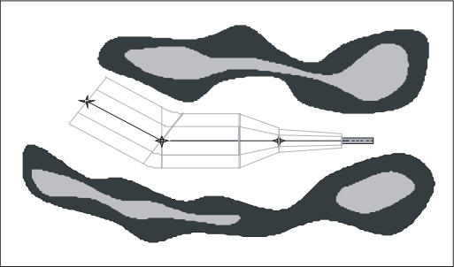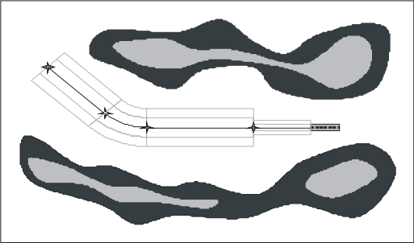

    # **设备标准**

    {{{col
    {{{row
    #### LNAV/RNAV的设备标准

    * 一部FMGC
    * 一部GPS
    * 两部IRS
    * 一部MCD
    * 一个FD
    * 在PF一侧的一个PFD
    * 两个ND（在PM一侧通过PFD/ND电门临时显示ND信息是允许的）
    * 两个FCU通道

    }}}

    {{{row
    #### **RNP AR的设备标准**

    * 两部FMGC
    * 两部MCDU
    * 两部FD
    * 至少一部AP或两部AP（取决于机型）
    * 两部FAC
    * 两部ELAC
    * 两部SFCC
    * 两部RA
    * 两个PFD带V/DEV显示或两部PFD带L/DEV和V/DEV显示（取决于机型）
    * 两个ND
    * 两部GPS
    * 三部ADRIS在NAV方式
    * TAWS带地形显示
    * 两个FCU通道

    }}}

    }}}

    # **程序**

    * 执行LNAV ONLY可行性的检查：

      * 检查飞机设备是否符合进近标准
      * 通过MCDU进程页面的绿色**GPS PRIMARY**字样检查RAIM的有效性
    * 下降准备：

      * 获取天气和着陆信息，如外界温度低于公布航图上的最低保护温度，则执行"LNAV ONLY"[^32]进近
      * 不要使用其他相邻机场的QNH数据
      * 与公布的航图中的内容交叉检查MCDU计划页面中的终端程序，如果在最后下降点（FDP）后显示**TOO STEEP PATH**，则执行"LNAV ONLY"[^32]或其他传统进近。另外，另外，MCDU中的最后横向轨迹与航图公布的横向轨迹数据的最大差异为1°，MCDU中的最后垂直轨迹与航图公布的垂直轨迹数据的最大差异为0.1°
      * ******RNP AR进近，进入MCDU-POSITION MONITOR-SEL NAV AIDS上的NAV AIDS拒选*（**RNP AR进近**）
      * 在进程页面的**BRG/DIST**字段中，插入基准跑道入口用于位置监控
      * 在性能页面中，在DH中输入最后的决断高度
      * 复习复飞策略，包括导航系统降级后的"逃逸程序"[^33]
    * {{{col
      {{{row
      下降（LNAV/VNAV）：

      * FL100时，检查导航精度，如导航精度低，使用传统"非精密进近"[^30]进近，如没有传统进场程序，则中止进近
      * 至少一部MCDU的进程页面上显示**GPS PRIMARY**字样
      * 交叉检查气压基准

      }}}

      {{{row
      * **下降（RNP AR）：**

        * *在两部MCDU进程页面上显示***GPS PRIMARY***字样，且ND上不显示***GPS PRIMARY LOST**
        * *在DATA-GPS MONITOR页面上检查两个GPS在NAV方式*
        * *两边ND的地形打开，如需要使用气象雷达，在PM侧显示雷达信息*

      }}}

      }}}
    * {{{col
      {{{row
      起始/中间进近（LNAV/VNAV）：

      * 监控飞机位置
      * 在满足下列条件后，FCU上的<kbd>APPR</kbd>电门预位：

        * 许可飞机进近
        * 下一个航路点为最后下降点
      * 在FMA上检查蓝色**FINAL**字样，代表进近导航已预位，且：

        * 在PFD上显示V/DEV刻度
        * 在最后下降点（参考"LNAV/VNAV和RNP AR所涉及到的知识"[^35]），ND上的**蓝色箭头**（**重要**）指示符合FINAL APP接通的条件

      }}}

      * **起始/中间进近（RNP AR）：**

        * *气压基准/高度表检查，最大差异不超过75ft*
        * *FD或AP+FD接通（由于在最后进近阶段必须接通一部AP，建议AP在当前阶段就接通）*
        * *PFD上显示V/DEV刻度*
        * *在满足下列条件后，FCU上的*<kbd>APPR</kbd>*电门预位：*

          * *许可飞机进近*
          * *下一个航路点为最后下降点*（参考"LNAV/VNAV和RNP AR所涉及到的知识"[^35]）
        * *在FMA上检查蓝色***FINAL***字样，代表进近导航已预位*

      }}}
    * 在最后下降点（参考"LNAV/VNAV和RNP AR所涉及到的知识"[^35]）：

      * 在FMA上检查绿色**FINAL**字样，代表进近已经接通
      * 设置复飞高度
      * 飞行参数监控，包括：

        * *监视PFD上的L/DEV和V/DEV*（**RNP AR**）
        * ND上的XTK误差
        * PFD上的V/DEV
        * 交叉检查航图上公布的高距比
    * 出现以下情况，PM必须喊话：

      * 偏航＞0.1NM（LNAV/VNAV）或*L/DEV到一个点*（**RNP AR**）或*TKR到1/2 RNP*（**RNP AR**）
      * V/DEV偏离大于1/2个点（在垂直刻度上，一个点表示100ft）
    * **RNP AR进近如果发生过大偏差，必须复飞**：

      * *L/DEV到2个点或XTK到1 RNP*
      * *V/DEV偏离到3/4个点**（在垂直刻度上，一个点表示100ft）*
    * 在DH+100ft：

      * PM喊话：100到决断高度
    * 在DH，PM喊话决断高度，且：

      * 如果能够建立目视参考：

        * PF宣布继续进近
        * AP OFF（AP在DH-50ft会自动断开）
        * FD 按需
      * 如果不能建立目视参考：

        * 复飞（参考"中止进近、复飞、中断着陆"[^26]）

    {{{row
    {{{col
    {{{row
    {{{row
    # **降级导航管理**（LNAV/VNAV）

    如果在有目视基础的情况下出现以下情况，机组可以继续使用适当的AP、FD继续进近：

    * ND上失去GPS PRIMARY
    * 一部FMGS上导航精度降级

    如果出现以下情况且没有足够的目视参考进行目视程序，必须中止进近（参考"中止进近、复飞、中断着陆"[^26]）：

    }}}

    * 两部ND上都失去GPS PRIMARY
    * 偏航＞0.3NM
    * ECAM出现琥珀色<u>NAV</u> **FM/GPS POS DISAGREE**
    * 两部FMGS上的导航精度降级
    * 出现低于V/DEV大于3/4个点，即75ft偏离时

    }}}

    {{{row
    # **降级导航管理****（RNP AR）**

    在下列设备失效的情况下，可以继续进近：

    * 一部GPS
    * 一部FMGS
    * 一部EFIS DU
    * 一部MCDU
    * 一部AP

    下列情况下，中止进近：

    * FINAL APP未接通
    * 两部ND上显示**GPS PRIMARY LOST**
    * 双<u>NAV</u> **ACCUR DOWNGRAD**
    * **FM/GPS POSITION DISAGREE**
    * **FMS1/FMS2 POS DIFF**
    * "双FMGC失效"[^36]或双FINAL APP方式失去
    * 如果RNP＜0.3NM，双AP失效（取决于机型）
    * 在出现影响障碍物或地形计算的不一致情况中，失去GPWS地形功能
    * **NAV ALT DISCREPANCY**

    }}}

    }}}

    }}}

    # **LNAV/VNAV和RNP AR所涉及到的知识**

    * 如何识别最后下降点FDP（Final Decent Point）？

      * 可以通过航图和MCDU计划页面的内容来识别，当选择了RNP进近时，根据程序设计，在MCDU的计划点排序中，从FDP点开始会出现白色的-3°字样
      * 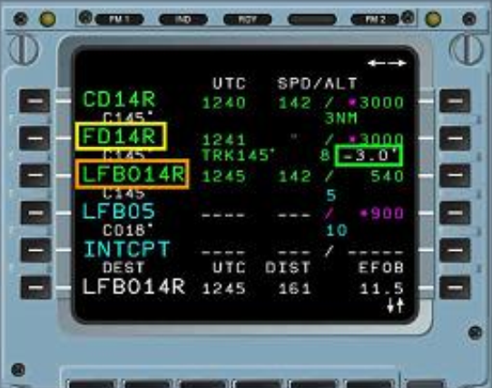
    * 我们平时所飞的RNP程序到底是LNAV/VNAV还是RNP AR？

      * 我们平时在运行中所使用的RNP程序，通常是指LNAV/VNAV程序，在运行时，RNP AR程序会在航图上明确标注当前使用的是RNP AR航图，要执行RNP AR程序，需要专门的资质培训及授权
    * LNAV/VNAV和RNP AR属于类精密进近，见跑道后应该用FD还是用TRACK？

      * 对于是否使用FD，主要取决于MAP（Miss Approach Point）的位置，当MAP与跑道口重合时，FD提供的指引是准确有效的，但是如果MAP不在跑道口，在飞机通过了MAP点之后，其垂直引导可能存在偏差，因此建议使用TRACK方式，但是这不代表不能使用FD，而是机组应该知晓偏差存在的可能性
    * 在**FINAL**模式接通后，当机组发现XTK＞0.3NM，是否还应该按照RNP复飞程序复飞？

      * RNP的复飞程序要求精度为1NM，当XTK＞0.3NM，此时飞机的导航精度不足以继续进近，但是只要偏差不大于1NM，就可以按照RNP程序复飞
    * 如果在最后进近过程中FINAL模式没有接通，我是否可以不复飞而直接降级到"LNAV ONLY"[^32]进近？

      * 不可以，LNAV ONLY属于非精密进近，而LNAV/VNAV或RNP AR都属于类精密进近，在这种情况下需要中止进近或复飞，重新进行进近简令之后再次加入进近

[^35]: # **LNAV/VNAV和RNP AR所涉及到的知识**

    * 如何识别最后下降点FDP（Final Decent Point）？

      * 可以通过航图和MCDU计划页面的内容来识别，当选择了RNP进近时，根据程序设计，在MCDU的计划点排序中，从FDP点开始会出现白色的-3°字样
      * 
    * 我们平时所飞的RNP程序到底是LNAV/VNAV还是RNP AR？

      * 我们平时在运行中所使用的RNP程序，通常是指LNAV/VNAV程序，在运行时，RNP AR程序会在航图上明确标注当前使用的是RNP AR航图，要执行RNP AR程序，需要专门的资质培训及授权
    * LNAV/VNAV和RNP AR属于类精密进近，见跑道后应该用FD还是用TRACK？

      * 对于是否使用FD，主要取决于MAP（Miss Approach Point）的位置，当MAP与跑道口重合时，FD提供的指引是准确有效的，但是如果MAP不在跑道口，在飞机通过了MAP点之后，其垂直引导可能存在偏差，因此建议使用TRACK方式，但是这不代表不能使用FD，而是机组应该知晓偏差存在的可能性
    * 在**FINAL**模式接通后，当机组发现XTK＞0.3NM，是否还应该按照RNP复飞程序复飞？

      * RNP的复飞程序要求精度为1NM，当XTK＞0.3NM，此时飞机的导航精度不足以继续进近，但是只要偏差不大于1NM，就可以按照RNP程序复飞
    * 如果在最后进近过程中FINAL模式没有接通，我是否可以不复飞而直接降级到"LNAV ONLY"[^32]进近？

      * 不可以，LNAV ONLY属于非精密进近，而LNAV/VNAV或RNP AR都属于类精密进近，在这种情况下需要中止进近或复飞，重新进行进近简令之后再次加入进近

[^36]: # 双FMGC失效

    # **双FMGC失效的现象：**

    1. 双MCDU黑屏
    2. 自动驾驶、自动推力断开 FMA出现**THR LK**警告，推力可能会在短时间内跟随推力手柄角度进行突然变化，FMA完全消失
    3. PFD上指引小时，并出现红色**FD**字样
    4. ND地图不可用，且出现红色**MAP NOT AVAILABLE**
    5. 两部MCDU顶部的琥珀色**FM1**和**FM2**灯亮
    6. ND两部导航设备成虚线
    7. 着陆标高自动调节功能失效
    8. 飞机上的全重显示消失
    9. 放出形态后反应式风切变探测失效警告响起

    # **双FMGC失效的程序：**

    1. 发现故障，PF报出**THR LK**，按照当前推力，将推力手柄移至当前推力所对应的角度之后，断开A-THR
    2. 重新尝试接通两部**AP**，以及相对应通道的**A-THR**
    3. 如果重新接通不成功，PF下口令：关FD，放小鸟，执行非正常程序
    4. 如模拟机具有BACK UP F-PLAN功能，起动该功能在ND上显示记忆的航路，如当前未能找到合适的导航台，可根据此功能提供的航线，人工沿线飞行
    5. 完成故障识别后进行短期决策，宣布PANPAN，申请雷达引导或自主导航飞向某点进行排故
    6. 无论有无雷达引导，下口令使用备用导航设备进行导航和位置判断
    7. 按照非正常程序进行计算机复位（短期复位/长期复位），之后进行长期决策
    8. 使用舱单上ZFW+当前FOB的方式重新计算当前飞机的重量，得到当前飞机全重之后，根据重心查询着陆距离及进近速度，如果当前飞机重量超过最大着陆重量（参考"7. 限制"[^37]），应当联系ATC使用原始数据导航加入等待耗油
    9. 长期决策后，如需要返场或备降，进行进近准备，决策依据先考虑天气因素，获取进近条件，复习ECAM
    10. 之后使用原始导航设备进行进近

    ---

    # **容易出现的问题：**

    * 出现**THR LK**后没有正确的将推力手柄收回至当前的推力位置再断开推力，造成突然的俯仰或速度的改变
    * 尝试重新接通不成功后第一时间不关FD，不放小鸟
    * 对人工三脱飞行没有预期，无法保持速度、高度、方向
    * 不按照标准的非正常程序进行处置，进近准备后不按照带故障的程序复习ECAM，遗漏目的地机场**着陆标高**的人工调节
    * 不尝试进行系统复位
    * 混淆每一部RMP频率调谐与对应导航设备的关系
    * PM尝试使用PF一侧的RMP调谐ILS频率
    * 使用备用导航设备后，选择电门没有选回VHF位，**SEL**灯常亮
    * 没有获取足够的决策依据就开始准备直接返场
    * 没有进行飞机全重的计算，造成无必要的超重着陆
    * 在进行标准进场时，没有考虑导航台切换的优先顺序
    * 遗忘跑道距离和V~app~的查询
    * 反射式风切变在双FMGC失效时就已经失效，但是不会有相应的警告，在进近过程中放襟翼后会出现相关提示，不要去进行相关的非正常处置程序
    * 试图执行ATC给出的RNAV程序

    # **双FMGC失效涉及到的知识：**

    * 为什么已经判断了双FMGC失效，但还是要尝试重新接通AP和A-THR？

      * 虽然双FMGC失效，但是FMGC其实同时在实现FM和FG两个功能，当双FMGC失效时，虽然从表象上看失去了FM和FG两个功能，但是实际上有可能仅有其中FM（飞行管理）功能失效，而FG（飞行引导）功能正常工作，我们需要进行积极尝试重新接通AP和A-THR，当一个通道不工作时还可以进行另外一个通道的尝试，只有确定了FMGC1+2确实无法提供任何功能，我们才再去继续使用人工飞行方式飞行
    * 为什么PM不要去尝试使用PF一侧的RMP进行ILS频率的调谐？

      * 当双FMGC失效后，唯一的一套ILS系统可以通过两侧的RMP进行调谐，当需要进行相应侧的其他导航台频率调谐时，由于系统限制原因，只能在对侧调谐，但是机组需要明白手臂横越中央操纵台时误碰推力手柄的风险，为了减少这种风险，机组应该在进行ILS盲降频率调谐时尽量使用本侧的RMP设备
    * 双MCDU失效和双FMGC失效的区别？

      * MCDU只是一个控制组件，相当于人机对话的接口，双MCDU失效只是进行人机对话的接口不可用，失去了进行FM指令的窗口，而FG功能健在，AP、A-THR功能都可以正常使用，但是双MCDU功能一旦失效，FM、FG功能都不可用，机组的工作负荷远大于单纯的失去双MCDU时的工作负荷
    * 双FMGC失效的V~app~应该查有故障的还是无故障的？

      * 双FMGC失效虽然影响了自动飞行功能，但是飞机本身的性能并没有受到影响，因此在进近时着陆距离和V~app~的确定都应该使用无故障的性能表进行查询，唯一需要注意的是需要根据舱单上提供的实际重心进行查询。
    * 双FMGC失效后，BACK UP F-PLAN功能其实并没有实际上的用处，能不能不起动？

      * 建议在飞机能够提供此功能的情况下还是起动BACK UP F-PLAN功能，该功能虽然不能帮助你重新恢复导航，但是能够给你进行航路的提示，在当前的运行环境下，大部分的航线都在使用RNAV或RNP程序，在没有在第一时间找到合适的导航台时，尽量沿线飞行，在进近期间如果觉得ND上的线段会对自己产生干扰，可以重新关闭BACK UP F-PLAN功能
    * 双FMGC失效后，雷达显示的天气信息还准确吗？

      * 准确，雷达的天气信息是以实时探测到的信息为主，能够直观的通过ND上的距离弧直观判断当前飞机和天气的相对位置关系。基于金科玉律中对于导航的定义，在飞行过程中了解天气所在的位置以及是否会对后续飞行产生影响，这是机组所需要了解的必要信息。因此，在飞行的过程中，如果出现双FMGC失效，机组更应该谨慎通过ND上的天气信息来判断后续飞行的路线，并且以此作为决策依据

[^37]: # 7. 限制

    标签：#限制#

    **注意：**由于各公司运行机型与构型各不相同，因此本笔记中涉及到的限制仅供参考，具体限制以各公司手册对应的飞机编号为准。

    # 飞机概述：

    #### 飞行机动载荷加速：

    * 光洁形态：

      * -1g至+2.5g
    * 其他形态：

      * 0g至+2g

    #### 最大操作高度：

    * 光洁形态：

      * 39800ft（这是可以保持座舱压力低于8000ft的最大高度）
    * 带形态：

      * 20000ft

    #### 机场运行限制：

    跑道坡度：±2°

    跑道高度：9200ft

    标称跑道宽度：45m（某些机型为：30m，以公司手册为准）

    #### 飞机离地俯仰和坡度限制：

    参看各公司手册DSC-20-40

    ---

    # 风的限制：

    最大**验证**侧风：38kt（包含侧风）

    起落最大顺风限制：10kt

    客货舱门的操作：

    * 客舱门操作最大风速65kt
    * 前和后货舱门操作时的最大风为 40 节（或 50 节，如果飞机机头迎风，或如果前和后货舱门处在下风面）
    * 在风速超过 65 节前，必须关闭前和后货舱门

    #### 湿跑道和污染跑道上最大的**推荐**侧风：

    | 跑道状态/跑道污染物                                                                                                                                                                  | ESF^（1）^或PIREP^（2）^ | 最大起飞侧风（包括阵风） | 最大着陆侧风（包括阵风） |
    | :------------------------------------------------------------------------------------------------------------------------------------------------------------------------------------- | ---------------------------- | :------------------------: | -------------------------- |
    | **潮湿：** 湿：3mm（1/8''）水 雪浆：3mm（1/8''） 干雪：3mm（1/8''） 湿雪：3mm（1/8''） 霜                                                                                 | 好                         |           38kt           | 38kt                     |
    | **实雪：** OAT≤-15°C                                                                                                                                                        | 好至中                     |           29kt           | 29kt                     |
    | **干雪：** 大于3mm（1/8''），最多100mm（4''） **湿雪：** 大于3mm（1/8''），最多30mm（6/5''） **实雪：** OAT＞15℃ **实雪上有干雪 实雪上有湿雪 湿滑** | 中                         |           25kt           | 25kt                     |
    | **水：** 大于3mm（1/8''），最多13mm(1/2'') **雪浆：** 大于3mm（1/8''），最多13mm(1/2'')                                                                               | 中至差                     |           20kt           | 20kt                     |
    | **冰**（冷的&干的）                                                                                                                                                           | 差                         |           15kt           | 15kt                     |

    EFS：预计道面摩擦力

    PIREP：刹车效应飞行员报告

    注：上表中给出的最大侧风的数值是基于计算得出的**推荐**值。

    自动着陆侧风限制请查看："自动着陆最大风条件："[^38]

    ---

    # 污染跑道起飞限制：

    以下跑道条件不推荐起飞：

    * 实雪顶部有水
    * 冰上有干雪或湿雪

    以下条件不允许起飞：

    * 湿冰

    ---

    # 速度限制：

    #### 驾驶舱窗户打开最大速度：

    200kt

    #### 最大使用速度：

    * VMO：350kt
    * MMO：M 0.82

    #### 最大襟缝翼速度：

    | 襟翼手柄位置 | 显示的形态 | 最大速度 | 飞行阶段         |
    | -------------- | ------------ | ---------- | ------------------ |
    | 1            | 1          | 230kt    | 下降、等待、进近 |
    | 1            | 1+F        | 215kt    | 起飞             |
    | 2            | 2          | 200kt    | 起飞、进近       |
    | 3            | 3          | 185kt    | 起飞、进近、着陆 |
    | FULL         | FULL       | 177kt    | 着陆             |

    #### 起落架速度限制：

    * 起落架放出时的最大速度（VLE）：280kt/M 0.67
    * 可以放下起落架的最大速度（VLO~放下~）：250kt/M 0.60
    * 可以手上起落架的最大速度（VLO~收上~）：220kt/M 0.54

    #### 最大轮速：

    195kt

    滑行速度：当飞机重量大于76000kg时，转弯速度不能超过20kt。

    #### 雨刷使用限制：

    最大使用雨刷速度：230kt

    ---

    # 重量限制：

    由于每个公司的重量限制因飞机构型不同而不同，因此请参考本公司对于本公司手册中关于重量限制部分内容。

    ---

    # 引气、空调、增压、通风限制：

    #### 引气：

    机上有旅客时，建议无空调供给时间不超过20分钟。

    不得同时使用地面HP气源装置和APU引气。

    #### 电子设备通风：

    | 外界温度        | 飞机供电时间 |
    | ----------------- | -------------- |
    | OAT≤49℃       | 无限制       |
    | 49℃＜OAT≤55℃ | 2h           |
    | 55℃＜OAT≤60℃ | 1h           |
    | 60℃＜OAT≤64℃ | 0.5h         |

    #### 座舱压力：

    * 最大正压差：

      * 9.0 PSI
    * 最大负压差：

      * -1 PSI
    * 安全释放活门设置：

      * 8.6 PSI

    飞行机组不得同时使用来自组件和来自 LP 空调装置的空调空气，以防止对空调系统产生任何不利的影响。

    ---

    # 自动飞行系统：

    #### 自动驾驶：

    | 状态                                              | 最低条件                   |
    | --------------------------------------------------- | ---------------------------- |
    | 起飞时                                            | 100ft（AGL）且离地至少5秒  |
    | 在使用FINAL APP，V/S或FPA模式的进近中             | 250ft (AGL)                |
    | 盘旋进近                                          | 500ft（AGL）               |
    | 在 ILS进近中，若FMA上未显示CAT 2或CAT 3能力      | 160ft（AGL）               |
    | 在 ILS 进近中， 当FMA上显示 CAT 2或 CAT 3能力时  | 参考CAT II/CAT III运行     |
    | 在PAR精密雷达进近或对等的进近中                  | 250ft（AGL）               |
    | 人工复飞后 在所有其它飞行阶段                   | 100ft (AGL) 500ft （AGL） |

    #### 导航方式的使用：

    **起飞后：**

    起飞后可以使用NAV方式，前提条件是：

    * GPS PRIMARY（GPS主用）可用，或
    * 飞行机组检查了FMGS起飞更新。

    **终端区域：**

    可在终端区域使用 NAV 方式，只要：

    * GPS PRIMARY（GPS主用）可用，或
    * 在MCDU上检查或输入了适当的RNP，并显示 HIGH 精度，或
    * 用导航设备原始数据交叉检查了FMS导航。

    #### 最低决断高：

    **特殊授权CAT I(SA CAT I)：**

    最低决断高：150ft（AGL）

    在 APPR 方式中至少一部自动驾驶仪必须接通下降至 决断高，并且 CAT 2，或 CAT 3 SINGLE 或 CAT 3 DUAL 必须显示在FMA 上。

    飞行机组必须使用 HUD 监控进近。飞行机组应该进行人工着陆。

    **低于标准的 CAT I（LTS CAT I）：**

    最低决断高：200ft（AGL）

    飞行机组必须使用 HUD 飞进近。

    飞行机组应执行人工着陆。

    **ILS Ⅱ 类：**

    最低决断高：100ft（AGL）

    至少一部自动驾驶仪必须接通在 APPR 方式，并且CAT 2, 或CAT 3 SINGLE或CAT 3DUAL 必须显示在 FMA 上。 人工着陆时，AP 应不晚于 80 ft AGL 断开。

    **特殊授权 CAT II (SA CAT II)**：

    最低决断高：100ft（AGL）

    至少一部自动驾驶仪必须接通在APPR方式，并且CAT 2, 或CAT 3 SINGLE 或 CAT 3 DUAL必须显示在FMA上。

    有HUD，飞行机组必须使用HUD监控进近并执行自动着陆或人工着陆。无自动着陆时，如果飞行机组执行自动进近，必须在不迟于80ft（AGL）前断开自动驾驶。

    没有HUD,飞行机组必须执行自动着陆。

    **不同于标准的 CAT II（ OTS CAT II）**：

    最低决断高：100ft（AGL）

    至少一部自动驾驶仪必须接通在APPR方式，并且CAT 2, 或CAT 3 SINGLE或CAT 3DUAL 必须显示在 FMA 上。  

    有HUD ,飞行机组必须使用HUD监控进近并执行自动着陆或人工着陆。无自动着陆时，如果飞行机组执行自动进近，须在不迟于 80 ft AGL 前断开自动驾驶。如无 HUD，飞行机组必须执行自动着陆。  

    **ILS III 类失效消极保护（单通道）：**

    最低决断高：50ft（AGL）

    在选择或管理速度下必须使用 自动推力。

    至少一部自动驾驶必须接通在APPR方式，并且FMA上必须显示CAT 3 SINGLE或CAT 3 DUAL。  

    **ILS III 类失效后保持工作（双通道）**：

    最低DH：100ft

    在选择或管理速度下必须使用自动推力。

    在 APPR 方式中必须接通两部自动驾驶，且 FMA 上必须显示 CAT 3 DUAL。

    * 无DH的CAT III

      * 最小RVR：75m

    #### 自动着陆：

    只有在进近中达到 1 000 ft 之前完成了发动机失效程序且在形态全（CEO）或形态3或者形态全（NEO）下，才允许进行 CAT II 和 CAT III 的失效消极保护自动着陆。  

    #### 自动着陆最大风条件：

    {{{col
    **NEO发动机：**

    **CEO发动机：**

    }}}

    {{{col
    * 顶风：30kt
    * 顺风：10kt
    * 侧风：20kt（15kt用于单发失效时的自动滑跑）

    * 顶风：30kt
    * 顺风：10kt
    * 侧风：20kt（无自动滑跑）/15kt（有自动滑跑）

    }}}

    ---

    # APU：

    #### APU起动：

    连续三次尝试起动 APU 后，飞行机组必须等待 60 min 才能进行新的起动尝试。

    在进行加/抽油程序时，允许APU的起动和关车，前提条件时：

    * 如果APU不能起动或自动关车，不要起动APU
    * 如果发生燃油溢出，执行正常APU关车

    #### APU转子速度：

    最大N转速：107%

    #### APU的EGT限制：

    最大EGT对于 APU 起动（低于 35 000 ft）：1090℃

    最大EGT对于 APU 起动（高于 35 000 ft）：1120℃ 

    APU运转时最大EGT：675℃

    #### APU电瓶起动限制：

    在应急电气构型下，最大电瓶起动APU高度为：FL2500

    且要求符合下列包线：

    

    #### APU供气限制：

    辅助起动发动机最高限制：20000ft

    空调和增压的最大高度（单组件）：22500ft

    空调和增压的最大高度（双组件）：20000ft

    不允许使用APU引气用于机翼防冰

    ---

    # 发动机：

    #### 发动机推力/EGT限制：

    **NEO：**

    | 操作                 | 条件           | 时限   | EGT    |
    | ---------------------- | ---------------- | -------- | -------- |
    | TOGA（包含起飞FLEX） | 所有发动机工作 | 5min   | 1083℃ |
    | TOGA（包含起飞FLEX） | 一台发动机工作 | 10min  | 1083℃ |
    | MCT                  | 无限制         | 无限制 | 1043℃ |
    | 起动                 | 地面           |        | 1083℃ |
    | 起动                 | 空中           |        | 1083℃ |

    **CEO：**

    | 操作                 | 条件           | 时限   | EGT   |
    | ---------------------- | ---------------- | -------- | ------- |
    | TOGA（包含起飞FLEX） | 所有发动机工作 | 5min   | 950℃ |
    | TOGA（包含起飞FLEX） | 一台发动机工作 | 10min  | 950℃ |
    | MCT                  | 无限制         | 无限制 | 915℃ |
    | 起动                | 地面          |        | 725℃ |
    | 起动                 | 空中           |        | 725℃ |

    #### 轴转速：

    {{{col
    **NEO：**

    **CEO：**

    }}}

    {{{col
    正常操作中的最大N1：100%

    最大N1：:104%

    }}}

    {{{col
    最大允许N1:105%

    最大N2：105%

    }}}

    正常操作中的最大N2:100%

    最大允许N2:105%

    #### 滑油温度：

    {{{col
    **NEO：**

    **CEO：**

    }}}

    {{{col
    最大温度：151℃

    最大连续温度：140℃

    }}}

    {{{col
    最低起动温度：-40℃

    最大瞬时温度（15 min）：155℃

    }}}

    {{{col
    起飞前最低温度：52℃

    {{{row
    最低起动温度：-40℃

    起飞前最低温度：-10℃

    }}}

    }}}

    #### 滑油量：

    | NEO                                            | CEO                                      |
    | ------------------------------------------------ | ------------------------------------------ |
    | 滑油量≥14夸脱，如OAT＜-30℃，滑油量≥16.5夸脱 | 滑油量≥9.5夸脱+0.5夸脱/每小时预计消耗量 |

    #### 起动机：

    |     | NEO                                                                       | CEO                                                                |
    | ------ | --------------------------------------------------------------------------- | -------------------------------------------------------------------- |
    | 循环 | 最多2次标准自动起动为一个循环                                             | 最多3次标准自动起动为一个循环                                      |
    | 间隔 | 对于地面起动（自动或人工），在连续的工作循环之间要求 35 s 的停顿         | 对于地面起动（自动或人工），在连续的工作循环之间要求 20 s 的停顿  |
    | 冷却 | 继3次失败的工作循环，或15min 连续或累积的冷转后, 要求有15 min的冷却时间  | 继4次失败的工作循环，要求有15 min的冷却时间                       |
    | 限制 | 当 N2高于20%时，不得运转起动机。                                         | 当 N2高于20%时，不得运转起动机。                                   |

    #### 反推：

    飞行中严禁选择反推。

    不允许使用反推让飞机后退。

    70 kt 以下不应使用最大反推。允许使用慢车反推直至飞机停下。  

    #### 灵活起飞：

    仅当工作的发动机在灵活温度（ TFLEX）的可用推力情况下，飞机满足起飞重量的所有性能要求时，才允许减推力起飞，即所谓的 灵活 起飞。

    在存在任何影响性能的不工作项目的情况下，只有在应用了相关的性能差额来满足上述要求时，才允许减推力起飞。

    不允许在污染跑道上灵活起飞。  

    **灵活起飞的条件：**

    | NEO                                           | CEO                                           |
    | ----------------------------------------------- | ----------------------------------------------- |
    | T~Flex~不得高于T~MAXFLEX~，即 ISA + 50 ° C | T~Flex~不得高于T~MAXFLEX~，即 ISA + 53 ° C |
    | 低于平台温度（T~REF~）                       | 低于平台温度（T~REF~）                       |
    | 低于实际的 OAT                                | 低于实际的 OAT                                |

    #### 发动机最大侧风起动：

    最大验证起动侧风：35kt。

    ---

    # 飞行操纵：

    #### 飞行机动载荷加速限制：

    #### 飞行机动载荷加速：

    * 光洁形态：

      * -1g至+2.5g
    * 其他形态：

      * 0g至+2g

    #### 襟缝翼放出飞行的最大高度：

    #### 最大操作高度：

    * 光洁形态：

      * 39800ft（这是可以保持座舱压力低于8000ft的最大高度）
    * 带形态：

      * 20000ft

    #### 最大襟缝翼飞行速度：

    #### 最大襟缝翼速度：

    | 襟翼手柄位置 | 显示的形态 | 最大速度 | 飞行阶段         |
    | -------------- | ------------ | ---------- | ------------------ |
    | 1            | 1          | 230kt    | 下降、等待、进近 |
    | 1            | 1+F        | 215kt    | 起飞             |
    | 2            | 2          | 200kt    | 起飞、进近       |
    | 3            | 3          | 185kt    | 起飞、进近、着陆 |
    | FULL         | FULL       | 177kt    | 着陆             |

    ---

    # 燃油：

    #### 起飞时燃油不平衡：

    ###### 内侧油箱（外侧平衡）：

    | 油箱容量（较重的油箱） | 最大不平衡          |
    | :----------------------: | --------------------- |
    |           满           | 500 kg（1102 lb）   |
    |   3000 kg（6613 lb）   | 1050 kg（2314 lb）  |
    |  1450 kg （3196 lb）  | 1045 kg （3196 lb） |

    ###### 外侧油箱（内侧平衡）：

    | 最大不平衡 | 370 kg（815 lb） |
    | ------------ | ------------------ |

    #### 飞行和着陆时燃油不平衡：

    ###### 内侧油箱（外侧平衡）：

    | 油箱容量（较重的油箱） | 最大不平衡         |
    | :----------------------: | -------------------- |
    |           满           | 1500 kg（3306 lb） |
    |   4300 kg（9479 lb）   | 1600 kg（3527 lb） |
    |   2250 kg（4960 lb）   | 2250 kg（4960 lb） |
    | 小于2250 kg（4960 lb） | 无限制             |

    ###### 外侧油箱（内侧平衡）：

    | 最大不平衡 | 690 kg (1521 lb)^注^ |
    | ------------ | ----------------------- |

    注解：允许在外侧机翼油箱中达到最大不平衡（一满/一空），条件是：

    * 一侧的外侧和内侧机翼油箱燃油量等于另一侧的外侧和内侧机翼油箱燃油量，或
    * 在较轻的外侧油箱一侧，内侧油箱的燃油量大于另一侧内侧油箱的燃油量。内侧油箱之间的燃油量差值不得大于3000 kg（6613 lb）。

    #### 最小起飞油量：

    最小起飞油量：1500 kg（3307 lb）

    起飞时不可以出现与机翼油箱中燃油低油面相关的 ECAM (燃油 机翼油箱低油面等) 的警报。

    ---

    # 防冰排雨：

    # 结冰条件的定义：

    **地面时：**

    当在地面和起飞时 OAT 不超过 10 °C，且在机坪、滑行道或跑道上操作时，道面上的雪、积水或雪浆可能会被发动机吸入，或冻结在发动机、吊舱或发动机传感器探头上，在这种情况下视为存在结冰条件。

    **地面或空中：**

    当OAT（在地面或起飞后或TAT（飞行中）不超过10 °C，且存在任何形式的可见水汽（例如云、能见度为1sm（1600m）或以下的雾、雨、雪、雨夹雪或冰晶）时，就存在结冰条件。  

    当存在结冰条件或预计会出现结冰条件时，在所有的地面及飞行操作中都必须接通发动机防冰，在温度低于 -40 °C SAT 时的爬升和巡航期间除外。在结冰条件下下降前和下降期间，包括温度低于-40°CSAT时，必须接通发动机防冰。   

    # 严重积冰的定义：

    当机身上累积的冰达到大约 5 mm (0.2 in) 厚或更厚时被视为严重积冰。

    # 薄白霜的定义：

    薄白霜通常是在寒冷无云的夜里在暴露的表面上均匀形成的白色结晶沉淀。 它很薄以致可辨别在其下面的表面特征（线条或标记）。  

    # 排雨剂：

    飞行机组应只在中到大雨的情况下才使用排雨剂。

    # **雨刷最大操作速度**：

    #### 雨刷使用限制：

    最大使用雨刷速度：230kt

    ---

    ---

    # 起落架：

    #### 刹车温度：

    起飞时的最大刹车温度：300℃

    #### 起落架速度限制：

    #### 起落架速度限制：

    * 起落架放出时的最大速度（VLE）：280kt/M 0.67
    * 可以放下起落架的最大速度（VLO~放下~）：250kt/M 0.60
    * 可以手上起落架的最大速度（VLO~收上~）：220kt/M 0.54

    #### 最大轮速：

    #### 最大轮速：

    195kt

    滑行速度：当飞机重量大于76000kg时，转弯速度不能超过20kt。

    #### 前轮转弯：

    使用空客批准的推车时，最大NWS角度：±85°

    #### 轮胎泄气或破损时的滑行：

    在轮胎泄气（未破损）的情况下脱离跑道或低速滑行，下列所有限制适用：

    * 如果每个起落架上最多一个轮胎泄气（考虑三个起落架），转弯时最大滑行速度：7kt
    * 如果同一主起落架（最多一个主起落架）上的两个轮胎泄气，最大滑行速度：3kt
    * 对于前轮转弯（ NWS）角：最大30°

    另外，如果怀疑轮胎破损，在脱离跑道或滑行之前飞行机组必须要求检查飞机。如果地面人员怀疑爆胎可能损坏起落架，则应采取维护措施。   

    ---

    # 导航：

    #### IRS地面校准：

    IRS 的地面校准可能在北纬 82° 和南纬 82 ° 之间。

    #### 磁（MAG）基准：

    * 如果所有 ADIRU 有相同的磁差表：

      在NAV方式， IR 将不会提供有效的磁航向和磁航迹角：

      * 北纬 73 ° 以北，西经 90 ° 和西经 120 ° (磁极地区)之间，和
      * 北纬 82 ° 以北，和
      * 南纬 60 ° 以南。

      禁止在超过这些限制的纬度飞行。
    * 如果一部 ADIRU 有不同的磁差表：

      在 NAV 方式， IR 将不会提供有效的磁航向和磁航迹角：

      * 北纬 60 ° 以北，西经 30 ° 和西经 160 ° 之间，和 
      * 北纬 75 ° 以北，和 
      * 南纬 55 ° 以南。

      禁止在超过这些限制的纬度飞行。

    ---

    # 其他：

    其他数据限制请查阅各公司FCOM手册-限制。

    ---

[^38]: #### 自动着陆最大风条件：

    {{{col
    **NEO发动机：**

    **CEO发动机：**

    }}}

    {{{col
    * 顶风：30kt
    * 顺风：10kt
    * 侧风：20kt（15kt用于单发失效时的自动滑跑）

    * 顶风：30kt
    * 顺风：10kt
    * 侧风：20kt（无自动滑跑）/15kt（有自动滑跑）

    }}}

    ---

[^39]: # 稳定进近

    # 定义：

    稳定进近是指飞机在着陆前以要求的构型、姿态、速度、动力，沿进近航径（即仪表着陆系统的航向道和下滑道）飞行的进近方式。稳定进近是确保进近着陆安全或者说正常落地的前提。

    # 建立稳定进近的最低高度：

    IMC气象条件下，必须在1000ft（AGL）以前建立稳定进近。

    VMC气象条件下，必须在500ft（AGL）以前建立稳定进近。

    # 稳定进近的标准：

    {{{col
    #### 仪表进近标准：

    #### 目视进近标准：

    }}}

    {{{col
    * 五边进近高度1000-1500ft（AGL）以内：

      * 飞机飞行航径正确；
      * 只需要很小的航向/俯仰变化就能保持正确的飞行航径；
      * 推力设置适合飞机形态；
      * 着陆襟翼放出；起落架放下，完成着陆形态；
      * 完成着陆检查单；完成着陆准备（风挡、雨刷、夜航灯光）；
      * 按进近图规定的标准稳定下降率（如果进近下降时）；
      * 调整速度到目标速度，速度偏差在+10/-5kt以内；
      * 航向道与下滑道偏差在±1个点范围内。
    * 五边进近高度500ft（AGL）以内：

      * 按进近图规定的标准保持稳定的下降率并不超过1000ft/m（如进近下降率要求大于此标准，需要完成特别简令）；
      * 保持速度稳定在Vapp，速度偏差+5/-0kt以内；
      * 航道和下滑道偏离指示小于±1/4个点，并保持在航道/下滑道上。

    * 五边进近1000ft（AGL）以内：

      * 飞机飞行航径正确；
      * 只需要很小的航向/俯仰变化就能保持正确的飞行航径；
      * 推力设置适合飞机形态；
      * 着陆襟翼放出；起落架放下，完成着陆形态；
      * 完成着陆检查单；完成着陆准备（风挡、雨刷、夜航灯光）；
      * 调整速度到目标速度，速度偏差在+10/-5kt以内；
    * 五边进近高度500ft（AGL）以内：

      * 保持稳定的着陆航向对正跑道，在转弯后对正跑道或反向进近对正跑道时，机翼应是水平的；
      * 保持稳定的下降率，不超过1000英尺/分钟（如果进近需要降率大于1000英尺/分钟，下降前应做特别简令）；
      * 保持速度稳定在Vapp，速度偏差+5/-0kt以内；

    }}}

    在满足了上述条件之后，在进入进近着陆阶段时，还需要满足以下标准：

    #### 进近着陆标准：

    在高于接地点500英尺以下，保持仪表或目视进近条件的进近才能认为是稳定的进近。如果在500ft（AGL）或以下不能持续保持下述标准，应执行复飞：

    * 在进近着陆过程中，目视着陆在高于接地点100英尺时，飞机的位置应该是驾驶舱在跑道水平延长线范围之内，并持续保持在此范围。
    * 飞机过跑道时，应该：

      * 稳定在目标速度到目标速度+5海里/小时以内；
      * 稳定的保持飞行航径；
      * 可以在接地区正常着陆

    注意：在整个进近过程中如果出现任何不能满足以上条件的情况，机组都应该选择复飞，复飞内容请参阅"中止进近、复飞、中断着陆"[^26]

[^40]: # 放行条件的获取与检查单的使用

    # 放行条件：

     以以下顺序获取放行条件，所有放行条件必须交叉检查：

    * ATIS:

     ATIS每半小时更新一次，以ATIS的风向来预测使用跑道（使用跑道以放行许可为准），D-ATIS以打印件为准，ATIS以抄收通波内容为准。如风向为正侧风，留意放行频率中其他飞机的使用跑道。

    * 放行：

     由于起飞时刻前半小时左右才能收到确切放行，因此在驾驶舱准备期间可以使用标准离场的走廊口方向作为预选标准，实际SID以放行为准。

    * 舱单：

     由于制作舱单需要在完全截载后，因此实际运行中的舱单获取同样是在起飞时刻前半小时左右，在实际舱单到达前的驾驶舱准备期间，可以预先在MCDU中输入一个固定的预估值是FMGC开始预先计算（如ZFW:55、ZFWCG:30）。

    # 触发检查单的时间节点

    | 时间节点                                                       | 动作                                           | 简令         | 检查单                         |
    | ---------------------------------------------------------------- | ------------------------------------------------ | -------------- | -------------------------------- |
    | 完成驾驶舱准备                                                 | 无                                             | 起飞简令     | 起动前检查单线上               |
    | 获得推出许可                                                   | 检查门窗，断开飞机外部连接，开信标灯（Beacon） | 无           | 起动前检查单线下               |
    | 发动机起动完成                                                 | 起动后动作/*操纵检查（特殊公司要求）*        | 无           | 起动后检查单                   |
    | 飞机进入主滑行道                                               | 滑行动作                                       | 起飞补充简令 | 起飞前检查单线上               |
    | 获得进跑道指令                                                 | 进跑道动作                                     | 无           | 起飞前检查单线下               |
    | 光洁形态                                                       | *绿点速度动作（特殊公司要求）*               | 无           | 起飞后爬升检查单线上           |
    | 过渡高/*过渡高-1000ft（特殊公司要求）*                       | 设置标准气压                                   | 无           | 起飞后爬升检查单线下           |
    | 高度通过FL100                                                  | 一万英尺动作                                   | 无           | 无                             |
    | 飞机到达巡航高度                                               | 巡航动作                                       | 无           | *巡航检查单（特殊公司要求）* |
    | 下降顶点+80NM左右                                              | 交操纵及进近准备                               | 进近简令     | *下降检查单（特殊公司要求）* |
    | 过渡高度层/*过渡高度层+1000ft（特殊公司要求）*且完成进近准备 | 气压转换                                       | 无           | 进近检查单                     |
    | 建立着陆形态+稳定进近                                          | 无                                             | 无           | 着陆检查单                     |
    | 脱离跑道                                                       | 着陆后动作                                     | 无           | 着陆后检查单                   |
    | 关车后N2小于30%                                                | 停机动作                                       | 无           | 停机检查单                     |
    | 决定离机                                                       | 离机动作                                       | 无           | 离机检查单                     |

     注：在外部环境有所更改的情况下，都应该进行补充简令。

[^41]: # 坐姿与扶手的调节

    坐姿与扶手的调节是在培训过程中容易被忽视的一环。

    不良的调节会导致的许多不良后果：

    * 过低的坐姿，影响关键阶段对于飞机运动趋势的目视判断
    * 过高的坐姿，影响FMA的认读
    * 不正确的扶手调节，导致操纵输入困难，肌肉疲劳
    * 不正确的脚蹬调整，导致脚蹬输入困难
    * 不正确的坐姿，导致脊椎、颈椎、肌肉的疲劳，甚至产生职业病，缩短职业生涯

    在空客本身的官方教学课件中，有专门的章节进行座椅，扶手，脚蹬的调节。

    # 座椅的使用方法：

    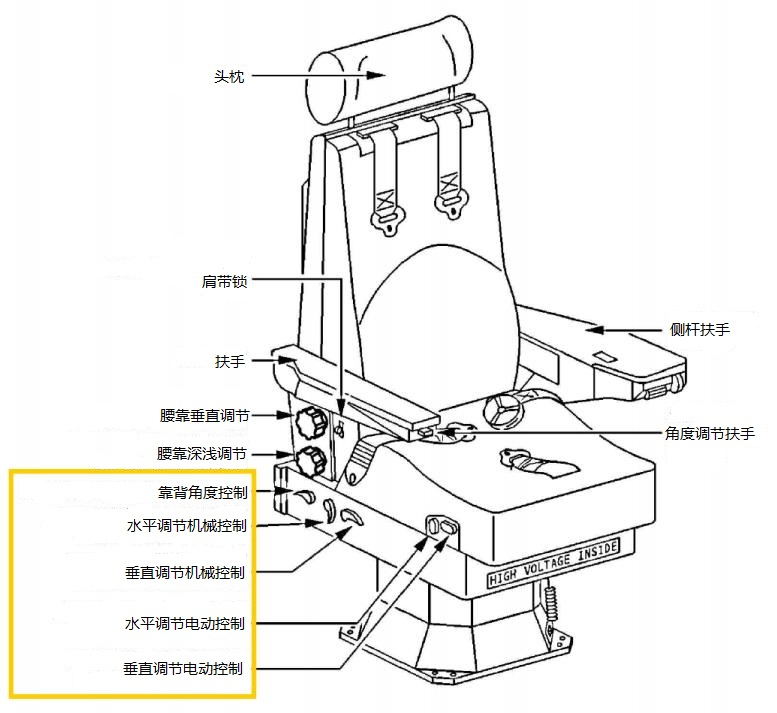

    图中黄色线框部分的调节功能是飞行员最重要使用的座椅调节功能，座椅的调节应该配合参考<kbd>视线参考面板</kbd>、<kbd>脚蹬距离调节</kbd>、<kbd>侧杆扶手调节</kbd>，使飞行员坐姿正确，易于进行操纵输入。

    # 视线参考面板：

    视线参考面板位于两块前风挡之间。

    在进行座椅调节时，在飞行员进行操纵坐姿时，白色的视觉参考点应该要能够覆盖住对侧的红色视觉参考点，以此为基准，确认自己的视线。

    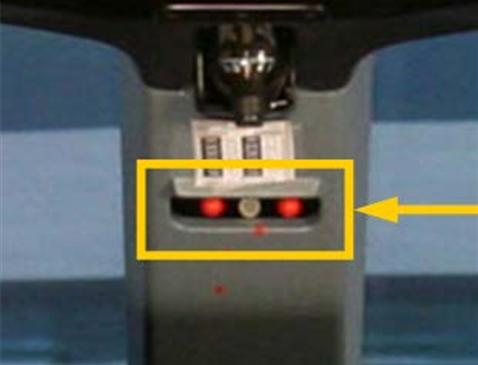

    与此同时，空客对于飞行员视线的高低也有要求，在飞行员进行操纵坐姿时，需要能够通过遮光板看见外部环境，同时不影响FMA的显示。

    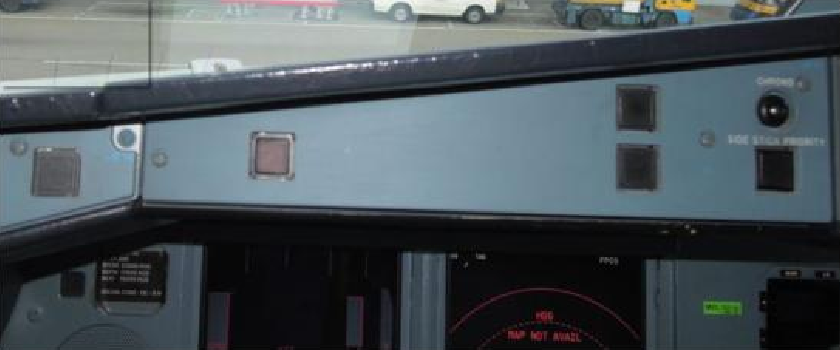

    通过对于这两者的参考，我们可以认为飞行员当前的坐姿正确。

    # 脚蹬距离调节：

    1. 在使用脚蹬的过程中，脚必须要完全放在脚蹬槽内。

    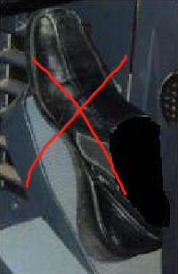

    2. 调整脚蹬进行测试，将脚蹬踩至最深处，并且用脚尖踩踏刹车，在此刻，飞行员的脚应该处于几乎完全伸直的状态。

    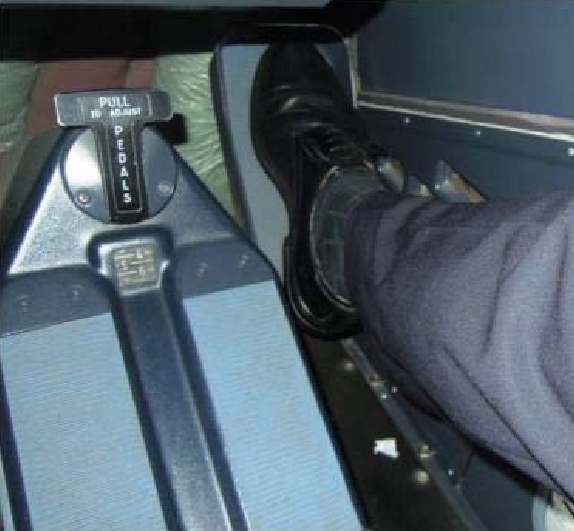

    3. 此刻脚蹬显示的距离刻度，即是适合飞行员当前身高腿长的合理刻度。

    # 侧杆扶手调节：

    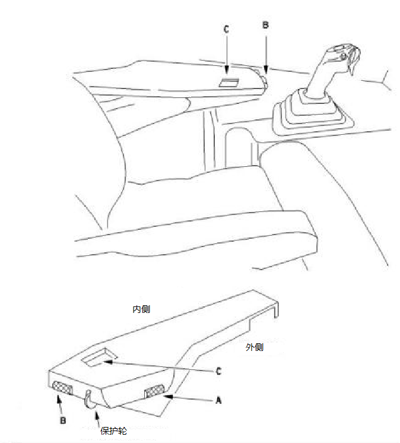

    A. 侧杆扶手高度调节，调整整个扶手的高度。

    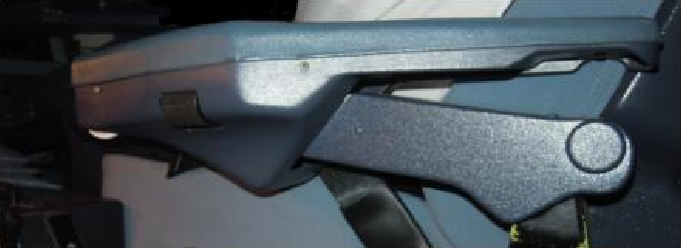

    B. 侧杆扶手角度调节，调整整个扶手的角度。

    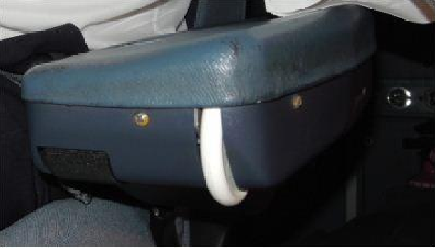

    C. 侧杆扶手高度、角度显示窗，字母代表当前使用的高度，数字代表当前使用的角度。

    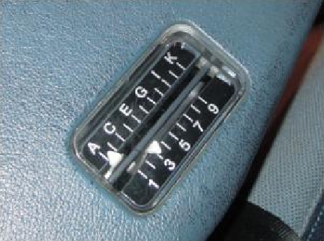

    确认操纵扶手是否调节合理，应该在座椅视线调整好后用以下两个步骤确认：

    * 如下图放置好自己的手腕，前移过程中手腕保持直线，不需要通过手腕的动作来寻找握杆的角度。

      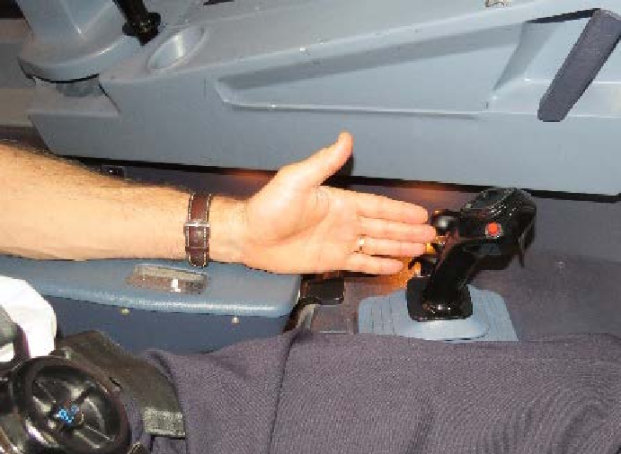
    * 握杆时，不吊肘，不耸肩，自然握住侧杆，在进行侧杆输入的时候身体不随之移动。

    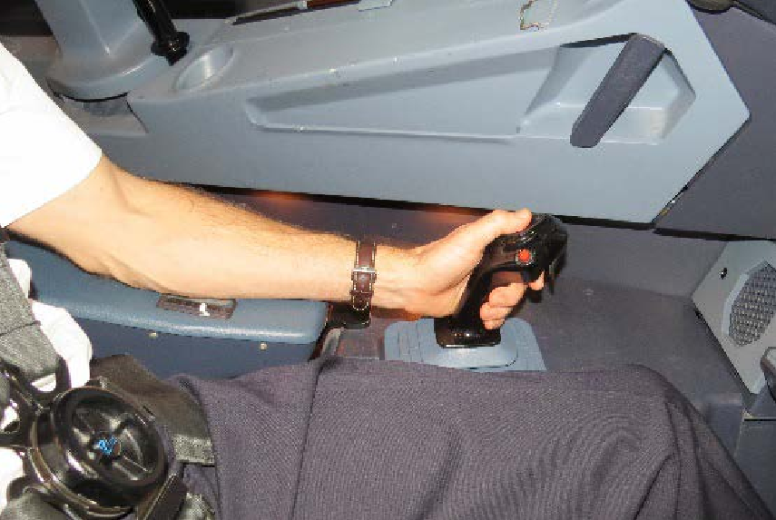

[^42]: # 冷舱驾驶舱预先准备的逻辑

     在进行冷舱准备过程中，我们需要了解，基本的预先驾驶舱准备，乃至于后续的飞行过程中，所有设备的准备、使用其实包含了三个逻辑顺序：

    |                            **在使用前确定是否安全**                            | **确认其是否能够使用**                                                  | **使用时尽量物尽其用**                                                                                                                 |
    | :----------------------------------------------------------------------------------------------------------------------------------------------: | ---------------------------------------------------------------------------------------------------------------------------------------- | ------------------------------------------------------------------------------------------------------------------------------------------------------------------------------------------------------- |
    | 在使用前确定是否安全，即任何一项设备在使用前要先确定其安全性。比如驾驶舱预先准备中的安全模块，或在飞行过程中每一样设备使用前是否超出其限制值。 | 确认其是否能够使用，即有些设备如果发生故障也不会对人员发生即时性的伤害，但是依旧存在造成后续问题的情况，对于这样的情况需要测试其功能。 | 无论对于设备还是信息，都属于驾驶舱资源范畴，当我们拥有了某一样驾驶舱资源，都应该第一时间落实在相关的方面。比如，当我们收到了天气信息，放行信息，在可用的情况下都应该直接落实在FCU或MCDU的相关设备上。 |

     注：后续驾驶舱涉及三种逻辑的思维方式都以相关的色块进行标注。

    ## 飞机设置（安全模块）：

     发动机、气象雷达、起落架、雨刷，在通电之前需要检查是否在安全的位置，通过基础的常识可以判断四个设备是否处于自己所应该在的安全位置。

    ---

    ## 电气模块：

    **通过电瓶和火警测试来确认是否能够安全使用APU**，以提供飞机的自我供能。在这一模块中，所有的程序都是以为飞机提供电能，气能为目的。在准备的过程中应当参照上述文章中提到的逻辑顺序进行理解。如，电瓶检查，属于检查APU**是否能够使用**，当APU启动完成后，则其提供的供电与供气都应该**物尽其用**，落实在相关的设备上。

     其逻辑如下：

    * **电瓶供电**
    * 有电即可测防火

      * 防火可用则自供能设备（APU）可用

        * APU可用则可供电、供气  
          **有供电即可照明，有供气即可调温**

    ---

    ## 飞机系统状态的检查：

     通过ECAM的RECALL按钮来确认飞机是否能够在后续的飞行中处于一个**安全的状态**，并且检查ECAM所不能及时提供警示信息的**氧气、液压、滑油**系统以及OEB，确认飞机正常后才能对飞机进行接收。

    ---

    ## 飞机外部状态和设备的检查：

    当确认ECAM工作正常，且氧气、液压、滑油都能够满足我们当前航段的需求时，我们可以通过ECAM进行飞机外部状态的检查，而外部设备能够产生动态的仅有襟翼、减速板和起落架。之后检查其他飞行中所需求的设备。

[^43]: # 目视起落程序

    # 目视起落程序

    1. 正常起飞爬升
    2. 起飞保持形态到襟翼1
    3. 起动进近，检查速度管理
    4. 到达起落航线高度后断AP，关FD，放小鸟，三边航迹，完成起飞后爬升检查单线上
    5. 25°坡度转弯，三边宽度保持2.5海里，最多不超过3海里（可以下口令让PM整理计划到五边或使用MCDU的参考距离圈功能）
    6. 正切跑道头计时（计时时间换算，3s'/100ft），根据风向风速进行计时修正
    7. 时间到，25°坡度转向四边，襟翼2，放轮，复飞高度（如连续目视起落则保持），着陆航迹
    8. 四边保持目视，下降率不超过500ft
    9. 视情况在四边或五边建立着陆形态
    10. 正对五边执行着陆后检查单
    11. 500ft标准喊话，稳定进近
    12. 连续目视起落，落地后下口令襟翼收一档，推力手柄中立，配平回绿区后推力手柄TOGA

    ---

    # **容易出现的问题：**

    * 起落航向方向的选择（按照机场细则指示飞行）
    * 起动进近过慢，一转弯速度过大
    * 转四边工作顺序不正确，襟翼和起落架能够起到减速作用，复飞高度和着陆航迹可以稍后再调
    * 转四边没有目视跑道盲目下降高度
    * 着陆后襟翼没收，推力手柄未中立，直接推TOGA，触发起飞构型警告

    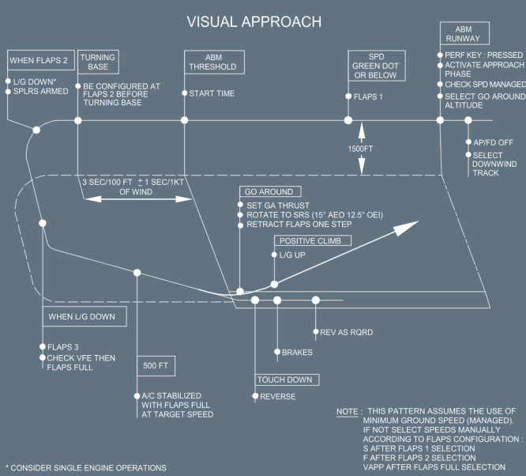

    ---

    # 相关解释：

    空客本身并没有公布官方的目视起落程序，仅有目视进近程序。每个公司都有自己所制定的目视起落程序标准，我们需要从原理上理解，再结合每个公司的标准目视起落程序进行记忆。

    #### **一边：**

    在一边，我们首先要考虑的重点在于一转弯的时机，一转弯的方向，一转弯的坡度，以及以什么形态加入一转弯。

    **一转弯的时机**：

    一转弯的时机在每个机场的机场细则中都有明确的规定，有些机场允许你离地后很快就转向三边，在转弯的过程中爬升，有的机场则要求必须达到目视起落航线高度，之后再加入三转弯。

    **一转弯的方向**：

    一转弯的方向决定了当前机场是进行左起落还是右起落，一转弯的方向在机场细则中可以查询。

    **一转弯的坡度**：

    由于目视起落没有二边，而是直接转向三边，三边的宽度不能超过3海里，因此在进行一转弯时，我们需要适当的考虑转弯坡度，在风向和风量影响不大的情况下，我们使用25°的标准转弯，如果出现逆风，我们可以适当的减小转弯坡度，最小20°，如果出现顺风，则适当的增加转弯坡度，最大30°。

    **以什么形态加入一转弯**：

    某些公司对于进行一转弯时的形态没有要求，但是我们需要理解的是，转弯过程中，速度越大，转弯效率越低，因此为了保证我们三边宽度尽量不超过3海里，无论是否需要用襟翼一的形态加入三转弯，我们都需要起动进近，用最大不超过绿点的速度配合25°标准转弯加入三边。

    #### **三边：**

    在三边，我们首先要考虑的重点在于三边的速度，三边的宽度，三边应保持的形态，以及转四边的时机。

    **三边的速度：**

    在三边唯一的速度要求是在正切跑道头时，使用襟翼一的S速度。因此在三边的前段，无论你是否已经起动了进近都无所谓，只要确定在正切跑道头之前能够将速度减小到襟翼一的S速度。S速度可以保证飞机在同样的时间内始终处于机场的净空区，否则用大速度保持在三边飞行，容易出现飞机冲出机场净空区的情况（参考国航釜山空难）。

    **三边的宽度：**

    三边的宽度应保持在2.5海里，不超过3海里范围内。因此我们在完成了一转弯后，出于安全角度考虑，应该首先进行宽度的修正，将三边的距离稳定在2.5海里。

    **三边应保持的形态：**

    在正切跑道头时放出襟翼一，在加入四边后，由于我们需要在四边上判断高度和距离，因此减速对我们保留四边裕度有更大的帮助，所以在加入四边前，我们应该放出襟翼二，在襟翼二后放出起落架。

    **转四边的时机：**

    保持S速度，以机场公布的起落航线高度进行换算，正切跑道头后，每100ft对应3秒，如起落航线高度为1500英尺，正切跑道头后计时为1500÷100*3=45秒，我们应当在45秒时转向四边。

    #### **四边：**

    当飞机处于四边时，我们重点需要考虑的是当前高度和位置是否处于适当的位置，这一点只能使用目视技巧进行判断。我们需要考虑的是，飞机在四边时的下降率，飞机四边的速度，后续转向五边的时机。

    **四边时的下降率：**

    飞机在四边时，以目视参考为基准，进行高度判断，当飞机明显低于正常的高度时，我们应该以保持平飞，缩短距离的方式去消除偏差，而不要进行爬升。

    如果飞机高于正常高度，我们则可以开始下降，此时下降率不要超过-500ft/m。

    **四边的速度：**

    加入四边的过程中，至少襟翼二，在四边时，襟翼三。我们需要理解，四边是一个调整位置和高度的过程，四边减速后会给我们保留更多的调整裕度，因此放到襟翼三，如需要更大的阻力，可以考虑放形态至襟翼全。

    **转向五边的时机：**

    转向五边的时机由驾驶员自行用目视的方式掌握判断，转向五边时最大坡度尽量不要超过30°。

    #### **五边：**

    当飞机处于五边时，飞机应该处于的是着陆形态，速度保持在Vapp，且航迹保持五边航迹。

    在飞机进入PAPI灯两红两白的范围后，飞行员应该根据自己的地速保持一个恒定的下降率。下降率和地速的关系应该为，下降率=地速52%。比如，飞机保持的Vapp所对应的地速为140kt，正常3°下滑角应保持140*52%=728ft/m，我们在五边的下降率应该在-700ft/m。

    # **目视起落演示视频：**

    <iframe src="https://player.bilibili.com/player.html?aid=934634042&amp;bvid=BV1BM4y1w7Bt&amp;cid=457141386&amp;page=1" data-src="//player.bilibili.com/player.html?aid=934634042&amp;bvid=BV1BM4y1w7Bt&amp;cid=457141386&amp;page=1" scrolling="no" border="0" frameborder="no" framespacing="0" allowfullscreen="true"></iframe>

[^44]: # RVSM

    # RVSM的定义：

    RVSM（Reduced Vertical Separation Minimum）减小最小垂直间隔。指在实行RVSM运行的空域内，在FL290至FL410（包含这两个高度层)之间的垂直间隔标准由2000英尺缩小到1000英尺。

    我国于2007年开始实行公制的RVSM运行，营运人必须从其国家适航当局获取运行许可以便在RVSM空域运行。

    # RVSM的设备要求：

    * 2 ADR + 2 DMC
    * 1部应答机
    * 1部自动驾驶仪
    * 1个FCU通道（用于高度目标选择和 OP CLB/OP DES 方式接通）
    * 2个PFD工作（用于高度指示）
    * 1部FWC（用于高度警报）

    # RVSM空域中运行：

    在RVSM空域中运行，机组除了确保以上设备正常工作外，还需：

    * 自动驾驶接通
    * 自动驾驶指引监控

    飞行高度层转换期间，飞机高于或低于允许的飞行高度层不应超过 150ft。

    * 大约每小时检查一次高度以及相关设备

    # RVSM非正常和应急程序：

    当在RVSM空域中飞行时，如出现下列情况均应向ATC**报告**，因为这些情况可能影响飞机保持在许可飞行高度层的能力：

    * 两部自动驾驶仪失效，
    * 失去高度表系统冗余度（仅剩一个PFD指示），
    * 高度表指示差异过大，且无法证实有效指示，
    * 任何其它影响飞机保持在许可飞行高度层能力的设备失效，
    * 遇到中度以上的紊流。

    如果在偏离指定的许可飞行高度层之前无法通知ATC或取得ATC许可，机组应执行确定的应急程序并尽快获得ATC许可。 

    # RVSM紧急脱离程序：

    右转航向30°，在新航向上飞20公里。

     

     

[^45]: # 排雨防冰

    # 结冰条件的定义：

    **地面时：**

    当在地面和起飞时 OAT 不超过 10 °C，且在机坪、滑行道或跑道上操作时，道面上的雪、积水或雪浆可能会被发动机吸入，或冻结在发动机、吊舱或发动机传感器探头上，在这种情况下视为存在结冰条件。

    **地面或空中：**

    当OAT（在地面或起飞后或TAT（飞行中）不超过10 °C，且存在任何形式的可见水汽（例如云、能见度为1sm（1600m）或以下的雾、雨、雪、雨夹雪或冰晶）时，就存在结冰条件。  

    当存在结冰条件或预计会出现结冰条件时，在所有的地面及飞行操作中都必须接通发动机防冰，在温度低于 -40 °C SAT 时的爬升和巡航期间除外。在结冰条件下下降前和下降期间，包括温度低于-40°CSAT时，必须接通发动机防冰。   

    # 严重积冰的定义：

    当机身上累积的冰达到大约 5 mm (0.2 in) 厚或更厚时被视为严重积冰。

    # 薄白霜的定义：

    薄白霜通常是在寒冷无云的夜里在暴露的表面上均匀形成的白色结晶沉淀。 它很薄以致可辨别在其下面的表面特征（线条或标记）。  

    # 排雨剂：

    飞行机组应只在中到大雨的情况下才使用排雨剂。

    # **雨刷最大操作速度**：

    #### 雨刷使用限制：

    最大使用雨刷速度：230kt

    ---

[^46]: # 跑道标识与灯光系统

    # 滑行引导标牌：

    机场常见的标牌有以下几种：

    * 红底白字：

      * 强制性指令标记牌，通常坐落在跑道口、限制区、禁区
    * 黄底黑字：

      * 方向标记牌，通常坐落在滑行道口，标记前方滑行道信息
    * 黑底黄字：

      * 位置标记牌，坐落在滑行道一侧或两侧，标记当前滑行道信息

    | 标识                                                 | 性质             | 含义              | 通常所处位置                  | 阅读                                                      |
    | ------------------------------------------------------ | ------------------ | ------------------- | ------------------------------- | ----------------------------------------------------------- |
    |  | 强制性指令标记牌 | 跑道编号          | 联络道或跑道入口              | 04-22号跑道标识，左转滑向04号，右转滑向22号               |
    |  | 强制性指令标记牌 | 禁止入内          | 禁区外                        | 禁止入内                                                  |
    |  | 强制性指令标记牌 | 二/三类盲降等待点 | 主滑行道二/三类盲降等待点位置 | 27号跑道二/三类盲降等待点                                 |
    |  | 方向标记牌       | 跑道外等待点位置  | 跑道外或限制滑行道            | 飞机只能从双虚线方向跨越至双实线方向，禁止反向滑行        |
    | 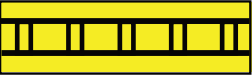 | 方向标记牌       | 盲降区域标志      | 正切盲降台的滑行道地面        | 当五边有飞机时，飞机进入此区域可能会对ILS台的信号产生影响 |
    |  | 方向标记牌       | 滑行道方位        | 滑行道一侧或两侧              | 箭头所指方向左前方的滑行道为L                             |
    |  | 位置标记牌       | 当前滑行道        | 滑行道一侧或两侧              | 当前所在滑行道为B                                         |

    # 各种常见进近灯光缩写表：

    | 名称  | 全名                                   |         翻译         |
    | ------- | ---------------------------------------- | :--------------------: |
    | PALS  | Precision Approach Light System        |   精密进近灯光系统   |
    | SFL   | Sequenced Flashing Lights              |      顺序闪光灯      |
    | VASIS | Visual Approach Slope Indicator System | 目视进近坡度指示系统 |
    | PAPI  | Precision Approach Path Indicator      |  精密进近航径指示器  |
    | HIRL  | High Intensity Runway Edge Lights      |   高强度跑道变线灯   |
    | RCLL  | Runway Centerline Lights               |      跑道中线灯      |
    | REDL  | Runway Edge Lights                     |      跑道边线灯      |
    | TDZL  | Touchdown Zone Lights                  |       接地区灯       |
    | RENL  | Runway Ending Lights                   |      跑道末端灯      |

    # 跑道标识：

    

    * 跑道入口标识（Threshold）：

      * 跑道入口标识斑马线线段数量与跑道宽度成正比，以A320可以运行的跑道宽度为例，分别对应：

        * 8条线段：跑道宽度30m
        * 12条线段：跑道宽度45m
        * 16条线段：跑道宽度60m
    * 接地区标识（Touchdown zone markings）

      * 接地区标识分两种，如下图：
      * 
      * 左图第一段标识只有单独线段，呈左右对称分部于道面，代表跑道总长度不超过2400m
      * 右图第一段为三条线段成为一组，呈左右对称分部于道面，代表跑道总长度超过2400m
      * 如最上示例图所示，接地区标识可以用作测距，在飞机进行滑跑减速的过程中，可以通过对侧跑道的接地区标识进行剩余距离的估算
    * 跑道内移标志：参考下图

      * 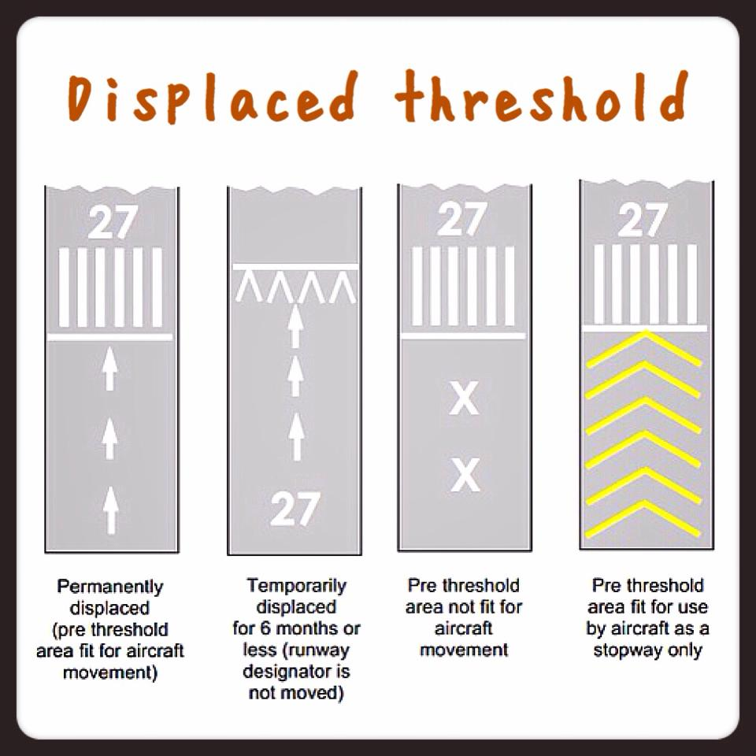
      * 图一为永久性跑道内移，机组可以使用该距离进行滑跑或起飞，但是禁止用于落地
      * 图二为临时性跑道内移，机组可以使用该距离进行滑跑或起飞，但是禁止用于落地，其跑道数字标识可能没有更改或移除
      * 图三为跑道内移，机组禁止使用
      * 图四为跑道内移，机组禁止使用其起飞或落地，仅用于对侧跑道落地后进行减速滑跑

    # 跑道灯光与跑道距离的关系：

    #### 跑道边线灯：

    跑道边线灯的灯距根据机场的不同而有所不同，如果需要使用数灯的方式来确定是否符合起飞或落地标准，应查阅相关机场的机场细则获取跑道边线灯灯距信息。

    从起飞一侧观察，跑道末端的600m或跑道长度的三分之一（二者取其小值）这一段的跑道边灯显示**黄色**。

    #### 跑道中线灯：

    所有执行精密进近的机场都需要安装跑道中线灯。

    这些灯的灯距通常以5米、7米、15米或30米的纵向间隔均匀排列，如果需要使用数灯的方式来确定是否符合起飞或落地标准，应查阅相关机场的机场细则获取跑道边线灯灯距信息。

    从跑道入口到离跑道末端900米处，跑道灯光为**白色**；由距跑道末端900米处到离跑道末端300米处，是**红色**与可变**白色**相间；由离跑道末端300米处直到跑道末端为**红色**。

[^47]: # MEL的使用

    # **MEL的性质：**

    MEL全称为Minimum Equipment List，即最低设备清单，是基于MMEL（Master Equipment List）进行客户化定制后的放行标准

    各公司的MEL依据中国民用航空局批准（或认可的A320主最低设备清单制定，充分考虑了公司具体航空器的构型（包括选装设备）、运行条件、维修条件、所飞航路设备和中国民用航空规章的有关要求

    设计MEL的目的并非不意味看可以偏离任何适用的飞行手册、适航指令或者局方的任何其他强制要求，而是允许飞机在一定时间内带有不工作的系统、功能或设备参加运行，直到恢复到正常工作标准，从而增强飞机的经济性和易用性，即便如此，维护措施也应该在最早可能进行的时机进行

    公司最低设备清单的条件和限制不代表解除由机长判断航空器在某些MEL允许不工作的情况是否能安全运行的决定，最低设备清单的规定仅适用于航空器开始飞行以前。任何对于在开始飞行以后出现故障或者不工作情况是否继续飞行的决定，必须基于飞行机组的判断和飞行技术。在适用的情况下，机长可以参考和使用MEL来继续飞行

    公司最低设备清单经局方批准后，在通过相应的操作程序、维修程序或者运行限制能够保持可接受的安全水平的情况下，允许在某些设备项目不工作时签派或者放行航空器进行取酬、调机或者训练飞行，而将其功能转移到其他工作部件或者参考其它仪表或部件提供要求的信息

    注意，MEL的使用仅适用于飞机本身的设备，如果出现航空器的机体或发动机部件缺失的情况，应该参照公司的最低构型清单CDL（Configuration Deviation List）

    # **MEL的使用：**

    * MEL默认航空器的机翼、方向舵、襟翼、发动机、起落架等关键设备在飞行情况下是必须正常工作的，因此没有在内特定编写与这些相关内容的条目，但是

    #### 签派或放行规则：

    * 根据具体条件，机长可以根据具体条件，提出高于MEL放行标准的要求，如：

      * 某段航程长达5小时，飞机AP故障，根据MEL可以放行，单要求全程手动飞行，出于驾驶舱精力分配的考虑，机长可以拒绝放行
    * MEL不能考虑到所有复合故障的情况，因此，在进行放行前，应该考虑放行多个MEL后，多个故障是否存在关联，是否会降低飞行的安全系数，或者增加机组的工作负荷，同时还应该考虑相关设备对于运行当前航线的航路、天气等是否存在影响

    #### 维修规则：

    * 维修部门应该在可能的情况下尽快对航空器存在的故障进行修复和检测，如无法完全排除故障，需要依据MEL放行时，应该尽早通知机长
    * 在任何情况下，使用MEL放行应该满足以下内容：

      * 飞行记录本上应当包括不工作设备项目的详细说明，对飞行机组的具体建议，如必要，还包括已采取的维修措施的信息
      * 如果机组在飞行中可能使用相关设备，与不工作组件或者部件有关的设备应当清晰地挂牌
      * 如果疏忽的操作可能产生危害，为了避免机组误操作，相关的设备项目必须按照相应的维修程序实际解除工作
      * 有具体的手册能够进行MEL放行相关程序的查询

    #### 修复期限：

    * MEL对于不工作设备有严格的修复期限的上限，如下：

      * A类：没有规定标准的期限，但此类应当按照本最低设备清单“备注和例外”规定的限制内完成修复工作。当规定了时间段时，应当以发现次日当地时间00:01时开始计算
      * B类：此类项目应在3个连续的日历日（72小时）内完成修复工作，不包括发现当日
      * C类：此类项目应在10个连续的日历日（240小时）内完成修复工作，不包括发现当日
      * D类：此类项目应在120个连续的日历日（2880小时）内完成修复工作，不包括发现当日

    #### 进行的工作：

    * MEL中的“O”项目：

      * 由机组参考手册完成的内容
    * MEL中的“M”项：

      * 由机务完成的内容

    # **Q & A：**

    * 哪些情况需要使用MEL查询放行标准？

      * 在飞行前，由公司机务或签派、放行告之飞机存在保留
      * 进入驾驶舱后，发现之前的机组有在飞行记录本上填写故障记录
      * 在驾驶舱准备过程中，通过RECALL按钮发现故障
    * 在航空器靠自动力移动后，飞机在法律上即进入了飞行状态，当飞机在滑行期间出现故障，是否需要使用MEL？

      * 根据"MEL的性质："[^48]中提到的，`任何对于在开始飞行以后出现故障或者不工作情况是否继续飞行的决定，必须基于飞行机组的判断和飞行技术`。因此，机组应该根据MEL中，对于该故障的描述以及保留后的产生的影响来进行决策，由于各公司规定不同，某些公司要求在地面一旦出现非MEL保留的故障后就应该立刻滑回，而某些公司则将决定权交由机长，一旦机长根据MEL，判断该故障可能会影响到后续的飞行安全裕度或增加驾驶舱工作负荷，则可以根据上文中"签派或放行规则："[^49]所提到的，使用机长权力，提高放行标准。换言之，从理论上来讲，如果有必要，机组不光是在滑行过程中，而是在整个飞行过程中都有权力依据MEL内容来判断飞机是否适航，从而进行继续飞行、备降或返场的决策

[^48]: # **MEL的性质：**

    MEL全称为Minimum Equipment List，即最低设备清单，是基于MMEL（Master Equipment List）进行客户化定制后的放行标准

    各公司的MEL依据中国民用航空局批准（或认可的A320主最低设备清单制定，充分考虑了公司具体航空器的构型（包括选装设备）、运行条件、维修条件、所飞航路设备和中国民用航空规章的有关要求

    设计MEL的目的并非不意味看可以偏离任何适用的飞行手册、适航指令或者局方的任何其他强制要求，而是允许飞机在一定时间内带有不工作的系统、功能或设备参加运行，直到恢复到正常工作标准，从而增强飞机的经济性和易用性，即便如此，维护措施也应该在最早可能进行的时机进行

    公司最低设备清单的条件和限制不代表解除由机长判断航空器在某些MEL允许不工作的情况是否能安全运行的决定，最低设备清单的规定仅适用于航空器开始飞行以前。任何对于在开始飞行以后出现故障或者不工作情况是否继续飞行的决定，必须基于飞行机组的判断和飞行技术。在适用的情况下，机长可以参考和使用MEL来继续飞行

    公司最低设备清单经局方批准后，在通过相应的操作程序、维修程序或者运行限制能够保持可接受的安全水平的情况下，允许在某些设备项目不工作时签派或者放行航空器进行取酬、调机或者训练飞行，而将其功能转移到其他工作部件或者参考其它仪表或部件提供要求的信息

    注意，MEL的使用仅适用于飞机本身的设备，如果出现航空器的机体或发动机部件缺失的情况，应该参照公司的最低构型清单CDL（Configuration Deviation List）

[^49]: #### 签派或放行规则：

    * 根据具体条件，机长可以根据具体条件，提出高于MEL放行标准的要求，如：

      * 某段航程长达5小时，飞机AP故障，根据MEL可以放行，单要求全程手动飞行，出于驾驶舱精力分配的考虑，机长可以拒绝放行
    * MEL不能考虑到所有复合故障的情况，因此，在进行放行前，应该考虑放行多个MEL后，多个故障是否存在关联，是否会降低飞行的安全系数，或者增加机组的工作负荷，同时还应该考虑相关设备对于运行当前航线的航路、天气等是否存在影响

[^50]: # 减推力-减功率起飞

    # **减推力/减功率起飞：**

    在平时的运行中，往往会出现飞机的TOGA起飞功率大于实际所需要的功率的情况，在这样的情况下，减小每次起飞时候所使用的发动机功率能够有效降低发动机的损耗，从而达到降低发动机维护成本与提高发动机可靠性的目的

    为了达到这样的目的，空客公司设计了减推力起飞和减功率起飞的程序

    * 减推力起飞：

      * 减推力起飞即我们平时所说的灵活温度起飞，我们知道温度对于发动机性能能够产生影响，当我们在不需要使用对应当前温度的全推力起飞时，我们可以通过输入一个灵活温度“欺骗”发动机，使发动机仅提供当前“假定温度”所对应的最大推力，这个推力小于当前温度的最大推力，因此假定温度必须要高于当前的实际温度
      * 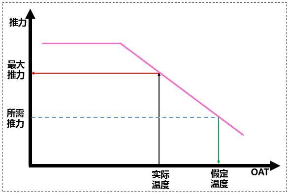
    * 减功率起飞：

      * 通过数据查询找到一个相对额定功率较低的推力，是主动将发动机功率限制住，减额定功率把发动机的整体推力变小。同一温度下，发动机的推力比全推力的情况下变小
      * 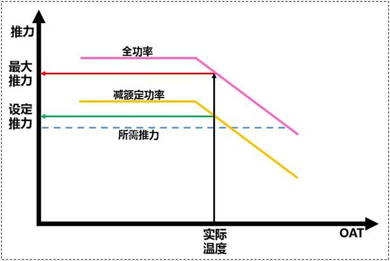

    通过两者的原理对比可知，虽然两者的最终目的都是减小发动机的推力，但是灵活温度起飞是通过利用“假定温度”欺骗FADEC，让FADEC提供一个对应当前“假定温度”的“最大推力”，而减推力起飞这是从整体上通过FADEC限制发动机的推力输出

    # **减推力/减功率起飞的对比：**

    * 推力的灵活性：

      * 减推力起飞在起飞过程中如果认为有必要，可以随时利用TOGA方式使用当前飞机能够提供的最大推力
      * 减功率起飞在起飞过程中，由于已经计算了所有的不利影响，在飞机达到F速度之前，除非出现了"GPWS及EGPWS"[^51]警告或"风切变及前方风切变"[^52]警告，都不允许使用TOGA推力
    * 对Vmcg的影响：

      * 首先我们要理解什么是V~mcg~，V~mcg~（地面最小操纵速度）在CCAR-25适航性标准中的定义是：飞机在跑道上滑跑过程中一发失效，另一侧完好发动机的推力会将飞机推向一边，飞行员通过操纵方向舵偏转与空气相互作用，可以使飞机恢复至与跑道中线平行的方向继续滑跑的最小速度，这里提出的要求有以下四点：

        * V~mcg~必须小于V~1~，否则飞机会无法进行控制
        * 通过方向舵与空气的互相作用来控制飞机方向，而非前轮转弯
        * 飞机机翼保持水平，保持原本的滑行方向，从单发失效丢失滑跑方向至恢复滑跑方向，飞机与原线路发生的偏移不超过9米，即30ft
        * 在进行V~mcg~计算时，必须使用最保守的计算方式来确定
      * 在明确了V~mcg~的定义后，我们可以知道，当V~mcg~越大，飞机在出现了地面单发后方向控制的难度也就越大，我们再进行两种起飞方式的对比：

        * 减推力起飞，由于发动机提供的是“假定温度”下的最大推力，因此一旦出现单发，由于发动机推力不平衡造成的偏转会存在，V~mcg~没有改变
        * 减功率起飞，由于限定了发动机产生的推力，因此一旦出现单发，发动机推力造成的不平衡会变小，V~mcg~会变小
    * 污染跑道：

      * 减推力起飞的性能计算急于非污染跑道的性能计算，因此在污染跑道上不能进行减推力起飞
      * 减功率起飞的性能计算考虑了所有的外界环境因素，因此可以在污染跑道上使用减推力起飞

    | 条件                             | 减推力起飞 | 减功率起飞 |
    | ---------------------------------- | ------------ | ------------ |
    | 起飞过程中能否随时增加推力到TOGA | 是         | 否         |
    | 是否减小V~mcg~                  | 否         | 是         |
    | 是否可以在污染跑道起飞           | 否         | 是         |

    由于国内使用的跑道普遍较长，V~mcg~的影响有限，污染跑道运行实例也较为罕见，因此在国内运行时，各家航空公司在运行和进行飞行员培训时都倾向于使用减推力起飞的程序，使用的飞机使用的也是减推力起飞的飞机，同时，空客规定不允许同时使用减推力和减功率起飞。在进行减推力起飞的过程中，主要涉及到两个方面的查询：

    # "最大起飞重量的查询"[^58]

    # "灵活温度的查询"[^59]

[^51]: # GPWS及EGPWS

    标签：#记忆项目#

    # **现象：**

    #### 警戒阶段：

    | 音响警告        | 视觉现象                                                                                                                                            | 含义        |
    | ----------------- | ----------------------------------------------------------------------------------------------------------------------------------------------------- | ------------- |
    | TERRAIN TERRAIN | ND显示琥珀色**TERR TERRAIN**，**GPWS**按钮指示灯亮  | 地形 地形   |
    | TOO LOW TERRAIN | ND显示琥珀色**TOO LOW TERR**，**GWPS**按钮指示灯亮  | 太低 地形   |
    | TERRAIN AHEAD   | ND显示琥珀色**TERR AHEAD**，**GWPS**按钮指示灯亮    | 前方地形    |
    | OBSTACLE AHEAD  | ND显示琥珀色**OBST AHEAD**，**GPWS**按钮指示灯亮    | 前方障碍物  |
    | SINK RATE       | ND显示琥珀色**SINK RATE**，**GPWS**按钮指示灯亮     | 下沉率      |
    | DON'T SINK      | ND显示琥珀色**DON'T SINK**，**GPWS**按钮指示灯亮    | 不要下沉    |
    | TOO LOW GEAR    | ND显示琥珀色**TOO LOW GEAR**，**GWPS**按钮指示灯亮  | 太低 起落架 |
    | TOO LOW FLAPS   | ND显示琥珀色**TOO LOW FLAPS**，**GWPS**按钮指示灯亮 | 太低 襟翼   |
    | GLIDE SLOPE     | ND显示琥珀色**GLID ESLOPE**，**GWPS**按钮指示灯亮   | 下滑道      |

    

    当GPWS警戒出现后，如机组未进行及时修正，所有的**警戒**信号也可以恶化为**警告**信号。

    #### 警告阶段：

    | 音响警告               | 视觉现象                                                                                                                                   | 含义            |
    | ------------------------ | -------------------------------------------------------------------------------------------------------------------------------------------- | ----------------- |
    | PULL UP                | ND显示红色**PULL UP**, **PULL UP**钮指示灯亮 | 拉升            |
    | TERRAIN AHEAD PULL UP  | ND显示红色**PULL UP**，**PULL UP**钮指示灯亮 | 前方地形 拉升   |
    | OBSTACAL AHEAD PULL UP | ND显示红色**PULL UP**，**PULL UP**钮指示灯亮 | 前方障碍物 拉升 |

    

    对于安装了新型EGPWS的机型，EGPWS会主动在机组两侧的ND上显示**TERRAIN**信息，在完成记忆项目后，机组需要主动按需关闭ND的**TERR**功能。

    # **程序：**

    #### 原因：

    在进行程序的记忆之前，我们首先要理解GPWS的警戒和警告的分类。所有的警戒和警告的分类，我们都大体上可以从四个根本原因上进行归类：

    1. <kbd>方向</kbd>原因，飞机在朝着有地形的方向接近，通常调整方向或者获取高度即可以消除警戒或警告；
    2. <kbd>高度</kbd>原因，飞机目前的方向正确，但是高度过低，需要获取高度以消除警戒或警告；
    3. <kbd>下降率</kbd>原因，飞目前的方向正确，高度在正常包线范围之内，但是下降率过大，触发近地警告；
    4. <kbd>构型</kbd>原因，飞机目前方向正确，高度正确，下降率正常，但是系统探测到飞机没有做好着陆准备

    而方向、高度、下降率三种原因都可以通过获取高度的方式来消除警告或警戒。

    | 方向原因                                                            | 高度原因                                                                  | 下降率原因                                                      |                             构型原因                             |
    | --------------------------------------------------------------------- | --------------------------------------------------------------------------- | ----------------------------------------------------------------- | :-----------------------------------------------------------------: |
    | **TERRAIN TERRAIN** | **TERRAIN TERRAIN**       | **SINK RATE**   | **TOO LOW GEAR** |
    | **TERRAIN AHEAD**   | **TOO LOW TERRAIN**       | **DON'T SINK**  | **TOO LOW FLAPS** |
    | **OBSTACLE AHEAD**  | **TERRAIN AHEAD**         | **GLIDE SLOPE** |                                                                  |
    |                                                                     | **OBSTACLE AHEAD**        |                                                                 |                                                                  |
    |                                                                     | **TERRAIN AHEAD PULL UP**  |                                                                 |                                                                  |
    |                                                                     | **OBSTACAL AHEAD PULL UP** |                                                                 |                                                                  |

    #### 动作：

    在IMC条件下，如果由于下降率过大而造成警戒或警告，说明飞机可以通过调整俯仰和推力的方式消除警告：

    * 调整俯仰和推力，使警报停止。
    * 当高度低于500AGL时，考虑复飞，参考"中止进近、复飞、中断着陆"[^26]

    在IMC条件下，如果由于方向或高度原因造成的警戒，说明飞机可以通过获取高度或调整方向的方式来消除警告，并且无论当前性质是警戒还是警告，高度的损失意味着可控撞地风险的增加，时间窗口尤为重要，因此必须毫不犹豫执行动作：

    * AP断开
    * 带杆到底
    * 推力手柄TOGA
    * 减速板检查收回
    * 坡度水平或调整
    * 不要改变飞机构型，直至越过障碍物

    无论在IMC或VMC条件下，如果由于构型原因造成警戒或警告，说明机组在进近过程中没有做好准备，不具备继续进近的条件，因此需要复飞，机组动作：

    * 复飞，参考"复飞程序："[^29]

    在VMC条件下，并且确认飞机没有可控撞地风险且负荷稳定进近的定义（参考："稳定进近"[^39]）；或在执行运营人设计的特殊程序时；或在有意低于下滑道时，飞行机组可以：

    * 将GPWS警告视为假警告，或
    * 目视调整飞行轨迹以消除警报，或
    * 关闭G/S方式

    # **容易出现的问题：**

    * 花太多时间判断当前警告的性质而不第一时间进行修正
    * 执行记忆项目动作不彻底，不推TOGA
    * 执行记忆项目动作不撤离，害怕过大的俯仰输入，不带杆到底
    * 习惯性用复飞动作进行记忆项目，在警告没有消除的情况下改变飞机构型

    # GPWS演示案例：

    <iframe src="https://player.bilibili.com/player.html?bvid=BV1dv411w7zb&amp;page=1&amp;high_quality=1&amp;as_wide=1&amp;allowfullscreen=true" data-src="//player.bilibili.com/player.html?aid=292996383&amp;bvid=BV13f4y1n7uh&amp;cid=408431792&amp;page=1" scrolling="no" border="0" frameborder="no" framespacing="0" allowfullscreen="true" sandbox="allow-top-navigation-by-user-activation allow-same-origin allow-forms allow-scripts allow-popups" style="height: 360px; width: 640px;"></iframe>

[^52]: # 风切变及前方风切变

    标签：#记忆项目#、#能量管理#

    # **风切变的解释：**

    #### **风切变形成的因素：**

    风切变可以形成在空中的任何高度，大气中不同两点之间的风速或风向的剧烈变化都可以称为风切变。但是对于民航飞机来说，最能形成风险的是高度低于1500ft的**低空风切变**，形成风切变的原因有很多，如：雷暴，锋面，逆温层，地形，机场附近的风力发电机，甚至五边上的帆船。最严重的风切变出现时往往还存在中到强程度的降水。

    #### **风切变的原理与影响：**

    风切变主要是由冷气轴引起，就像一个正在向下移动的宽度在0.5 NM至1.5 NM之间的圆柱。当空气接触地面时：

    * 它在水平方向产生一个蘑菇状的气流，引起水平风梯度；
    * 它在边缘处向内侧卷曲，引起垂直气团的运动。

    由此我们可以得知，当飞机在遭遇风切变时：

    * 水平风梯度严重影响升力，导致飞机下降或者达到非常大的迎角
    * 垂直气团的运动会严重影响着飞机飞行轨迹。

     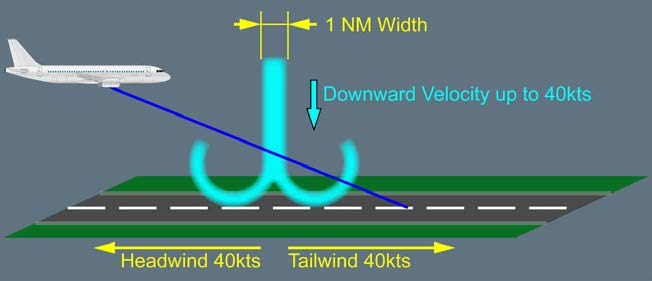

    

    # **风切变的识别：**

    * 预测式风切变探测警告
    * 反应式风切变探测警告

    同时，我们应当了解，预测式风切变和反应式风切变探测并不能探测出所有的风切变，因此根据局方的定义，飞行员还应该进行人工判断，尤其是判断出严重低空风切变时，机组应该立刻根据记忆项目采取行动，判断的依据包括：

    * 空速的突然变化±15kt
    * 垂直速度的突然变化±500ft
    * 俯仰姿态突然变化±5°
    * 下滑道突然偏差±1个点（进近阶段）
    * 推力较长时间不正常（进近阶段）

    注意，风切变可以出现在大气中的任何高度和位置，而在离地50ft以下时，空客的风切变探测系统告警会被抑制，因此离地高度小于50ft时，即便遭遇风切变也不会有任何提醒。起飞过程中，当空速大于100kt时，风切变探测系统告警被抑制。

    # **前方风切变：**

    #### **预测式风切变探测工作的条件：**

    * PWS电门在AUTO位
    * 无线电高度低于2300ft
    * 雷达系统电门在1或2或OFF位
    * 至少一台发动机在工作
    * 地速大于30kt或纵向加速度在至少0.5s内大于给定的临界值

    注：如果安装了两部气象雷达，当选择的气象雷达失效时，飞行机组可以用雷达控制面板上的雷达电门选择工作的系统来恢复 PWS 功能。   

    #### **前方风切变的现象：**

    * 起飞阶段警告：

      * 驾驶舱响起语音警告“**WINDSHEAR AHEAD**”
      * PFD上出现红色“**W/S AHEAD**”字样
      * ND上出现预测式风切变显示的前方5NM范围内的风切变

    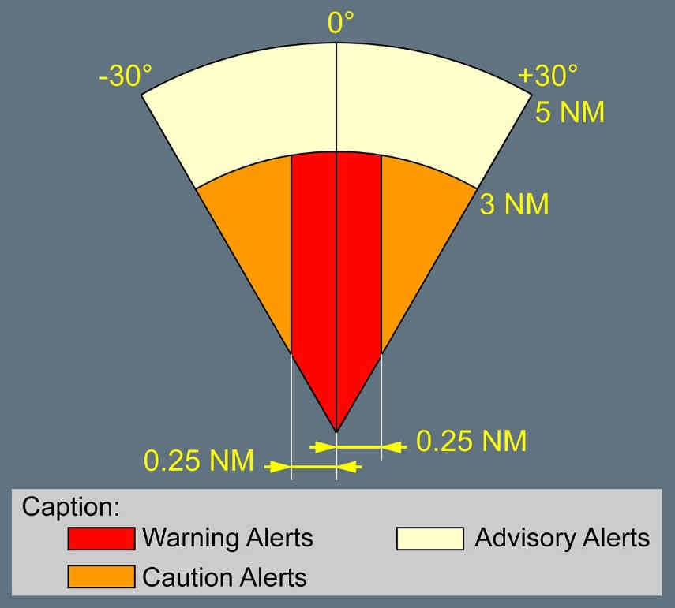

    * 进近阶段警告：

      * 驾驶舱响起语音警告“**GO AROUND,** **WINDSHEAR AHEAD**”
      * ND上出现红色“**W/S AHEAD**”字样
      * ND上出现预测式风切变显示的前方5NM范围内的风切变

    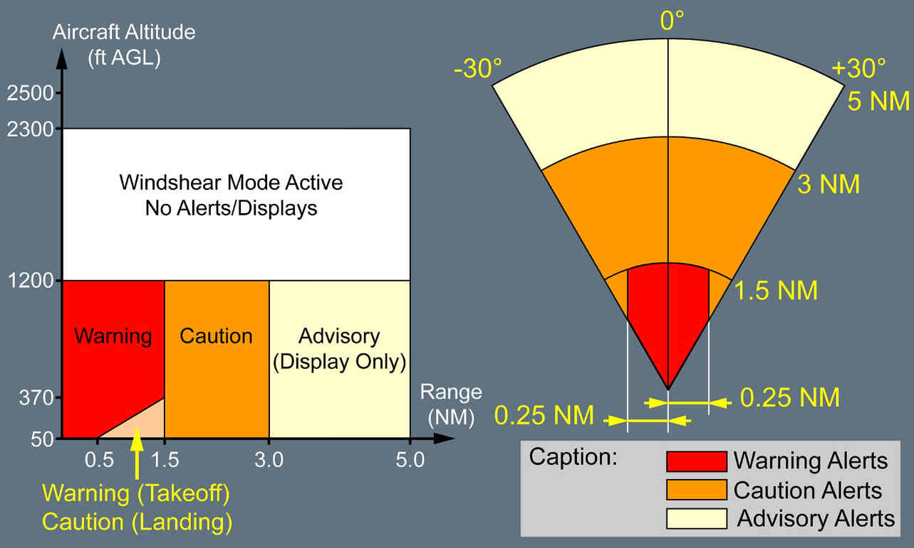

    * 警戒：

      * 驾驶舱响起语音警戒“**MONITOR RADAR DISPLAY**”
      * ND上出现琥珀色“**W/S AHEAD**”字样
      * ND上出现预测式风切变显示的前方5NM范围内的风切变

      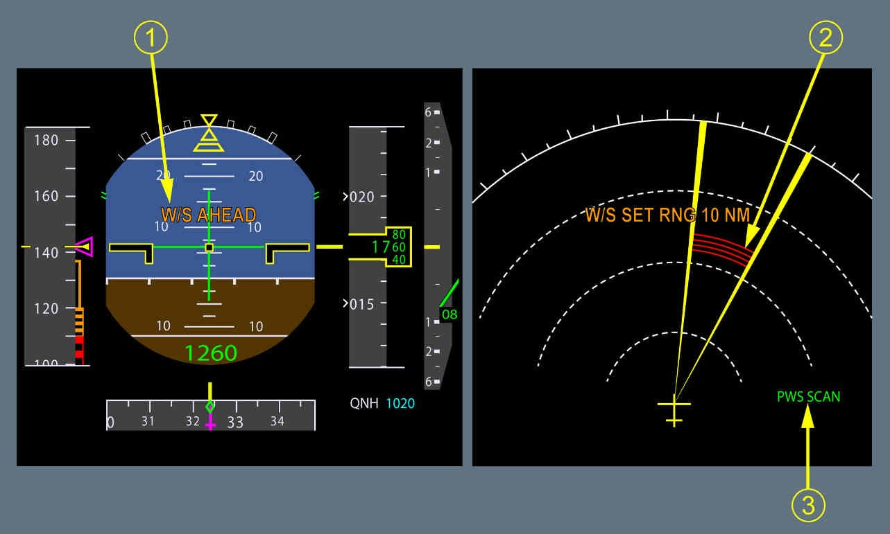
    * 咨询：

      * ND上出现预测式风切变显示的前方5NM范围内的风切变

    注：最后进近期间，在 370 ftAGL 和 50 ftAGL之间且范围在 1.5 NM和 0.5 NM之间时，目视和音响警告警报降级至警戒警报。  

    #### **前方风切变的程序：**

    * 起飞前：

      * 延迟起飞，或者选择有利跑道
    * 起飞滑跑过程中：

      * 中断起飞
    * 升空时：

      * 推力手柄TOGA（在进入风切变之前都可以改变形态，因此按照正常起飞程序收轮收襟翼）
      * AP如果接通，保持ON（在进入风切变之前，可以根据"自动驾驶："[^53]限制接通AP）
      * 跟随SRS
      * 如果进入风切变，参考"风切变改出的程序："[^54]

    * 进近时：

      * 中止进近
    * 着陆时：

      * 复飞
      * AP如果接通，保持ON

    参考"风切变改出的程序："[^54]

    # **风切变：**

    #### **风切变的现象：**

    参考"风切变的识别："[^55]

    #### **风切变改出的程序：**

    * 起飞时：

      * 如果在V1前识别出风切变，中断起飞

    * V1后、爬升、着陆阶段：

      * 当机组成员发现风向风速急速改变时，喊出“风向风速不稳定，疑似风切变”
      * PF宣布“风切变，我操纵，保持构型”
      * 推力手柄TOGA
      * 保持当前AP的状态
      * 跟随SRS
      * 如飞机正在转弯，拔出航向
      * 检查减速板收起

    > **注意：**
    >
    > 如有必要，PF可以带杆到底。
    >
    > 当迎角值大于α prot，AP将自动断开。
    >
    > 如果没有FD，则保持俯仰至17.5°。
    >
    > 在进入风切变后，PM应该主动报出风向风速以及飞机的状态，如：“顺风50kt增加，速度减小，下降率-500”。
    >
    > 在风向风速逐渐稳定后，PM报出“风向风速稳定”。
    >
    > PM应该在有条件的情况下尽快报告ATC，防止后续飞机进入风切变，如脱离风切变后突破了目标高度，应及时通知ATC并且申请新的高度指令。
    >

    * 风切变脱离后：

      * 如未收起落架，收起落架
      * 使用俯仰控制好飞机的速度，不进入红区
      * 在TOGA位置断开自动推力
      * 接通A-THR
      * 当飞机速度有上升趋势时，将推力手柄收回至CLIMB位
      * 正常收形态。

    # **容易出现的问题：**

    * 不敢进行大量的侧杆输入，导致无法及时跟随SRS
    * 俯仰输入过程中带坡度
    * 如飞机正在转弯，不拔出航向，机翼未改平
    * 如在进近过程中遭遇风切变，未检查减速板收起
    * 认为飞机抖动减小且速度上升既是脱离风切变，不证实当前风速风向是否确实稳定
    * 速度快速上升时试图通过收推力的方式来控制空速
    * 速度快速上升时不使用俯仰来控制空速，导致超速
    * 进近过程中遭遇风切变习惯性正上升后收轮
    * PM在进入风切变后第一时间急于联系ATC，而忽略监控当前飞机状态

    ---

    # **补充程序：**

    在极其特殊的情况下，飞机在滑跑过程中遭遇风切变时速度无法达到Vr，在这种情况下，机组不应该考虑中断起飞，而应该在距离跑道末端约2000ft处开始抬轮。

    判断飞机相对于跑道的位置，可以使用跑道灯光系统进行判断，具体请参考："跑道标识："[^56]与"跑道灯光与跑道距离的关系："[^57]。

    # 风切变及前方风切变演示案例：

    <iframe src="https://player.bilibili.com/player.html?bvid=BV1T64y1a7BJ&amp;page=1&amp;high_quality=1&amp;as_wide=1&amp;allowfullscreen=true" data-src="//player.bilibili.com/player.html?aid=420412391&amp;bvid=BV1J3411q7YF&amp;cid=408428853&amp;page=1" scrolling="no" border="0" frameborder="no" framespacing="0" allowfullscreen="true" sandbox="allow-top-navigation-by-user-activation allow-same-origin allow-forms allow-scripts allow-popups" style="height: 360px; width: 640px;"></iframe>

[^53]: #### 自动驾驶：

    | 状态                                              | 最低条件                   |
    | --------------------------------------------------- | ---------------------------- |
    | 起飞时                                            | 100ft（AGL）且离地至少5秒  |
    | 在使用FINAL APP，V/S或FPA模式的进近中             | 250ft (AGL)                |
    | 盘旋进近                                          | 500ft（AGL）               |
    | 在 ILS进近中，若FMA上未显示CAT 2或CAT 3能力      | 160ft（AGL）               |
    | 在 ILS 进近中， 当FMA上显示 CAT 2或 CAT 3能力时  | 参考CAT II/CAT III运行     |
    | 在PAR精密雷达进近或对等的进近中                  | 250ft（AGL）               |
    | 人工复飞后 在所有其它飞行阶段                   | 100ft (AGL) 500ft （AGL） |

[^54]: #### **风切变改出的程序：**

    * 起飞时：

      * 如果在V1前识别出风切变，中断起飞

    * V1后、爬升、着陆阶段：

      * 当机组成员发现风向风速急速改变时，喊出“风向风速不稳定，疑似风切变”
      * PF宣布“风切变，我操纵，保持构型”
      * 推力手柄TOGA
      * 保持当前AP的状态
      * 跟随SRS
      * 如飞机正在转弯，拔出航向
      * 检查减速板收起

    > **注意：**
    >
    > 如有必要，PF可以带杆到底。
    >
    > 当迎角值大于α prot，AP将自动断开。
    >
    > 如果没有FD，则保持俯仰至17.5°。
    >
    > 在进入风切变后，PM应该主动报出风向风速以及飞机的状态，如：“顺风50kt增加，速度减小，下降率-500”。
    >
    > 在风向风速逐渐稳定后，PM报出“风向风速稳定”。
    >
    > PM应该在有条件的情况下尽快报告ATC，防止后续飞机进入风切变，如脱离风切变后突破了目标高度，应及时通知ATC并且申请新的高度指令。
    >

    * 风切变脱离后：

      * 如未收起落架，收起落架
      * 使用俯仰控制好飞机的速度，不进入红区
      * 在TOGA位置断开自动推力
      * 接通A-THR
      * 当飞机速度有上升趋势时，将推力手柄收回至CLIMB位
      * 正常收形态。

[^55]: # **风切变的识别：**

    * 预测式风切变探测警告
    * 反应式风切变探测警告

    同时，我们应当了解，预测式风切变和反应式风切变探测并不能探测出所有的风切变，因此根据局方的定义，飞行员还应该进行人工判断，尤其是判断出严重低空风切变时，机组应该立刻根据记忆项目采取行动，判断的依据包括：

    * 空速的突然变化±15kt
    * 垂直速度的突然变化±500ft
    * 俯仰姿态突然变化±5°
    * 下滑道突然偏差±1个点（进近阶段）
    * 推力较长时间不正常（进近阶段）

    注意，风切变可以出现在大气中的任何高度和位置，而在离地50ft以下时，空客的风切变探测系统告警会被抑制，因此离地高度小于50ft时，即便遭遇风切变也不会有任何提醒。起飞过程中，当空速大于100kt时，风切变探测系统告警被抑制。

[^56]: # 跑道标识：

    

    * 跑道入口标识（Threshold）：

      * 跑道入口标识斑马线线段数量与跑道宽度成正比，以A320可以运行的跑道宽度为例，分别对应：

        * 8条线段：跑道宽度30m
        * 12条线段：跑道宽度45m
        * 16条线段：跑道宽度60m
    * 接地区标识（Touchdown zone markings）

      * 接地区标识分两种，如下图：
      * 
      * 左图第一段标识只有单独线段，呈左右对称分部于道面，代表跑道总长度不超过2400m
      * 右图第一段为三条线段成为一组，呈左右对称分部于道面，代表跑道总长度超过2400m
      * 如最上示例图所示，接地区标识可以用作测距，在飞机进行滑跑减速的过程中，可以通过对侧跑道的接地区标识进行剩余距离的估算
    * 跑道内移标志：参考下图

      * 
      * 图一为永久性跑道内移，机组可以使用该距离进行滑跑或起飞，但是禁止用于落地
      * 图二为临时性跑道内移，机组可以使用该距离进行滑跑或起飞，但是禁止用于落地，其跑道数字标识可能没有更改或移除
      * 图三为跑道内移，机组禁止使用
      * 图四为跑道内移，机组禁止使用其起飞或落地，仅用于对侧跑道落地后进行减速滑跑

[^57]: # 跑道灯光与跑道距离的关系：

    #### 跑道边线灯：

    跑道边线灯的灯距根据机场的不同而有所不同，如果需要使用数灯的方式来确定是否符合起飞或落地标准，应查阅相关机场的机场细则获取跑道边线灯灯距信息。

    从起飞一侧观察，跑道末端的600m或跑道长度的三分之一（二者取其小值）这一段的跑道边灯显示**黄色**。

    #### 跑道中线灯：

    所有执行精密进近的机场都需要安装跑道中线灯。

    这些灯的灯距通常以5米、7米、15米或30米的纵向间隔均匀排列，如果需要使用数灯的方式来确定是否符合起飞或落地标准，应查阅相关机场的机场细则获取跑道边线灯灯距信息。

    从跑道入口到离跑道末端900米处，跑道灯光为**白色**；由距跑道末端900米处到离跑道末端300米处，是**红色**与可变**白色**相间；由离跑道末端300米处直到跑道末端为**红色**。

[^58]: # 最大起飞重量的查询

    当飞机在温度较高的高高原地区运行时，由于飞机性能衰减较为严重，因此机组在获取舱单后必须要进行最大起飞重量的查询以确定当前飞机性能能够允许的最大起飞重量

    # 使用方法

    1. 使用基准部分确认使用对应当前跑道的起飞性能表

        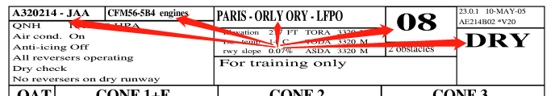
    2. 查找正文中的性能

        如使用的是温度表示法，先查找当前OAT对应的最大起飞重量是否能够起飞，如果性能满足，则在正文中查找对应起飞形态的重量

        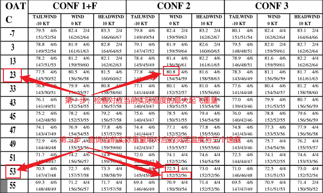

        如使用的是重量表示法，在正文中查找对应的数据，检查当前查出的灵活温度是否高于OAT，确定是否满足灵活温度起飞的条件

        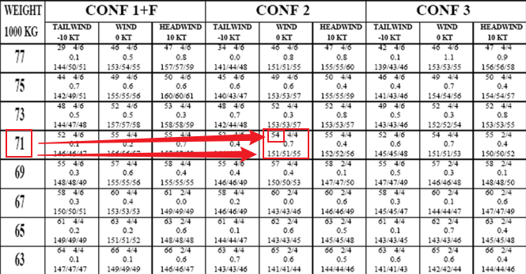
    3. 是否开防冰，如果开防冰，根据手册内容进行最大灵活温度修正，如下（以各公司手册为准）：

        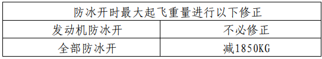
    4. 使用修正部分进行修正

        注意，在进行修正的过程中，和"灵活温度的查询"[^59]修正内容不同，在进行最大起飞重量查询时，所有数据都要进行修正

        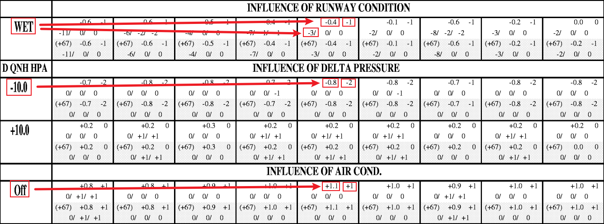

    5. 得到所有参数后，运用说明部分进行检查，必须要确定以下内容：

        * 使用当前起飞重量对比手册"7. 限制"[^37]部分当前飞机的最大起飞认证重量，取较小值
        * 得到的速度不小于Min V~1~/V~r~/V~2~的速度
    6. 最后再通过"灵活温度的查询"[^59]中的内容来确认起飞时能否使用灵活温度起飞，以及具体的灵活温度

    # 使用方法简单图示：

    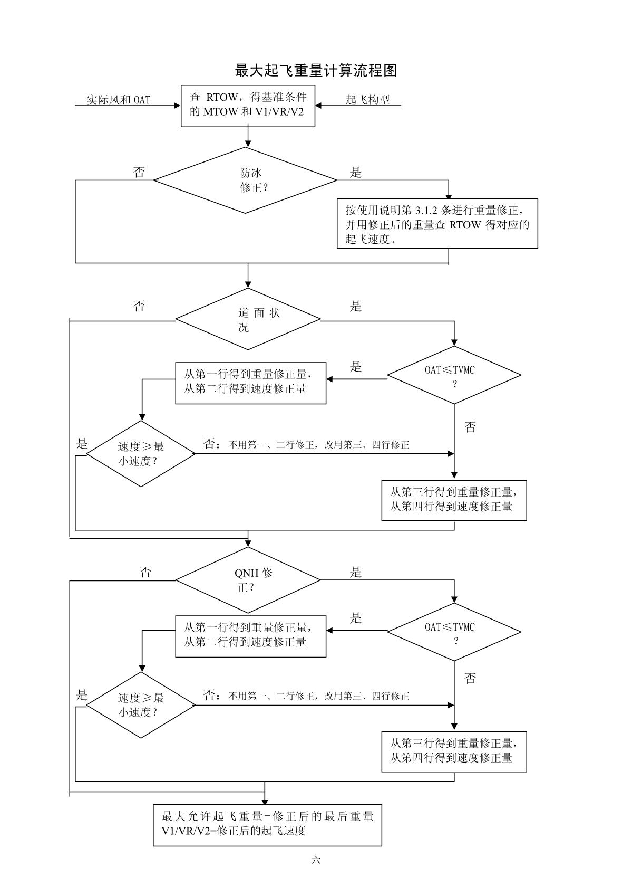

[^59]: # 灵活温度的查询

    使用灵活温度起飞的条件

    在使用灵活温度起飞前，我们必须要明确灵活温度的使用限制，在满足了以下三个条件之后才能进行减推力起飞：

    * T~Flex~（灵活温度）＞Tref（平台推力温度，起飞性能表"修正部分"[^60]阴影区查询）
    * T~Flex~（灵活温度）＞OAT（外界温度）
    * T~Flex~（灵活温度）≤T~Flex max~（最大灵活温度）

    # 使用方法

    1. 使用基准部分确认使用对应当前跑道的起飞性能表

        
    2. 查找正文中的性能

        如使用的是温度表示法，先查找当前OAT对应的最大起飞重量是否能够起飞，如果性能满足，则在正文中查找对应起飞形态的重量

        

        如使用的是重量表示法，在正文中查找对应的数据，检查当前查出的灵活温度是否高于OAT

        
    3. 是否开防冰，如果开防冰，根据手册内容进行最大灵活温度修正（如下，以各公司手册为准）：

        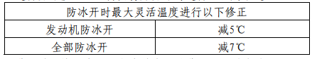
    4. 使用修正部分进行修正

        注意，和"最大起飞重量的查询"[^58]不同，在进行修正的过程中，湿跑道的修正需要进行重量、灵活温度和速度的全部修正，QNH和引气的修正只进行灵活温度的修正

        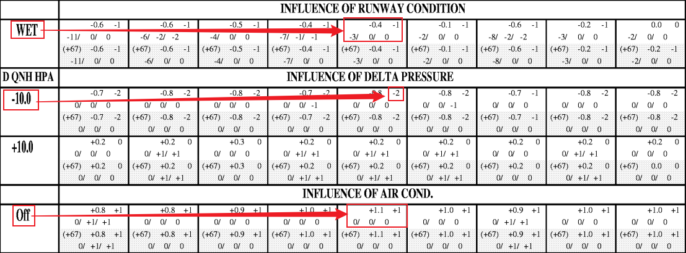

    4. 得到所有参数后，运用说明部分进行检查，必须要确定以下内容：

        * 灵活温度＞OAT
        * V~1~/V~r~/V~2~＞Min V~1~/V~r~/V~2~

        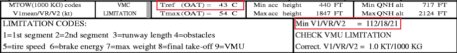

    # 使用方法简单图示

    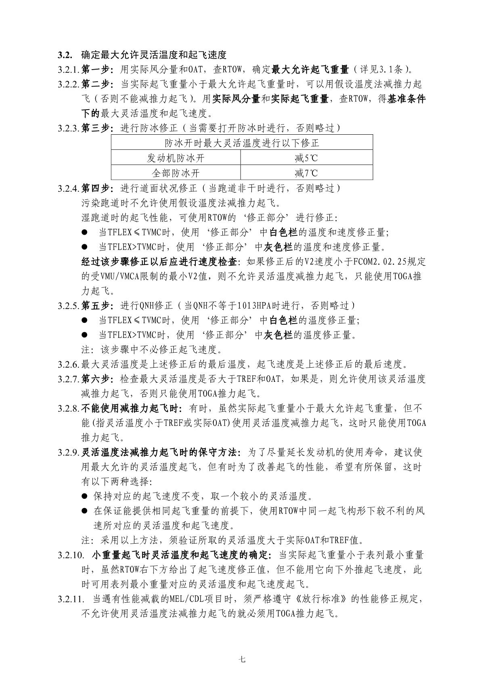

    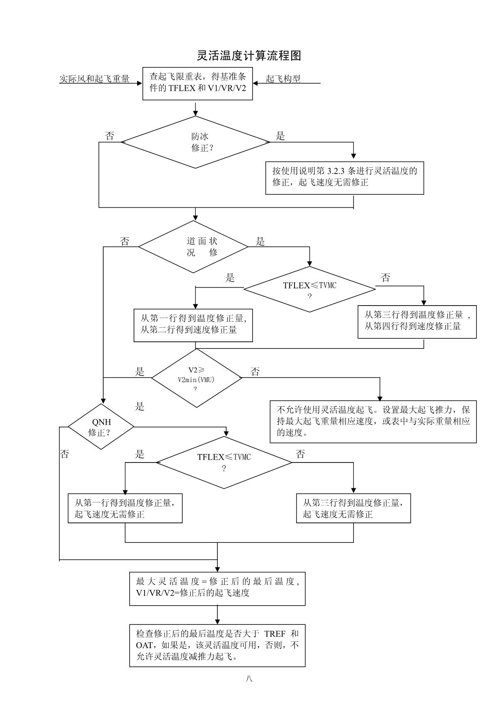

[^60]: # 修正部分

    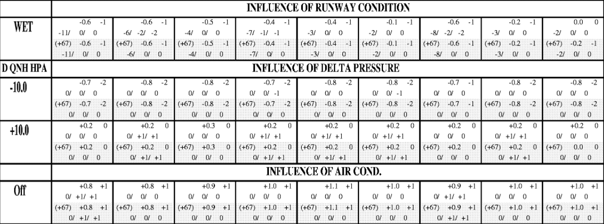

    修正部分包括了三个部分的修正：

    * 道面情况的修正
    * 修正海压的修正
    * 空调引气的修正

    修正部分会出现带灰色阴影部分，这部分适用于查询出灵活温度大于T~vmc~时的修正。T~vmc~的数据在灰色阴影部分有显示，如上图所示，阴影部分的T~vmc~以带括号的（+67）标识，这代表只有当灵活温度大于67℃时，我们才使用该部分进行修正

[^61]: # 6. 科目分析

    # 目录：

    * 🛢"燃油"[^62]
    * 🧠"记忆及机动科目"[^72]
    * 🤖"自动飞行"[^91]
    * 🚵"刹车-起落架"[^96]
    * 🗜"座舱增压"[^97]
    * 🔌"电气"[^98]
    * 🐔"发动机"[^99]
    * 🕹"飞行操纵"[^109]
    * 🩸"液压"[^111]
    * 🦮"导航"[^117]
    * 👁"监视"[^119]
    * Ⓜ"其他"[^120]
    * 🚭"烟雾、异味、电子设备烟雾处置程序"[^64]

[^62]: # 燃油

    # **科目概述：**

    对于A320系列飞机而言，燃油系统的科目都较为简单，QRH中的检查单的内容都比较直观清楚，对于唯一较为考验机组决策的是"重力供油"[^63]程序中的决策

    由于燃油系统出现故障后在短时间内对于飞机的安全与运行影响不大，因此在QRH中，涉及到关于燃油系统的科目仅有三个，包括：

    * 燃油不平衡
    * 燃油泄露
    * "重力供油"[^63]

    在进行燃油系统的讨论之前，我们首先要理解燃油系统的设计思路和供油逻辑：

    #### **设计目的：**

    燃油系统的主要作用包括：

    * 为发动机和APU供油
    * 在加油时，给油箱提供正确的燃油量和燃油导向
    * 冷却IDG
    * 减小机翼承受的载荷，减轻机翼弯曲或震颤

    #### **加油逻辑：**

    * 加油时，燃油系统会引导燃油首先进入ACT*、中央油箱（如预设加油量大于机翼油箱载量）和外侧油箱
    * 外侧油箱加满时，溢入内侧油箱

    #### **供油逻辑：**

    供油逻辑是为了完成设计目的而存在的，供油逻辑包括：

    * 内侧油箱燃油流向发动机或APU，一部分未进入燃烧室的燃油回到外侧油箱，当外侧油箱满载时，自动通过溢流管道进入内侧油箱

      * 为发动机和APU供油，未进入燃烧室的燃油对IDG有冷却作用
    * ACT 2*油箱燃油流向中央油箱
    * ACT 1*油箱燃油流向中央油箱
    * 中央油箱燃油流向内侧油箱
    * 内侧油箱将油箱内的燃油消耗到剩750kg后，外侧油箱燃油流向内侧油箱

      * 保证外侧油箱有油，减小机翼承受的载荷

    {{{col
    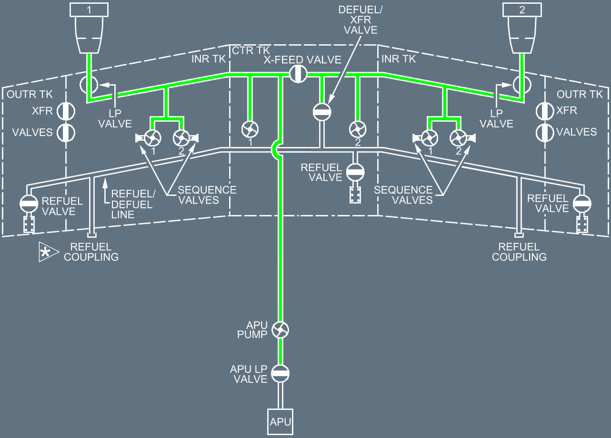

    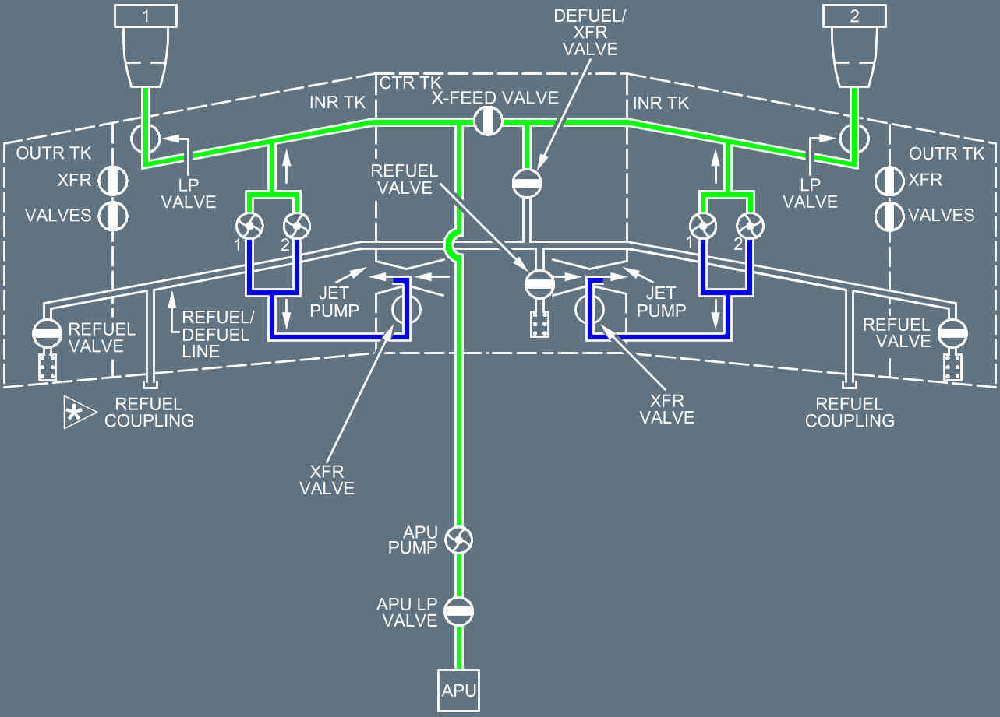

    }}}

    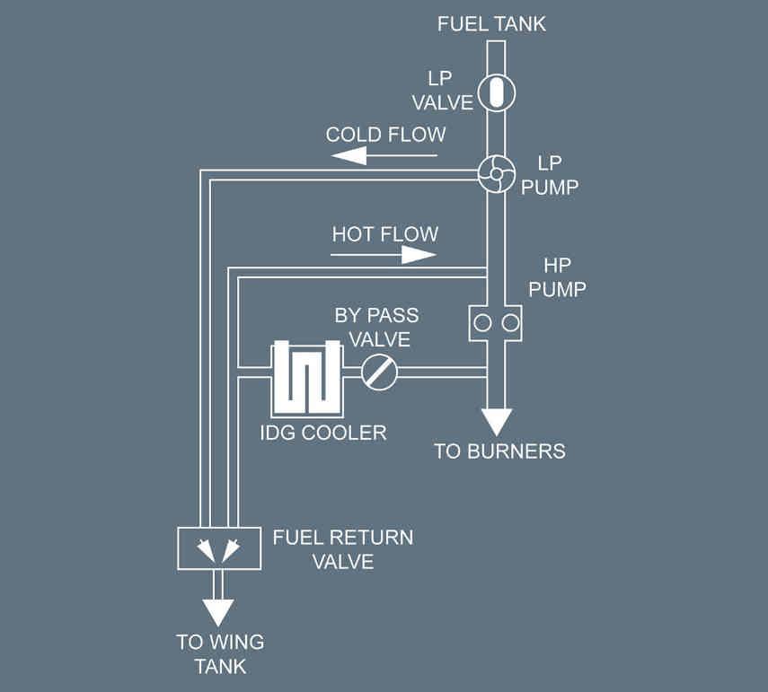

    在理解了基础供油逻辑之后，我们对于基本的一些燃油故障处置逻辑就有一个较为清晰的认知

    比如当油箱燃油温度过高或过低，除了改变飞行高度之外，还可以通过增加或减少燃油通过IDG时产生的热交换来进行处置，当我们需要更多温度时，通过增加发动机功率来达到增加IDG功率的目的，当IDG功率增加后，产生的热量被为IDG降温的燃油带回至机翼油箱，从而达到加温的目的

    而当燃油温度过高时，我们可以通过减少IDG的负载的方式，减少为IDG降温的燃油的热交换，从而达到降温的目的

    # **燃油系统需要了解的知识：**

    * 为何在出现长时间延误时，飞机在地面可能会出现燃油不平衡告警？

      * 当飞机在地面时，如果使用了APU进行供电与供气，APU的供油是来自于左内侧机翼油箱，已知APU每小时消耗燃油量约200kg左右，当延误时间过长时，APU会一直消耗燃油，最终导致FLSCU（燃油油面传感控制装置，参考"8. 缩略语快速查询表格"[^3]）探测到油面不平衡，触发警告
    * 在燃油系统章节的非正常程序里，有些程序要求判断燃油泄露，如何进行判断？

      * 最直观的方式是通过目视判断，机组可以通知乘务组进行目视观察，当发动机吊舱或翼尖出现了燃油泄露，如果出现了燃油泄漏，乘务组可以在客舱靠近发动机的舷窗处明确观察到发动机背后拉出一道白烟一样的雾化过的燃油，在雾化后的燃油有可能会通过通风管道进入飞机内部，出现异味，详情可以参考"烟雾、异味、电子设备烟雾处置程序"[^64]及"排烟、异味程序"[^67]
      * 但是没有雾化过的燃油迹象不代表飞机不存在燃油泄露，机组还应该通过飞机当前的FOB与FU相加，对比舱单上起飞时的燃油总量，如果FOB+FU之和明显小于起飞燃油总量，既说明飞机存在漏油的程序，另外，除目视观察，异味，以及燃油计算方式之外，还有以下方式来判断燃油是否存在泄露：

        * 燃油总量以不正常的速率减小
        * 燃油不平衡加剧
        * 燃油流量增大，N1偏低
        * 飞机计划页面的EFOB变为**琥珀色**
        * MCDU草稿栏出现琥珀色**DEST EFOB BELOW MIN**

    # "重力供油"[^63]程序

[^63]: # 重力供油

    # **需要重力供油时的即时现象：**

    * ECAM上同一侧机翼油箱的两个机翼油箱泵都出现燃油泵低压警戒

    # **重力供油的程序：**

    * 检查燃油泵低压的原因
    * 发动机方式选择器点火位
    * 避免负载荷
    * 根据QRH手册中的飞行高度时间与重力供油升限，向ATC申请高度
    * 完成QRH检查单重力供油部分的内容

    # **所涉及到的知识：**

    * 为什么重力供油程序要求将发动机方式选择器放在点火位？

      * 在FCOM的燃油泵1+2低压中有明确说明，在进行重力供油时，为了燃油出现剧烈的晃动而出现熄火，因此将发动机方式选择器放在点火位
    * 什么叫负载荷？如何避免负载荷？

      * 举例说明，当半瓶水放置不动时，瓶身和水承受的是1个G的重力载荷，当这半瓶水从桌上下坠时，瓶身和水所承受的载荷小于1个G，当你把这半瓶水拿在手中上下摇晃，当动作向下时，瓶子和里面的水都承受的是负载荷，水会从瓶子的下半部分移动到上半部分，由此可见负载荷对于液体的影响远大于固体的影响。燃油也是液体，如果飞机在空中进行突然剧烈的下降动作，那么飞机里的物体都有可能承受负载荷。重力供油系统依赖于重力载荷，如果失去载荷形成负载荷，那么燃油将无法进入重力供油系统，导致重力供油失效，会造成发动机失去燃油供给，因此，避免负载荷的最好方法即是在下降过程中柔和控制下降率，避免剧烈的下降动作
    * QRH中，重力供油程序提到飞行高度升限的问题：

      * 如果高度大于FL300并且飞行时间大于30分钟，保持当前高度
      * 如果高度大于FL300并且飞行时间小于30分钟，升限FL280
      * 如果高度未达到FL300，升限FL150

      那么这些条件是否可以作为我继续执行航班或是返场的依据？

      * 在当前国内的运行环境下，此类决策的倾向性还没有一个统一的标准，主要从两个角度进行考虑：

        * 正方：按照手册，当飞机满足此类性能要求的时候，是可以继续执行航班的，手册中也没有明确这类故障需要尽快落地，因此没有必要因为这类型的小故障而放弃正常航班的运行
        * 反方：我国航班运行条件较为复杂，外界影响因素影响较多，在后续执行航班过程中如果由于燃油系统故障，引发其他问题，机组可能会承担不必要的责任，另外，即便是根据手册，如果飞机还未达到FL300的高度，在下到FL150升限之后也可能出现油耗增加，而造成剩余油量紧张的情况，引发更多的问题，因此还不如尽快落地处置故障

[^64]: # 烟雾、异味、电子设备烟雾处置程序

    # **烟雾和异味的现象：**

    * ECAM出现任何烟雾警告
    * 在驾驶舱通风管中出现任何可见的烟雾
    * 乘务组报告飞机客舱中出现烟雾
    * 任何机组成员（包括乘务员）嗅到异味

    # **烟雾和异味处置的程序：**

    * 发现烟雾或异味的第一时间带上氧气面罩
    * 联系ATC，根据是否能够判明烟雾源和烟雾是否可控来决定宣布**PANPAN**或**MAYDAY**，尽快下高度（参考"快-慢速释压"[^65]程序部分）
    * 考虑就近落地
    * 执行QRH-烟雾、异味、航空电子设备烟雾程序
    * 如果烟雾已经成为最大威胁时，执行QRH-"排烟、异味程序"[^67]
    * 考虑进入"应急电气构型"[^70]
    * 落地后如果持续出现烟雾，执行"紧急撤离"[^71]程序

    # **容易出现的问题：**

    * 出现烟雾或异味后没有尽快通过烟雾源的位置能否判断及是否能够控制就宣布**MAYDAY**
    * 没有尽快下高度尽快着陆的意识
    * 和客舱机组缺乏良好的沟通
    * 在执行程序时无法很好的区分场景进行烟雾源的判断
    * 在进入了应急电气构型的情况下，落地前没有根据QRH程序重新接通发电机1和发电机2
    * 在烟雾不可控情况下，落地后，试图自行滑行或处置，延误"紧急撤离"[^71]时机

    # **烟雾、异味处置程序涉及到的知识点：**

    由于烟雾、异味的情况很难在模拟机上进行模拟，以至于绝大部分飞行员对于烟雾、异味现象的认识都比较抽象，这是一个客观上存在的问题，但是理解这套程序的设计有助于我们对实际情况进行判断和处置，我们首先要理解的是程序设计的动机和目的。

    烟雾、异味处置程序的设计目的：

    * 带上氧气面罩：

      * 保护机组安全，使机组能够有能力进行程序
    * 宣布**PANPAN**和**MAYDAY**的决策差异：

      * 在出现烟雾的第一时间宣布PANPAN，能够方便从ATC处取得下降高度的权限，在后续程序的处置过程中，是否要升级到MAYDAY，取决于能否判断烟雾源以及烟雾是否能够控制
    * 尽快下高度并且落地：

      * 烟雾和异味的出现极有可能是飞机上存在火源，尽快在地面上进行处置才是最好的选择
      * 当飞机使用了应急氧气之后，根据法规此刻的飞机处于不适航的状态，因此需要尽快落地
      * 如果后续程序中要求使用"排烟、异味程序"[^67]，低高度可以通过释压手段，利用大气内外压差把烟雾排出飞机，在执行这一程序时，只有在低高度才有足够的氧气供机上人员呼吸，而不会造成失能的情况
    * 执行QRH相关程序：

      * 根据QRH程序来确定烟雾，通过阻断空气循环来控制烟雾对飞机舱内的继续污染，同样这样做的好处还有：如果是火情引起的烟雾，由于隔离了空气循环，火的燃烧失去了化学反应源，有可能熄灭
    * 视情况执行"排烟、异味程序"[^67]：

      * 由于判断烟雾源可能占用大量的时间，烟雾的不断累积可能对飞机内部产生致命的影响，同时还会对机组的视觉造成阻碍，以至于无法正常阅读程序（可以参考本章节最后视频演示部分），是否需要触发"排烟、异味程序"[^67]，应该按照以下几个标准来进行：

        * 是否出现了燃油雾化
        * 当前的烟雾、异味是否已经造成视觉上的困难或造成人的呼吸障碍
      * 在执行"排烟、异味程序"[^67]时，可能会出现需要在执行本程序和"排烟、异味程序"[^67]程序时，不断进行反复横跳，具体内容请参考"排烟、异味程序"[^67]
    * 考虑进入"应急电气构型"[^70]：

      * 在无法确定烟雾源的情况下，只有尽可能的卸载电气设备的使用，用这种以面打点的手段来尽量避免继续出现的烟雾
    * 考虑执行"紧急撤离"[^71]程序：

      * 在落地后，根据最新的局方要求，机组和乘务组都具有发布紧急撤离的权限，如客舱反应烟雾源不可控，乘务组可以使用其权限宣布紧急撤离，但是在撤离前必须要和机组进行协同

    在以上内容中，大部分的程序都较为直观，但是该程序最大的问题在于容易出现在没有电子设备监控的情况下，因此需要进行烟雾源位置的判断，这才是该程序最耗时也是最不容易的部分

    #### **烟雾源的判断：**

    根据手册，在执行该程序时，应该分为三个阶段：

    1. 怀疑烟雾来自空调系统
    2. 怀疑烟雾来自客舱设备
    3. 怀疑烟雾来自电子设备/驾驶舱

    这三个阶段分别对应三种烟雾源，所以，对于烟雾源的判断十分重要，如果在对进行判断，执行完阶段1和阶段2的处置后依旧存在烟雾，机组再执行第3阶段的程序，而对于烟雾源的判断，我们也存在一定的技巧：

    * 对于烟雾判断最直观的，是通过ECAM警告，一旦出现了电子舱烟雾、洗手间烟雾、货舱烟雾，安装在其中的烟雾探头都会很直观的通过ECAM告知机组明确的烟雾源
    * 其次对于烟雾来源是有倾向性怀疑，比如在某个设备故障后，如已被识别的发动机故障，APU故障等，烟雾有可能是来自这些系统
    * 通过气味来进行烟雾源的判断，异味所对应的怀疑设备如下：

    | 异味描述       | 怀疑的烟雾源                           |
    | ---------------- | ---------------------------------------- |
    | 酸味           | 电气设备/机载娱乐设备 发动机漏油      |
    | 燃烧           | 电气设备 厨房设施 吸入飞鸟           |
    | 化学品味       | 污染的引气切口 APU吸入                |
    | 氯漂白剂       | 防烟罩 阻塞门区域排水管               |
    | 电气           | 电气设备                               |
    | 脏袜子         | APU或发动机漏油                        |
    | 排泄物         | 卫生间                                 |
    | 燃油           | APU FCU/燃油管路                       |
    | 滑油           | 发动机或APU滑油泄漏                    |
    | 特种液压工作油 | 发动机液压                             |
    | 硫磺           | 接线板 航空电子设备过滤水污染 电灯泡 |

    #### **其他涉及的问题：**

    * 紧急下降程序（参考："快-慢速释压"[^65]）完成后，机组是否还要取掉氧气面罩？

      * 这取决于当前烟雾是否消失，或是否执行了"排烟、异味程序"[^67]，如果当前驾驶舱内的烟雾依旧很浓烈，贸然取下氧气面罩可能会导致机组的身体不适，而一直佩带氧气面罩，则需要考虑氧气面罩的供氧时间，如果机组供氧的氧气量过低还一直佩带氧气面罩，则有可能会造成机组缺氧而导致失能
    * 当出现了只有气味但是没有ECAM的情况，是否需要进行本程序？

      * 当出现了只有气味，但是没有ECAM的情况，应该优先使用QRH进行程序，参考程序设计中"3.3 非正常和紧急程序"[^18]中的设计逻辑，执行程序的优先顺序应该为：

        * 记忆项目
        * OEB记忆动作
        * ECAM
        * QRH
        * FCOM
        * OEB处理

        在没有前三项的情况下，我们应该考虑以QRH优先执行程序
    * 烟雾、异味程序在检查中容易出现的重难点：

      * 在训练过程中，教员或检查员通常会使用一定的干扰手段检验机组对于程序的掌握情况，主要手段是通过模拟乘务组不断的反馈客舱烟雾浓重，对本程序进行干扰，不断的诱导机组重复性的执行"排烟、异味程序"[^67]，在这样的情况下，机组应该通知乘务长，已经在进行排烟程序，要求乘务长暂停对于驾驶舱的打扰，等待广播或通知即可，这样做的优势在于：

        * 首先明确告知乘务长，驾驶舱正在进行处置程序
        * 其次明确驾驶舱机组并未失能，防止乘务员无必要的进入驾驶舱
    * 烟雾通常也是由于火警触发的，那和火警探测有什么区别？

      * 机载系统的火警探头是通过探测到温度超过探测器阈值后，产生的警告，而烟雾探测的工作原理是通过探测空气中的颗粒大小来进行判断，因此，在有烟雾探测器的地方，即使是使用空气喷雾，香水等能够在空气中产生较大颗粒的行为，同样会激活烟雾探测警告
    * 虽然进入了"应急电气构型"[^70]，但是程序要求在落地前恢复发电机，飞机在这种情况下已经脱离了应急电气构型的状态，那我们是否还需要进行应急电气构型的总结？

      * 虽然在落地前已经恢复了发电机供电，让飞机脱离了应急电气构型状态，但是在巡航和进近过程中，飞机依旧处于电气应急构型状态，飞机的性能受到限制，因此我们依旧需要进行应急电气构型总结中巡航和进近的部分，而在落地之前我们让飞机脱离了应急电气构型状态，因此之后的着陆和复飞部分不需要按照应急电气构型的总结部分来执行

    # 烟雾、异味处置程序实操视频：

    <iframe src="https://player.bilibili.com/player.html?aid=250576356&amp;bvid=BV1Av411A7t8&amp;cid=410332648&amp;page=1" data-src="//player.bilibili.com/player.html?aid=250576356&amp;bvid=BV1Av411A7t8&amp;cid=410332648&amp;page=1" scrolling="no" border="0" frameborder="no" framespacing="0" allowfullscreen="true"></iframe>

[^65]: # 快-慢速释压

    标签：#增压系统#、#记忆项目#

    {{{col
    # **快速释压的现象：**

    # **慢速释压的现象：**

    }}}

    {{{col
    快速释压通常是由于机体破损或系统故障等原因造成，主要的现象有：

    慢速释压通常是由于飞机的增压系统等故障造成，主要现象有：

    }}}

    {{{col
    1. 客舱高度急速上升
    2. 飞机可能发生巨响
    3. ECAM响起**座舱压力高警告**

    1. 机组发现，或乘务组报告飞机有异响
    2. 客舱高度非正常上升
    3. 不快速处置，ECAM**咨询信息**会出现，之后会响起**座舱压力高警告**

    }}}

    ---

    # **紧急/快速下降程序：**

    {{{col
    ## **快速释压的程序：**

    ## **慢速释压的程序：**

    }}}

    {{{col
    1. 出现快速释压现象后，机组第一时间带上氧气面罩，建立正常供氧
    2. 打开内话并且检查通话
    3. 机组职能转化为CM1、CM2，CM1下口令“开始紧急下降”，建议使用AP
    4. CM2给客舱打铃，联系ATC宣布MAYDAY，申请紧急下降，开始紧急下降后，PA广播通知乘客在座位上坐好，使用氧气面罩呼吸
    5. 粗调：将高度旋钮快速左转并拔出，航向旋钮拔出并右转以脱离"RVSM紧急脱离程序："[^66]，速度旋钮直接拔出
    6. 如没有自动推力，则将推力手柄收到慢车位
    7. 减速板放出到最大
    8. CM1进行FCU的精调，调整高度至MEA-MORA，右偏航路5NM，调整速度旋钮，原则如下：

        **如飞机无破损，速度选择最大**

        **如飞机有破损，速度拔出保持，如速度在250kt左右且飞机高度低于FL250，考虑减速后放起落架增加下降率**
    9. CM2执行**ECAM**动作，**ECAM**动作完成后，翻阅紧急下降检查单（QRH）
    10. 距离FL100英尺+2000ft，收起减速板
    11. 距离FL100英尺+1000ft，速度管理
    12. CM2联系ATC，寻求新的指令，并且根据指令重新调节高度、航向、速度。注：**FL100并非常规飞行高度，CM2完成程序后即可联系ATC申请新的飞行高度**。
    13. 紧急下降完成后，CM2先取下氧气面罩，能够正常呼吸后，交接操纵，CM1取下氧气面罩，两人都要进行氧气面罩复位
    14. CM2进行PA广播，通知乘客取下氧气面罩正常呼吸，要求乘务长巡舱并报告后舱情况

    1. 发现慢速释压后，PM联系ATC申请快速下降
    2. 获取ATC指令后PF下口令“开始快速下降”，建议使用AP
    3. PM给客舱打铃
    4. 粗调：将高度旋钮快速左转并拔出，航向旋钮拔出并右转以脱离"RVSM紧急脱离程序："[^66]，速度旋钮拔出
    5. 如没有自动推力，则将推力手柄收到慢车位
    6. 减速板放出到最大
    7. PF进行FCU的精调，调整高度至MEA-MORA，右偏航路5NM，调整速度至最大
    8. 距离FL100英尺+2000ft，收起减速板
    9. 距离FL100英尺+1000ft，速度管理
    10. PM联系ATC，寻求新的指令，并且根据指令重新调节高度、航向、速度。注：**FL100并非常规飞行高度，CM2完成程序后即可联系ATC申请新的飞行高度**。
    11. PM通过乘务呼叫按钮联系乘务长，要求巡舱并报告后舱情况

    }}}

    **注：无论是紧急下降还是快速下降，后续的高度调整都要有限考虑使用升降率调整，升降率不超过1000ft/m**

    ---

    # **容易出现的问题：**

    * 对于紧急/快速下降的概念不清晰，导致驾驶舱分工不明确
    * 对于紧急/快速下降，飞机是否有破损的概念不清晰，速度调整不合理
    * 不检查FMA，对于当前飞机的高度状态和速度状态不检查
    * 速度保持在Mach,未转换成SPD
    * 偏出航路，使用MCDU的偏置功能后航向不管理，或管理后没有航路切入点
    * 调整FCU后，手不放回减速板
    * 紧急下降动作完成后，遗漏紧急下降检查单
    * 在下降过程中丢失目标高度+2000ft/+1000ft的高度节点
    * 程序完成后没有和乘务组建立交流
    * 后续飞行过程中，使用OPEN方式

    # 紧急下降演示案例：

    <iframe src="https://player.bilibili.com/player.html?bvid=BV1Bh411p7QW&amp;page=1&amp;high_quality=1&amp;as_wide=1&amp;allowfullscreen=true" data-src="//player.bilibili.com/player.html?aid=632986925&amp;bvid=BV16b4y127YE&amp;cid=408435151&amp;page=1" scrolling="no" border="0" frameborder="no" framespacing="0" allowfullscreen="true" sandbox="allow-top-navigation-by-user-activation allow-same-origin allow-forms allow-scripts allow-popups" style="height: 360px; width: 640px;"></iframe>

[^66]: # RVSM紧急脱离程序：

    右转航向30°，在新航向上飞20公里。

     

     

[^67]: # 排烟、异味程序

    # **程序的性质：**

    排烟、异味程序的设计，实际上是作为"烟雾、异味、电子设备烟雾处置程序"[^64]的补充程序来进行的，程序设计的目的，是为了防止过大的烟雾对机组执行主程序造成困难，或烟雾过大影响到机上人员生命安全而制作的一个缓冲程序

    

    

    根据检查单内容，在进行排烟、异味程序的时候，可能会出现在两套程序中反复横跳，当从"烟雾、异味、电子设备烟雾处置程序"[^64]跳转至本程序后，是否按照程序中的`查阅ABN-27烟雾/异味/航空电子设备烟雾-概述`部分跳转回前一部分程序，应该以下节点为基准进行判断：

    * 飞机是否还没有稳定至FL100/MEA-MORA，如果没有，则跳转回"烟雾、异味、电子设备烟雾处置程序"[^64]
    * 如果已经下降至FL100/MEA-MORA，继续执行本程序，完成后再跳转回"烟雾、异味、电子设备烟雾处置程序"[^64]

    # **程序设计的目的：**

    * 什么是燃油雾化？

      * 发动机为了确保燃油在发动机内的燃烧效率，会首先将燃油通过压力雾化，同样燃油如果受到外界压力泄漏出发动机，也同样会出现雾化现象。如果燃油出现了泄漏，乘务组可以在客舱靠近发动机的舷窗处明确观察到发动机背后拉出一道白烟一样的雾化过的燃油，在这样的情况下，飞机中的烟雾或者异味大概率是由于燃油泄漏造成的
    * 如果其他部分出现漏油，就一定不会出现异味吗？

      * 漏油不代表一定有燃油雾化现象，这也是为什么"烟雾、异味、电子设备烟雾处置程序"[^64]中需要及时确定烟雾源或异味源，以及写明燃油气味的原因，但是无论如何，如果在飞机中能够闻到明显的燃油异味，唯一的途径就只有经过通风和空调管路
    * 程序中，燃油雾化和组件与风扇的关系？

      {{{col
      * 如果出现燃油泄漏，雾化过的燃油很可能会随着发动机引气系统进入到通风管道，这样在驾驶舱就会出现很明显的异味，关闭组件，使用客舱风扇，是为了保持当前空气处于内部循环状态，避免进一步被污染，同时继续下降至FL100，使用冲压空气给飞机供气

      

      }}}

    * 为什么要将着陆标高调整至10000ft或MEA/MORA？

      * 座舱增压系统有四个功能：

        * 地面：在地面将外流活门完全打开
        * 预增压：在起飞时，增加座舱压力，以避免在抬轮时座舱压力波动
        * 在飞行中增压：调节座舱高度和变化率，为旅客提供舒适的飞行（详情参考："2. A320驾驶舱设计"[^2]-"2.1 设计目的："[^68]）
        * 释压：接地后，在地面功能将外流活门完全打开前，逐渐释放剩余的座舱压力
      * 我们的增压系统是根据着陆机场的标高来进行增压的，换言之，人工将着陆标高调至10000ft或MEA/MORA，其目的是为增压系统提供一个虚假的着陆标高，利用座舱增压的基本功能来达到主动释压的目的
    * 为什么我们要主动释压？

      * 当飞机中烟雾或异味过多时，我们可以利用上一条提到的内容来进行主动释压，这样的好处是，利用压差将飞机中已经被污染的空气通过外流活门挤压出飞机，让新鲜的空气涌入飞机内部，形成一个健康的空气循环，如果烟雾继续影响飞行员的视线或者危及机上人员的生命安全，将飞机减速到侧窗打开速度限制以下（参考"7. 限制"[^37]-"速度限制："[^69]）利用同样的原理继续利用内外压差将烟雾排出飞机外部

[^68]: # 2.1 设计目的：

    空客驾驶舱的设计是在飞机的整个运行环境中满足飞行机组的操作需要，同时保证在飞行中电传飞机系列之间的最大一致性

    驾驶舱的设计基于以下 10 条高水平设计要求：

    1. 飞行机组对于飞机安全运行负有最终责任
    2. 如需要，飞行机组可按直觉采取行动以行使其全部权利，同时也旨在消除超限应力或过量操纵的风险
    3. 适用于飞行员之前获得的各种技能水平和经验
    4. 确保安全，旅客舒适度以及效率，遵循此优先顺序
    5. 通过加强情景意识和飞机状态的意识简化飞行机组任务
    6. 自动化被视作是对飞行员可用的一个附加特征， 飞行机组可根据情况决定何时使用以及需要何种级别的辅助
    7. 人机界面的设计综同时考虑了系统特征和飞行机组的优劣势
    8. 系统设计过程中应用了当前最先进的人为因素考虑手段，以便管理飞行机组的潜在错误
    9. 整体驾驶舱设计有助于促进和加强机组成员通信(例如分工、协同合作)
    10. 新技术的使用和新功能的实施受以下方面的强制要求：

         * 重大的安全效益
         * 显著的运行优势
         * 对飞行机组需求有明确的响应

[^69]: # 速度限制：

    #### 驾驶舱窗户打开最大速度：

    200kt

    #### 最大使用速度：

    * VMO：350kt
    * MMO：M 0.82

    #### 最大襟缝翼速度：

    | 襟翼手柄位置 | 显示的形态 | 最大速度 | 飞行阶段         |
    | -------------- | ------------ | ---------- | ------------------ |
    | 1            | 1          | 230kt    | 下降、等待、进近 |
    | 1            | 1+F        | 215kt    | 起飞             |
    | 2            | 2          | 200kt    | 起飞、进近       |
    | 3            | 3          | 185kt    | 起飞、进近、着陆 |
    | FULL         | FULL       | 177kt    | 着陆             |

    #### 起落架速度限制：

    * 起落架放出时的最大速度（VLE）：280kt/M 0.67
    * 可以放下起落架的最大速度（VLO~放下~）：250kt/M 0.60
    * 可以手上起落架的最大速度（VLO~收上~）：220kt/M 0.54

    #### 最大轮速：

    195kt

    滑行速度：当飞机重量大于76000kg时，转弯速度不能超过20kt。

    #### 雨刷使用限制：

    最大使用雨刷速度：230kt

    ---

[^70]: # 应急电气构型

    # **应急电气构型的即时现象**

    * 整个驾驶舱将在一瞬间断电
    * AP、FD、A-THR断开
    * 蓝系统恢复供电后，能恢复的系统如下：

    | 飞行           | 导航                                                             | 通讯            |
    | ---------------- | ------------------------------------------------------------------ | ----------------- |
    | PFD1、备用仪表 | ND1、FMGC1（需按压MCDU的FMGC REQ键恢复）、RMP1、VOR1、ILS1、DME1 | VHF1、HF1、ATC1 |

    * 除了以上设备外，其他设备全部黑屏
    * PFD上出现红色的**FD**
    * PFD左上角出现琥珀色**THR LK**
    * 飞机进入备用法则

    # **应急电气构型的程序**

    * 当出现应急电气构型时，由于右座飞行员丧失了操纵条件，左座飞行员无论当时是否是PF，角色都应该都自动转换为PF，并立刻按照"3.3 非正常和紧急程序"[^18]原则接管飞机，并且划分工作区域
    * PF下口令：“关指引，放小鸟，设置航迹XXX”
    * PF应当第一时间宣布**MAYDAY**，如未在第一时间宣布**MAYDAY**，当ECAM程序进行到备忘页面时，PM应进行提醒，并且设置应答机编码为7700，同时检查ATC在第一部位置
    * 完成ECAM动作，由于SD页面无法显示，PM可以按压STS电门强制上部ECAM显示状态页面
    * 完成ECAM动作后，PF下口令，命令PM完成总结中油耗以及着陆性能的查询，并且以此作为决策的依据，详情参考"3.4 总结的使用"[^22]
    * 完成基本的决策信息后，PF由于无法交操纵进行进近准备，必须下口令命令PM详细报出当前状态页面信息，以及不工作系统
    * PF下口令指挥PM进行进近准备，并且通过PM来预习总结中的进近、着陆、复飞部分，同时就当前飞机的实际状态及总结中的内容进行机组间的协同
    * 通过按压<kbd>MCDU MENU</kbd>按钮，或MCDU MENU页面上的<kbd>FMGC（REQ）</kbd>功能键重新起动FMGC功能
    * 在进近过程中，机组应该按照总结的进近部分实施进近，并且查询应急电气构型剩余系统表格，确认剩余系统，以及特定的某些系统在何种条件下失效/工作
    * 在建立最后进近状态后，作为提醒，飞行机组可快速浏览着陆和复飞部分（最后的V~app~不能小于140kt，失去前轮转弯和防滞，反推，自动喊话等功能）
    * 由于前轮转弯失效，机组应该提前协同好ATC与签派，通知当前飞机的实际状况，需要在落地后占用跑道同时申请拖车待命，将飞机拖离跑道
    * 进近过程中，由于襟缝翼状态缓慢，需要考虑是否提前放出形态
    * 在最后进近过程中，放轮后飞机进入直接法则，V~app~保持至少140kt
    * 落地过程中，机组使用的是蓄压瓶压力进行刹车，只可以使用7次，PF的刹车动作应该柔和且持续，PM应该监控并且报出当前刹车压力，防止爆胎
    * 落地停稳后，需根据当前停留刹车的实际工作状态来判断是否使用停留刹车
    * 如需要复飞，起落架收好后，飞机恢复为备用法则

    # **容易出现的问题**

    * 如右座飞行员为PF，会下意识试图接管操纵，进行错误的工作划分
    * 出现**THR LK**后没有正确的将推力手柄收回至当前的推力位置再断开推力，造成突然的俯仰或速度的改变
    * 出现红色**FD**不下口令“关指引，方向鸟，设置航迹XXX”
    * 在ECAM没有提示的情况下，试图启动APU进行供电
    * 在有ECAM提示的情况下，遗忘电瓶供电起动APU的高度限制，在高度超过FL250的情况下超限起动APU
    * 在进行进近准备时，不重新起动FMGC
    * 对保持最小速度140kt不敏感，尤其是在最后放轮后，飞机进入直接法则，不良的操纵输入容易让飞机空速小于140kt
    * 失去自动喊话，PM未能及时或者遗忘报出高度
    * 落地后刹车过猛，超过1000psi，PM不报出刹车压力
    * 刹车压力接近或超过1000psi时，PF为了减小压力，下意识让双脚脱离脚蹬，浪费刹车次数

    # **应急电气构型涉及到的知识**

    * 为什么进近速度不能小于140kt？

      * 当空速小于140kt时，相对气流无法让RAT产生足够的风转，导致RAT进入失速的状态，失去风转的RAT无法驱动应急发电机来产生足够的电力对飞机仅有的剩余系统供电，导致驾驶舱失去所有的屏幕。一般来说，能够减速到140kt以下时，剩余的高度都不会太高，所以一旦失去所有屏幕，很可能造成非常严重的后果
    * 为什么必须要ECAM提醒才能打开APU？

      * 由于每架飞机构型不同，其电气系统的逻辑也不尽相同，如果机组在没有ECAM提示的情况下打开了APU，APU的起动时靠电瓶支持的，这样造成的结果是非但APU无法起动，还会浪费电瓶中的储电量，尤其是在进跑道拉平期间，当空速低于125kt，飞机将会转为由电瓶供电，如果此时电瓶的电量已经被浪费在盲目的起动APU上，那么飞机将会进入完全没有电力的状态，后果不堪设想
    * 为什么建议尽量少的使用刹车？

      * 使用蓄压瓶刹车时，无论机组踩踏刹车的力度大小如何，每使用踩踏再释放刹车踏板一次就会释放1/7的储备液压，因此蓄压瓶只能使用7次，因此强烈建议机组在进行减速时，仅使用一次柔和且持续的刹车，通过踩踏刹车踏板的力度来调整刹车压力，直到飞机停住，这一动作可以为停留刹车保留足够的压力，利于飞机停稳后可以使用停留刹车

    # **应急电气构型视频演示**

    <iframe src="https://player.bilibili.com/player.html?aid=675536042&amp;bvid=BV1JU4y1N7UT&amp;cid=410291124&amp;page=1" data-src="//player.bilibili.com/player.html?aid=675536042&amp;bvid=BV1JU4y1N7UT&amp;cid=410291124&amp;page=1" scrolling="no" border="0" frameborder="no" framespacing="0" allowfullscreen="true"></iframe>

[^71]: # 紧急撤离

    # **需要紧急撤离的情况：**

    * 飞机出现火警
    * 有明显的烟雾
    * 飞机结构损坏（起落架折断，漏油等可能危及人员乘客生命安全的情况）

    ---

    # **紧急撤离的原则：**

    1. 在对于紧急撤离有预期时，应优先和乘务组沟通，制定紧急撤离预案
    2. 在落地后应该使用如选择自动刹车中，或最大人工刹车等手段尽快停住飞机
    3. 停住飞机后，机组成员职责应转换为CM1，CM2
    4. 在有ECAM的前提下优先由CM2执行ECAM，做完ECAM动作再执行紧急撤离检查单，没有ECAM则直接执行紧急撤离检查单，在地面时，CM2不需要证实即可操作发动机主电门与火警按钮
    5. 紧急撤离检查单，CM2念出检查单并执行动作，与ATC的联系由CM1执行
    6. 在发布最终的撤离信号前，CM1必须判断是否需要执行紧急撤离，如不需要执行，通知乘务组在座位上坐好，如需要撤离，再发布紧急撤离指令
    7. 紧急撤离检查单执行完成后，CM1下口令，指示CM2带舱单手电筒到L1门帮助紧急撤离
    8. 紧急撤离结束后，CM1必须进行巡舱，确定飞机上没有人员停留后才能离开飞机

    ---

    # **容易出现的问题：**

    * 在飞机滑跑过程中没有尽快停住飞机
    * 飞机停住后不使用停留刹车
    * 驾驶舱分工不明确，分工混淆
    * 紧急撤离检查单跳漏项，在没有关车的情况下就提前发布了撤离指令，造成人员在撤离中伤亡
    * 没有按照当前情况具体判断是否真的需要发布紧急撤离指令
    * 紧急撤离指令发布后不通知ATC
    * 紧急撤离指令电门按压后不止铃
    * 在CM2离开驾驶舱时遗漏舱单

    # **紧急撤离程序演示视频：**

    <iframe src="https://player.bilibili.com/player.html?aid=718086319&amp;bvid=BV1YQ4y1k7aK&amp;cid=410339110&amp;page=1" data-src="//player.bilibili.com/player.html?aid=718086319&amp;bvid=BV1YQ4y1k7aK&amp;cid=410339110&amp;page=1" scrolling="no" border="0" frameborder="no" framespacing="0" allowfullscreen="true"></iframe>

[^72]: # 记忆及机动科目

    # **记忆项目的定义：**

    在常规的飞行中，无论飞机遭遇何种情况，机组都应该按照一定的顺序进行工作排序，但是在遭遇某些特定的情况时，由于时间窗口特别紧张，造成机组即便是按照ECAM程序或"3.3 非正常和紧急程序"[^18]进行系列流程，依旧无法完成，甚至造成不可挽回的后果，因此在进行程序设计时，空客公司取消了对于这些特定情况的ECAM提醒，转而要求飞行员根据特定情况进行反射式的处置，这些情况，被称为记忆项目

    根据飞行理念的转变，空客公司记忆项目的总数也曾经出现过增加或者减小的调整，最多的时候多达13个，最少时只有9个，其中有些记忆项目的程序内容也经过了若干改动。在最新版本的空客官方手册中，已经将前方风切变从记忆项目中取消，因此保留的内容有以下9种：

    * "失速及离地失速"[^73]两种
    * "风切变及前方风切变"[^52]中的风切变部分
    * "TCAS"[^75]
    * "GPWS及EGPWS"[^51]的警戒与警告两种
    * "空速不可靠"[^76]
    * "刹车失效"[^83]
    * "快-慢速释压"[^65]中的快速释压（紧急下降）

    但是根据各公司理念的不同，有些公司在记忆项目中增加了如"单发"[^84]程序，或者保留了老版本的如：机组失能、大速度改出、空中颠簸等程序，所有的记忆项目内容，应该以公司手册为准，即便如此，客户化后的记忆项目与空客本身的记忆项目比起来，只多不少，不会出现覆盖不到空客官方的记忆项目的情况

    # **记忆项目的要求：**

    空客对记忆项目的要求是机组能够针对飞机当前遭遇的突发情况进行不需要查阅手册的第一时间反射式反应，这要求机组在平时的训练中对于针对需要使用记忆项目的条件，记忆项目的程序和动作，记忆项目的备注内容进行记忆

    但是，需要了解的是，对于某些在程序中带框的记忆项目，并不要求机组完全记忆，而只需要记忆带框的部分就足够，而不需要进行所有内容的记忆，比如紧急下降程序，记忆项目就只需要完成到快速建立下降为止，后续内容应该根据ECAM与QRH内容逐条执行

    # 记忆项目包括的内容：

    由于记忆项目标准不同，本条目中的记忆项目以尽量涵盖为目的编写，具体记忆项目的定义以各自公司的手册为准

    {{{col
    ## "失速及离地失速"[^73]

    ## "风切变及前方风切变"[^52]

    ## "TCAS"[^75]

    ## "GPWS及EGPWS"[^51]

    ## "空速不可靠"[^76]

    ## "刹车失效"[^83]

    ## "快-慢速释压"[^65]

    }}}

[^73]: # 失速及离地失速

    标签：#能量管理#、#机动科目#、#记忆项目#

    # **形成失速警告的条件：**

    正常情况下，只有在备用或直接法则里，在低速且AOA大于临界AOA时才会有语音“失速”警告出现。因此，为了方便我们更容易进入失速改出的训练，我们需要通过主动关闭FAC 1+2或在教员台设置备用/直接法则，将飞机主动降级至备用法则或直接法则

    但是我们需要理解，在实际飞行运行中，如果出现机械故障，如迎角探头故障或是飞机进入雷雨，严重积冰造成迎角探头冻结或虚假警告，也可能出现失速警告。

    无论何种情况，飞行员必须采取记忆项目动作

    # **失速改出的动作：**

    #### 光洁形态：

    * 进入备用或直接法则后，将推力手柄收至慢车，保持高度，俯仰会随速度的减小而增加
    * 飞机会在完全进突然有一个下坠低头动作，如果不坚决持续带杆，有可能飞机会无法保持高度而脱离即将进入的失速状态。飞机减速至α保护速度后，PFD会出现红色的**STALL STALL**，语音警告会响起
    * PF喊话：失速，我操纵，襟翼一。同时顶杆至0至-3°之间，以牺牲高度的方式减小迎角换取速度，在第一时间消除失速警告，检查减速板收起（是否放襟翼取决于进入失速的高度是否超过襟缝翼使用限制，参考：限制"最大操作高度："[^74]）注意：襟翼1放出后俯仰姿态会发生变化，需要以侧杆控制住飞机的抬头趋势
    * 逐渐缓慢的增加推力至CLIMB位置，当速度大于S速度后，根据襟缝翼的速度原则收襟翼，并逐渐柔和带杆，回到原高度起飞形态

    #### 起飞形态：

    * 进入备用或直接法则后，将推力手柄收至慢车，保持高度，按照襟缝翼的速度原则放出襟翼2，俯仰会随速度的减小而增加。为了加快进入失速的时机，可以考虑使用侧杆进入坡度的输入
    * 飞机会在完全进突然有一个下坠低头动作，如果不坚决持续带杆，有可能飞机会无法保持高度而脱离即将进入的失速状态。飞机减速至α保护速度后，PFD会出现红色的**STALL STALL**，语音警告会响起
    * PF喊话：失速，我操纵，TOGA 15°，此处由于公司侧重点不同，因此对于不同的公司，可能会有不同的处理方式

      * 处理方式1：顶杆至0至-3°之间，之后改平坡度，以牺牲高度的方式减小迎角换取速度，在第一时间消除失速警告，检查减速板收起

        * 这种处理方式主要针对带坡度进入起飞形态失速，优点在于能够快速制止STALL WARNING警告，如果公司侧重点在于不响起警告，使用此种处理方式
      * 处理方式2：直接保持TOGA 15°，忽略**STALL WARNING**警告

        * 这种处理方式主要针对平飞进入起飞形态失速，原理在于**STALL WARNING**警告响起不代表飞机已经真正进入深度失速（深度失速时会能感受到明显的机身震动），依靠能量的增加可以脱离失速状态，如果公司侧重点在于对手册的依据，使用此种处理方式
    * 逐渐增加推力至TOGA位置，当完全脱离失速后，逐渐柔和带杆至15°，根据襟缝翼的速度原则收形态，爬升回到原高度

    #### 着陆形态：

    * 进入备用或直接法则后，将推力手柄收至慢车，按照速度原则逐渐设置飞机构型至着陆构型，并保持-700ft/min下降率，飞行员需要逐渐增加杆力，有必要时可以带杆到底并谨慎使用配平
    * 飞机减速至α保护速度后，PFD会出现红色的**STALL STALL**，语音警告会响起
    * PF喊话：失速，我操纵。同时顶杆至0至-3°之间
    * 语音警告消失后，逐渐带杆，柔和进行爬升
    * 出现正上升后，PF喊话：收轮。速度脱离VLS后，可以收一档襟翼

    # **改出动作原理分析：**

    * 顶杆：失速的基本原理就是飞机的迎角超过了临界迎角，导致划过机翼上下面的气流不足，缺少足够支撑飞机保持高度的伯努利效应，因此应对失速的最好办法，就是减小迎角，重新获得足够多的划过机翼表面的气流
    * 襟翼1：当机组将襟翼手柄向下设置为襟翼1时，襟缝翼的**实际行程只会将缝翼放出**。襟缝翼的设计目的之一则是増升，延长机翼上下表面面积，使气流通过机翼时停留更多时间，从而达到增加升力的目的，根据下图所示，缝翼提供更多的升力，而襟翼提供更多的阻力。在放出缝翼后，飞机的临界迎角会增加。当飞机脱离了失速状态并且平稳增速爬升时，机组应该按照襟缝翼的速度原则进行操纵，防止超速

      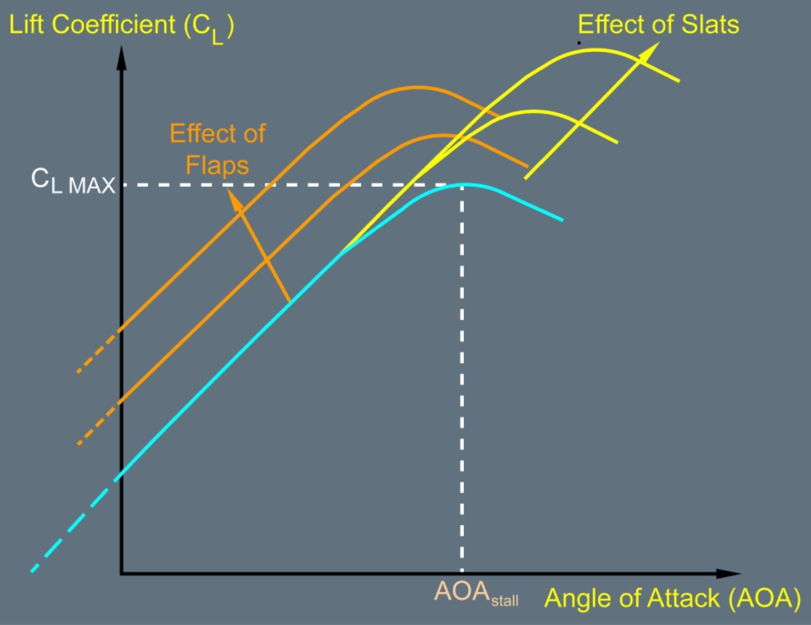
    * 推力：在光洁形态的失速改出中，手册没有规定推力的使用大小，飞机在用高度换速度的过程中已经积累了足够的势能，因此没有必要将推力手柄设置到TOGA位。这一点的优势在于，由于A320飞机发动机悬挂于机翼，过大的推力会造成飞机突然抬头，从而造成迎角探头探测到过大的迎角变化，引发可能的二次失速警告。而离地失速与着陆形态失速则应该按照手册要求将推力推至TOGA位置。也因此，我们在进行推力设置时应该柔和，避免过大的推力变化对飞机的俯仰造成过大的影响

      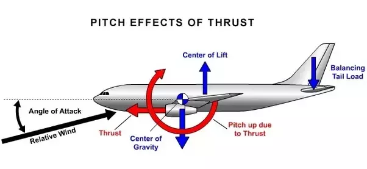

    # **失速改出容易出现的问题：**

    * 顶杆过量，之后急于进行俯仰的修正，造成飞机俯仰行程较大，触发二次失速警告
    * 急于消失下降率，在飞机还没有完全积累够足够的能量时就过早带杆，触发二次失速警告
    * 推力增加太快，造成飞机有抬头趋势难以控制
    * 在备用法则下进行失速改出训练，飞行员对于在速度进入V~ls~以后自动配平将不工作没有预期，没有及时带杆造成高度损失
    * 单纯带杆，遗漏增加推力动作
    * 起飞形态失速改出过程中，先改平坡度再顶杆

    # 失速改出演示案例：

    <iframe src="https://player.bilibili.com/player.html?aid=972692768&amp;bvid=BV1Ap4y1b7Qt&amp;cid=325868829&amp;page=1" data-src="//player.bilibili.com/player.html?aid=972692768&amp;bvid=BV1Ap4y1b7Qt&amp;cid=325868829&amp;page=1" scrolling="no" border="0" frameborder="no" framespacing="0" allowfullscreen="true"></iframe>

[^74]: #### 最大操作高度：

    * 光洁形态：

      * 39800ft（这是可以保持座舱压力低于8000ft的最大高度）
    * 带形态：

      * 20000ft

[^75]: # TCAS

    标签：#记忆项目#

    # **TCAS的现象：**

    * **TA咨询信息**
    * **RA决策信息**

    # **TCAS的程序：**

    #### **TCAS TA咨询信息阶段：**

    * TA咨询信息出现，PF喊话：“TCAS我操纵，ND ARC 10。” PM将两侧ND距离圈调至10NM，通过客舱打铃通知乘务组坐好。
    * 通过FMA是否有蓝色**TCAS**判断AP/FD TCAS的工作状态
    * PM主动联系ATC咨询交通信息

    #### **TCAS RA决策信息阶段：**

    | **如AP/FD TCAS可用且出现RA信息：**                                                                         | **如AP/FD TCAS不可用出现RA信息：**                                                                                                                 |
    | ------------------------------------------------------------------------------------------------------------------------------------------------------------ | --------------------------------------------------------------------------------------------------------------------------------------------------------------------------------------------------- |
    | FMA第二行出现**TCAS**，PF报出：“**TCAS BLUE**，自动避让。” | FMA第二行空白，PF报出：“TCAS避让，人工操纵。”                                                                                                                                                   |
    | 自动驾驶**接通状态**，出现RA信息后，飞机跟随指引，机组监控飞机状态                                         | 自动驾驶**接通状态**，出现RA信息后，PF下口令：关指引，飞绿区。**断开**AP人工控制飞机升降率保持绿区 |
    | 自动驾驶**未接通**，出现RA信息后，人工跟随指引，机组监控飞机状态                                            | 自动驾驶**未接通**，出现RA信息后，PF下口令：关指引，飞绿区。人工控制飞机升降率保持绿区                                                             |
    | 在合适的时机通知ATC“TCAS 避让”                                                                                                                           | 在合适的时机通知ATC“TCAS 避让”                                                                                                                                                                  |

    #### 恢复阶段：

    1. 通过系统Clear of Conflict报话判断飞机是否已经结束TCAS冲突
    2. 确认冲突结束后，PM联系ATC报告TCAS避让，申请恢复正常飞行轨迹
    3. PF通过PFD检查飞机的高度、速度、导航模式，遵守ATC指令
    4. 恢复正常的ND使用
    5. 通过客舱呼叫按钮呼叫乘务长进驾驶舱报告后舱情况

    # **容易出现的问题：**

    * 飞行时，ND的距离圈使用不合理，无法第一时间发现存在冲突隐患飞机的位置
    * TA咨询信息响起时，没有第一时间通过检查FMA上的**TCAS**来判断飞机AP/FD TCAS是否可用
    * TA咨询信息响起时，过早断开AP或FD
    * RA决策信息响起时，没有及时断开FD
    * 根据ND上显示的冲突飞机位置，在Clear Of Conflict响起前过早判断飞机已经解除冲突
    * 冲突结束后，不检查FMA以及飞机的状态
    * 冲突结束后，忘记恢复ND的正常使用

    # **TCAS RA演示案例：**

    <iframe src="https://player.bilibili.com/player.html?bvid=BV1fU4y1w74m&amp;page=1&amp;high_quality=1&amp;as_wide=1&amp;allowfullscreen=true" data-src="//player.bilibili.com/player.html?aid=377912748&amp;bvid=BV1of4y1A7JN&amp;cid=408428374&amp;page=1" scrolling="no" border="0" frameborder="no" framespacing="0" allowfullscreen="true" sandbox="allow-top-navigation-by-user-activation allow-same-origin allow-forms allow-scripts allow-popups" style="height: 360px; width: 640px;"></iframe>

[^76]: # 空速不可靠

    空速不可靠是所有现代飞机的经典科目之一，对于A320系列飞机来说，引起空速不可靠的可能性有很多，其中包括了：

    * 空速管异物堵塞导致飞机没有空速读数
    * 电气系统故障造成的电加温失效，静压系统积冰导致无空速读数或读数不准确（参考"空速不可靠所涉及的知识"[^77]）
    * ADR的空速通道失效（参考"空速不可靠所涉及的知识"[^77]）

    # **空速不可靠的现象：**

    * 三部空速表出现较大的差异
    * ECAM上显示“**ADR CHECK PROC APLLY**”
    * ECAM上显示“**UNREL SPD PROC APPLY**”
    * 任何一部或两部空速表出现**异常显示**
    * 任何一部或两部空速表出现**明显错误**
    * 空速或高度出现意外变化
    * 飞行基本参数之间不正常的对应关系（俯仰，推力，空速，高度和垂直速度指示）。 例如：

      * 高度没有增加，然而机头却大幅上仰且推力大，
      * IAS增加，然而机头却大幅上仰，
      * IAS减小，然而机头却大幅下降，
      * IAS减小，然后机头下俯且飞机在下降。
    * 触发**失速**、**超速警告**或E/WD上显示**FLAP RELIEF**（襟翼减载）信息，这些信息与指示空速矛盾，在这里切记：

      * 相信失速警告，因为失速警告是由AOA探头触发，和错误的空速指示无关
      * 怀疑超速警告，根据情况，超速警告可能是错误的也可能是正确的。当**OVERSPEED VFE**警告触发时，出现飞机抖振是空速确实过大的迹象。
    * 当RA工作时，气压高度与RA高度显示不一致。
    * 空气动力噪音减小，指示空速却增加， 反之亦然。
    * 进近中，使用正常起落架系统不能放下起落架。

    # **空速不可靠的程序：**

    * 发现空速显示不正确后，第一时间进入三脱：

      * AP关
      * A-THR关
      * FD关
    * 低于减推力高度：

      * 推力手柄TOGA，俯仰姿态15°
    * 高于减推力高度且低于FL100：

      * 推力手柄CLIMB，俯仰姿态10°
    * 高于减推力高度且高于FL100：

      * 推力手柄CLIMB，俯仰姿态5°
      * 襟翼如果并非形态全：保持当前形态
    * 襟翼如果为形态全：收到形态3
    * 减速板检查收回
    * 起落架收上

    当处于或高于MSA或起落航线高度时，使用QRH不可靠空速程序查询

    # **容易出现的错误：**

    * 试图第一时间去判别飞机的可靠空速，而不在第一时间控制飞机状态
    * ADR的失效的情况下，关闭了ADIRS
    * 视失速警告为假警告而不进行失速改出的动作
    * 盲目相信超速警告而进行超速改出动作

    注意：当出现空速不可靠时，无论其造成原因是由于ADR空速通道失效，还是静压系统堵塞造，本科目的重点在于第一时间控制飞机状态的决策执行是否坚决，我们需要理解的是，我们始终要遵守金科玉律的原则进行飞行，控制好飞机后再进行排故（参考："4.11 金科玉律"[^21]），只要控制好飞机，保持飞机处于安全的包线之内，再根据QRH的引导逐步辨别，隔离与处置特情

    # **空速不可靠所涉及的知识**

    参考"ADR故障"[^78]

    参考"DC 1+2故障"[^82]

    # 空速不可靠演示案例：

    <iframe src="https://player.bilibili.com/player.html?bvid=BV1RL411x7U2&amp;page=1&amp;high_quality=1&amp;as_wide=1&amp;allowfullscreen=true" data-src="//player.bilibili.com/player.html?aid=890466454&amp;bvid=BV14P4y1Y71V&amp;cid=408432810&amp;page=1" scrolling="no" border="0" frameborder="no" framespacing="0" allowfullscreen="true" sandbox="allow-top-navigation-by-user-activation allow-same-origin allow-forms allow-scripts allow-popups" style="height: 360px; width: 640px;"></iframe>

[^77]: # **空速不可靠所涉及的知识**

    参考"ADR故障"[^78]

    参考"DC 1+2故障"[^82]

[^78]: # ADR故障

    ADIRS，其实包含了ADR和IR两个功能，ADR功能都可能独立的故障，甚至ADR的各通道也可能出现故障，如空速通道失效后出现的"空速不可靠"[^76]

    单纯的ADR或IR故障中，除ADR 1故障会导致GPWS系统不工作之外，其他情况都不会衍生出后续的故障，进行简单的转换即可继续正常飞行，因此在这里我们主要重点在ADR的复合故障上

    # **两部或以上ADR故障后影响操作的即时现象：**

    * AP断开
    * A-THR断开，出现琥珀色**THR LK**
    * 相关PFD上，速度、高度指示消失
    * FD消失，PFD上出现红色**FD**字样
    * 飞机进入备用法则
    * ADR所对应的ATC/应答机不工作
    * GPWS不工作（如ADR1失效）
    * ND上的TAS指示消失

    # **两部ADR故障后的程序：**

    * 如PF侧的PDF失去速度、高度指示而PM侧完好，第一时间交操纵
    * 如两侧的PDF都失去速度、高度指示，按照"空速不可靠"[^76]程序记忆部分处置，机组立刻按照"3.3 非正常和紧急程序"[^18]原则接管飞机，并且划分工作区域
    * PF报出**THR LK**，按照当前推力，将推力手柄移至当前推力所对应的角度之后，断开A-THR
    * 根据公司遇险等级报告ATC宣布**PANPAN**或**MAYDAY**
    * 执行ECAM动作
    * 如ADR1+3故障，进近过程中需要执行重力放起落架程序
    * 重力放轮后，进入直接法则

    ---

    # **如三部ADR故障：**

    * 按照"空速不可靠"[^76]程序记忆部分处置，机组立刻按照"3.3 非正常和紧急程序"[^18]原则接管飞机，并且划分工作区域
    * 关FD，放小鸟
    * PF报出**THR LK**，按照当前推力，将推力手柄移至当前推力所对应的角度之后，断开A-THR
    * 如可能，使用BUSS，PFD上会自动显示绿区及GPS高度
    * 如飞机没有BUSS功能，或进行了俯仰输入后BUSS对侧杆输入没有任何反应，忽略BUSS的显示，并且重新回到"空速不可靠"[^76]程序记忆部分，保持姿态，并且查询QRH"空速不可靠"[^76]程序的俯仰-推力参照表，高度使用MCDU的DATA-GPS MONITOR查看当前GPS高度
    * 小心参考备用仪表
    * 联系ATC，宣布**MAYDAY**
    * ADR1+2+3可能没有ECAM显示，按照"非正常和紧急程序的运用原则："[^79]，有ECAM做ECAM，没有ECAM做QRH
    * 查阅QRH-所有ADR关
    * 进近过程中需要执行重力放起落架程序
    * 重力放轮后，进入直接法则
    * 如需要复飞，按照"空速不可靠"[^76]记忆部分进行复飞爬升

    # **容易出现的问题：**

    * 在双ADR失效时，进近前准备过程中，PF不交操纵，完全交给PM准备
    * 盲目信任备用仪表
    * 程序要求关闭ADR，但是误关ADIRUS
    * 盲目信任BUSS
    * 没有BUSS的情况下不知道在哪里查看GPS高度

    # **ADR故障所涉及到的内容：**

    * 在双ADR失效时，只有一个PFD可用，PF如何交操纵做准备？

      * 按照"3.3 非正常和紧急程序"[^18]的处置原则，PF可以在PM侧缺少操纵依据而无法进行操纵交接的情况下，命令PM进行进近准备，但是在当前双ADR失效的情况下，通过转换面板，PM是能够获取到操纵参数依据的，在交操纵过程中，接操纵方必须详细报出飞机当前的状态和详细参数
    * 明明其他系统都没有问题，为什么ADR 1+3故障时要使用重力放起落架程序？

      * 起落架正常工作时，安全活门工作，在空速超过260kt时，LGCIU会切断液压系统的供压，以免超速放出（参考"7. 限制"[^37]），其在空中的数据来自ADR 1和ADR 3（当飞机在地面时，数据来自探测到压缩的LGCIU），在ADR 1+3都失效的情况下，系统无法获取当前的空速信息，缺少是否处于工作条件的依据，起落架会保持在收上的锁定位，因此需要人工重力放出起落架
      * 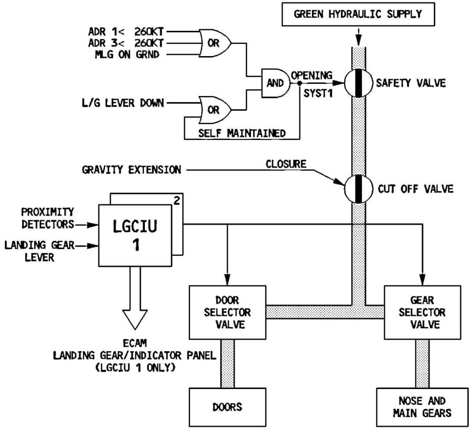
    * 按照上述的设计逻辑，为什么襟翼不使用ADR数据来防止超限放出呢？

      * 因为在空中有可能会出现"空速不可靠"[^76]，空速不可靠的其中一个原因就包括了ADR的空速通道故障，如果单纯依靠速度来限制起落架的放出，机组还可以通过重力放起落架程序来进行起落架人工放出，此方法是可行的，但是如果单纯依靠速度来限制襟翼的放出，机载设备无法进行人工放出，会造成飞机在进近时无法建立形态，而V~app~增大的情况，无谓的增加机组落地时的操作难度
    * 为什么不能盲目信任备用仪表？而"空速不可靠"[^76]程序或"IR故障"[^80]程序中为什么又要求相信备用仪表？

      * 备用仪表的速度数据和ADR3使用同样的数据源，错误的ADR 3数据同样可能造成备用仪表显示错误，因此必须谨慎判断
      * 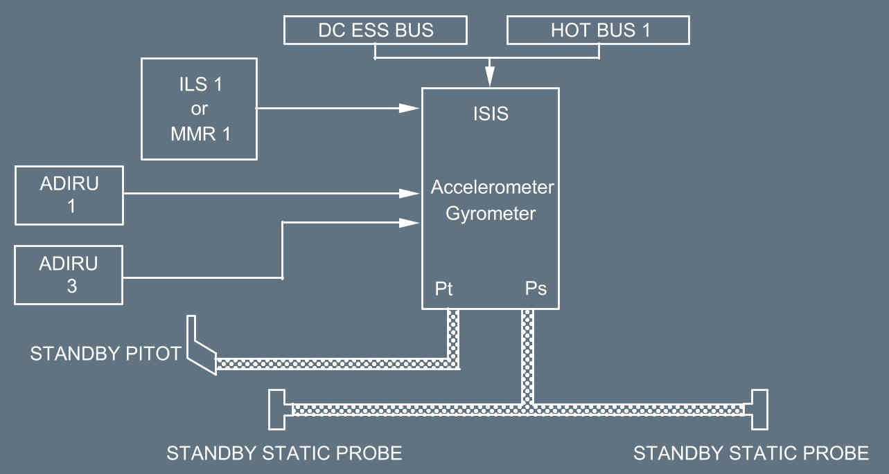
      * 同样的理由，也可以解释为什么"空速不可靠"[^76]和"IR故障"[^80]程序中要求相信备用仪表，因为单纯的空速不可靠时，ADR的功能正常，其数据源是可信的

    * 如果程序要求关闭ADR，和关闭ADIRS有何区别？

      * ADIRS的功能=ADR+IR，如果仅仅是ADR通道失效，IR依旧能够提供惯性基准功能（参考"IR故障"[^80]），即便是IR失效，也可以进行姿态校准，保留一部分功能，如果直接关闭ADIRS
    * 基础的航空理论有提到，飞机的IAS=GS±风速，那么我通过地速和风速的计算，能够得到当前实际的空速，并且以此为依据进行飞行吗？

      * 在平时的训练中，是有飞行员通过这样的技术来进行空速的估算的，但是我们需要知道，在高高度时，即便是飞机自带的空速也已经不可靠，因此当飞机在高高度巡航时，通常会用马赫数来取代空速，但是在低高度的时候，此技术是可行的，只是飞机如本身就具有BUSS功能，完全可以使用BUSS来减轻机组的工作负荷
    * BUSS有可能出错吗？

      * BUSS的数据是根据FAC通过外部大气数据计算的，在飞机高于FL250的情况下，由于大气稀薄，迎角探头提供的数据可能不准确，而飞机积冰的产生也有可能使飞机在进行侧杆输入的时候，BUSS的速度带在PFD上没有相应的反应，在这样的情况下，机组应该使用QRH上推力和俯仰的关系进行匹配，而不是盲目相信BUSS，但是在出现两部及以上的ADR故障后，使用BUSS能够有效的将GPS高度转换至PDF上，飞行员不需要进行更多的精力分配去通过MCDU检查当前的飞机高度，因此打开BUSS有助于减小机组的工作负荷，同样的，虽然速度参考不可用，不代表BUSS的高度功能不可用，这也就是为什么在"7. 限制"[^37]章节中并没有规定在FL250以下不能使用高度的原因，同样也是在设计程序时，即便绿区对侧杆输入无反应，程序也不要求关闭BUSS的原因+
    * AIIRS的ADR与IR通道同时失效后，应该优先执行哪个程序？

      * 优先执行ADR程序，因为ADR程序失效之后，根据"4.11 金科玉律"[^21]的内容，机组应该首先要有飞行的参数依据，速度和高度的显示是飞机当前重要的参考数据，因此应该优先执行ADR程序，当ADR程序完成后，再进行"IR故障"[^80]部分的处置

    # **ADR故障演示视频：**

    <iframe src="https://player.bilibili.com/player.html?aid=463185113&amp;bvid=BV1sL41147er&amp;cid=413675876&amp;page=1" data-src="//player.bilibili.com/player.html?aid=463185113&amp;bvid=BV1sL41147er&amp;cid=413675876&amp;page=1" scrolling="no" border="0" frameborder="no" framespacing="0" allowfullscreen="true"></iframe>

[^79]: # 非正常和紧急程序的运用原则：

    |                                    | When ? | How ? |
    | ------------------------------------ | -------- | ------- |
    | 记忆项目                           | 立即   | 记忆  |
    | OEB 记忆动作                       | 立即   | 记忆  |
    | 非正常/紧急程序 ECAM/FCOM/QRH/OEB | 适当时 | 读&做 |

    具体处置流程，请查看"3.3.1 天龙八步"[^19]

[^80]: # IR故障

    ADIRS，其实包含了ADR和IR两个功能，IR功能可能独立的故障，即便IR故障后，其ATT功能可能依旧可用

    单纯的IR故障中，进行简单的转换即可，因此在这里我们主要重点在IRs的复合故障上

    # **两部或以上IR故障后影响操作的即时现象：**

    * AP断开
    * A-THR断开，出现琥珀色**THR LK**
    * 对应的PFD上出现红色**FD**字样
    * 对应的PFD上的姿态和航向指示消失，出现故障旗
    * 对应的PFD上垂直升降率被琥珀色**气压垂直速度**方框取代
    * 对应的ND上航向数据消失，地速和风的信息被<kbd>---</kbd>信息取代
    * 飞机进入备用法则
    * GPWS TERR功能（如IR 1失效）
    * TCAS可能不工作
    * GLS自动落地

    # **两部或以上IR故障后的程序：**

    * 如PF侧的PDF失去姿态、航向指示而PM侧完好，第一时间交操纵
    * 如两侧的PDF都失去姿态、航向指示，机组立刻按照"3.3 非正常和紧急程序"[^18]原则接管飞机，并且划分工作区域
    * 关FD，放小鸟，在还未恢复姿态指示时以备用仪表的指示作为操作依据
    * PF报出**THR LK**，按照当前推力，将推力手柄移至当前推力所对应的角度之后，断开A-THR
    * 根据公司遇险等级报告ATC宣布**PANPAN**或**MAYDAY**，需重点检查并且报告当前TCAS的工作情况
    * 执行ECAM动作
    * 预习直接法则和重力放轮
    * 尽快落地

    # **容易出现的问题：**

    * 在双IR失效时，进近前准备过程中，PF不交操纵，完全交给PM准备
    * 程序要求关闭ADR，但是误关ADIRUS

    # **涉及的知识：**

    参考"ADR故障所涉及到的内容："[^81]

    # **演示视频：**

    <iframe src="https://player.bilibili.com/player.html?aid=463236124&amp;bvid=BV1UL411W7wU&amp;cid=413686369&amp;page=1" data-src="//player.bilibili.com/player.html?aid=463236124&amp;bvid=BV1UL411W7wU&amp;cid=413686369&amp;page=1" scrolling="no" border="0" frameborder="no" framespacing="0" allowfullscreen="true"></iframe>

[^81]: # **ADR故障所涉及到的内容：**

    * 在双ADR失效时，只有一个PFD可用，PF如何交操纵做准备？

      * 按照"3.3 非正常和紧急程序"[^18]的处置原则，PF可以在PM侧缺少操纵依据而无法进行操纵交接的情况下，命令PM进行进近准备，但是在当前双ADR失效的情况下，通过转换面板，PM是能够获取到操纵参数依据的，在交操纵过程中，接操纵方必须详细报出飞机当前的状态和详细参数
    * 明明其他系统都没有问题，为什么ADR 1+3故障时要使用重力放起落架程序？

      * 起落架正常工作时，安全活门工作，在空速超过260kt时，LGCIU会切断液压系统的供压，以免超速放出（参考"7. 限制"[^37]），其在空中的数据来自ADR 1和ADR 3（当飞机在地面时，数据来自探测到压缩的LGCIU），在ADR 1+3都失效的情况下，系统无法获取当前的空速信息，缺少是否处于工作条件的依据，起落架会保持在收上的锁定位，因此需要人工重力放出起落架
      * 
    * 按照上述的设计逻辑，为什么襟翼不使用ADR数据来防止超限放出呢？

      * 因为在空中有可能会出现"空速不可靠"[^76]，空速不可靠的其中一个原因就包括了ADR的空速通道故障，如果单纯依靠速度来限制起落架的放出，机组还可以通过重力放起落架程序来进行起落架人工放出，此方法是可行的，但是如果单纯依靠速度来限制襟翼的放出，机载设备无法进行人工放出，会造成飞机在进近时无法建立形态，而V~app~增大的情况，无谓的增加机组落地时的操作难度
    * 为什么不能盲目信任备用仪表？而"空速不可靠"[^76]程序或"IR故障"[^80]程序中为什么又要求相信备用仪表？

      * 备用仪表的速度数据和ADR3使用同样的数据源，错误的ADR 3数据同样可能造成备用仪表显示错误，因此必须谨慎判断
      * 
      * 同样的理由，也可以解释为什么"空速不可靠"[^76]和"IR故障"[^80]程序中要求相信备用仪表，因为单纯的空速不可靠时，ADR的功能正常，其数据源是可信的

    * 如果程序要求关闭ADR，和关闭ADIRS有何区别？

      * ADIRS的功能=ADR+IR，如果仅仅是ADR通道失效，IR依旧能够提供惯性基准功能（参考"IR故障"[^80]），即便是IR失效，也可以进行姿态校准，保留一部分功能，如果直接关闭ADIRS
    * 基础的航空理论有提到，飞机的IAS=GS±风速，那么我通过地速和风速的计算，能够得到当前实际的空速，并且以此为依据进行飞行吗？

      * 在平时的训练中，是有飞行员通过这样的技术来进行空速的估算的，但是我们需要知道，在高高度时，即便是飞机自带的空速也已经不可靠，因此当飞机在高高度巡航时，通常会用马赫数来取代空速，但是在低高度的时候，此技术是可行的，只是飞机如本身就具有BUSS功能，完全可以使用BUSS来减轻机组的工作负荷
    * BUSS有可能出错吗？

      * BUSS的数据是根据FAC通过外部大气数据计算的，在飞机高于FL250的情况下，由于大气稀薄，迎角探头提供的数据可能不准确，而飞机积冰的产生也有可能使飞机在进行侧杆输入的时候，BUSS的速度带在PFD上没有相应的反应，在这样的情况下，机组应该使用QRH上推力和俯仰的关系进行匹配，而不是盲目相信BUSS，但是在出现两部及以上的ADR故障后，使用BUSS能够有效的将GPS高度转换至PDF上，飞行员不需要进行更多的精力分配去通过MCDU检查当前的飞机高度，因此打开BUSS有助于减小机组的工作负荷，同样的，虽然速度参考不可用，不代表BUSS的高度功能不可用，这也就是为什么在"7. 限制"[^37]章节中并没有规定在FL250以下不能使用高度的原因，同样也是在设计程序时，即便绿区对侧杆输入无反应，程序也不要求关闭BUSS的原因+
    * AIIRS的ADR与IR通道同时失效后，应该优先执行哪个程序？

      * 优先执行ADR程序，因为ADR程序失效之后，根据"4.11 金科玉律"[^21]的内容，机组应该首先要有飞行的参数依据，速度和高度的显示是飞机当前重要的参考数据，因此应该优先执行ADR程序，当ADR程序完成后，再进行"IR故障"[^80]部分的处置

[^82]: # DC 1+2故障

    # **DC 1+2的即时现象**

    * 驾驶舱会在一瞬间断电并立即恢复供电
    * AP2失效，如当前使用AP2，自动驾驶，自动推力将断开
    * 出现ECAM警戒
    * 出现以下系统的次级故障：

      * 座舱增压

      * 燃油

      * 空调

      * 刹车

      * 飞行操纵

    * 状态页面的不工作系统中，出现大量不工作系统，如下图：

      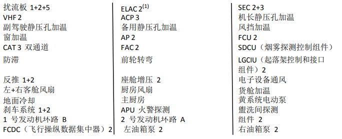
    * 出现大量其他的可能不工作的系统，如下图：

      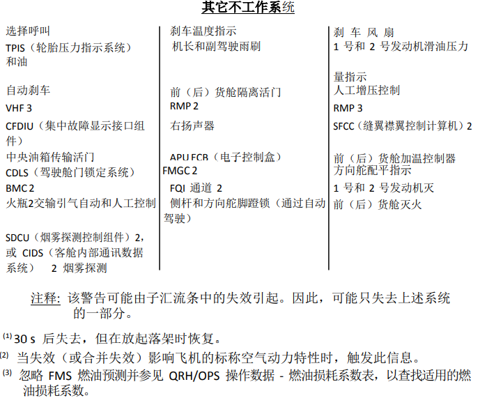

    **注：**由于各公司机型构型与手册编撰存在差异，此列表应以公司手册为准，此处的截图仅作为参考举例

    # **DC 1+2故障的程序**

    * 按照"3.3 非正常和紧急程序"[^18]原则接管飞机，并且划分工作区域
    * 执行ECAM动作
    * 根据各公司制定的遇险标准，宣布**PANPAN**或**MAYDAY**
    * 尽快根据状态页面内容，进行着陆决策

    # **DC 1+2故障时容易出现的问题**

    * 由于襟缝翼缓慢，因此在进近过程中需要考虑设置形态的时机
    * 由于三个静压孔加温都不可用，因此在飞行过程中应尽量避免进入积冰条件，并且以此作为尽快着陆的决策依据，如果一旦进入积冰条件，飞机由于静压孔被积冰堵塞，可能会出现空速不可靠现象，参考"空速不可靠"[^76]部分内容（**重要**）
    * 燃油消耗增加应该作为决策依据的重点考虑内容
    * 对于失去前轮转弯没有预期，试图落地后正常脱离跑道

    # **DC 1+2故障涉及到的知识**

    * 电气系统故障为何会影响到刹车系统，导致最大刹车压力不能超过1000PSI？

      * 由于防滞系统不工作，因此在出现了DC 1+2故障后，刹车压力不能超过1000PSI
    * 为什么DC 1+2引起的空速不可靠会在本课件中标注**重要**？

      * 由于静压孔被积冰覆盖，导致静压系统失效或读书错误，其引起的空速不可靠的现象和一般的空速不可靠存在差异。在这样的情况下出现的空速不可靠现象，不光是空速不准确，其高度读数，升降率，以及小鸟的航迹指示都会出现偏差，因此当出现了DC 1+2后，应该尽量避免进入积冰条件，造成复合故障
    * 一旦不可避免的进入了积冰区域，造成了空速不可靠，应该以什么样的方式来处理？

      * 一旦进入了积冰区域，导致静压系统为ADR提供错误的读数，在这样的情况下我们只能优先对三部空速读数进行判断，如果无法进行判断，或判断为三个读数都不准确，那么机组应该将ADR视为失效，此时应该主动关闭ADR，并按照"ADR故障"[^78]的程序处置，在这样的情况下会对机组产生极强的工作负荷，因此强烈建议尽量避免该情况的发生
    * DC 1+2对整个飞行当前状态的影响并不算大，为什么要立刻进行着陆决策？

      * 按照空客的设计原则，每一套系统至少都有另外一套备份系统（参考"2. A320驾驶舱设计"[^2]），在出现了DC 1+2故障后，如SEC，RMP，SFCC等系统都失去了相对应的备份系统，此时飞机已属于不适航状态，因此需要尽快进行着陆决策

[^83]: # 刹车失效

    标签：#起落架#、#记忆项目#

    # **刹车失效的现象：**

    1. 速度有下指趋势，但飞机没有明显的减速现象
    2. 自动刹车的**Decelerate**灯可能不亮

    ---

    # **刹车失效的程序：**

    1. 任何组员发现没有有效减速后，第一时间喊出“刹车失效”
    2. 反推如已收到反慢车或以上，重新拉出最大反推，并且保留最大反推到飞机彻底停住
    3. 双脚脱离踏板
    4. PF下口令“关前轮防滞转弯”
    5. PM执行动作
    6. 双脚重新使用踏板进行刹车
    7. PM根据刹车压力指示器不断报出两侧刹车压力
    8. 如有必要可间歇性使用停留刹车，如可以，尽量不要使用停留刹车
    9. 飞机完全停住后，PM联系ATC占用跑道并且申请拖车

    ---

    # **容易出现的问题：**

    - PM只监控了速度下降趋势，无法及时发现刹车失效
    - 双脚没有脱离踏板即下口令关断前轮防滞转弯
    - 使用蓄压瓶压力刹车时多次踩踏踏板
    - 飞机完全停下后不使用停留刹车
    - 停留刹车刹上后反推未收起

    # 刹车失效实际案例：

    <iframe src="https://player.bilibili.com/player.html?bvid=BV1sq4y1K7WU&amp;page=1&amp;high_quality=1&amp;as_wide=1&amp;allowfullscreen=true" data-src="//player.bilibili.com/player.html?aid=420394458&amp;bvid=BV1s3411q7Y7&amp;cid=408434212&amp;page=1" scrolling="no" border="0" frameborder="no" framespacing="0" allowfullscreen="true" sandbox="allow-top-navigation-by-user-activation allow-same-origin allow-forms allow-scripts allow-popups" style="height: 360px; width: 640px;"></iframe>

[^84]: # 单发

    # **单发的名词解释：**

    “单发”，即是一个发动机失效的简称，虽然现代飞机的发动机可靠性已经很高，但是依旧存在很多可能引气发动机失效的因素，飞机动力部分管路的破裂，附件齿轮箱的故障或破损，外来物的入侵，金属疲劳造成的部件断裂，燃油油路的堵塞，发动机控制系统故障等等都可能造成发动机失效。

    虽然根据A320飞机的设计裕度来讲，飞机本身完全可以依靠一个发动机的性能进行起飞，但是随着一个发动机失效，往往还会带来更多的安全隐患，其中包括：

    * 方向的偏转
    * 性能损失过大导致无法保持安全的飞行高度
    * 火警
    * 液压的泄漏
    * 发电机不工作等等

    虽然不属于记忆项目，但是单发要求飞行员在处置这一故障，尤其是起飞过程中的单发时，必须要根据实际情况进行有效的处置，由于涉及到的系统繁杂，需要考虑的因素多，对操纵要求高，时间窗口小，因此，对于单发处置的最好预案，是进行一个针对起飞过程中单发处置的紧急简令。

    很多公司都有自己详细的起飞简令，在此不再赘述，但是简令的模板应该包含于以下内容，强烈推荐飞行员对于紧急简令进行记忆。

    ---

    # **起飞紧急简令：**

    起飞紧急简令应该在进行起飞前简令时完成。此简令包含了起飞时出现单发后使用的几乎所有的单发程序，因此**强烈建议**对此简令进行记忆。起飞前简令包含两个部分：

    ### 简令V1前中断部分：

    V1前单发或者其他不正常情况，`包括100kt以下任何ECAM警告，100kt以上V1之前出现火警或严重损坏，发动机失效，任何红色ECAM警告，发动机侧杆失效，反推故障，反推开锁，推力手柄故障`，由CM1进行决断，喊出“中断我操纵”，推力手柄慢车，控制方向，反推最大可用，CM2监控扰流板、反推、自动刹车以及减速情况，在跑道上停住后使用停留刹车，报告塔台，执行ECAM动作。

    ### 简令V1后单发部分：

    `V1-20kt出现的爆胎`，V1后单发或者其他不正常情况继续起飞，具体动作，推力手柄TOGA，抬头执行，AGL+400英尺以下除收轮外不做任何动作。400英尺以上执行ECAM动作，单发做到单发关断，火警做到灭火瓶释放，宣布发动机保护完成（火警不宣布），暂停ECAM动作。到达增速高度改平增速，F速度向上，襟翼1，S速度向上襟翼0，绿点速度OPEN CLIMB，推力手柄MCT，报告ATC，继续执行ECAM动作。

    ---

    # **单发时发动机可能的状态：**

    发动机一旦出现单发或火警，可能出现的是发动机无损但非正常关车，发动机有损非正常关车，发动机带火警且关车，发动机带火警且还在工作。除了单纯的ECAM提醒之外，通过其他特征正确的判断当前发动机的实际状态可以让机组避免无谓的释放灭火瓶动作，减少公司的损失，而一味的不释放灭火瓶，在飞机发动机有损坏或带火警的情况下，错误的判断则可能造成严重的安全隐患，进一步扩大故障带来的伤害和后果，因此当前发动机实际状态的判断尤为重要，我们可以从下面几个方面来判断发动机的实际状态：

    | 单发无损                                                                                                                                                                                                                                                            | 单发有损（同时出现两个为准）                                                                                                                                                                                                                                                                                            | 单发火警无推力                                                                                                                                                                                                                                                                                                                                                                                                                     | 单发火警有推力                                                                                                                                                                                                                                                                                                                                                                                   |
    | --------------------------------------------------------------------------------------------------------------------------------------------------------------------------------------------------------------------------------------------------------------------- | ------------------------------------------------------------------------------------------------------------------------------------------------------------------------------------------------------------------------------------------------------------------------------------------------------------------------- | ------------------------------------------------------------------------------------------------------------------------------------------------------------------------------------------------------------------------------------------------------------------------------------------------------------------------------------------------------------------------------------------------------------------------------------ | -------------------------------------------------------------------------------------------------------------------------------------------------------------------------------------------------------------------------------------------------------------------------------------------------------------------------------------------------------------------------------------------------- |
    | 转子速度（N转速）快速下降 飞机在滑跑或爬升过程中出现非预期的方向偏离 一侧发动机噪音明显突然减小 琥珀色的**Engine 1（2）FAIL **备忘页面出现琥珀色**LAND ASAP**  | EGT快速上升超过红线 转子速度（N转速）严重不匹配或为0 飞机振动或抖振显著增加，或这二者都显著增加 失去液压系统 重复的或不可控的发动机喘振（有声响） 琥珀色的**Engine 1（2）FAIL **备忘页面出现琥珀色**LAND ASAP**  | 转子速度（N转速）严重不匹配或为0 红色的**Engine 1（2）Fire** CRC连续谐音警告 **主警告灯**亮 备忘页出现红色**LAND ASAP** 发动机火警按钮变为**红色** 发动机主电门面板**FIRE**灯亮  | 红色的**Engine 1（2）Fire **CRC连续谐音警告 **主警告灯**亮 备忘页出现红色**LAND ASAP** 发动机火警按钮变为**红色 **发动机主电门面板**FIRE**灯亮  |

    其中，火警的故障特征十分明显，且无论是否存在推力，在程序的处置上都没有区别（特殊的极端性科目除外，如起飞后单发失效且另外一个发动机火警）但是对于单发无损和单发有损而言，经常会出现难以判断的情况，尤其是对于低速中断时的NEO飞机，如果PM未能及时监控到发动机转速的逐渐下降，转速很快就会归零，如果单纯以N转速来判断发动机是否受损的话，依据并不充分，因此在进行判断的过程中，应该以同时出现两个表格中的内容为准

    # **单发时方向的控制：**

    方向的控制对于发动机失效来说是一个比较关键的问题，尤其是在70kt以下的低速中断时，会面对以下几个问题：

    * 一个发动机不工作，造成推力不一致，低速时会产生相当大的偏转力矩
    * 减速板的自动工作条件是速度达到72kt，在70节之前的中断无法触发减速板升起，会让减速效应降低
    * 当自动刹车处于MAX预位时，触发的条件必须满足：

      * `探测到扰流板放出指令并且地速大于40kt`

        因此在当前状态下，自动刹车不工作
    * 另外，外界不利条件还可能造成飞机更大程度的偏转和减速困难，其中包括：

      * 侧风吹击垂尾，产生的偏转力矩
      * 跑道湿滑造成减速效应差

    因此，在单发时，我们必须通过持续的方向舵输入来控制好飞机的方向，尤其是在低速、侧风、湿滑跑道的不利因素下，方向的控制要尤其小心

    # 以高度阶段分类的单发处置：

    {{{col
    # "V1前单发"[^85]

    # "V1后单发"[^88]

    # "巡航单发"[^89]

    }}}

    # 讨论：

    * 为什么在V1-20kt爆胎时，速度明明没有到达V1，但是却要按照V1后单发失效处置？

      * 当一个轮胎爆破时，当前轮胎的刹车效应接近于无，但是在起飞过程中，飞机的重量往往较大，且发动机推力处于起飞推力，无论是动能还是势能都较大，在滑跑过程中，机组很难判断出剩余的跑道能否足够当前飞机进行滑跑减速，一旦跑道剩余距离不够，飞机冲出跑道，将造成严重的后果，与其如此，除非轮胎碎片伤害了发动机，其他情况下都不如继续起飞，给自己留够足够的时间裕度进行单发的处置及落地性能的查询，获取确切的着陆距离依据，远好过盲目中断带来的冲出跑道的风险
    * V1后单发，有没有必要在起飞后等待β目标变为蓝色再进行舵面的输入？

      * 如果飞机在地面滑跑期间就出现了发动机失效，在地面静风或微风的情况下，飞机虽然会出现偏转，但是控制难度不大，如果不踩舵离地，飞机虽然会出现偏转但是依旧在可控制范围以内，从理论上来说，我们完全可以等待偏转超过了横侧接管范围，即β目标变成蓝色之后再进行舵面的输入，然而，根据我国民航局的检查标准，控制飞机方向偏差不能超过5°，尤其是在模拟机检查的过程中往往还伴随着大侧风的情况，因此虽然手册上建议等待β目标变为蓝色再进行舵面的输入，但是如果等待β目标变为蓝色再蹬舵，往往这个时候方向修正都来不及。另一方面讲，如果在地面滑跑期间就出现了发动机失效，进行一个持续稳定的方向舵输入会让飞机很好的控制在中线上，在离地后保持同样的力度也能够让飞机保持稳定的方向，因此个人认为，是否在实际的训练或飞行中等待β目标变为蓝色再蹬舵，还需要根据飞行员根据当前的实际情况进行判断
    * 方向舵配平怎么打？

      * 参考"9. 经验法则"[^90]
    * 火警是否有必要在400ft以下不做任何动作？

      * 正方观点：在400ft以下时，首先要解决的是越障问题，即便是单发火警，起火的发动机也可能存在推力，机组应该利用这个推力进行进行当前状态下最危险的高度的获取，尤其是高高原机场飞机性能差的情况下，高度的获取尤为重要
      * 反方观点：新版的QRH-概述-重要信息中明确写明了：`如在起飞、进近、复飞过程中发生失效，飞机至少应高于跑道400ft（在某些紧急情况下，如果建立了正确的飞行轨迹，PF可以在此高度之前执行动作）`，在当前特定条件下，发动机火警属于紧急情况，飞行员应该优先考虑保护发动机，消除火警隐患，避免火情的进一步扩大，因此在这种情况下，应该忽略400ft的程序高度节点，第一时间进行故障处置

[^85]: # V1前单发

    # **V1前单发：**

    ### 简令V1前中断部分：

    V1前单发或者其他不正常情况，`包括100kt以下任何ECAM警告，100kt以上V1之前出现火警或严重损坏，发动机失效，任何红色ECAM警告，发动机侧杆失效，反推故障，反推开锁，推力手柄故障`，由CM1进行决断，喊出“中断我操纵”，推力手柄慢车，控制方向，反推最大可用，CM2监控扰流板、反推、自动刹车以及减速情况，在跑道上停住后使用停留刹车，报告塔台，执行ECAM动作。

    # **V1前单发的即时现象：**

    * 起飞滑跑过程中，一侧发动机突然噪音减小甚至消失
    * 起飞滑跑过程中，飞机出现突然的方向偏转（发动机失效）
    * 起飞滑跑过程中，发动机出现异响（发动机受损）
    * ECAM警告响起，**警告灯亮**，并伴有连续警告音（发动机火警）

    # **V1前单发程序：**

    ## 中断动作：

    1. 发现单发后，机组首先控制好飞机方向
    2. CM1喊出：中断，我操纵
    3. 推力手柄慢车，控制飞机滑跑方向
    4. 反推最大可用
    5. CM2监控并报出扰流板、反推、刹车工作情况
    6. 飞机停住后使用停留刹车，CM1进行PA广播：乘务组各就各位，CM2通知ATC占用跑道
    7. 第一时间通过ECAM、N1转速来判断发动机状态

    ## 处置动作：

    | **单发无损** | **单发有损** | **单发火警**                                  |
    | ----------------------------------------------------------------------------- | ----------------------------------------------------------------------------- | --------------------------------------------------------------------------------------------------------------- |
    | 参考"单发时发动机可能的状态："[^86]                                           | 参考"单发时发动机可能的状态："[^86]                                          | 火警灯亮，有连续警告音，ECAM出现**红色火警**提示，判断为火警  |
    | ECAM动作做到单发关断，报出发动机保护完成                                   | ECAM动作做到第一个灭火瓶释放，报出发动机保护完成                           | ECAM执行到第二个灭火瓶释放                                                                                   |
    | PA广播乘务组留在原地无需撤离，CM2联系ATC申请飞机滑回检查                   | PA广播乘务组留在原地无需撤离，CM2联系ATC申飞机滑回检查                     | 判断是否需要紧急撤离，如需要，执行"紧急撤离"[^71]程序，如不需要，通知乘务组解除警戒                            |
    |                                                                            |                                                                            | 如无法自行滑回，CM2联系ATC申请拖车                                                                           |

    # **V1前单发应该重点关注的问题：**

    * 发动机一旦出现单发或火警，可能出现的是发动机无损但非正常关车，发动机有损非正常关车，发动机带火警且关车，发动机带火警且还在工作。正确的判断当前发动机的实际状态可以让机组避免无谓的释放灭火瓶动作，减少公司的损失，而一味的不释放灭火瓶，在飞机发动机有损坏或带火警的情况下，则可能造成严重的安全隐患，进一步扩大故障带来的伤害和后果，因此当前发动机实际状态的判断尤为重要，详细信息请参考"单发时发动机可能的状态："[^86]

    # **低速单发中断的要点：**

    * 低速中断的危险性，参考"单发时方向的控制："[^87]
    * 处置要点：

      * 在拉出反推后尽快收起反推：

        * 由于是低速中断，已经使用的跑道距离不长，因此机组在此时没有必要过于考虑跑道剩余距离的问题，而是应该优先考虑如何应对突如其来的大幅度偏转，当单发失效后，拉出反推也只有一个反推在工作，这无疑会增加飞机在减速过程中的偏转力矩，造成更严重的方向偏转，让机组难以控制。因此机组应该在拉出反推后尽快将反推收起，用人工刹车和差动刹车的方式控制飞机方向并且进行减速
      * 视线，脚蹬的输入以及差动刹车：

        * 当飞机出现单发并开始减速滑跑后，飞机的方向改变剧烈，如果失去视线的参考，机组将很难提前判断出飞机方向的运动趋势，在这一阶段，强迫自己将视线放远是很有效的解决办法
        * 脚蹬的输入一定要及时，不能因为害怕偏转幅度改变剧烈而进行柔和的输入，这不符合"4.11 金科玉律"[^21]中，`未按预期发展时，采取措施`的内容，如有必要，使用正在输入脚同侧的刹车进行差动刹车，尽快停住飞机
      * 手轮的使用：

        * 根据空客手册的内容，在飞机达到滑行速度时都可以使用手轮轮，原理上来讲，手轮的工作速度范围为小于130kt都可使用，在刚刚进行中断的过程中，由于反推和人工刹车的介入，飞机滑跑速度会有明显而剧烈的下降，一般很快都会低于40kt，在这样的情况下，手轮控制前轮转弯的范围是±75°，更有利于飞机方向的控制
      * 停留刹车：

        * 在飞机停稳后，如果不使用停留刹车，飞机即便只剩一个发动机提供慢车推力，也有可能造成飞机重新发生位移，因此在飞机停稳后，第一时间就应该使用停留刹车

    # **容易出现的问题：**

    * PM监控到飞机出现非正常状态后，忽略了V1的喊话，V1喊话应优先于所有喊话
    * 方向修正不及时，飞机擦跑道边灯或冲出跑道
    * 直接将推力手柄从Flex位置拉到反推最大
    * 飞机停住后不使用停留刹车
    * 停住后判断发动机是否受损的依据不正确，以至于无法判断发动机是否受损，必须释放灭火瓶
    * 在发动机无损或发动机有损但已释放灭火瓶的情况下，继续执行ECAM动作，长时间占用跑道处置
    * 在脱离跑道后，不执行着陆后检查单

[^86]: # **单发时发动机可能的状态：**

    发动机一旦出现单发或火警，可能出现的是发动机无损但非正常关车，发动机有损非正常关车，发动机带火警且关车，发动机带火警且还在工作。除了单纯的ECAM提醒之外，通过其他特征正确的判断当前发动机的实际状态可以让机组避免无谓的释放灭火瓶动作，减少公司的损失，而一味的不释放灭火瓶，在飞机发动机有损坏或带火警的情况下，错误的判断则可能造成严重的安全隐患，进一步扩大故障带来的伤害和后果，因此当前发动机实际状态的判断尤为重要，我们可以从下面几个方面来判断发动机的实际状态：

    | 单发无损                                                                                                                                                                                                                                                            | 单发有损（同时出现两个为准）                                                                                                                                                                                                                                                                                            | 单发火警无推力                                                                                                                                                                                                                                                                                                                                                                                                                     | 单发火警有推力                                                                                                                                                                                                                                                                                                                                                                                   |
    | --------------------------------------------------------------------------------------------------------------------------------------------------------------------------------------------------------------------------------------------------------------------- | ------------------------------------------------------------------------------------------------------------------------------------------------------------------------------------------------------------------------------------------------------------------------------------------------------------------------- | ------------------------------------------------------------------------------------------------------------------------------------------------------------------------------------------------------------------------------------------------------------------------------------------------------------------------------------------------------------------------------------------------------------------------------------ | -------------------------------------------------------------------------------------------------------------------------------------------------------------------------------------------------------------------------------------------------------------------------------------------------------------------------------------------------------------------------------------------------- |
    | 转子速度（N转速）快速下降 飞机在滑跑或爬升过程中出现非预期的方向偏离 一侧发动机噪音明显突然减小 琥珀色的**Engine 1（2）FAIL **备忘页面出现琥珀色**LAND ASAP**  | EGT快速上升超过红线 转子速度（N转速）严重不匹配或为0 飞机振动或抖振显著增加，或这二者都显著增加 失去液压系统 重复的或不可控的发动机喘振（有声响） 琥珀色的**Engine 1（2）FAIL **备忘页面出现琥珀色**LAND ASAP**  | 转子速度（N转速）严重不匹配或为0 红色的**Engine 1（2）Fire** CRC连续谐音警告 **主警告灯**亮 备忘页出现红色**LAND ASAP** 发动机火警按钮变为**红色** 发动机主电门面板**FIRE**灯亮  | 红色的**Engine 1（2）Fire **CRC连续谐音警告 **主警告灯**亮 备忘页出现红色**LAND ASAP** 发动机火警按钮变为**红色 **发动机主电门面板**FIRE**灯亮  |

    其中，火警的故障特征十分明显，且无论是否存在推力，在程序的处置上都没有区别（特殊的极端性科目除外，如起飞后单发失效且另外一个发动机火警）但是对于单发无损和单发有损而言，经常会出现难以判断的情况，尤其是对于低速中断时的NEO飞机，如果PM未能及时监控到发动机转速的逐渐下降，转速很快就会归零，如果单纯以N转速来判断发动机是否受损的话，依据并不充分，因此在进行判断的过程中，应该以同时出现两个表格中的内容为准

[^87]: # **单发时方向的控制：**

    方向的控制对于发动机失效来说是一个比较关键的问题，尤其是在70kt以下的低速中断时，会面对以下几个问题：

    * 一个发动机不工作，造成推力不一致，低速时会产生相当大的偏转力矩
    * 减速板的自动工作条件是速度达到72kt，在70节之前的中断无法触发减速板升起，会让减速效应降低
    * 当自动刹车处于MAX预位时，触发的条件必须满足：

      * `探测到扰流板放出指令并且地速大于40kt`

        因此在当前状态下，自动刹车不工作
    * 另外，外界不利条件还可能造成飞机更大程度的偏转和减速困难，其中包括：

      * 侧风吹击垂尾，产生的偏转力矩
      * 跑道湿滑造成减速效应差

    因此，在单发时，我们必须通过持续的方向舵输入来控制好飞机的方向，尤其是在低速、侧风、湿滑跑道的不利因素下，方向的控制要尤其小心

[^88]: # V1后单发

    # **V1后单发：**

    ### 简令V1后单发部分：

    `V1-20kt出现的爆胎`，V1后单发或者其他不正常情况继续起飞，具体动作，推力手柄TOGA，抬头执行，AGL+400英尺以下除收轮外不做任何动作。400英尺以上执行ECAM动作，单发做到单发关断，火警做到灭火瓶释放，宣布发动机保护完成（火警不宣布），暂停ECAM动作。到达增速高度改平增速，F速度向上，襟翼1，S速度向上襟翼0，绿点速度OPEN CLIMB，推力手柄MCT，报告ATC，继续执行ECAM动作。

    ---

    ## **V1后单发的现象：**

    * 起飞滑跑过程中，飞机出现突然的方向偏转（发动机失效）
    * 起飞滑跑过程中，发动机出现异响（发动机受损）

      1. 推力手柄TOGA，报出相应的FMA
    * ECAM警告响起，**警告灯亮**，并伴有连续警告音（发动机火警）

    ## **V1后单发程序：**

    ### 地面至起飞动作（400ft以下）：

    1. 使用方向舵控制飞机方向
    2. 方向稳定且地速大于Vr后正常抬轮，柔和带杆到12.5°，升空后跟随SRS指引
    3. 如升空后出现单发，不要急于进行舵量输入，因为横侧的法则会进行升空后给出一些方向舵偏转指令来消除侧滑，当侧滑β目标变成**蓝色**，PF应蹬舵修正飞机侧滑
    4. PF应使用方向舵配平减轻腿上压力
    5. 方向舵配平完成后尽快接通自动驾驶
    6. 出现正上升率且无线电高度增加后，PM报出“正上升率”，下口令收轮

    ### 处置程序（400ft以上）：

    1. 判断当前航径是否合理，是否需要拔出航向保持一边
    2. PF下口令开始非正常处置流程，ECAM动作应做到发动机保护完成，之后再进行改平增速
    3. 尽量在1500ft以下完成

    | **单发无损** | **单发有损** | **单发火警** |
    | ----------------------------------------------------------------------------- | ----------------------------------------------------------------------------- | ------------------------------------------------------------------------------ |
    | N1有转速，判断为单发无损                                                    | N1无转速，判断为单发有损                                                    | 火警灯亮，有连续警告音，ECAM出现红色火警提示，判断为火警                     |
    | ECAM程序执行到单发关断，关断后报出“发动机已保护”                          | ECAM程序执行到灭火瓶释放，释放后检查无烟无火，报出“发动机已保护”          | ECAM程序执行到第二个灭火瓶释放                                               |
    | 1500ft改平增速，按照正常原则收形态                                          | 1500ft改平增速，按照正常原则收形态                                          | 1500ft改平增速，按照正常原则收形态                                           |
    | 绿点速度开放爬升，推力手柄MCT                                               | 绿点速度，开放爬升，推力手柄MCT                                             | 绿点速度，开放爬升，推力手柄MCT                                              |
    | 继续执行"3.3 非正常和紧急程序"[^18]                                           | 继续执行"3.3 非正常和紧急程序"[^18]                                           | 继续执行"3.3 非正常和紧急程序"[^18]                                            |

    ### 后续程序：

    | **单发无损** | **单发有损** | **单发火警** |
    | ----------------------------------------------------------------------------- | ----------------------------------------------------------------------------- | ------------------------------------------------------------------------------ |
    | PF报告ATC，宣布PANPAN，之后进行返场决策                                    | PF报告ATC，宣布PANPAN，之后进行返场决策                                    | PF报告ATC，宣布MAYDAY，应答机7700，通知可能占用跑道，之后尽快着陆           |
    | 返场过程中执行空中重新起动发动机检查单                                     | 返场过程中执行单发直接进近检查单                                           | 返场过程中，如PF没有多余精力，PM可自行完成所有检查单                         |
    | 如起动成功，则尽快落地                                                     | 尽快落地                                                                   | 做好"紧急撤离"[^71]预案                                                       |
    | 如重新起动不成功，则进行单发直接进近检查单，并且检查飞机重量               | 进行单发直接进近检查单，并且检查飞机重量                                   |                                                                             |

    在进行所有程序的过程中，机组应尽量完成进近准备，

    单发落地前可以考虑选择自动刹车中，使用最大反推直到飞机完全停下，从而尽快在跑道上停住飞机，方便进行下一步的决策和处置。

    ## **容易出现的问题：**

    * PM监控到飞机出现非正常状态后，忽略了V1的喊话，V1喊话应优先于所有喊话
    * 起飞后出现单发没有第一时间蹬住侧滑，导致飞机舵杆不协调，爬升效率低
    * 起飞后不使用方向舵配平就直接尝试接通AP，容易导致飞机在接通AP的瞬间出现大幅度摆动或无法接通AP
    * 在1500ft以下完成到单发关断（无损），第一个灭火瓶释放（**有损**），第二个灭火瓶释放（**火警**）后不监控飞机状态，而继续去执行ECAM动作，忽略飞机改平增速的高度节点
    * 没有根据当前飞机的实际性能，地形等条件判断一边是保持还是使用正常程序离场
    * 在PM进行ECAM动作时，PF的决策过慢，没有根据当前的时机情况加以合理判断
    * 忘记执行空中重新起动发动机检查单（无损），单发直接进近检查单（有损或重新起动不成功），没有根据当前实际情况选择着陆形态的依据
    * 忽视检查飞机是否重量超限，而遗漏超重着陆检查单
    * 空中出现**火警**，未根据火警的实际情况为决策依据而宣布紧急撤离

[^89]: # 巡航单发

    # **巡航单发：**

    ## **巡航单发的现象：**

    * 发动机出现明显的转速下降
    * 同时运转的两台发动机其中一边突然声音减小或消失
    * ECAM警告响起

    ## **巡航单发程序：**

    在识别到巡航单发时，PF应该在第一时间内：

    * 将所有推力手柄推至MCT位
    * 断开A/THR

    如在巡航中，PF应该：

    * 按需设置HDG航向并拔出
    * 在进程页面确定发动机失效改出高度

    准备好下降时，PF应该：

    * 按照当前选择策略设置速度并拔出
    * 设置发动机失效改出高度并拉出以接通OPEN DES

    适当时，PF要求执行ECAM/OEB动作。

    在接近重量限制的高飞行高度层上， 飞行机组不应延迟下降动作，因为飞机速度会迅速减小。机组应该避免减速到绿点速度以下。

    断开A/THR以便在按照策略选择速度时或是在拔出旋钮接通OPEN DES方式开始下降时，避免出现任何发动机推力减小的情况。A/THR断开后，在OPEN DES方式下，目标速度由升降舵控制。

    不得匆忙执行ECAM动作，因为正确完成动作更加重要。 

    ### 巡航单发策略：

    * 标准策略：

      * 设置速度目标M0.78/300kt。选择速度 0.78/300kt 以确保飞机在空中重新点火启动包线范围内达到稳定的风转速度。REC MAX EO（建议的最大单发失效）巡航高度，该高度等于防冰关时的LRC单发失效最大飞行高度层，显示MCDU 进程页面上（双FM失效时，QRH中也有远程速度时的一台发动机失效总升限）。
      * 当 V/S低于500ft/min时，选择V/S -500 ft/min并接通A/THR。一旦建立在改平高度上，可以从QRH中查阅一台发动机失效情况下的远程巡航性能数据。
    * 标准策略动作：

      * 推力手柄：MCT
      * A-THR：关
      * 航向：选择
      * 通讯：联系ATC
      * 速度：M0.78/300kt
      * 高度：OPEN DES方式下降至单发升限
      * V/S低于500ft/min时，选择V/S -500ft/min
      * A-THR：开

    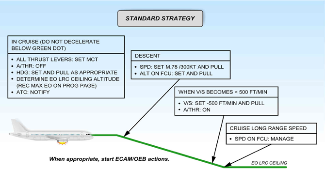

    * 越障策略：

      * 设置速度目标至绿点。这个动作的目的在于将发动机产生的能量从速度的保持转移到高度的保持，设置绿点速度后，下降率和下降角将有效减小，达到越障的目的
      * 当完成越障后，应该回到标准策略
    * 标准策略动作：

      * 推力手柄：MCT
      * A-THR：关
      * 航向：选择
      * 通讯：联系ATC
      * 速度：绿点
      * 高度：OPEN DES方式下降至单发升限
      * 越障完成后，返回标准策略

    

    * 固定速度策略（ETOPS）

      * 建议参考公司手册FCOM-程序-特殊运行-延程运行-改航性能数据章节

    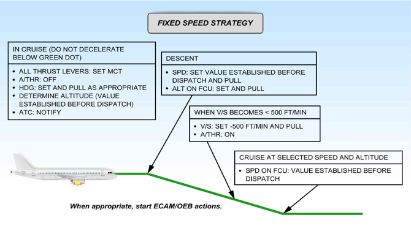

    ## **容易出现的问题：**

    * 推力手柄位置推至TOGA位
    * 推力手柄推至MCT位但不断开A-THR
    * 试图第一时间判断发动机工作状态，只推在工作发动机对应的推力手柄
    * 选择速度时对马赫数与空速的概念不清楚，在高高度选择300kt空速而不是M 0.78，造成飞机超速
    * 不了解重新接通自动推力的时机
    * 不尝试进行空中重新起动的检查单

[^90]: # 9. 经验法则

    # **名词解释：**

    经验法则，又叫Rule of Thumb，根据维基百科的解释，Rule of Thumb法则起源与英国，十八世纪的英国法官允许丈夫使用一根宽度不超过拇指的棍子“温和的”殴打自己的老婆，以维持“家庭纪律”。然而在英国的法律中并没有任何明文规定允许丈夫可以殴打自己的妻子。后来，这一“以经验为基础而执行的行为”被称为“Rule of Thumb”（经验法则），代指并不精确但是能够顺利实施的措施，并且在各行各业中被使用。比如历史上布料商认为拇指的宽度大约等于一英寸，啤酒酿造商用拇指测量酒桶的温度，渔夫在冬天使用拇指来测量冰层的厚度以确保冰面能支撑人的体重等，这些都属于经验法则范畴

    # **民航中的经验法则：**

    #### **和温度相关的经验法则：**

    * 零度等温线的计算：

      * 已知标准的大气温度递减率为1000ft：2℃，以此可以大概推算出空中的零度等温线位置，假设当前飞机处于海平面机场，地面温度为16℃，16÷2×1000=8000，零度等温线高度大约在8000ft左右，机组可以尽量避开这个高度，以免遭遇非必要的复杂天气
    * ISA偏差计算：

      * ISA偏差是指某处实际温度与标准ISA温度的差值，标准ISA，在标准的大气环境下为15℃，公式为：

        $T标准=15℃-（2℃÷1000ft）×机场标高$  

        假设当前飞机所在机场标高为1000ft，温度为20℃，当前的T~标准~=15℃-（2℃÷1000ft）×1000ft=13℃

        ISA偏差=T实际-T标准=20℃-13℃=+7℃

    #### **下降率和下滑角相关的经验法则：**

    * 3°下滑角对应的下降率：

      * 3°下滑角的正常计算公式为GSx5.2，通常飞行员为了减小工作负荷，会用地速x5的方式进行大概计算，我们的飞机进近速度通常是在地速140kt左右，那么下降率就应该是140kt约等于700ft/min，为了方便计算，我们也可以直接用÷2×10的方式进行计算，如当前地速为200kt，那么对应3°下滑角的正确下降率计算为200÷2×10≈1000ft/min
    * 使用FPA进行进近剖面修正：

      * 三个一原则，每改变1°FPA，每1海里，可以进行100ft英尺高度修正

    #### **和风速相关的经验法则：**

    * 侧风分量的计算：

      * 正逆风或正顺风：

        * 计算参数=0%

          不需要进行修正
      * 逆风或顺风与跑道成30°夹角：

        * 计算参数=50%

          如30°右侧风10kt，右侧风大约是5kt左右
      * 逆风或顺风与跑道成45°夹角：

        * 计算参数=70%

          如45°右侧风10kt，右侧风大约为6-7kt左右
      * 逆风或顺风与跑道成60°夹角：

        * 计算参数=90%

          如60°右侧风10kt，右侧风大约为9kt左右
      * 正侧风90°夹角：

        * 计算参数=100%

    #### **和转弯相关的经验法则：**

    * 飞机转一圈需要的时间：

      * 在TAS小于等于170kt时，按照要求转弯率为3°/s，360÷3等于120秒，所以在低高度时，转弯一圈用时为2分钟
      * 在TAS大于170kt时，速度增大则转弯率降低，340kt的TAS转弯率就是TAS170kt的一半，用时翻倍，因此当TAS为340kt时，转一圈用时大约为4分钟

    * 飞机的转弯半径：

      * 转弯半径的计算公式为：

        $$
        R=V²/g×tanθ
        $$

        R为半径，V为真空速，g为恒定的重力加速度，一般认为是9.8，θ为转弯角度，但是这种计算方式太过于耗费时间，因此我们可以利用经验法则，记住几个个基准的数值，即：

        * TAS180kt，25°坡度，转弯半径约为1NM
        * TAS300kt，25°坡度，转弯半径约为3NM
        * TAS400kt，15°坡度，转弯半径约为9NM
      * 如需要进行大概计算，可以通过以下方式进行快速计算：

        * 当速度≤TAS200kt时，使用标准转弯

          * 转弯半径NM≈TAS÷200，或
          * 转弯半径NM≈TAS×1%
        * 当在巡航高度飞行，马赫数＞0.4M，或TAS大于200kt，使用30°坡度转弯

          * 转弯半径NM≈马赫数×10-2

    #### **其他经验法则：**

    * 平飞减速：

      * 在慢车状态下每消耗10kt需要大概1NM的距离，假如我们当前位置需要将速度从250kt减小到200kt，那么需要提前5NM进行减速
      * 如果使用减速板，减速率会×2，加入我们当前位置需要将速度从230kt减速至200kt，仅需要大约1.5海里就足够了

    * 保持绿点速度下降时每1000ft消耗的距离：

      * 理想无风的条件下，推力在慢车，保持绿点速度时，每消失1000ft，高度大约消耗2.5NM

    * 单发离地后方向舵怎么打？

      * 单发离地后，β目标往哪个方向跑，就用哪条腿使用方向舵修正侧滑，方向舵配平往正在用力的脚的方向配置，保持10-12秒左右，以脚上感受不到压力为准

[^91]: # 自动飞行

    # "FCU 1+2故障"[^92]

    # "双FMGC失效"[^36]（见导航部分）

[^92]: # FCU 1+2故障

    # **FCU 1+2的现象：**

    * FCU上：

      * 气压表自动跳转为STD
      * FCU的速度/马赫窗口、航向/航迹窗口、高度窗口都无显示
      * A-THR，AP1+2，FD1+2都不工作
    * PFD上：

      * FMA左上角显示琥珀色**THR LK**，需要人工调节推力手柄位置并且断开
      * AP无法使用，自动驾驶断开，驾驶舱由警告音，需要使用接管按钮止铃，且ECAM会出现相应的红色**AP OFF**
      * FD无法使用，PFD自动放出小鸟
      * 显示ILS
      * 失去除了LAND或GA方式外所有的FMA
    * ND上：

      * ND显示模式锁定在NAV模式
      * 根据型号不同，ND距离显示为20NM或80NM
      * 指针1只与VOR 1相关联
      * 指针2只与ADF 2相关联，如未安装ADF，则自动关联ADF 1
    * 其他：

      * 气象雷达的图像可能失去。如果继续显示雷达图像，则需要主动忽略此显示。在所有情况下，都会显示红色的**WXR RNG**（气象雷达范围）信息。

    # **FCU 1+2的程序：**

    #### 出现故障时的第一反应：

    * 当出现FCU 1+2时，AP、A-THR、FD都会断开，因此飞行员按照"4.11 金科玉律"[^21]第一条，应该在第一时间操纵好飞机的状态：

      * 使用侧杆接管按钮接管飞机，从而止铃
      * 尽快将推力手柄设置到当前的推力实际位置，并且按压自动推力断开按钮
      * 通话报告ATC，如在RVSM区域，则应该脱离当前区域，详细程序请参考："RVSM紧急脱离程序："[^66]
    * 根据"3.3 非正常和紧急程序"[^18]进行处置，完成"3.3.1 天龙八步"[^19]
    * 使用"原始数据导航"[^93]技术进行进近

    #### 高度的保持：

    在飞行期间，由两个FCU通道都失效，导致气压基准会自动调制1013 hPa，因此在飞行过程中，我们应当优先以备用仪表的高度显示为准。

    但是同时，我们需要了解基本的高度换算方法，基本口诀为：**大大小小**。

    简单说来，**当PFD上的STD气压值（1013）大于备用高度表的气压值，那么它所显示的高度也应该大于备用高度表所显示的高度**。

    反之，**当PFD上的STD气压值（1013）小于备用高度表的气压值，那么它所显示的高度也应该小于备用高度表所显示的高度**。

    每一个单位的气压值在标准海平面温度上所对应的高度值大约为27.3英尺，在进行换算中按照30英尺掌握，那么根据气压差，我们可以根据当前的高度进行修正，这样做的好处在于：

    * 如果备用仪表保留或故障（这一点在模拟机训练中很常见），我们依旧可以进行高度的换算而保持正确的飞行高度；
    * 能够更好的将注意力分配与PFD上，减少注意力的分配

    #### 换算示例：

    > 举例说明，当前我们在6900ft高度飞行，当前的实际修正海压为1003，此刻出现了FCU 1+2失效，两部PFD的气压都只显示为STD。
    >
    > 如果我们需要进行人工换算修正，当前STD（1013）的修正海压大于1003，差值为10，每一个单位对应30ft的高度，那么我们的修正量为：
    >
    > （STD-1003）*30=300
    >
    > 按照**大大小小**口诀，当STD大于备用仪表的修正海压时，我们PFD上的高度也应该大于备用高度表所显示的高度，因此我们使用6900ft+300ft=7200ft，当我们飞机保持在7200ft时，实际飞行高度即是6900ft。
    >

    # **容易出现****的问题：**

    * 在出现FCU单通道故障时不尝试使用另外一个通道的自动化设备
    * 出现FCU 1+2双通道故障后，不关指引放小鸟
    * 在没有判断高度偏差的情况下盲目进行高度修正
    * 错误的使用MCDU的导航台锁定功能进行导航台锁定，导致ND上无法显示正确的导航台

    # **双FCU故障演示视频：**

    <iframe src="https://player.bilibili.com/player.html?aid=805576238&amp;bvid=BV1r34y1S7Ua&amp;cid=410330006&amp;page=1" data-src="//player.bilibili.com/player.html?aid=805576238&amp;bvid=BV1r34y1S7Ua&amp;cid=410330006&amp;page=1" scrolling="no" border="0" frameborder="no" framespacing="0" allowfullscreen="true"></iframe>

    * 在进近准备过程中不要输入MDA，即便是根据上述口诀进行了高度修正，我们也不应该在MCDU中输入高度修正值，而应该以人工监控的方式，根据各公司的标准喊话报出关键高度
    * VOR/ADF指针1只与VOR 1相关联，因此如果需要锁定VOR，我们的主用的VOR及其径向线应该绑定在第一部
    * VOR/ADF指针2只与ADF 2相关联，如果没有安装ADF 2，则自动与ADF 1相关联，因此如果我们需要使用ADF，则应该将其输入到ADF 2，如没有ADF 2，则输入至ADF 1
    * 当FCU 1+2失效出现后，飞机会自动接通ILS及偏离刻度，如果进近方式为VOR进近，ILS及偏离刻度会抑制垂直偏离指示，导致垂直偏离指示不可用
    * 如果需要外界温度较低，还需要考虑进行寒冷气象条件下的高度修正

[^93]: # 原始数据导航

    # **定义**

    原始数据导航是指在空中通过相关的接收器利用地面导航台发射的导航系统进行位置判断的导航方式。就目前来讲主流导航设备为VOR、NDB、DME，其中VOR和NDB能为机组提供方位信息，DME提供距离信息，机组可以通过方位和距离信息得出一个当前位置的坐标，从而进行导航。

    # **需要使用原始数据导航的情况与特点**

    在实际的飞行和训练中，机组往往都会遭遇需要进行原始数据导航的情况，这些单独出现的故障（非衍生故障）通常有：

    * GPS主用丢失，且导航精度低
    * 地图漂移
    * 两部MCDU失效，导致无法校验导航精度，需要使用原始数据导航
    * 两部FMGC失效，丢失FM功能，需要使用原始数据导航

    注意，GPS丢失，导航精度低并不代表此刻就已经出现了实际上的地图漂移，但是由于失去了自动导航的精度，机组依旧应该按照地图漂移程序进行处置

    无论发生上述任何情况，使用原始数据导航飞行在本质上并不困难，机组都应该按照"4.11 金科玉律"[^21]的原则执行`飞行、导航、通讯`任务排序，进而更好的将飞机控制在安全包线范围之内

    # **原始数据导航的具体科目**

    {{{col
    # "地图漂移"[^94]

    # "双MCDU失效"[^95]

    # "双FMGC失效"[^36]

    }}}

    # **加入等待**

    在进行原始数据导航的训练时，经常出现由于刚起飞就是去导航精度而需要备降或返场的情况，在这种情况下，尤其是双FMGC故障时，很容易出现由于飞机没有显示全重，或者查询全重后未引起警惕而在无意间超重着陆的情况，为了避免这样的情况，机组应该通过"7. 限制"[^37]对自己当前的飞机重量进行查询，如果发现飞机超重，则需要在空中加入等待，而标准等待的加入往往也是在进行原始数据导航时所附加的考核项目

    ### **标准等待的标准：**

    标准等待有以下三个需要确认的数据：

    * 速度
    * 高度（查阅航图）
    * 方向（查阅航图，使用航迹模式飞行）

    高度和方向都可以在进场图或进近图上找到，这里值得一提的是速度。除航图上特别的速度限制之外，根据我国法规规定，标准等待速度如下：

    | 等待高度               | 标准等待速度 | 如遭遇颠簸时的等待速度    |
    | ------------------------ | -------------- | --------------------------- |
    | 高度＜14000ft          | ＜230kt      | ＜280kt                   |
    | 14000ft＜高度＜20000ft | ＜240kt      | ＜280kt或＜0.8M，取较小值 |
    | 20000ft＜高度＜34000ft | ＜265kt      | ＜280kt或＜0.8M，取较小值 |
    | 高度＞34000ft          | ＜0.83       | ＜0.83                    |

    ### **标准等待的加入方式：**

    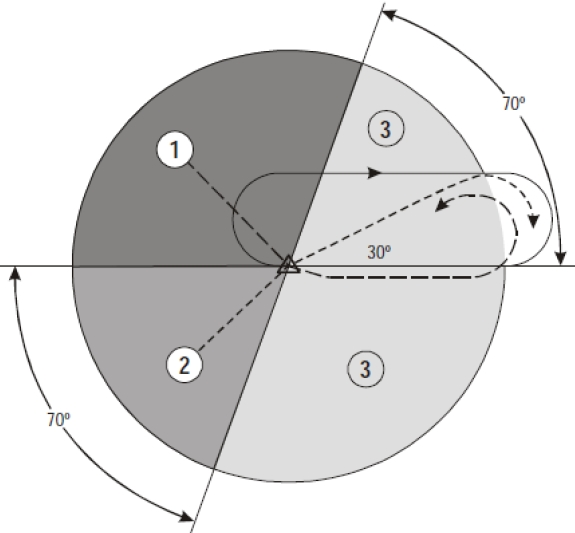

    * ①为平行加入：

      * 过台后保持出航边1分钟，如标准等待为右等待即进行左转（反之，如左等待即进行右转），重新过台后以标准转弯转向出航边，满足下列条件后计时：

        * 机翼改平
        * 正切导航台

        计时一分钟后，保持标准转弯重新向台飞行，并且根据入航边径向线进行方位修正
    * ②为水滴进入：

      * 过台后以30°角度保持平飞1分钟，如标准等待为右等待则右转（反之，如左等待即进行左转），保持标准转弯重新向台飞行，并且根据入航边径向线进行方位修正
    * ③为直接进入：

      * 过台后直接转弯，如准等待为右等待则右转（反之，如左等待即进行左转），满足下列条件后计时：

        * 机翼改平
        * 正切导航台

        计时一分钟后，保持标准转弯重新向台飞行，并且根据入航边径向线进行方位修正

    注意，在进行标准等待时，在可能的情况下，水平模式尽量选择航迹模式，航迹模式能够有效的消除侧风偏流的影响，减轻机组的工作负荷

    观察以上三种方式，**所有的加入等待的方式，都是过台之后朝外且向保护区内转弯飞行**，请在训练和飞行中牢记这一点

    #### **加入等待的小技巧：**

    在加入标准等待时，很多人无法快速判断出自己与导航台的相对方位以及应该使用的加入方式，在这里我们需要明确两件事：

    * 航图上永远会有正北标，我们可以以正北标进行判断：

    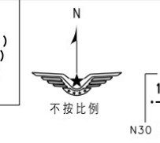

    * 将ND显示模式选择至F-PLAN模式（除非"FCU 1+2故障"[^92]，其他情况都可以使用），因为F-PLAN模式是所有模式中以正北为基准显示的模式：

    

    在双FMGC失效的情况下，虽然地图不可用，但是依旧能够直观的显示飞机目前机头的朝向，对移动航图，将正北标指向12点方向，就能直观的看出我们与目标导航台的相对位置，以及加入方式

[^94]: # 地图漂移

    # **地图漂移的现象：**

    * 飞机的指引指向不正确
    * AP接通状态下，飞机突然开始进行非预期的横侧修正，甚至来回摆动
    * ND上飞机和计划航路的显示出现较大的偏差
    * ECAM上出现琥珀色**CHECK A/C POSITION**
    * MCDU上出现琥珀色**CHECK A/C POSTION**，且MCDU进程页面显示**GPS LOST**，导航精度显示**LOW**
    * MCDU上出现琥珀色**FMS1/FMS2 POS DIFF**
    * ECAM上出现琥珀色<u>NAV</u> **FM/GPS DISAGREE**

    # **地图漂移的程序：**

    发现地图漂移之后，根据当前的情况，属于"4.11 金科玉律"[^21]中`情况未按照预期发展`，因此机组应该马上采取行动：

    * 如AP可用，保持AP接通，立刻拔出航向，如AP不可用，人工飞行，PF下口令：“设置航迹/航迹XXX”，第一时间稳定住飞机的状态
    * 虽然很可能在第一时间不会出现ECAM动作，但是依旧按照"3.3 非正常和紧急程序"[^18]处置流程进行处置，PF通知ATC当前飞机状态，并且申请雷达引导
    * 如MCDU可用，使用无线电导航页面的导航台锁定功能进行原始数据定位，并且将EFIS上的导航台选择器设置到相关的位置
    * 如MCDU不可用，通过RMP的备用导航调谐功能调谐导航台频率，并且将EFIS上的导航台选择器设置到相关的位置
    * 使用原始数据导航，尽快备降或返场，正常进行进近的准备
    * 进近期间，关闭GPWS系统的**TERR**功能

    注意：即便是后续过程中地图漂移的现象消失，依旧不能盲目相信自动导航设备，建议全程使用原始数据导航

    # **容易出现的问题：**

    地图漂移是一个处理起来相对轻松的科目，但是作为没有太多飞行经历的飞行员，依旧需要注意以下内容：

    * 在飞行过程中，过于相信自动导航系统的引导，盲目跟随指引
    * 出现地图漂移后，试图使用ND上的航路或与导航台、机场的相对位置进行定位
    * 未在第一时间联系ATC并且告知情况
    * 过于相信ATC的雷达引导，不进行高度或方位上的监控
    * 锁定了无线电导航台后，EFIS上的导航台选择器没有设置到相对应的位置，ND上依旧无法显示飞机与锁定导航台的相关位置
    * 如使用了RMP备用导航调谐功能，RMP选择器没有恢复到自己向对应VFH1/VFH2，**SEL**灯常亮

    # **地图漂移涉及到的系统知识：**

    * 为什么同样是使用原始数据导航，地图漂移就需要关闭GPWS系统的TERR功能，而双MCDU失效和双FMGC失效就不需要？

      * GPWS的五个基本提醒功能包括：

        * 下降率过大
        * 近地率过大
        * 起飞或复飞后掉高度
        * 不在着陆形态时，地形间隔不足
        * 下降低于下滑道过大

        这几个功能都和气压高度有关，和当前数据库是否生效没有直接关系，但是当出现地图漂移时，系统提供了错误的地形数据，虽然从系统逻辑上来讲，某些新型的EPGWS系统在探测到导航精度低时，会自动抑制EGPWS的TAD（地形意识和显示）、TCF（地形间隔平台）、RFCF（跑道间隔区域底线）功能，只保留作为GPWS的五个基本功能， 但是由于每一架飞机使用的GPWS型号不同，如果没有进行抑制的话，在进近过程中就很容易激活错误的可控撞地提醒，一旦进行了提醒，无论是否是假警告，机组都应该按照记忆项目的原则执行"GPWS及EGPWS"[^51]程序，导致没有必要的复飞，因此，最好的办法是机组不需要投入过多的精力去进行当前机型安装GWPS类别的查询，而直接关闭GPWS的TERR功能，达到避免虚假警告的目的

    #### 飞机的各种位置：

    飞机导航系统最主要的目的之一就是确定飞机的位置。目前A320系列飞机机载导航系统有三种，即惯性导航系统（IRS）、无线电导航系统和GPS，每种导航系统都能确定出各自的飞机位置，然后提供给FM使用。

    1. 混合惯导位置：

        A320系列飞机有3套IRS，每套IRS都将计算出飞机惯性位置送给飞行管理制导计算机（FMGC），如果这三个IRS位置均有效，FMGC则根据这3个位置计算出一重力平均值，即“混合惯导（MIXIRS）位置。当其中一个IRS位置偏差异常时，FMGC在MIXIRS位置的计算中使用一定的法则以消除这个IRS位置的影响（见下图）。

        如果其中一个IRS位置失效或者偏差太大（与先前的MIXIRS位置相比偏差大于30海里），FMGC就将此IRS位置剔除，仅使用一个IRS位置，优先权顺序从高到底依次为：本侧IRS位置、IRS3位置、另一侧IRS位置，这取决于当前机组使用的哪一部AP

    

    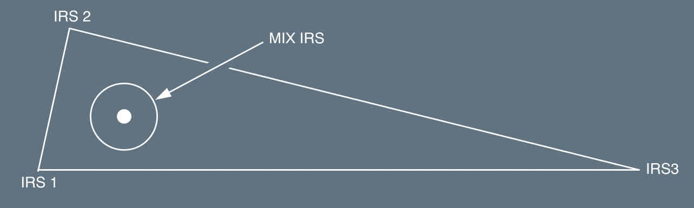

    2. 无线电位置：

        A320系列飞机上用以导航计算的无线电导航条统有甚高频全向信标系统（VOR）和测距系统（DME），由于单一的无线电导航方式无法确定飞机的位置，所以每个FMGC正常情况下使用本侧的无线电导航设备、采用DME/DME或VOR/DME的组合方式来最终确定飞机的无线电位置。FMGC或者机组选择的地面导航台可以在SELECTED NAV/AIDS页上查看
    3. GPS位置：

        A320系列飞机都有2套GPS系统，核心部件（MMR或GPSSU）计算出飞机的GPS位置。每个IRS系统接收各自的GPS位置进行混合计算，得到3个全球定位惯性导航系统（GPIRS）位置，FMGC根据误差情况与优先权采决定使用哪个GPIRS位置，优先权顺序从高到低依次为：本侧GPIRS位置、GPIRS3位置、对侧GPIRS位置，GPIRS位置数据不断被FM进行着完整性测试，如果GPIRS位置在MIXIRS位置和无线电位置的充许误差范围之内，并且GPIRS位置比无线电位置的预计位置误差（EPE）小或相等时，GPIRS位置才会被使用，导航（ND）和MCDU上显示“**GPS PRIMARY**"（即GPS主用）信息，GPS PRIMARY方式有效。如果测试失败，GPIRS位置则被拒用，ND和MCDU上显示“**GPS PRIMARY LOST**“信息（即GPS主用丢失），GPS PRIMARY方式无效（见图2，FM1位置=GPIRS1位置，其他FM位置均为相应的无线电位置）

        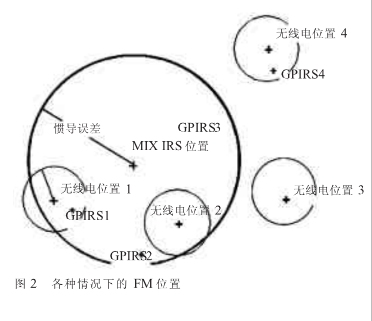
    4. FM位置：

        飞机的FM位置即是FMGC在电子仪表地图上用来显示当前飞机的位置。正常情况下，飞机的FM1位置在ND1上显示，FM2位置在ND2上显示。当其中一个FM位置失效后，剩下的FM位置同时在两侧的ND上显示，此时两侧的ND均应设置为相同的显示方式与距离，否则故障边的ND上将显示琥珀色“**SELECT OFFSIDE RANGE/MODE**"的提示信息。  
        当IRS未完成校准或者故障，或者FMGC中的FM部分故障后，相应一侧的电子仪表地图不会被显示，ND上显示**MAP NOT AVAIL**（地图不可用）信息。

    #### FM位置的更新：

    A320系列飞机的FM位置更新有自动更新和人工更新二种方式：

    * 自动更新：

      * 在飞行的各个阶段，飞机FM位置的自动更新情况如下：
      * 在地面上：

        起飞推力施加前如果GPS PRIMARY无效，FM位置=MIXIRS位置；如果GPS PRIMARY有效，FM位置=GPIRS位置
      * 在地面上：

        起飞推力施加后，对于件号以“BI"字母开头的LegacyFMGC，不管GPS PRIMARY是否有效，均具有“起飞位置更新”功能，即飞机在跑道头起飞，当推力手柄至于起飞推力位时，FM位置此刻迅速被强制更新为此条跑道的入口位置。对于件号以“C”字头的第二代飞行管理系统（FMS2），如果GPS PRIMARY无效，也具有“起飞位置更新”功能，但如果GPS PRIMARY有效，起飞位置更新功能则被抑制，此时FM位置=GPIRS位置
      * 起飞爬升过程中：

        当起飞推力设置大约2分钟后，FM位置向GPIRS位置（GPS PRIMARY）或MIX IRS位置接近
      * 巡航中：

        如果GPSPRIMARY有效，则“无线电位置更新“功能被抑制，FM位置=GPIRS位置；

        如果GPSPRIMARY无效，当飞机处在足够数量的地面导航台的有效范围之内时，FM位置=无线电/IRS混合位置。实际上，当无线电位置有效时，飞机的无线电/IRS混合位置经过滤处理被FM使用时已经与无线电位置基本相同

        只要无线电位置或者GPIRS位置有效，每个FMGC就不断计算着从MIXIRS位置到对应无线电位置或者GPIRS位置的矢量，这个矢量被称为“偏差”，偏差不断被FMGC更新。当无线电位置或者GPIRS位置无效时，偏差被记忆下来，此时FM位置=MIXIRS位置+偏差
      * 进近中：

        当AP/FD接通，飞机处在ILS或LOC进近方式并且截获航道后，航向道的信号可以被FMGC用来更新飞机的FM位置，此功能被称为“LOC位置更新”
    * 人工更新：

      * 非跑道头起飞时：

        如果飞机不是进行全跑道起飞，则起飞前机组应当在性能页面的TAKE OFF页上输入起飞偏差（TO SHIFT）值，当推力手柄设置为起飞位时，“起飞位置更新”功能使得FM位置此刻迅速被更新为全跑道TO SHIFT的修正值
      * 飞行中：

        机组在空中确认当前飞机的FM位置有较大误差后，可以通过在进程页上的“UPDATE AT”项人工输入导航台、航路点、机场的识别代码，当飞机飞越这些位置点上空时，使飞机的FM位置强制更新为这些点的坐标位置

    飞机的导航方式及各个位置的情况可以在<kbd>DATA</kbd>页面通过`GPS MONITOR`和`POSITION MONITOR`功能进行查看

    #### 地图漂移产生的原因：

    虽然不正确的IRS校准、未进行TO SHIFT人工更新、错误的识别代码、国内外坐标系统信息不兼容等原因都可能造成地图漂移现象，但是更多时候都是由于GPS系统故障、IRS误差过大造成的，当出现地图漂移时，飞行员没有必要去立即判别造成地图漂移的原因，而应该根据当前的实际状况，进行原始数据导航，让飞机处于一个安全的包线之中

[^95]: # 双MCDU失效

    # **双MCDU失效的现象：**

    * 两部MCDU黑屏且无法使用

    # **双MCDU失效的程序：**

    * 任何一名机组成员发现MCDU失效立刻报出“双MCDU失效”
    * 虽然没有ECAM程序，但是也应该按照"3.3 非正常和紧急程序"[^18]顺序进行处置
    * 如正在使用AP，保持AP接通，拔出当前航向保持
    * 如未使用AP，拔出当前航向，手动跟随FD
    * PF通知ATC当前飞机状态，并且申请雷达引导
    * 通过RMP的备用导航调谐功能调谐导航台频率，并且将EFIS上的导航台选择器设置到相关的位置
    * 使用原始数据导航，尽快备降或返场，正常进行进近的准备

    # **双MCDU失效容易出现的问题：**

    双MCDU失效是一个处理起来相对轻松的科目，但是作为没有太多飞行经历的飞行员，依旧需要注意以下内容：

    * 认为FMGC的FM功能依旧可靠，继续飞向目的地
    * 未在第一时间联系ATC并且告知情况
    * 不尝试进行系统复位
    * 混淆每一部RMP频率调谐与对应导航设备的关系
    * PM尝试使用PF一侧的RMP调谐ILS频率
    * 使用备用导航设备后，选择电门没有选回VHF位，**SEL**灯常亮
    * 过于相信ATC的雷达引导，不进行高度或方位上的监控
    * 没有获取足够的决策依据就开始准备直接返场
    * 在进行标准进场时，没有考虑导航台切换的优先顺序

    # **双FMGC失效涉及到的知识：**

    * MCDU虽然失效，但是FMGC功能正常，为什么不能继续完成航段？

      * 虽然FMGC功能正常，但是MCDU失效后，无法进行导航精度以及各项数据的检查，盲目飞行隐藏的安全风险太大，因此不能继续完成航段
    * 为什么PM不要去尝试使用PF一侧的RMP进行ILS频率的调谐？

      * 当双FMGC失效后，唯一的一套ILS系统可以通过两侧的RMP进行调谐，当需要进行相应侧的其他导航台频率调谐时，由于系统限制原因，只能在对侧调谐，但是机组需要明白手臂横越中央操纵台时误碰推力手柄的风险，为了减少这种风险，机组应该在进行ILS盲降频率调谐时尽量使用本侧的RMP设备
    * 双MCDU失效和双FMGC失效的区别？

      * MCDU只是一个控制组件，相当于人机对话的接口，双MCDU失效只是进行人机对话的接口不可用，失去了进行FM指令的窗口，而FG功能健在，AP、A-THR功能都可以正常使用，但是双MCDU功能一旦失效，FM、FG功能都不可用，机组的工作负荷远大于单纯的失去双MCDU时的工作负荷

[^96]: # 刹车-起落架

    # "刹车失效"[^83]

[^97]: # 座舱增压

    # "快-慢速释压"[^65]

[^98]: # 电气

    # "应急电气构型"[^70]

[^99]: # 发动机

    # "使用外部-交输气源起动发动机"[^100]

    # "人工起动发动机程序"[^102]

    # "发动机失速与振动值高"[^104]

    # "单发"[^84]

    # "双推力手柄故障"[^107]

[^100]: # 使用外部-交输气源起动发动机

    # **性质：**

    飞机的发动机是依靠气源来起动的，在正常工作状态下，APU的引气通过飞机的内部管路能够正常进入发动机，帮助其完成自起动，然而在实际训练和飞行中，往往会出现APU的引气功能无法正常使用的情况，在这样的情况下，飞机丧失了自供气能力，但是机组依旧可以利用外部气源来起动发动机，当起动好一个发动机之后，具有供气功能的发动机，让飞机恢复了自供气能力，因此机组可以利用完好一侧的发动机来进行自供气，从而起动另外一台发动机

    # **程序：**

    * 当机组通过MEL（参考"MEL的使用"[^47]）或ECAM得知飞机故障，而必须要使用外部气源或交输气源起动发动机时：

      * 通知ATC
      * 检查飞机接通了外部气源或外部气源+外部电源
      * 预习程序

    * 当得到原地起动许可后：

      * 根据ATC或地面工作人员要求，起动相应的发动机，如果没有起动顺序要求，尽量先起动2发
      * 起动时，PM念，PF做，参考"4.1 驾驶舱职责划分"[^4]-"补充程序时："[^101]
    * 起动好一个发动机后：

      * 通知ATC，听ATC指挥
      * 如果可以在原地起动另外一个发动机，根据手册重复程序
      * 如果不能在原地起动另外一个发动机，执行交输引气起动发动机程序
    * 如果执行交输引气起动发动机程序：

      * 推出到位后，设置停留刹车
      * 执行程序，起动时，PM念，PF做，参考"4.1 驾驶舱职责划分"[^4]-"补充程序时："[^101]

    # **涉及到的内容：**

    * 为什么要尽量先起动2发？

      * 2号发动机可以为黄系统增压，黄系统为停留刹车供压，保证飞机在起动过程中不会出现非预期的移动
    * 为什么不能在停机位就使用交输引气起动发动机？

      * 执行交输引气起动发动机程序的过程中，由于为了保持引气压力，极有可能需要增加已经起动好的发动机的推力，当发动机推力增加时，即便不超过40%的N1转速，依旧存在以下几种隐患：

        * 发动机吸入前方的异物或物体，甚至影响地面工作人员的生命安全
        * 发动机的尾流对地面人员、物体、设备甚至交通工具造成伤害
        * 在增加推力过程中如果突然失去停留刹车，飞机将不可避免的产生位移，严重时可能会伤害廊桥甚至候机楼
      * 因此，ATC在考虑到以上几种安全隐患的情况下，会尽量要求机组推至远机位或滑行道执行该程序，以降低安全隐患

    * 为什么通常都不使用外部引气起动发动机程序起动两个发动机？

      * 使用外部气源起动两个发动机，存在对于机坪和地面设备，设施的安全隐患，因此通常的做法都只使用外部气源设备起动一个发动机
      * 如果使用外部气源车起动时，外部气源车会尽量处于飞机的某一侧（通常是右侧，因为引气接口在右侧，这种情况下应优先起动1发），如果两侧的发动机都起动，可能存在伤害外部气源车的情况
    * 为什么要尽量先起动2发？

      * 2号发动机可以为黄系统及蓄压瓶增压，能够控制飞机停留刹车，保证飞机在起动过程中不产生非预期的移动
    * 为什么不能直接在停机位就使用交输引气起动发动机程序？

      * 执行交输引气起动发动机的过程中涉及到为了保持引气压力，必须增加发动机推力的动作，当发动机推力增加时，即便不超过40%的N1转速，也存在以下几种隐患：

        * 发动机吸入前方的异物或物体，甚至影响地面工作人员的生命安全
        * 发动机的尾流造对人、物体、设备、甚至交通工具造成损害
        * 在增加推力的过程中如果突然失去停留刹车，飞机将不可避免的撞向候机楼
      * 因此，ATC在考虑到以上几种安全隐患的情况下，会尽量要求机组推至远机位或滑行道，安全隐患相对较小的位置进行起动

[^101]: #### 补充程序时：

    如果程序与发动机起动有关，首先推荐阅读整个程序，然后：

    * PM 读出动作
    * PF 执行动作

    针对其他的补充程序：

    应按照“读&做(READ&DO)”原则执行程序，即PM 读出程序，PF 或PM 视情况执行动作。  

    ---

[^102]: # 人工起动发动机程序

    # **需要进行人工起动发动机的情况：**

    * 发动机失速
    * 发动机EGT超限
    * 起动气压低造成悬挂
    * 预计由于外界温度或机场高度导致的引气性能下降
    * 预计由于外界温度或机场高度导致的发动机EGT裕度变小
    * 预计外部气源的性能不足以起动发动机
    * 当天第一次起动期间间歇性的ECAM提示<u>ENG 1（2）：</u>**ING A（B） FAULT**警报

    # **人工起动发动机的程序：**

    * 如果在起动过程中出现了"需要进行人工起动发动机的情况："[^103]中所涉及的内容，执行QRH中的发动机冷转程序
    * 如果预计需要执行人工起动发动机程序，执行FCOM-正常程序-补充程序-人工起动发动机程序，程序分工由PM念，PF做（详情参考"补充程序时："[^101]）

    # **人工起动发动机过程中涉及到的问题：**

    * 什么是发动机失速？

      * 参考"发动机失速与振动值高"[^104]部分
    * 为什么要强调在执行补充程序时，由PM念，PF做？

      * 在"补充程序："[^106]中已提到了，在执行补充程序时PM念，视情况由PF或PM做，此处没有明确在执行人工发动机起动程序时的具体分工，但是按照"4. 驾驶舱分工"[^20]中的设计原则，和飞机动力装置有关的部分，都应该属于PF的职责范围，因此此处的检查单应该由PM完成，而动作由PF执行
    * 什么是发动机起动悬挂？

      * 发动机起动悬挂是指起动活门打开，但是引气压力不够造成N转速上升到某个数值后就不再继续上升，导致发动机无法顺利起动的现象，在出现这种情况时，通常发动机没有明确的ECAM指示，这就是为什么我们在起动发动机需要计时的原因，通常正常启动发动机的时间为40-45秒，如果出现由于环境问题造成的性能衰减，可以适当延长这个时间，但是如果起动时间接近2分钟，依旧没有启动且没有任何警告，我们即视为起动悬挂
    * 为什么起动不成功后要执行干冷转程序？

      * 在地面起动不成功时，干冷转循环可以使发动机通风以排掉发动机中的燃油蒸汽，降低EGT，同时进行发动机系统的渗漏检查，排除其他可能性的故障，有利于下一次起动成功
    * 如果人工起动发动机也失败了怎么办？

      * 重新执行干冷转程序，可以再次进行尝试，但是尝试的间隔和次数必须要遵循当前飞机发动机构型中的"7. 限制"[^37]部分

    # **容易出现的问题：**

    * 启动时不计时
    * 人工起动发动机前不进行干冷转程序
    * 尝试起动发动机次数超限

    # **人工起动发动机程序视频：**

    <iframe src="https://player.bilibili.com/player.html?aid=293029607&amp;bvid=BV1nf4y1n7dY&amp;cid=410956617&amp;page=1" data-src="//player.bilibili.com/player.html?aid=293029607&amp;bvid=BV1nf4y1n7dY&amp;cid=410956617&amp;page=1" scrolling="no" border="0" frameborder="no" framespacing="0" allowfullscreen="true"></iframe>

[^103]: # **需要进行人工起动发动机的情况：**

    * 发动机失速
    * 发动机EGT超限
    * 起动气压低造成悬挂
    * 预计由于外界温度或机场高度导致的引气性能下降
    * 预计由于外界温度或机场高度导致的发动机EGT裕度变小
    * 预计外部气源的性能不足以起动发动机
    * 当天第一次起动期间间歇性的ECAM提示<u>ENG 1（2）：</u>**ING A（B） FAULT**警报

[^104]: # 发动机失速与振动值高

    # **现象：**

    #### **发动机失速发生时可能出现的现象：**

    * 发动机发出巨响
    * ECAM提示发动机振动值超限
    * 飞机尾喷管冒火甚至回火
    * 飞机在空中时出现有规律的方向偏转，感觉像飞机一侧被外力拉扯
    * 转子转速波动
    * 推力手柄反应迟缓
    * EGT超限或推力增加时EGT快速上升
    * ECAM出现发动机振动值高的提示

    #### **发动机振动值高时的现象：**

    * ECAM出现ADV咨询信息
    * 飞机随振动值的增加出现抖动，甚至出现有规律的方向偏转，感觉像飞机一侧被外力拉扯
    * 转子转速波动
    * ECAM出现发动机振动值高的提示

    通过上述内容可以看出，这两个科目发生时的现象有很多相似之处，因此在此合并分析

    # **程序：**

    #### **发动机失速时的程序：**

    * 在地面：

      * 推力手柄（受影响的发动机）慢车
      * 发动机主电门（受影响的发动机）关
      * 如果是在起动过程中出现发动机失速，考虑执行"人工起动发动机程序"[^102]（尽量迎风起动）
    * 在空中：

      * 推力手柄（受影响的发动机）慢车
      * 发动机参数（受影响的发动机）检查

        * 如果发动机参数异常：

          * 关车
        * 如果发动机参数正常：

          * 发动机防冰开
          * 推力手柄缓慢前移
        * 如果再次出现失速：

          * 推力手柄（受影响的发动机）慢车
          * 机组联系ATC，是否宣布**PANPAN**以各公司遇险标准决定
          * 后续不用关车，但是具体程序参考"单发"[^84]部分

    #### **发动机振动值高的程序：**

    * 发动机参数检查
    * 如果怀疑积冰：

      * 断开A-THR
      * 推力（一次一台发动机）收回到慢车，然后增加到N1＞80%（按照QRH内容，执行甩冰程序，可能需要执行若干次）
    * 如果不怀疑有积冰：

      * 如果高于震动咨询且飞机条件允许，推力减小到低于咨询临界值
      * 机组联系ATC，是否宣布**PANPAN**以各公司遇险标准决定
      * 后续不用关车，但是具体程序参考"单发"[^84]部分
      * 建议**落地时，不要拉反推**
    * 着陆后，如果震动程序：

      * 选择合适的时机关闭发动机

    # **科目分析：**

    从上述的内容来看，我们可以看出，这两个科目容易混淆的部分在于：

    * 由于现象十分接近，因此容易出现错误的识别，造成错误的关车或不关车的决策
    * 程序也十分接近，其核心重点都是通过减小发动机推力来消除现象，并且可能会使用类似于"单发"[^84]的程序进行改航或返场

    但是虽然两者现象和程序十分相似，但是其性质是有区别的，我们需要理解造成这两种现象的原因加以判断

    #### **造成发动机失速的原因：**

    所谓的发动机失速，其实是指发动机压缩机失速，主要原因是进入发动机压缩机的相对气流较小，在压缩机的进气口产生了一个小型的低压甚至真空区域，使本来该进入压缩机的气流回流，是发动机核心部分由于气流原因造成的振动，**属于发动机内部产生的问题**，这样出现的情况有：

    * 剧烈的气流流动造成发动机震动
    * 剧烈的气流回流由于突然的运动发出类似爆炸或尖嘶声
    * 燃油燃烧不完全，造成尾喷管失火
    * 回流的气流讲燃烧不完全的燃油反向抽出燃烧室，造成发动机回火

    在地面，由于这是由发动机压气机部分无法接收到足够的相对气流而产生的失速，因此我们可以尽量使发动机迎风起动增加相对气流，并且进行"人工起动发动机程序"[^102]的方式来避免发动机后续的失速

    注：由于发动机容易出现异响和震动，因此发动机失速也成为发动机喘振

    #### **发动机振动值高的原因：**

    发动机振动值高，往往是由于某些原因造成的发动机叶片变形、粘连造成的叶片旋转时离心力不平衡所造成的振动，**属于发动机外部产生的问题**。出现这样的情况有：

    * 外来物入侵伤害发动机叶片
    * 结冰造成叶片旋转时不平衡
    * 发动机叶片金属老化发生缺失或粘连

    在理解了两种故障发生的原因之后，我们就可以进行相对应的处置

    * 收推力的目的？

      * 不管是发动机失速还是发动机震动值高，无论其产生的原因是什么，我们都可以通过在第一时间将推力收至慢车来减小此故障对于飞机的影响，保护好发动机，避免更大的安全隐患，如果发动机是由于发动机失速产生高振动值，那么收推力将减小压缩机的功率，如果发动机是由于外部原因出现振动值高，那么收推力将明显减小叶片的旋转速度，减小离心力的不平衡
      * 无论是哪种情况，在一个推力手柄收到慢车之后，飞机已经处于事实上的只有一个发动机提供推力的状态，因此我们需要考虑"单发"[^84]程序
    * 为什么发动机失速就需要考虑关车，而振动值高就不需要？

      * 发动机失速考虑关车的先决条件是发动机参数异常，参考"造成发动机失速的原因："[^105]部分，由于是发动机内部出现的问题，并且可能会产生回火，发动机如果继续运转有可能会造成进一步的损伤；而发动机振动值高时，主要优先考虑的是是否是由于积冰产生的叶片问题，如果是由于积冰产生的问题，那么通过接通发动机防冰是有可能可以恢复的，如果不能，即便是不关车，发动机也仅仅是处于风转状态，不会造成更大的损伤。而从法规上讲，发动机空中关车与不关车的法律性质是不同的，这一点也是机组需要考虑的内容
    * 为什么发动机振动值高需要断开自动推力？

      * 断开自动推力的先决条件是怀疑有积冰，断开自动推力的主要目的是方便机组根据QRH中的内容进行甩冰程序，这样做的好处还有：

        * 当自动推力接通时，如果使用OPEN方式在下降，即便是推力手柄在CLIMB位，但是自动推力会将实际推力限制在慢车，断开自动推力能有效的避免这一情况
    * 如果出现发动机失速或发动机振动值高，随后通过程序恢复了发动机的正常运转，是否还要尽快落地？

      * 需要，即便是故障现象消失，但是机组并没有办法判断当前发动机的实际状态，继续长时间的继续飞行很可能会造成更多严重的后果，因此建议即便是故障现象消失，也应该尽快落地
    * 手册上没有写，但是为什么强烈建议，高振动值落地后不要拉反推？

      * 在手册中，所有关于受影响发动机的程序和动作，都是避免剧烈的推力变化，这样做的目的在于避免突然的推力变化对发动机产生更多的不利影响，而落地时，如果拉出反推，也属于强烈的推力变化，也有可能在使用反推的过程中对发动机造成进一步的伤害，造成情况的恶化，因此建议在着陆距离足够的情况下，尽量不要使用反推
    * 如果在进近过程中出现风切变，是否还应该避免过大的推力变化，而只推一个发动机到TOGA?

      * 无论在何种情况下，机组优先保证的是飞机和人员的安全（详情参考："2. A320驾驶舱设计"[^2]-"2.1 设计目的："[^68]），如果飞机在进近过程中遭遇风切变，一个发动机提供的推力很难提供足够的性能，可能会造成坠机的状况，因此在进近过程中遭遇风切变，优先考虑的应该是如何使飞机保持在安全的包线之内

    # **容易出现的问题：**

    * 不关注ECAM的ADV信息，迟迟无法发现发动机振动值高，长时间的不正常运行对发动机产生更大的伤害
    * 无法正确判断当前飞机的实际状态为发动机失速还是发动机振动值高，使用错误的程序进行处置
    * 在故障现象消失后，执行了错误的决策，继续飞行
    * 出现发动机振动值高后，在着陆距离足够的情况下，落地拉反推造成过大的推力变化

    # **概念问题：**

    根据各公司手册翻译的差异，有的公司将ENG STALL翻译为发动机喘振

    在英文中，喘振被称为Surge，大家往往被失速和喘振的概念区别困扰，尤其是刚接触大飞机的学员，由于翻译的不准确造成不能准确判断发动机失速和发动机振动值高的区别

    根据剑桥大学热流体和涡轮机械工程学院的Ivor Day教授的解释，喘振（Surge）实际上是发动机失速（Stall）后的极端体现，失速是压缩机在切向流动的扰动，而喘振是轴向的扰动。在失速过程中，通过压缩机的平均空气流量是稳定的，造成失速的原因是相对气流不足，但在喘振期间，流量将快速（以毫秒为单位）出现脉冲现象，以致于剧烈的空气流向引起反向流动，因此通常伴随着响亮的爆炸声

    即便程度不同，其本身性质都是由于失速造成的，并且机组使用同样的处置方式进行处置，因此在空客的手册中，仅编撰了ENG STALL的非正常程序，机组并不能因为STALL没有达到Surge的程度而不执行该程序

    # **发动机失速视频：**

    <iframe src="https://player.bilibili.com/player.html?aid=335613888&amp;bvid=BV1FR4y1p79X&amp;cid=410958992&amp;page=1" data-src="//player.bilibili.com/player.html?aid=335613888&amp;bvid=BV1FR4y1p79X&amp;cid=410958992&amp;page=1" scrolling="no" border="0" frameborder="no" framespacing="0" allowfullscreen="true"></iframe>

[^105]: #### **造成发动机失速的原因：**

    所谓的发动机失速，其实是指发动机压缩机失速，主要原因是进入发动机压缩机的相对气流较小，在压缩机的进气口产生了一个小型的低压甚至真空区域，使本来该进入压缩机的气流回流，是发动机核心部分由于气流原因造成的振动，**属于发动机内部产生的问题**，这样出现的情况有：

    * 剧烈的气流流动造成发动机震动
    * 剧烈的气流回流由于突然的运动发出类似爆炸或尖嘶声
    * 燃油燃烧不完全，造成尾喷管失火
    * 回流的气流讲燃烧不完全的燃油反向抽出燃烧室，造成发动机回火

    在地面，由于这是由发动机压气机部分无法接收到足够的相对气流而产生的失速，因此我们可以尽量使发动机迎风起动增加相对气流，并且进行"人工起动发动机程序"[^102]的方式来避免发动机后续的失速

    注：由于发动机容易出现异响和震动，因此发动机失速也成为发动机喘振

[^106]: # **补充程序：**

    在极其特殊的情况下，飞机在滑跑过程中遭遇风切变时速度无法达到Vr，在这种情况下，机组不应该考虑中断起飞，而应该在距离跑道末端约2000ft处开始抬轮。

    判断飞机相对于跑道的位置，可以使用跑道灯光系统进行判断，具体请参考："跑道标识："[^56]与"跑道灯光与跑道距离的关系："[^57]。

[^107]: # 双推力手柄故障

    # **双****推力手柄故障的即时现象**

    * ECAM出现琥珀色<u>ENG 1（2）</u>**THR LEVER FAULT**
    * 自动推力保持
    * 缝翼放出时，推力自动收回到慢车
    * 速度不断下降，最终触发**α-floor**
    * 即便自动推力工作，一旦触发**α-floor**，推力就只能处于**TOGA LK**和IDLE位

    # **双推力手柄故障的程序**

    * 当出现双推力手柄故障警告，飞行员应该立刻按照"3.3 非正常和紧急程序"[^18]原则接管飞机，并且划分工作区域
    * 联系ATC，根据公司划分的遇险等级发布**PANPAN**或**MAYDAY**报
    * 尽快备降或返场，期间完成ECAM动作
    * 保持自动推力接通及光洁形态，PF交操纵进行进近准备与进近简令
    * 进近简令应该包含后续对应双推力手柄故障时进近及复飞的预案
    * 提前联系ATC准备拖车待命
    * 进近时，根据"其他经验法则："[^108]中的内容，在五边6NM左右开始放襟翼
    * 当把襟翼手柄设置到襟翼1，缝翼放出，推力只有慢车，保持下滑道或稳定下降率，在速度合适时放出襟翼2，起落架，襟翼3，襟翼全
    * 如由于能量原因无法顺利着陆，则正常复飞
    * 复飞后，只要自动推力工作，就会处于慢车位，直到触发**α-floor**，推力重新回到**TOGA LK**，飞行员需要人工解除**TOGA LK**方式，再接通**A-THR**，之后的重新进近过程中，会不断的重复这一循环

    # **双推力手柄故障容易出现的问题**

    * 盲目判断推力手柄故障会造成自动推力不工作，因此主动断开自动推力
    * 不通知ATC发出遇险信号
    * 不通知ATC预备拖车
    * 对于襟翼放出后的推力状态没有预期，按照正常进近程序放襟翼，导致推力非预期收到慢车，造成无法成功着陆
    * 复飞后推力始终在TOGA和IDLE之间来回循环，机组对此没有预期，导致飞机状态难以控制

    # **双推力手柄故障涉及到的要点**

    * 在这种情况下，什么时候将襟翼手柄设置为1最合适？

      * 根据"其他经验法则："[^108]中提到的内容，大约在五边6海里时开始设置襟翼最为合适，当缝翼放出时，根据正常的减速逻辑，自动推力也在慢车位置，同时飞机会进行减速，利用这个减速过程，保持推力在慢车状态，一鼓作气建立着陆形态，并且始终保持正常的下滑道，利用最后减速过程中剩余的冗余能量来进行进近及着陆，在这里，我们需要了解，很有可能在进入跑道入口时我们的飞机速度大于我们预期的V~app~，因此机组要小心操纵，如果出现由于能量大而造成的平飘过远，果断复飞
    * 刹车以及前轮转弯都工作的状态下，为什么要联系ATC申请拖车待命？

      * 由于落地之后飞机在地面上只有慢车，但是慢车不一定能够提供足够的滑行推力，以至于飞机可能在落地后无法依靠自身动力进行滑行，为了防止这样的问题出现，机组应该提前联系ATC申请拖车，以免长时间占用跑道
    * 如果进近失败需要复飞，后续怎么处置？

      * 首先我们需要了解飞机进近失败后推力的状态，在当前环境下，推力唯一能够长期保持的位置就只有TOGA和IDLE，其他的推力位置都不可用。但是不代表我们就只能被动的使用这两中推力，当速度逐渐减小时，我们可以主动将推力手柄推至TOGA位置，这样做的好处在于，能够让机组对于飞机的状态有所预期，不会突然的导致飞机状态不稳定的情况出现。但是同样需要注意的是，由于FMGC还在正常工作，因此当设置推力手柄在TOGA位置时，可能会激活复飞航路，因此建议机组手动断开飞行，使用原始数据进近

[^108]: #### **其他经验法则：**

    * 平飞减速：

      * 在慢车状态下每消耗10kt需要大概1NM的距离，假如我们当前位置需要将速度从250kt减小到200kt，那么需要提前5NM进行减速
      * 如果使用减速板，减速率会×2，加入我们当前位置需要将速度从230kt减速至200kt，仅需要大约1.5海里就足够了

    * 保持绿点速度下降时每1000ft消耗的距离：

      * 理想无风的条件下，推力在慢车，保持绿点速度时，每消失1000ft，高度大约消耗2.5NM

    * 单发离地后方向舵怎么打？

      * 单发离地后，β目标往哪个方向跑，就用哪条腿使用方向舵修正侧滑，方向舵配平往正在用力的脚的方向配置，保持10-12秒左右，以脚上感受不到压力为准

[^109]: # 飞行操纵

    # "襟缝翼卡阻"[^110]

[^110]: # 襟缝翼卡阻

    # **襟缝翼卡阻的现象：**

    * 在襟缝翼进行运动过程中，襟缝翼的位置指示变为**琥珀色**

    # **襟缝翼卡阻的要点：**

    * 无论是在起飞过程中还是进近过程中，一旦发现襟缝翼卡阻，PF应第一时间拔出速度旋钮，固定住当前的速度
    * 如在进近过程中出现襟缝翼卡阻，必须中止进近或复飞并通知ATC，参考"中止进近、复飞、中断着陆"[^26]，在复飞过程中，最大速度-10kt
    * 检查推力手柄在CLIMB位且自动推力接通
    * 如失去自动推力，人工接管推力手柄
    * 在合适的时机，调整速度至合适，即V~FE~-5kt
    * 执行ECAM程序
    * 预习襟缝翼卡阻检查单，并且结合检查单进行进近准备

    # **襟缝翼卡阻容易出现的问题：**

    * 没有在第一时间发现襟缝翼出现卡阻，增速过程中造成超速
    * 拔出速度后未检查推力手柄位置，A-THR依旧处于蓝色预位状态，没有接通，速度继续上升，造成超速
    * 在起飞后需要被降至起飞备降场的情况下，带形态飞行高度超过FL200，超过襟缝翼高度限制（参考"最大操作高度："[^74]）
    * 进近数据查询错误
    * 对襟缝翼缓慢无概念，造成最后进近无法建立稳定形态（参考"稳定进近"[^39]）
    * 混淆襟翼1+F和襟翼2的速度限制，超速放襟翼

    # **科目讲解：**

    能够触发襟缝翼卡阻的原因有很多，出现的现象也各有不同，无论哪种情况，当我们发现襟缝翼出现卡阻的时候，都应该按照金科玉律控制好飞机的状态（参考："4.11 金科玉律"[^21]），在进行非正常程序的处置中，再去需要根据实际情况对其进行处置，其中，除了双液压程序之外，其他出现的卡阻都应该参考QRH的卡阻检查单，双液压系统造成的卡阻则已经明确写在了相关的检查单内。

    | 卡阻原因            | 卡阻位置                 | 卡阻后和飞行操纵相关的现象                                            |
    | --------------------- | -------------------------- | ----------------------------------------------------------------------- |
    | SFCC双通道故障      | 襟缝翼卡阻在当前位置     | 失去AP、FD、A-THR所有特征速度不显示，放轮后进入直接法则               |
    | 襟翼双通道失效      | 襟翼卡阻在当前位置       | 失去AP、FD、A-THR，速度自动转换为选择模式                            |
    | 缝翼双通道失效      | 缝翼卡阻在当前位置       | 失去AP、FD、A-THR，飞机进入备用法则，放轮后进入直接法则              |
    | G+Y                 | 襟翼失效                 | 失去AP，缝翼放出缓慢，备用法则，放轮后直接法则                        |
    | G+B                 | 缝翼失效                 | 失去AP，A-THR不可靠需人工断开，襟翼放出缓慢，备用法则，放轮后直接法则 |
    | 机械卡阻（WTB工作） | 襟翼或缝翼卡阻在当前位置 | 正常操纵                                                              |

    在进行数据查询时，我们需要了解在表格中，存在两种不同情况的查询。如下图所示，图中的性能分为以下几种情况：

    * SFCC计算机出现故障，ECAM出现**FLAP SYS 1+2 FAULT**或**SLAT SYS 1+2 FAULT**时，查询以下表格：

      * 襟翼故障
      * 缝翼故障
    * 机械原因出现卡阻，**WTB**工作，查询以下表格：

      * 襟翼和缝翼在0位
      * 襟翼＜1
      * 1≤襟翼＜2
      * 2≤襟翼＜3
      * 襟翼=3
      * 襟翼＞3

    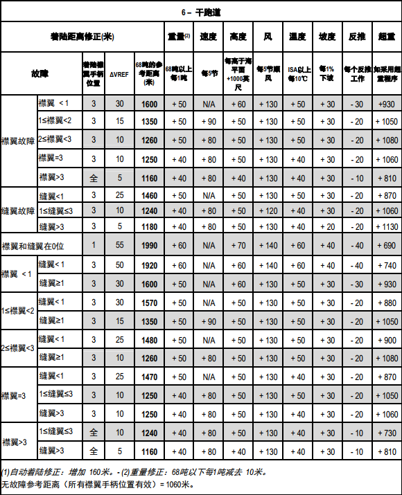

    * **双液压**失效造成的襟缝翼卡阻，应该直接查询双液压故障后的性能
    * 复合故障造成的襟缝翼卡阻，应按照多重失效的性能进行查询

[^111]: # 液压

    # "双液压"[^112]

[^112]: # 双液压

    # **双液压系统失效解释：**

    A320飞机使用的是三套完全独立的液压系统进行供压，因此在实际飞行中双液压系统故障，尤其是不可恢复的双液压系统故障是极其罕见的，但是在训练过程中我们依旧需要对这类极端的#复杂科目#进行训练。

    我们需要理解的是，三套液压系统中，失去任意一套液压系统造成的影响是有限的，当两套液压系统失去后，剩余的一套液压系统依旧能够让飞行员能够保留对飞机的基本控制。因此对于某个液压系统一旦失效后必定会产生的不可逆（除非液压恢复）且会影响到后续操作的的影响，我们需要有一个**大概的了解**。如：

    * 绿系统失效

      * 起落需要重力放出且无法回收
      * 一发反推不可用
      * 自动刹车、正常刹车不可用
    * 黄系统失效

      * 前轮转弯不可用
      * 二发反推不可用
      * 停留刹车可能不可用

    另外，当出现双液压故障时，更应该仔细阅读状态页面中关于**不工作系统**所体现的内容。

    

    # **液压系统故障的种类：**

    当一套或者多套液压系统故障时，并不代表这套液压系统所提供的压力在后续的飞行中完全不可用，在某些特殊的情况下，液压系统是可以通过特定的方法进行恢复的。具体可以参见下表：

    | 故障名称                   | 性质     | 恢复压力的方法                              |
    | ---------------------------- | ---------- | --------------------------------------------- |
    | 液压系统泵过热             | 可恢复   | 关闭液压泵，等待过热消失后重新接通          |
    | 发动机液压系统崩故障       | 可恢复   | PTU供压                                     |
    | 黄系统电动泵故障/低压/过热 | 无影响   | 无影响                                      |
    | 液压系统低气压且压力稳定   | 可恢复   | PTU供压，高度下降后故障液压系统可能自行恢复 |
    | 液压系统低气压且压力不稳定 | 可能恢复 | 下降高度                                    |
    | 单液压系统低油面（泄漏）   | 不可恢复 | NULL                                        |

    # **双液压科目的特点：**

    虽然不同的液压系统失效组合会对飞机现象产生不同的影响，但是无论何种组合，只要出现双液压失效，必然会涉及到以下几种处置特点：

    * 但凡是双液压失效，必然会出现红色的**LAND ASAP**，机组需要宣布MAYDAY
    * 但凡是双液压失效，AP1+2必然失效
    * 但凡出现双液压失效，作为#复杂科目#必然需要执行总结部分，详情参考"3.4 总结的使用"[^22]
    * 但凡出现双液压失效，必须要进行详细的性能查询
    * 但凡出现双液压失效，必然会失去相关舵面的操纵，飞行员应该谨慎驾驶飞机，防止触发不必要的警告
    * 但凡出现双液压失效，必然使用重力放起落架程序，即使当前还剩余绿系统，为了避免剩余系统不必要的液压负载，也应该使用重力放起落架程序
    * 和黄系统相关的，必然涉及到前轮转弯不工作，落地后需要占用跑道并且要求地面拖车协助
    * 和绿系统或黄系统相关的，必然涉及到至少一个反推无法使用，可参考本章"双液压系统失效解释："[^113]
    * 作为#复杂故障#，必须要慎重的进行进近与着陆性能的查询，并且根据查询结果选择落地机场

    # **双液压失效的具体科目：**

    {{{col
    {{{col
    {{{col
    # "G+Y"[^114]

    # "G+B"[^115]

    }}}

    }}}

    # "B+Y"[^116]

    }}}

[^113]: # **双液压系统失效解释：**

    A320飞机使用的是三套完全独立的液压系统进行供压，因此在实际飞行中双液压系统故障，尤其是不可恢复的双液压系统故障是极其罕见的，但是在训练过程中我们依旧需要对这类极端的#复杂科目#进行训练。

    我们需要理解的是，三套液压系统中，失去任意一套液压系统造成的影响是有限的，当两套液压系统失去后，剩余的一套液压系统依旧能够让飞行员能够保留对飞机的基本控制。因此对于某个液压系统一旦失效后必定会产生的不可逆（除非液压恢复）且会影响到后续操作的的影响，我们需要有一个**大概的了解**。如：

    * 绿系统失效

      * 起落需要重力放出且无法回收
      * 一发反推不可用
      * 自动刹车、正常刹车不可用
    * 黄系统失效

      * 前轮转弯不可用
      * 二发反推不可用
      * 停留刹车可能不可用

    另外，当出现双液压故障时，更应该仔细阅读状态页面中关于**不工作系统**所体现的内容。

    

[^114]: # G+Y

    # **G**+**Y****的即时现象：**

    * AP断开
    * 飞机进入备用法则
    * 如果起落架放出，飞机进入直接法则
    * 出现红色**LAND ASAP**

    # **G**+**Y****的程序：**

    * 当出现G+Y系统警告，飞行员应该立刻按照"3.3 非正常和紧急程序"[^18]原则接管飞机，并且划分工作区域
    * PF应当第一时间宣布**MAYDAY**，如未在第一时间宣布**MAYDAY**，当ECAM程序进行到备忘页面时，PM应进行提醒，并且设置应答机编码为7700
    * 当完成ECAM动作后，PF下口令，命令PM完成总结中油耗以及着陆性能的查询，并且以此作为决策的依据，详情参考"3.4 总结的使用"[^22]
    * 完成基本的决策信息后，PF需要进行进近准备，在进近准备过程中复习状态页中所显示的所有内容，并且预习总结中的进近、着陆、复飞部分，同时就当前飞机的实际状态及总结中的内容进行机组间的协同
    * 在进近过程中，机组应该按照总结的进近部分实施进近
    * 在建立最后进近状态后，作为提醒，飞行机组可快速浏览着陆和复飞部分(刹车，前轮转弯，反推和复飞时收起起落架）
    * 由于前轮转弯失效，机组应该提前协同好ATC与签派，通知当前飞机的实际状况，需要在落地后占用跑道同时申请拖车待命，将飞机拖离跑道
    * 进近过程中，由于襟缝翼状态缓慢，需要考虑是否提前放出形态
    * 在最后进近过程中，由PM执行总结中的重力放起落架程序
    * 落地过程中，机组使用的是蓄压瓶压力进行刹车，只可以使用7次，PF的刹车动作应该柔和且持续，PM应该监控并且报出当前刹车压力，防止爆胎
    * 落地停稳后，需根据当前停留刹车的实际工作状态来判断是否使用停留刹车
    * 如需要复飞，最大俯仰不能超过15°，并且不要回收起落架

    # **G**+**Y**故障中**应重点关注的要点：**

    * G+Y的故障特点之一，失去襟翼，缝翼缓慢，这样会造成飞机减速较慢，因此机组需要考虑飞机的减速效率，不要盲目提前转向五边
    * 在备用法则下，飞机操纵还具有自动配平功能，此功能是由升降舵提供的。由于起落架放出后飞机将进入直接法则，进入直接法则后飞机的自动俯仰配平将不工作，飞机会记忆升降舵当前的偏转外置，并且使其对应侧杆中立时的对应位置。因此机组应该在放出襟翼3，保持V~app~并且建立稳定下降之后，利用飞机尚存的自动配平功能将俯仰配平设置在一个对机组有利的配平位置，再进行放轮动作，此动作的优势在于，在进入直接法则之前让侧杆和升降舵匹配在一个更好操作的位置，有利于减少机组的工作负荷与操纵难度

      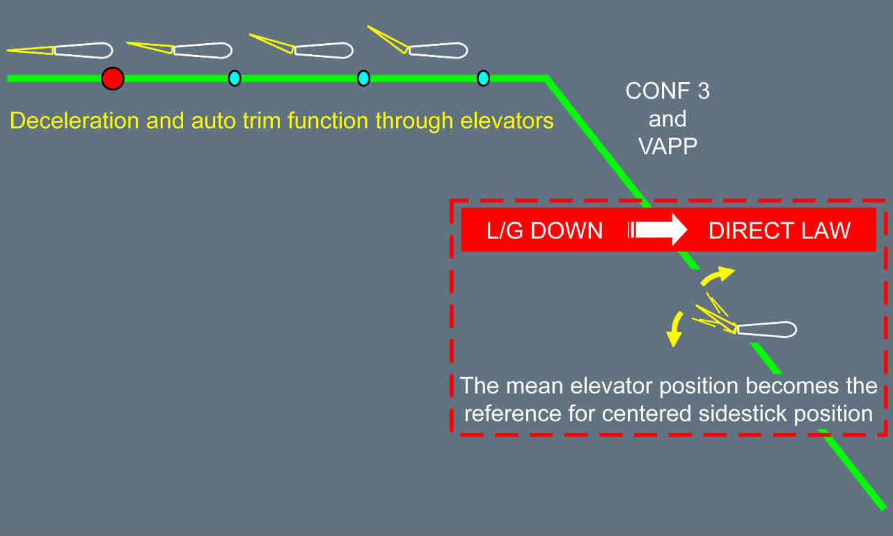
    * 落地过程中，机组使用的是蓄压瓶压力进行刹车，只可以使用7次，如飞机的ABCU具有刹车压力自动限制器，且ABCU工作正常，ABCU将会自动将刹车压力控制在1000PSI以下，但是实际操纵过程中，飞行员不需要进行当前飞机是否有ABCU刹车自动限制器功能的判断，PF的刹车动作应该柔和且持续，当压力偏大时，应该以柔和减小脚上输入量的方式来进行减压，不要对于跑道长度的使用过于谨慎，在有条件的情况下，可以根据"跑道标识与灯光系统"[^46]的内容对当前剩余跑道进行评估，PM应该监控并且报出当前刹车压力，防止爆胎
    * 落地滑跑过程中，强烈建议机组在进行减速时，仅使用一次柔和且持续的刹车
    * 飞机落地的姿态比平时大，机组应该监控飞机的俯仰，落地时尽量不要超过10°，防止擦机尾
    * 如需要复飞，俯仰配平当前的位置对于飞机的俯仰会造成很大的影响，在操纵过程中应该控制飞机俯仰不超过15°

    # **容易出现的问题：**

    * 机组在进行操纵时过于粗猛，导致人为造成的失速或低能量警告
    * 在进近过程中，习惯性在设置襟翼2后放出起落架，使飞机提前进入直接法则，造成不必要的工作负荷
    * 液压系统在襟缝翼放出或运动的过程中失效，没有第一时间按照速度限制监管好速度，导致超速
    * 一个或两个反推失效后，落地不使用失效侧的反推
    * 落地后刹车过猛，超过1000psi，PM不报出刹车压力
    * 刹车压力接近或超过1000psi时，PF为了减小压力，下意识让双脚脱离脚蹬，浪费刹车次数

    # **G**+**Y****涉及到的系统知识：**

    * 为什么我们要在放起落架前稳定下滑并且保持V~app~？

      * 首先我们要理解升降舵工作的原理，升降舵是由两个电控的液压伺服装置驱动的，而这两套液压伺服装置有以下三种工作方式：

        * 工作：传动装置的位置由电动控制

          * 在这种情况下，除非进行某些机动飞行，否则通常都是一套伺服驱动装置工作，另外一套在阻尼方式
        * 阻尼：传动装置随操纵面运动

          * 当失去液压操纵时，两套液压伺服装置将进入阻尼模式
        * 定中：传动装置由液压保持在中立位

          * 当失去电动控制时，两套液压伺服装置将进入定中模式
      * 当我们失去G+Y系统时，我们同时也失去了安定面，虽然我们可以看到俯仰配平轮还在自动运动，但是升降舵并没有实际处于工作模式，而是被动的进入了阻尼模式，配平轮的转动只是显示升降舵通过阻尼模式使升降舵随操纵面随动，这也属于自动配平的一种，但是放起落架后，转换到直接法则，仅剩的自动配平功能也完全失去。但是，系统会记忆住此时升降舵的偏转位置，并且使此位置成为侧杆中立时参照值。这就是为了确保进近和着陆时正确的侧杆中立位置，程序要求在起落架放出之前需要V~app~稳定及稳定下滑的原因。如果未履行此程序，系统将错误的位置记忆为侧杆中立位置，造成在进近下降过程中很可能会出现持续顶杆的现象，让飞机难以控制，在进跑道需要俯仰姿态接地时，甚至会造成需要通过松杆的动作而不是使用正常的拉杆动作来接地，其操纵难度可想而知
    * 为什么减速会慢并且落地姿态会大？

      * 飞机襟翼和缝翼都属于飞机的増升装置，但是缝翼的具有更好的増升性能，使飞机在相对较低的速度时，也能产生足够的升力，而襟翼则能在进近时产生更多的阻力并且更好的控制飞机的姿态，因此，当飞机失去G+Y系统时，由于失去了襟翼，飞机的减速效率会明显降低，这就是为什么我们在进近过程中需要提前考虑减速的原因；
      * 同样的，由于失去襟翼，根据伯努利定律，气流划过机翼的面积小于平时能够放出襟翼时的面积，因此飞机必须增加自己的迎角来达到在同样的速度下产生同样升力的的目的，所以在飞机进跑道时，为了保证较大的迎角，俯仰会大于正常有襟翼状态下的姿态，这也是为什么在平时的训练或者航班中，使用形态3落地时姿态要大于形态全的原因。因此在G+Y这种不正常情况下，如果机组不谨慎控制自己的俯仰姿态，就会存在擦机尾的风险，同时机组也应该做好响起Pitch警告的心理准备

    * 为什么建议尽量少的使用刹车？

      * 使用蓄压瓶刹车时，无论机组踩踏刹车的力度大小如何，每使用踩踏再释放刹车踏板一次就会释放1/7的储备液压，因此蓄压瓶只能使用7次，因此强烈建议机组在进行减速时，仅使用一次柔和且持续的刹车，通过踩踏刹车踏板的力度来调整刹车压力，直到飞机停住，这一动作可以为停留刹车保留足够的压力，利于飞机停稳后可以使用停留刹车

    # **双液压G+Y演示视频：**

    <iframe src="https://player.bilibili.com/player.html?aid=335512940&amp;bvid=BV1XA411F7QT&amp;cid=410341277&amp;page=1" data-src="//player.bilibili.com/player.html?aid=335512940&amp;bvid=BV1XA411F7QT&amp;cid=410341277&amp;page=1" scrolling="no" border="0" frameborder="no" framespacing="0" allowfullscreen="true"></iframe>

[^115]: # G+B

    # **G**+**B****的即时现象****：**

    * AP断开
    * 飞机进入备用法则
    * 如果起落架放出，飞机进入直接法则
    * 出现红色**LAND ASAP**

    # **G**+**B****的程序：**

    * 当出现G+B系统警告，飞行员应该立刻按照"3.3 非正常和紧急程序"[^18]原则接管飞机，并且划分工作区域
    * PF应当第一时间宣布**MAYDAY**，如未在第一时间宣布**MAYDAY**，当ECAM程序进行到备忘页面时，PM应进行提醒，并且设置应答机编码为7700
    * 当完成ECAM动作后，PF下口令，命令PM完成总结中油耗以及着陆性能的查询，并且以此作为决策的依据，详情参考"3.4 总结的使用"[^22]
    * 完成基本的决策信息后，PF需要进行进近准备，在进近准备过程中复习状态页中所显示的所有内容，并且预习总结中的进近、着陆、复飞部分，同时就当前飞机的实际状态及总结中的内容进行机组间的协同
    * 开始进近时，断开自动推力
    * 在进近过程中，机组应该按照总结的进近部分实施进近
    * 在速度为200Kt时（形态1以后），执行总结中的重力放起落架程序，之后放出形态2，形态3
    * 在建立最后进近状态后，作为提醒，飞行机组可快速浏览着陆和复飞部分(刹车，前轮转弯，反推和复飞时收起起落架）
    * 如需要复飞，最大俯仰不能超过15°，并且不要回收起落架

    # **G**+**B**故障中**应重点关注的问题：**

    * G+B的故障特点之一，是失去缝翼，襟翼缓慢，这样会造成飞机阻力较大，使用推力控制能量能力及控制俯仰的能力稍弱，就很容易触发低能量警告或失速警告，因此在操纵控制上必须要非常谨慎，这样的操纵条件会占用PF大量的精力，因此在进近过程中PF一定要注意自己的注意力分配，同时PM最好能够更加积极主动的进行帮助
    * 在开始进近后，由于飞机失去了増升能力更强的缝翼，以及其他的一些操纵面，因此即便是在FCU上设置了选择的速度，自动推力也无法很好的进行速度上的保持，会导致飞机状态不稳定，结合上一条中所提到的内容，机组应该及时断开自动推力，此时机组会发现稳定的人工推力能够更好的保持飞机的状态，不会出现在自动推力工作状态下，能量不好控制，甚至不可控制的情况
    * 与G+Y不同，机组不应该对进入直接法则过于谨慎，在直线飞行时，进行襟翼1-放轮-襟翼2的设置
    * 由于速度窗口较小，应尽量避免在转弯的过程中改变形态

    # **容易出现的问题：**

    * 机组在进行操纵时过于粗猛，导致人为造成的失速或低能量警告
    * 在转弯的过程中改变构型
    * 过分依赖自动推力，在进近过程中迟迟不断开自动推力，反而造成能量难以控制
    * 惧怕进入直接法则，而不断推迟放起落架的程序时机
    * 放襟翼2的时机选择不正确，触发超速或失速警告响起，或者急于控制速度触发超速或低能量警告

    # **G**+**B****涉及到的系统知识：**

    * 自动推力工作，为什么ECAM建议人工断开？

      * 自动推力是根据自动飞行系统的FG功能在不断进行计算，在此刻飞机的FG功能并未降级，因此理论上来讲自动推力确实工作。但是虽然自动推力系统工作，但是自动推力的计算是建立在所有操纵面都正常使用的情况下计算的，当G+B液压系统失效后，由于左侧升降舵、两侧的副翼、扰流板1+3+5都不工作，所造成的结果是俯仰、坡度都难以进行控制，在这样的情况下，自动推力所提供的能量就会十分容易造成推力和实际运行舵面不匹配，这实际上是一种自动化设备工作不符合预期的情况，根据"4.11 金科玉律"[^21]第四条，机组就应该采取措施，而最好，最稳定的措施，就是断开自动推力，断开自动推力后，发动机所提供的推力和推力手柄所在的位置成直接关系，这一动作的优势在于飞行员可以直接控制飞机的状态，而不会被不稳定的自动推力干扰，造成能量上不好控制，甚至不可控制的情况
    * 为什么要在直线飞行且200kt的速度使用重力放起落架程序进入直接法则？

      * 首先我们应该理解当前飞机状态对我们操纵带来的不利因素：

        * 如同上一条中提到，飞机很多重要操纵面不工作，因此在进行操纵输入时，飞机的反应会相对滞后
        * 参考襟翼手柄与襟翼位置的对应角度，当释放出襟翼1时，襟翼实际上并没有运动，红色速度带只是根据襟翼手柄所在的位置指示当前的速度上限，但是在释放襟翼2时，襟翼会运动至15°位置，同时飞机的俯仰姿态会随着襟翼2的放出而产生改变，而速度带显示FAC计算的Vls速度，俯仰的增加会导致Vls的快速增加，如果在此时进行转弯，Vls还会继续上升，让我们可用的速度窗口几乎消失，让飞行员难以甚至无法避免的让飞机速度进入Vls，直至触发失速警告。因此襟翼1-放轮-襟翼2期间，是G+B科目**最重要的节点**。在此节点上，我们切忌在转弯的过程中去改变飞机形态（而在设置襟翼3时，襟翼只会从15°运动到20°位置，造成的影响远不如襟翼1至襟翼2时剧烈，但是我们依旧应该采取保守的办法，在直线上改变形态，避免非预期的情况）
        * 一旦触发失速警告，飞行员会下意识的进行顶杆修正，但是由于失去主要操纵舵面的原因，操纵效率低，在顶杆修正后，如果没有尽快回到正确的俯仰姿态，会造成飞机快速增速，从而又触发超速警告，即便没有触发超速警告，过大的速度也让机组很难在有限的可用速度窗口中放出襟翼2，这样就会让机组容易陷入带杆就响失速警告，顶杆就响超速警告的两难境地
      * 分析以上三个不利因素我们可以看出，直接法则并不是本科目的重难点，重难点是设置襟翼2的时机，空客将推荐的放起落架速度设置为200kt，最主要的还是出于尽量保留较大的可用速度窗口的考虑，因此，我们可以通过在进近过程中，在直线飞行时，在下降的过程中去设置形态的方式避过以上对我们不利的因素，这样做的好处有：

        * 直线飞行时，Vls较小，为我们保留更多的可用速度窗口
        * 下降过程中，Vls较小，未我们保留更多的可用速度窗口，如果可能，未自己保留1000ft的高度裕度，在进行这1000ft的下降过程中，通过改变俯仰控制下降率来控制速度的变化，来达到更好的控制效果，在进行这1000ft下降的过程中，完全可以设置推力手柄慢车，保持-1000ft/min的下降率，用1分钟的时间完成总结中进近重力放起落架部分，以及设置襟翼2，之后的可用速度窗口会豁然开朗，大幅减轻操纵负荷，降低操纵难度
        * 下降过程中，即便是俯仰改变，主要影响的也仅仅是飞机的下降率，而不会造成突然之间的Vls上涨

[^116]: # B+Y

    # **B**+**Y****的即时现象：**

    * AP断开
    * ECAM显示琥珀色**LAND ASAP**

    # **B**+**Y****的程序：**

    * 当出现G+B系统警告，飞行员应该立刻按照"3.3 非正常和紧急程序"[^18]原则接管飞机，并且划分工作区域
    * PF应当第一时间宣布**PANPAN**，如完成程序后相关的系统未恢复或无法恢复（黄系统电动泵不可用），则宣布**MAYDAY**，并且设置应答机编码为7700
    * 当完成ECAM动作后，PF下口令，命令PM完成总结中油耗以及着陆性能的查询，并且以此作为决策的依据，详情参考"3.4 总结的使用"[^22]
    * 完成基本的决策信息后，PF需要进行进近准备，在进近准备过程中复习状态页中所显示的所有内容，并且预习总结中的进近、着陆、复飞部分，同时就当前飞机的实际状态及总结中的内容进行机组间的协同
    * 在进近过程中，机组应该按照总结的进近部分实施进近
    * 在建立最后进近状态后，作为提醒，飞行机组可快速浏览着陆和复飞部分(刹车，前轮转弯，反推和复飞时收起起落架）
    * 由于前轮转弯失效，机组应该提前协同好ATC与签派，通知当前飞机的实际状况，需要在落地后占用跑道同时申请拖车待命，将飞机拖离跑道
    * 进近过程中，由于襟缝翼状态缓慢，需要考虑是否提前放出形态
    * 在最后进近过程中，由PM执行总结中的重力放起落架程序
    * 如需要复飞，最大俯仰不能超过15°，并且不要回收起落架

    # **B**+**Y****涉及到的系统知识：**

    * 为什么ECAM显示琥珀色的**LAND ASAP**，但我们却要宣布**MAYDAY**？

      * 尽管每个公司对于飞机遇险时**PANPAN**报和**MAYDAY**报定义有所不同，但是根据空客的设计理论，每一套系统都应该有相应的备份系统，而当双液压故障时，当前飞机处于没有备份系统的不适航状态，但是依旧存在通过黄系统电动泵恢复黄系统供压的可能性，因此我们在第一时间应该宣布**PANPAN**，当确定无法成功使用黄系统电动泵恢复供压后，机组则可以将自己的遇险等级提高至**MAYDAY**，并且设置应答机7700。
    * 为什么绿系统可用的状态下，我们还需要进行重力放起落架程序？

      * 当我们的飞机仅剩绿系统工作时，绿系统需要单独控制飞机的襟翼、缝翼、方向舵、安定面、左侧升降舵、副翼、扰流板1+5，而绿系统本身能提供液压压力的上限为3000psi，虽然在理论上来讲绿系统依旧可以控制起落架的收放，但是参考上一条，飞机已经失去所有的备份系统，从保护的角度来看，尽量减小液压的负载，可以保护绿液压系统正常工作，一旦绿系统超载，飞机将会失去三套液压系统，处置难度及可能产生的后果的严重性都远高于牺牲起落架收回功能的后果

[^117]: # 导航

    # "原始数据导航"[^93]

    # "RA 1+2故障"[^118]

[^118]: # RA 1+2故障

    # **RA 1+2故障时的现象：**

    当RA 1+2故障时，除了本身的ECAM程序之外，AP、FD、A-THR等功能都保持完好，并不会出现明显的影响飞机操纵和性能的情况出现，直到放起落架时，飞机才会进入直接法则

    # **RA 1+2故障时的程序：**

    * 按照"3.3 非正常和紧急程序"[^18]处置流程完成动作，并且查询相关的进近速度
    * 由于此时飞机本身的性能并没有出现太大问题，因此具有飞往目的地的条件，机组应该综合当前的各种因素作为评估依据，判断是否需要继续飞行，各种因素包括：

      * 目的地机场的气象条件是否会对放起落架后的操纵造成困难
      * 由于失去了GPWS与FWS系统，目的地机场附近的地形是否会对安全的运行环境包线产生影响
      * 目的地机场的保障能力
    * 由于TCAS不工作，需要通知ATC，当前自己已经失去了空中交通监视和避让的能力
    * 在进近准备过程中预习直接法则，并做好使用襟翼3落地的预案
    * **APPR电门****不可用**，可以用**L****OC电门**截获航向道，再以下降率或FPA的方式跟随下滑道
    * 放起落架后AP会断开，飞机将进入直接法则
    * 进近时，需要将速度减到计算好的V~app~
    * 飞机将失去反应式风切变探测，以及基于RA系统提供的自动喊话，PM应该密切监控风向风速的变化，参考"风切变的识别："[^55]
    * 飞机接地开始拉平期间，没有“Retard”喊话，PF应当通过目视判断自己的实际高度来进行收推力动作
    * 如果需要复飞，正常设置推力手柄至TOGA，当起落架收上后，飞机将回到正常法则

    # **容易出现的问题：**

    * 不理解TCAS系统不工作对于空域运行的影响，不报告ATC
    * 对直接法则以及襟翼3落地的预案准备不足
    * 不理解当前飞机的状态，在有ILS进近可用的情况下选择LOC进近方式
    * 不理解当前飞机的状态，在有AP可用的情况下主动断开，进行非必要的人工飞行
    * 失去自动喊话后，丢失“1000ft”的关键节点，在AAL 1000ft时，没有建立稳定进近，详情参考"稳定进近"[^39]
    * 过于依赖自动喊话作为收推力的依据，在落地过程中迟迟不收推力手柄

    # **RA 1+2故障涉及到的知识：**

    * APPR电门无法接通，使用LOC电门截获航向道，那么天气标准应该按照盲降掌握还是LOC掌握？

      * 我们需要了解的是，盲降的工作条件在于地面ILS台工作正常，同时飞机的ILS信号接收器工作正常，在这样的情况下，即便是人工操纵，也是盲降，使用**LOC电门**截获航向道并且使用下降率或FPA进行下滑道的跟随，只是**无法自动截获下滑道**的另外一种手段，是"4.11 金科玉律"[^21]中采用相应等级的自动化设备的一种体现，其本质并非下滑道不工作或不可靠，因此从性质上来说，即便无法通过自动化设备截获下滑道，我们依旧进行的是盲降进近，因此天气标准应该按照盲降掌握
    * 为何自动喊话不工作，但是依旧可以听到“100 above”、"Minimum"的喊话？

      * 当RA 1+2故障时，我们失去的只是基于无线电高度表失效后，根据无线电高度表探测进行的喊话，而“100 Above”、“Minimum”的喊话则是建立在修正海压的基础上的，因此不受影响
    * 为何会放襟翼时会触发反应式风切边探测故障的警告？

      * 风切变探测功能是由FAC计算机提供的，其提供的条件为：

        * 起飞时，从离地3s到1300ft无线电高度表高度
        * 着陆时，从1300ft无线电高度表高度至50ft
        * 至少选择了襟翼1
      * 由此可见，反应式风切变功能主要是依赖无线电高度表提供的高度，当襟翼没有设置为1时，飞机并没有使用反应式风切变功能，但是在放出襟翼1之后，系统探测到由于失去了无线电高度，因此反应式风切变丢失了工作的条件，从而触发警告

    # **RA 1+2故障程序视频：**

    <iframe src="https://player.bilibili.com/player.html?aid=890579075&amp;bvid=BV1bP4y1h7Rp&amp;cid=410328065&amp;page=1" data-src="//player.bilibili.com/player.html?aid=890579075&amp;bvid=BV1bP4y1h7Rp&amp;cid=410328065&amp;page=1" scrolling="no" border="0" frameborder="no" framespacing="0" allowfullscreen="true"></iframe>

[^119]: # 监视

    # "GPWS及EGPWS"[^51]

    # "TCAS"[^75]

[^120]: # 其他

    # "大坡度盘旋"[^121]

    # "紧急撤离"[^71]

[^121]: # 大坡度盘旋

    标签：#能量管理#、#机动科目#

    # **大坡度盘旋进入方式：**

    法则：正常、备用、直接

    FD：关

    高度：无要求

    速度：250kt

    坡度：45°

    自动推力：关

    # **大坡度盘旋的标准：**

    速度偏差：±10kt

    高度偏差：±100ft

    坡度偏差：±5°

    改出航迹偏差：±10°

    不触发任何警告。

    # **大坡度盘旋的原理：**

    大坡度盘旋过程中，无论飞机处于任何法则，45°的转弯角度也已经触发了坡度保护，飞机必须一直保持坡度的持续输入，从而达到保持45°大坡度的目的。

    在飞机达到45°大坡度时，根据基本的升力法则，坡度的增加会造成升力分量减小，从而造成能量的短缺，这一点会直接体现在高度和速度上。高度会下降，速度会减小。

    在进行大坡度盘旋修正的过程中，容易出现的是同时对坡度、速度和高度进行复合修正，这样的修正方式会造成修正过量。由于每次飞机的重量，进入大坡度盘旋的高度不同造成性能不同，因此在进入大坡度的过程中，随着坡度的逐渐变化，最终会损失多少能量，需要补足多少能量，这是一个变量，无法直观的判断。

    因此我们需要想办法将这个变量转化为定量。

    最直观的方式，既是保持坡度的过程中，先不进行速度的修正，而优先进行高度的保持，在保持好高度的情况下，能量的损失会通过速度指标明显的表现出来。

    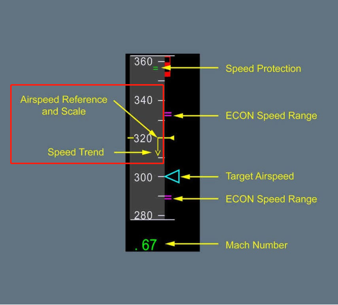

    速度趋势指标（Speed Trend）指示的是飞机10秒后所处的速度，因此，在保持好坡度和高度的情况下，我们有10秒钟的时间窗口去进行速度的能量补偿。

    之后通过侧杆不断的进行坡度和高度的调整，再根据速度趋势箭头进行速度的调整。在预定航向提前20°-30°时（根据公司要求），PM报出差20°/30°改出。PF保持高度，逐渐松开对于坡度的输入，此时飞机升力分量增加，维持高度后能量将转移至速度上，我们再根据速度趋势箭头，通过减小推力的方式来减小能量的输出，使飞机稳定在精确的航径上。

    # **大坡度盘旋容易出现的问题：**

    * 在没有找到固定的坡度并且保持稳定高度的过程中就盲目进行大幅度的推力调整
    * 同时进行高度、速度、坡度的复合修正
    * 注意力锥形集中于坡度、高度、速度、推力中的某一个或几个参数，而不进行视线的扫视

    # 大坡度盘旋演示案例：

    <iframe src="https://player.bilibili.com/player.html?aid=548002499&amp;bvid=BV1Sq4y1N7GZ&amp;cid=409488711&amp;page=1" data-src="//player.bilibili.com/player.html?aid=548002499&amp;bvid=BV1Sq4y1N7GZ&amp;cid=409488711&amp;page=1" scrolling="no" border="0" frameborder="no" framespacing="0" allowfullscreen="true"></iframe>

    <iframe src="https://player.bilibili.com/player.html?aid=890401086&amp;bvid=BV1TP4y1Y7WJ&amp;cid=408422881&amp;page=1" data-src="//player.bilibili.com/player.html?aid=890401086&amp;bvid=BV1TP4y1Y7WJ&amp;cid=408422881&amp;page=1" scrolling="no" border="0" frameborder="no" framespacing="0" allowfullscreen="true"></iframe>

[^122]: # 10. 鸣谢名单

    本套笔记能够面世，需要感谢很多人，他们中有刚刚开始学习机型理论的学员，也有经验丰富的航空公司教员，感谢你们从各自的层面为这套笔记提供各方面的需求、反馈、支持、帮助、纠正：

    马教员（ZH）

    王教员（ZH）

    邱教员（PN）

    王队（HX）

    秦机长（OQ）

    王机长（GJ）

    马俊飞（HX）

    范浩轩（EU）

    高峰（HX）（素材搜集）

    以及我那为数众多的学生们，感谢你们为每一个科目中`容易产生的错误`部分提供的大量实际案例，要不是你们，我都不知道A320飞机还能这么飞。
